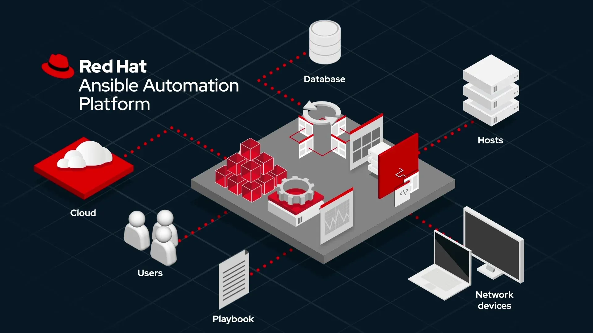
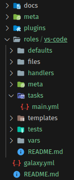
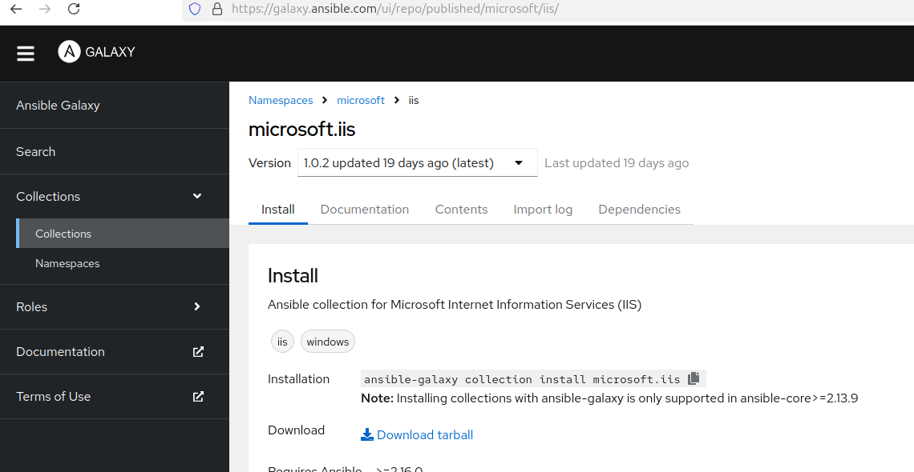
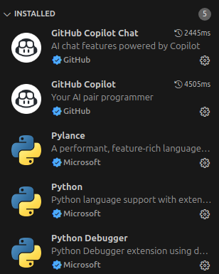
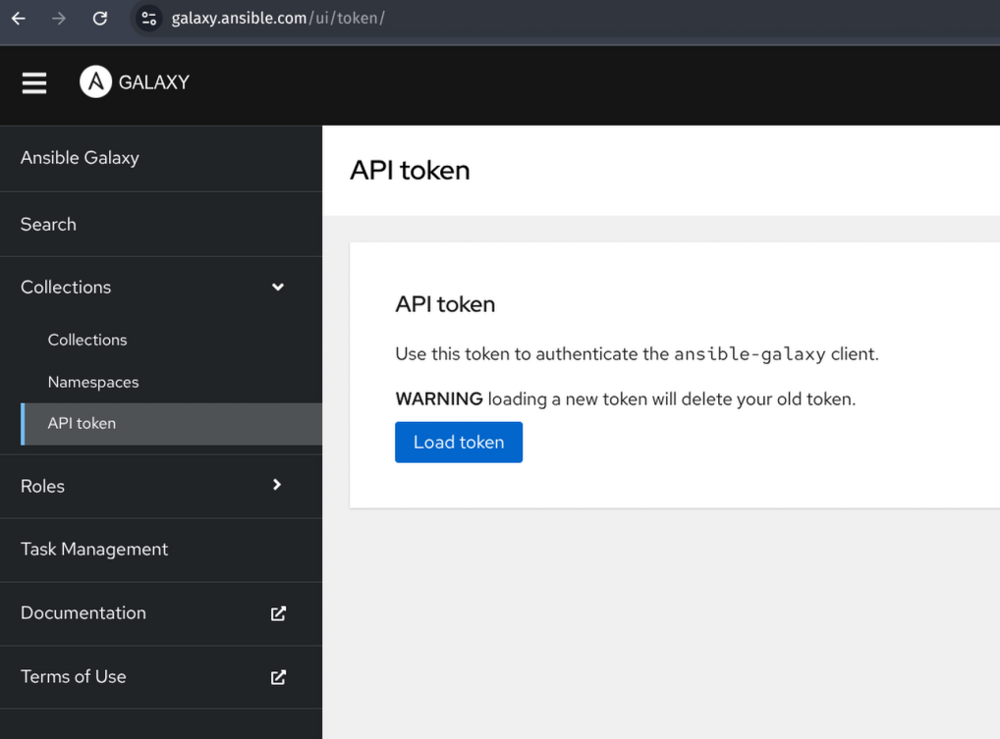

# Ansible Collection ile Kişisel Linux Sistem ve Dotfiles Otomasyonu


Bu  yazımızda birden fazla farklı Linux dağıtımı için Ansible ile hem uygulamarımızın yönetimini hem de dotfile'larımızı nasıl yöntebilceğimizi öğrenmeye çalışacağız. Amacımız full bir sitemden ziya de bir başlangıç oluşturmak. Açık yalın bir yapı kurup isteğimize göre genişletebilceğimiz bir örnek yapmış olacağız.





Yazıyı anlamak ve örnekleri çalıştırabilmek için biraz Ansible bilmek gerekiyor. Amacımız Ansible öğrenmekten ziyade Ansible'ı kişisel sistemlerimizde nasıl kullnacağımız konusunda basit bir örnek yapmak.

Yazıda ayrıca Ansible'in özelliklerinden biri olan Colleciton yapısını da görüyor olacağız. Temelde amacımız sıfırdan bir Linux dağıtımı kurduğumuzda kullanığımız uygulamaların kurulmasını ve bütün ayarlarımızın da yapılmasını sağlamak. Hatta mümkünse farklı dağıtımlarda da çalıştırabilmek. 


## Ansible Collection Nedir? Nasıl Kullanılır?

Ansible Collection, Ansible ekosisteminde rolleri (roles), eklentileri (plugins), modülleri (modules), playbook'ları ve diğer Ansible içeriklerini tek bir paket gibi toplayıp paylaşmayı sağlayan bir yapıdır. Aslında "Ansible paketleme ve dağıtım mekanizması" olarak düşünülebilir.

Yani colleciton ansible playbook yazarken ansible objelerimizi gruplandırmak ve tekrar kullnabilmek için kullandığımız bir yöntem.

Örneğin, Ansible ile bir altyapıyı yönetirken, sıklıkla benzer roller ya da özel eklentiler geliştirmemiz gerekebilir. Bu rolleri ve eklentileri tek tek paylaşmak yerine, Collection adı verilen bir yapı içinde düzenleyip, sürümleyip, Ansible Galaxy (ya da özel bir repository) üzerinden dağıtabiliriz. Böylece farklı projelerde veya makinede kullanmak istediğimizde, tek bir komutla (örneğin `ansible-galaxy collection install <namespace>.<collection_name>`) toptan kurulumu yapabiliriz.


İlk yapacağımız örnekte colleciton tam olarka nedir nasıl çalışır onu anlamaya çalışacağız. Bu başlıktan sonra altta gerçek bir sistem kurlumu yapacağız.

Şimdi çalışmaya başlayalım. Bir klasör oluştutup içine Vagrantfile adında bir dosya oluşturup içine alttaki metti kopyalıyoruz.

```ruby
Vagrant.configure("2") do |config|

  config.vm.box = "bento/ubuntu-24.04"
  config.vm.box_version = "202502.21.0"
  config.vm.provider "virtualbox" do |vb|

  vb.gui = true
  vb.memory = "4048"
  end

end
```

Daha sonra aynı dizinde temninal/poershell açıp `vagrant up` komutuyla ubuntu makşinemizi ayağa kaldırıyoruz.

Kurulum bittikten sonra aşağıdaki komutla makineye bağlanıyoruz. İsterseniz Virtualbox üzerinden arayüzü kullnarak da login olabilirsiniz. Kullanıcı adı ve şifreyi vagrant olarak girebilirsiniz.

```shell
vagrant ssh
```


Daha sonra alttaki komutlarla Python3 ve Ansible kurulumu yapıyoruz.

```shell
sudo apt update && sudo apt upgrade -y && sudo apt install python3 python3-pip -y && sudo apt install python3-venv -y

cd $HOME

python3 -m venv ansible_virtual_env

source ansible_virtual_env/bin/activate

pip install ansible
```
Birden fazla dağıtımı, birden fazla kullanıcı oluşturarak desteklemek istiyoruz.

Dosya ve klasör yapısını manuel oluşturabiliriz ancak biz öyle yapmacağız. Bunu yerine *Ansible Collection* kullanacağız.

Ansible Collection, Ansible ekosisteminde rolleri (roles), eklentileri (plugins), modülleri (modules), playbook'ları ve diğer Ansible içeriklerini tek bir paket gibi toplayıp paylaşmayı sağlayan bir yapıdır. Aslında "Ansible paketleme ve dağıtım mekanizması" olarak düşünülebilir.

Örneğin, Ansible ile bir altyapıyı yönetirken, sıklıkla benzer roller ya da özel eklentiler geliştirmemiz gerekebilir. Bu rolleri ve eklentileri tek tek paylaşmak yerine, Collection adı verilen bir yapı içinde düzenleyip, sürümleyip, Ansible Galaxy (ya da özel bir repository) üzerinden dağıtabiliriz. Böylece farklı projelerde veya makinede kullanmak istediğimizde, tek bir komutla (örneğin ansible-galaxy collection install \<namespace>.<collection_name>) toptan kurulumu yapabiliriz.


Bütün komutlarımızı daha önce oluşturduğumuz sanal makine üzerinden çalıştıracağız. Tabi kendi bilgisayarınızda çalıştırıp git üzerinden senkronize de edebilirsiniz. 
Bütün komutlarımızı daha önce oluşturduğumuz sanal makine üzerinden çalıştıracağız. Tabi kendi bilgisayarınızda çalıştırıp git üzerinden senkronize de edebilirsiniz. 

Bu komutta kullandığımız *my_ansible_dotfiles* collection namespace adı ve *developer_machine* ise collection adı.

```shell
ansible-galaxy collection init my_ansible_dotfiles.developer_machine
```
*developer_machine* dizinine bakacak olursak;
- `galaxy.yml` dosyası collection'ınımız için meta bilgilerini taşır. Bu dosyayı kendi bilgilerinizle değiştirebilirsiniz.
- Roles dizinine makinemizde çalıştırmak isteğimiz uygulma ve servislerin kurlum ve konfigürasyonlarını koyacağız
- meta klasöründeki `runtime.yml` dosyası da Ansible sürüm uyumluluğu, Eski/yeni plugin ve modül yolları (redirection / deprecation), Ortak modül gruplarının tanımlanması, gibi daha gelişmiş veya ileri seviye konfigürasyonları yönetmek için oluşturulan bir dosyadır. 


Şimdi rollerimizi eklemeye başlayalım. Collection dizinindeyken terminalden role ekliyoruz. İlk rolümüz `vs-code` olacak.


```shell
cd developer_machine
ansible-galaxy init roles/vs-code
```

`vs-code` Rolünün eklendiğini görebiliriz. 


Klasör yapısı alttaki gibi olacak.




İlerde bu rolü playbook'larımızda kullanırken alttaki gibi namespace adını yazarak kullanacağız.

```yml
- name: my_ansible_dotfiles.developer_machine collection'ınından rol kullan
  hosts: all
  roles:
    - name: my_ansible_dotfiles.developer_machine.vs-code
```

Şimdi vs-code rolümüzü yazmaya başlayalım. Öncelikle vs-code'u kuralım. Roles klasöründe oluşan `vs-code` klasörüne girip task içindekiş `main.yml` dosyasına alttaki kodları ekliyoruz.

```yml
---

- name: Install vscode
  become: yes
  apt:
    name: code
    state: present
- name: Install vscode extensions
  ansible.builtin.command:X-Forwarded-For
    cmd: code --force --install-extension {{ item }}
  changed_when: false
  loop:
    - github.copilot
    - github.vscode-github-actions
    - ms-python.python
```

Şu ana kadar bir collection oluşturduk bu collection'a VS Code ve bazı extensionleri yükledik. Şimdi buraya kadar yaptıklarımızı makinemizde test edelim.

Bunun için öncelikle collection'ımızı built alıp install etmemiz gerekiyor.

Collection ana dizininde iken terminalden alttaki komutları çalıştırıyoruz.

```bash
ansible-galaxy collection build --force
```

Sonuçta elimizde `my_ansible_dotfiles-developer_machine-1.0.0.tar.gz` adında bir dosya oluşmuş olacak.

Yukarıda da bahsettiğimiz gibi collection oluştup install etmemiz buradaki kodları çalıştırdığımız anlamına gelmiyor. Yani bu colleciton'ı install ettiğimizde bu uygulamaları kurmuş olmayacağız. Elimizde playbook'larda kullanabilceğimiz bir rollerden, plugin'lerden, modullerden vb oluşan bir koleksiyonumuz olacak.

Şimdi intall edelim.

```shell
ansible-galaxy collection install my_ansible_dotfiles-developer_machine-1.0.0.tar.gz
```

Komutu çalıştırdığımızda `/home/vagrant/.ansible/collections/ansible_collections` dizinine oluşturduğumuz collection kurulur.

Artık buradaki rolleri kullanabilir hale geldik. Alttaki gibi bir playbook yazıp çalıştırabliriz.

```yaml
- hosts: all
  collections:
    - my_ansible_dotfiles.developer_machine
  roles:
    - vs-code
```

Üstteki kodları bir `playbook.yml` adında bir dosyaya kopyalayıp lttaki komutla çalıştırabiliriz.

```shell
ansible-playbook playbook.yml
```

Bu komutla birlikte vs-code rolümüz rolde belirttiğimiz ` github.copilot, github.vscode-github-actions, ms-python.python` VS Code extension'larıyla birlikte çalışacaktır.

Tabii bir burada lokal sistemde collection'ı yazıp kullandığımız için paketleyip kurduk. Ancak Ansible Galaxy sayfasından bir collection kullanmak isteseydik alttaki örnekte olduğu gibi kurulum yapmalıyız. Mesela alttaki örnkete Microsoft IIS collection'ı kuruyoruz. Collection sayfası : https://galaxy.ansible.com/ui/repo/published/microsoft/iis/

```shell
ansible-galaxy collection install microsoft.iis
```




Ancak diyelimki biz kendimiz başka bir collection'ı kullanan collection yazıyoruz ve bunu da Ansible Galaxy'de yayınlayacağız. Dolayısıyla yazdığımız collection'ı kullancak geliştiriciye git bide şu colleciton'ları yükle demememiz gerkiyor. Bunun için de collection yapısında `galaxy.yml` adında bir dosya bir mevcut. 


Bu dosyanın kısa bir kısmını altta veriyorum. Burada *dependencies* diye bir bölüm var. Bu kısma alttaki örnkte yazdığım gibi diğer collection bağımlılıklarımızı ekleyebiliriz.

```yaml
description: My developmnet machine

license:
- GPL-2.0-or-later

license_file: ''

tags: []

dependencies: { other_namespace.some_collection: '>=2.0.0,<3.0.0', community.crypto: '*'}

# The URL of the originating SCM repository
repository: http://example.com/repository

# The URL to any online docs
documentation: http://docs.example.com

# The URL to the homepage of the collection/project
homepage: http://example.com

# The URL to the collection issue tracker
issues: http://example.com/issue/tracker

```

Böylece bizim colleciton'ımız yüklenirken bağımlılıklar da yüklenmiş olacak.


Buraya kadar mevzuyu anlamaya çalıştık. Şimdi artık içinde kullanıcı yönetimi ve birden fazla mekineyi destekleyecek bir sistem nasıl geliştirebiliriz ona bakalım.

## Sistem ve Dotfiles Yönetimi


Öncelikle yapmak istediklerimiz listeleyelim.

- Bütün roller tekil olarak eklenip kaldırılabilmeli
- Bütün roller toplu halde kaldırılıp eklenebilmeli
- Herhangi bir rolün ek bileşenleri her dağıtım için (mesela VC Code bileşenleri) eklenip kaldırılabilmeli
- Sisteme kullanıcı eklenip kaldırılabilmeli
- Kullanıcı rolleri düzenlenebilmeli
- Kullanıcı home konfigürasyonları yapılabilmeli
- Farklı makineler yönetilebilmeli (örneğin makineye özel uygulama, driver vb kurulumlar yapılabilmeli)
- ve aynı anda birden fazla makineye farklı dağıtımlar için paket kurulabilmeli


Yani son tahlilde biz sıfırdan bir makine kurduğumuzda buna kullanıcı, kullanıcıya özel ayarları ve gerekli olan uygulamaları yükleyebilmeliyiz.

Şimdi yeni bir collection oluştutup böyle bir sistem kurmaya çalışalım. Yapacağımız çalışmayı doğrudan Vagrant ile oluşturduğumuz makine de arayüz üzerinden login olup yaparsanız sizin için daha kolay olacaktır. 

Bunun için alttaki komutla yeni bir  collection oluşturalım.


```bash

# Daha önce yukarıda oluşturduğumuz Python virtual environmöent'ı aktif ediyoruz

source $HOME/ansible_virtual_env/bin/activate

ansible-galaxy collection init my_namespace.my_machines

```
Kodu çalıştırdığımızda `my_namespace/my_machine` dizini oluşmuş oldu.

Projemizi dışarıdan içeriye doğru yazacağız. Yani önce ne istediğimizin taslağını çıkartıp sonra içini dolduracağız. Bunun için Önce inventory yazacağız, daha sonra playbook ve son olarak colleciton'ımızın içini doldrucağız.

## Inventory Oluşturmak

`my_namespace/my_machine` dizinide `inventory.yml` adında bir dosya oluşturup alttaki gibi dolduralım. Amacımız hatırlarsanız aynı paketleri farklı dağıtımlara kurmak.

Şuan elimizde sadece localhost makinemiz var ve o da bir ubuntu makinesi.

Fakat ilerde Vagrant üzerinden test yapabileceğimiz ve bütün dağıtımları test edebileceğimiz yapıyı da kuracağız.

```yml
all:
  children:
    ubuntu_hosts:
      hosts:
        ubuntu1:
          ansible_connection: local
          ansible_become_method: sudo
          ansible_become: yes
    arch_hosts:
      hosts:
        arch1:
          ansible_host:
        arch2:
          ansible_host:
    fedora_hosts:
      hosts:
        fedora1:
          ansible_host: 
        fedora2:
          ansible_host:
```

Şimdi aynı dizine bir de playbook ekleyelim. Bu bütün rolleri, oluşturlacak kullanıcıları ve dağıttımlara özel ayaları barındırsın.

Ben `my_machine_playbook.yml` adında bir dosya oluşturdum ve içeriğini alttan kopyaladım.


```yml
---
- name: Setup Ubuntu systems # inventory dosyasımızda birden fazla Ubuntu sisttemi kurabilceğimizi belirtmiştik
  hosts: ubuntu_hosts
  gather_facts: yes
  connection: local
  become_method: sudo
  become: yes  # sudo yetkisi için
  collections:
    - my_namespace.my_machines # istenirse klasör yapısındak farklı bişr isim de kullanılabilir. galaxy.xml dosyası üzerinden ayarlanabiliyor.
    # sadece kendi collection'ımızı kullanıyoruz.
  vars:
    target_distribution: Ubuntu
    system_users:
      - username: developer
        shell: /bin/zsh # developer kullanıcısı için zsh shell
      - username: admin 
        shell: /bin/bash # admin kullanıcısı için bash shell
    excluded_packages: # Rollerde ilerde varsayılan peketleri kuracağız ama onlardan kurmak istemediğimiz varsa buradan yönetelim istiyoruz.
      - vim
    install_ohmyzsh: true # zsh için ohmyzsh temasının yüklneip yüklenmeyeceğini belirlemek için bir ayar.


  pre_tasks:
    - name: Verify target distribution # kurulum başlamadan önce kurulum yapacağımız makinenin ubuntu olup olamdığını kontrol ediyoruz.
      fail:
        msg: "Kurulum yapacağınız makine Ubuntu olmalıdır" 
      when: ansible_distribution != target_distribution

  roles:  # amacımız alttaki rolleri kurmak.
    - my_namespace.my_machines.base_setup # bütün dağıtımlarda minimum olmasını istediğimiz paketler, kullanıcıların oluşturlması ve diğer ayalar.
    - my_namespace.my_machines.common_packages # genelö paketler
    - my_namespace.my_machines.zsh # zsh ın kurlumu ve dotfile'ların yönetimi için role
    - my_namespace.my_machines.vscode # vscode ve extension'ların kurlumu ve ayaları 

######################## Örnek Archlinux konfigürasyonu ##########################
- name: Setup Arch Linux systems
  hosts: arch_hosts
  gather_facts: yes
  connection: local
  become_method: sudo
  become: yes  # sudo yetkisi için
  collections:
    - my_namespace.my_machines
  vars:
    target_distribution: Archlinux
    system_users:
      - username: developer
        shell: /bin/zsh # developer kullanıcısı için zsh shell
      - username: admin 
        shell: /bin/bash # admin kullanıcısı için bash shell
    excluded_packages:
      - vim
    install_ohmyzsh: true

  pre_tasks:
    - name: Verify target distribution
      fail:
        msg: "Kurulum yapacağınız makine Archlinux olmalıdır"
      when: ansible_distribution != target_distribution

  roles:
    - my_namespace.my_machines.base_setup
    - my_namespace.my_machines.common_packages
    - my_namespace.my_machines.zsh
    - my_namespace.my_machines.vscode

######################## Örnek Fedora konfigürasyonu ##########################

- name: Setup Fedora systems
  hosts: fedora_hosts
  gather_facts: yes
  connection: local
  become_method: sudo
  become: yes  # sudo yetkisi için
  collections:
    - my_namespace.my_machines
  vars:
    target_distribution: Fedora
    system_users:
      - username: developer
        shell: /bin/zsh # developer kullanıcısı için zsh shell
      - username: admin 
        shell: /bin/bash # admin kullanıcısı için bash shell
    excluded_packages:
      - vim
    install_ohmyzsh: true

  pre_tasks:
    - name: Verify target distribution
      fail:
        msg: "Kurulum yapacağınız makine Fedora olmalıdır"
      when: ansible_distribution != target_distribution

  roles:
    - my_namespace.my_machines.base_setup
    - my_namespace.my_machines.common_packages
    - my_namespace.my_machines.zsh
    - my_namespace.my_machines.vscode
```


Artık rollerimizi ekleyebiliriz. Alttaki komutları my_machine klasöründeyken çalıştırıyoruz.

```bash
ansible-galaxy init roles/base_setup
ansible-galaxy init roles/common_packages
ansible-galaxy init roles/zsh
ansible-galaxy init roles/vscode
```

Bu komutlardan sonra dizin yapımız alttaki gibi görünüyor olacak.

```
├── docs
├── galaxy.yml
├── inventory.yml
├── meta
├── my_machine_playbook.yml
├── plugins
├── README.md
└── roles
    ├── base_setup
    ├── common_packages
    ├── vscode
    └── zsh
```

Rollerden herhangi birini kontrol edecek olursanız bir çok klasör eklendiğini görebilirsiniz. Biz bunların hespsini kullanmayacağız. Konumuz buradaki bütün klasörleri incelemk değil zaten ancak yine de ne işe yaradıklarını bilmiyorsanız ve öğrenmek isteseniz alttaki iki kaynağa göz atabilirsiniz.

- [Ansible Resmi Playbook Sayfası](https://docs.ansible.com/ansible/latest/playbook_guide/playbooks.html)
- [Ansible Resmi Roles Sayfası](https://docs.ansible.com/ansible/latest/playbook_guide/playbooks_reuse_roles.html#roles)

## Base_Setup Role Yönetimi

Şimdi base_setup rolümüzü yazmaya başlayalım.

Öncelikle sistem gruplarının ve base paketlerin tanımlarından başlayalım. Bunun için base_setup altındaki vars dizinine `ubuntu.yml` adında bir dosya açıp içeriğini alttaki gibi yapalım. Alttaki paketler sadece bir örnek, siz istediklerinizi ekleyiep çıkartabilirsiniz. Ancak burada dikkat etmeniz gereken konu buradaki paketlerin çok alt seviye olduğu. Yani hiç bir uygulama kurmasak bile sistemin çalışmasında bize lazım olacak uygulamalar. 

Vars klasöründe tanımladığımız değerler role içinde değiştirlmeyecek yani sabit kalamsını istediğimiz değişkenler için kullanılır.


```yml
system_groups:
  admin: sudo
  developer: sudo
base_packages:
  - sudo
  - build-essential
  - man-db
  - bash-completion
```

Şimdi bir de defaults klasöründe `main.yml` adında bir dosya tanımlayıp içeriğini alttaki gibi yapıyoruz. Bu kalsörde tanımladıklarımız dışarıdan mesela playbook üzerinden değiştirebiliriz. Hatırlarsanız yukardaki playbook tanımlamamızda sistem_users değişkenini ezmiştik. Burada sadece admin kullanıcısı tanımlıyken yukarıda bir de developer  kullanıcısını ekeldik. Burada 

```yml
system_users:
  - username: admin
    groups: wheel,sudo
    shell: /bin/bash

excluded_packages: []

base_packages:
  - vim
  - git
  - curl
  - wget
  - htop
```

Şimdide bunları yönetecek task'i yazalım. Task'lari de dağıtımma göre farklılaştıracağız.

tasks klasöründe `ubuntu.yml` adında bir dosya oluşturup içeriğpini alttaki gibi değiştiriyoruz.

```yml

- name: Update apt cache
  apt:
    update_cache: yes
    cache_valid_time: 3600

- name: Install base packages
  apt: # base_packages da tanımlı ve playbook'da exclude edilmeiş paketleri kuruyoruz.
    name: "{{ base_packages | difference(excluded_packages | default([])) }}"
    state: present

- name: Create system users # sistem_users da tanımlı kullanıcı listesini dolaşıp kullanıcıları oluşturuyoruz. 
  ansible.builtin.user:
    name: "{{ item.username }}"
    groups: "{{ system_groups[item.username] }}"
    shell: "{{ item.shell }}"
    create_home: yes
  loop: "{{ system_users }}"

```

Ancak `ubuntu.yml` dosyası tek başına çalışamaz bunun için tasks içimdeki `main.yml` dosyasının içeriğini alttaki gibi değiştiriyoruz. Eğer dosya yoksa oluşturmalıyız.


```yml
- name: Get system information
  ansible.builtin.setup:
    gather_subset:
      - distribution # dağıtım bilgisini playbook üzerindeki target_distribution değişlkeni ile veriyoruz

- name: Include distribution specific variables # dağıtıma göre ilgili dağıtım değişkenlerini yüklüyoruz.
  include_vars: "{{ ansible_distribution | lower }}.yml"


# istenirse bütün dağıtımlarda bu role iel ilgili yapılcak diğer işler için task'ler de eklenebilir.
```

## Common_Packages Role Yönetimi

Konfigürasyon ihtiyacı olmadan kurup hemen kullanabilceğimiz uyuglamalrı bu role ile yükleyeceğiz. Zsh, Visual Studio Code gibi dotfiles'ı olan ve bunları kurulumdan sonra da yönetememiz gerekn paketler için ayrı ayrı role yazacağız.

Öncelikle kurulacak paketleri tanımlamak için common_packages dizini altındaki vars klasörüne `ubuntu.yml` adında bir dosya oluşturuyoruz ve içerğini alttaki gibi  değiştiriyoruz.

```yml

common_packages:
  - git
  - vim
  - curl
  - wget
  - htop
  - ffmpeg
  - jq
  - tree
  - unzip
  - zip
  - tmux
  - net-tools

```

Doha sonra tasks klsörüne `ubuntu.yml` adında bir dosya ekleyip içeriğini alattaki gibi değiştiriyoruz.

```yml
- name: Install common packages for Ubuntu # variables olarka tanımlı olan paketler kuruluyor.
  apt:
    name: "{{ common_packages | difference(excluded_packages | default([])) }}"
    state: present
    update_cache: yes
```

Son olarak birde `main.yml` dosyası ekliyoruz. 

```yml
- name: Include distribution specific variables # dağıtıma özel var dosyası yükleniyor
  include_vars: "{{ ansible_distribution | lower }}.yml"

- name: Include distribution specific tasks
  include_tasks: "{{ ansible_distribution | lower }}.yml" # dağıtıma özel task'lar yükleniyor.
```

Şimdi burada kadar yaptıklarımızı bi test edelim. Bunun için Bunun için öncelikle collection'ımızı built alıp install etmemiz gerekiyor.

Collection ana dizininde iken terminalden alttaki komutları çalıştırıyoruz.

```bash

# Öncelikle Ansible için oluştuduğumuz virtual environment'ı aktif ediyoruz
source $HOME/ansible_virtual_env/bin/activate

# daha sonra build alıyoruz
ansible-galaxy collection build --force
```

Sonuçta elimizde `my_namespace-my_machines-1.0.0.tar.gz` adında bir dosya oluşmuş olacak.

Yukarıda da bahsettiğimiz gibi collection oluştup install etmemiz buradaki kodları çalıştırdığımız anlamına gelmiyor. Yani bu colleciton'ı install ettiğimizde bu uygulamaları kurmuş olmayacağız. Elimizde playbook'larda kullanabilceğimiz bir rollerden, plugin'lerden, modullerden vb oluşan bir koleksiyonumuz olacak.

Şimdi intall edelim.

```shell
ansible-galaxy collection install my_namespace-my_machines-1.0.0.tar.gz --force
```

Komutu çalıştırdığımızda `/home/vagrant/.ansible/collections/ansible_collections/my_namespace/my_machines/` dizinine oluşturduğumuz collection kurulur.  Bu dizine gidip playbook'u çalıştırıyoruz.

Artık tanımladığımız playbook ve invenrory doyalarını kullanarka kurulum yapabiliriz.

```shell
ansible-playbook -i inventory.yml my_machine_playbook.yml  --limit ubuntu_hosts -e "target_distribution=Ubuntu"
```
Kurulum bittikten sonra mesela kurduğumuz paketlerden bazılarını mesela jq, ffmpeg, tree terminalden çalıştırabilirsiniz. 

Birde eklediğimiz kullanıcıları kontrol edelim.

```shell
cat /etc/passwd

# sonuç
#developer:x:1001:1001::/home/developer:/bin/zsh
#admin:x:1002:1002::/home/admin:/bin/bash
```

Kullanıcılarımızın da eklendiğini görebiliriz.


## VsCode Role Yönetimi


Öncelikle vscode dizinindeki vars klasörüne `ubuntu.yml` adında bir dosya oluşturuyoruz ve içerğini alttaki gibi  değiştiriyoruz.

Linux kurulumu için VS Code resmi sayfasındaki [şu linki](https://code.visualstudio.com/docs/setup/linux#_install-vs-code-on-linux) takip ediyoruz.

```yml
vscode_package: code
vscode_repository_key: https://packages.microsoft.com/keys/microsoft.asc
vscode_repository: deb [arch=amd64] https://packages.microsoft.com/repos/vscode stable main
```


Daha sonra dışarıdan role dışından da değiştirilebilmesi için defaults klasörü altına `main.yml` adında doya oluşturup içeriğin alttaki gibi değiştiryoruz.

Extension isimlerini VS Code marketplace'den bulabilirsiniz. Extension'ların kurulum ve yönetim işleri için VS Code'un bir cli'ı var. [Resmi web sitesinden](https://code.visualstudio.com/docs/configure/command-line) bakabilirsiniz. Biz sadece kurulum ve kaldırma işlemlerini yapıyoruz ancak daha bir çok özelliği var. 

```yml

vscode_extensions_present: # yüklemek istediklerimiz
  - ms-python.python
  - redhat.ansible
  - github.copilot
  - esbenp.prettier-vscode
  - yzhang.markdown-all-in-one
  - github.vscode-github-actions
vscode_extensions_absent: ## yüklü ise kaldırmak istediklerimiz
  - hashicorp.terraform
```

Tasks klasörü altına `ubuntu.yml` adında bir dosya koyup içeriğini alttaki gbi dğeiştiriyoruz.

```yml
- name: Add VS Code repository key
  apt_key:
    url: "{{ vscode_repository_key }}"
    state: present

- name: Add VS Code repository
  apt_repository:
    repo: "{{ vscode_repository }}"
    state: present

- name: Install VS Code
  apt:
    name: "{{ vscode_package }}"
    state: present
    update_cache: yes
```

Ve son olarak tasks altına `main.yml` dosyası ekliyoruz ve içeriğini alttaki gibi yapıyoruz.


```yml
- name: Include distribution specific variables   # dağıtıma uygun vars yükleniyor
  include_vars: "{{ ansible_distribution | lower }}.yml"

- name: Include distribution specific tasks       # dağıtıma uygun task yükleniyor
  include_tasks: "{{ ansible_distribution | lower }}.yml"

- name: Install VS Code extensions
  become: no  # Root olarak çalıştırmaya çalışma
  ansible.builtin.shell: |
    code --no-sandbox --user-data-dir=/home/{{ item.0.username }}/.vscode --install-extension {{ item.1 }}
  register: vscode_ext_install
  changed_when: "'successfully installed' in (vscode_ext_install.stdout | default(''))" # eğer shell stdout çıktısında "successfully installed" yazıyorsa extension başarıyla kuruldu demektir.
  failed_when: 
    - vscode_ext_install.rc is defined   # yani shell komutu çalıştı mı?
    - vscode_ext_install.rc != 0  # shell çalıştıysa sonuç sıfırdan farklı mı? yani hata var mı?
    - "'already installed' not in (vscode_ext_install.stderr | default(''))" # # shell hata çıktısında "already installed" yoksa o zaman gerçekten hata var demektir. 
  with_nested:
    - "{{ system_users }}" # her kullanıcı için ayrı ayrı kuruyoruz
    - "{{ vscode_extensions_present | default([]) }}"
  environment:
    DISPLAY: ":0" # code --install-extension komutu arkada tarafta GUI'ye erişim isteyebiliyor. Biz shell üzerinden kurulum yapıyoruz bu nedenle komuta GUI kullanma izni vermiş oluyoruz. Eğer bunu kullanmazsak bazı extension'lar kurulumda hata verebilir. Eğer kesinlikle kullanmayacaksak yani tamamen shell üzerinden kurulum yapacaksak ozaman vsix paketlerini indirip script ile de kurulum yapılabilir. 

- name: Uninstall VS Code extensions
  become: no  # Root olarak çalıştırmaya çalışma
  ansible.builtin.shell: |
    code --no-sandbox --user-data-dir=/home/{{ item.0.username }}/.vscode --uninstall-extension {{ item.1 }}
  register: vscode_ext_uninstall
  changed_when: "'successfully uninstalled' in (vscode_ext_uninstall.stdout | default(''))"
  failed_when:
    - vscode_ext_uninstall.rc is defined
    - vscode_ext_uninstall.rc != 0
    - "'is not installed' not in (vscode_ext_uninstall.stderr | default(''))"
  with_nested:
    - "{{ system_users }}"
    - "{{ vscode_extensions_absent | default([]) }}" # state'i absend olanlar uninstall ediliyor.
  environment:
    DISPLAY: ":0"
```


Bunu da hemen test edebiliriz. 

```shell
source $HOME/ansible_virtual_env/bin/activate

# daha sonra build alıyoruz
ansible-galaxy collection build --force

ansible-galaxy collection install my_namespace-my_machines-1.0.0.tar.gz --force

cd /home/vagrant/.ansible/collections/ansible_collections/my_namespace/my_machines/

ansible-playbook -i inventory.yml my_machine_playbook.yml  --limit ubuntu_hosts -e "target_distribution=Ubuntu"

```

Kurulum sonrasında artık VS Code'u çalıştırabiliyor olacağız. Extension'ları da kontrol ettiğimizde kurulu olduklarını görebiliriz.




## Zsh Role ve Dotfile (Custom Configuration) Yönetimi

Zsh kurulumunda ayrıca kendi konfigürasyon dosyamızı da sisteme ekleyeceğiz.


Yine öncelikle vars dizininden başlayalım. Zsh rolündeki vars klasörüne `ubuntu.yml` adında bir dosya oluşturup içeriğini alttaki gibi değiştyiriyoruz.

```yml
zsh_packages:
  - zsh
```
Zsh'ı özelleştirmek için kullancağımız konfigürayon dosyasının değiştirlmesi ve kopyalanması için Jinja2 template kullanacağız. Bunun iiçin tempales klasörüne `zshrc.j2` adında bir doya oluşturuyoruz. İçeriği alttaki gibi olacak.


```jinja

# Path to Oh My Zsh installation
export ZSH="{{ user_homes[item.username] }}/.oh-my-zsh"

# Set theme
ZSH_THEME="robbyrussell"

# Define plugins
plugins=(
    git
    zsh-autosuggestions
    zsh-syntax-highlighting
)

# Set common options
HYPHEN_INSENSITIVE="true"
ENABLE_CORRECTION="true"
COMPLETION_WAITING_DOTS="true"

# History settings
HIST_STAMPS="yyyy-mm-dd"
HISTSIZE=10000
SAVEHIST=10000
HISTFILE=~/.zsh_history

# Load Oh My Zsh
source $ZSH/oh-my-zsh.sh

# User configuration
export LANG=en_US.UTF-8

# Preferred editor for local and remote sessions
if [[ -n $SSH_CONNECTION ]]; then
    export EDITOR='vim'
else
    export EDITOR='vim'
fi

# Compilation flags
export ARCHFLAGS="-arch $(uname -m)"

```

Eğer Zsh nedir bilmiyorsanız çok takılmayın. Sadece bir bash gibi buda bir shell. Kişiselleştirilebilmesinden dolayı son yıllarda belki en çok kullanılan shell sistemlerinden biri haline geldi. Plugin yapısı ile birlikte genişletilebiliyor. Kişiselleştirme ayarlarınıza bir dosya da turabiliyoruz. Böylece her kurulumdan sonta bütün ayarları tekrar yapmak zorunda kalmıyoruz.

Zsh kulanan herkesin ilk yüklediği araçlardan biri `Oh My Zsh` ollabilir. Bu da Zsh'ın plugin ve theme konfigürayonunu daha kolay ve efektif yürütmemizi sağlayan bir araç. 


Üstteki `zshrc.j2` dosyasının içeriğine bakacak olursak ikici satırda `{{ user_homes[item.username] }}` metnini görebiliriz. Jinja2 template'i bize `{{ }}` arasıda kod çalıştırmamızı sağlıyor. Ayrıca Jinja2 ile Python'dan dosya içine veride akatarabiliyoruz. Mesela `{{ user_homes[item.username] }}`  satırındaki user_home Ansible'dan değer okurken `item.username` ile Ansible task'inden aktarılan bilgiyi okumuş oluyoruz. Task'lari de oluşturduğumuzda daha iyi anlıyor olcağız.


Şimdi tasks klasörü içine `ubuntu.yml` adında bir dosya oluşturup alttaki kodu ekliyoruz.

```yml
- name: Install zsh packages
  apt:
    name: "{{ zsh_packages }}"
    state: present
```

Daha sonra `main.yml` dosyamızı oluşturuyoruz ve alttaki içeriği kopyalıyoruz.


```yml

- name: Include distribution specific variables
  include_vars: "{{ ansible_distribution | lower }}.yml"

- name: Include distribution specific tasks
  include_tasks: "{{ ansible_distribution | lower }}.yml"

- name: Install zsh and dependencies
  package:
    name: "{{ zsh_packages }}"
    state: present

- name: Get user home directory # her bir kullanıcının home dizinini fact olrak set liyoruz. Böylece bütün task lerlden de erişebilir olmuş oluyor.
  ansible.builtin.set_fact:
    user_homes: "{{ user_homes | default({}) | combine({ item.username: '/home/' + item.username }) }}"
  loop: "{{ system_users }}"

- name: Install Oh My Zsh # oh-my-zsh bütün kullacılar için indiriliyor.
  ansible.builtin.git:
    repo: https://github.com/ohmyzsh/ohmyzsh.git
    dest: "{{ user_homes[item.username] }}/.oh-my-zsh"
  loop: "{{ system_users }}"
  when: install_ohmyzsh | default(true)
  become: false

- name: Deploy .zshrc configuration file # template dosyamız olan zshrc.j2 dosyası her kullanıcı için kopyalanırken loop daki system_users item'ı template doyasına geçirilir. 
  ansible.builtin.template:
    src: zshrc.j2
    dest: "{{ user_homes[item.username] }}/.zshrc"
    owner: "{{ item.username }}"
    group: "{{ item.username }}"
    mode: '0644'
  loop: "{{ system_users }}"
  when: item.shell == '/bin/zsh'

- name: Set zsh as default shell
  ansible.builtin.user:
    name: "{{ item.username }}"
    shell: /bin/zsh
  loop: "{{ system_users }}"
  when: item.shell == '/bin/zsh'


```


Zsh rolündeki en önemli konu dotfile dosyamızın git üzerinde tutulması ve istediğimiz zaman kurlum yaparken Jinja2 template yardımıyla home dizinimize kopyalayabilmemiz.

Bu şekilde örneğin KDE Plasma veya Gnome ayarlarınızı, diğer kullandığınız tüm home dizini ve uygulaa yalarınızı Ansible ile saklayabilir, düzeleyebilir ve otomatik olarak yükleyebilirsiniz.


Şimdi buraya kadar yaptıklarımız tekrar çalıştıralım.

```shell
source $HOME/ansible_virtual_env/bin/activate

# daha sonra build alıyoruz
ansible-galaxy collection build --force

ansible-galaxy collection install my_namespace-my_machines-1.0.0.tar.gz --force

cd /home/vagrant/.ansible/collections/ansible_collections/my_namespace/my_machines/

ansible-playbook -i inventory.yml my_machine_playbook.yml  --limit ubuntu_hosts -e "target_distribution=Ubuntu"
```

Playbook'a eklediğimiz developer kullanıcısı için zsh'ı varsayılan shell yapmıştık. Terminalde bu kullanıcıya geçiş yaptığımızda zsh'ın da ayalarlandığını görebiliriz.

## Diğer Dağıtımları da Yönetmek


Burad tek yapmanız gereken sadece ubuntu için yazdığımız `ubunut.yml` dosyalarını Fedora ve Archlinux için klonlayıp içerklerini onlara uygun şekile editlemek. İnventory dosyasını güncelleyip playbook'u çalıştırdığınıda ilgili dağıtım kurulumu yapılcaktır.


## Kapanış

Şimdi collection'ınımızı Ansible Galaxy'ye ekleyebiliriz. Hem kendimiz doğrudan Galaxy'den indirip kullnabiliriz hem de diğer son kullanıcılara açmış oluruz. Bunun için öncelikle https://galaxy.ansible.com adresinden bir hesap açıyoruz. Bu detaya girmiyorum zaten çok kolay.

Login oluktan sonra token oluşturuyoruz. Alttaki resimde de görülen `load token` butonuna tıklıyoruz.



Atrık bild alıp publish yapabiliriz. Ancak şuna dikkat edin alttaki namespace ve collection name sizinkiyle aynı olmak sorunda. Bunu sağlmak için de `galaxy.yml` altındaki namespace ve collection name alanlarını kendi namespace adınızla değiştirmelisiniz.

```shell
ansible-galaxy collection build --force

ansible-galaxy collection install my_namespace-my_machines-1.0.0.tar.gz --force

ansible-galaxy collection publish --token token_buraya_gelecek -c  my_namespace-my_machines-1.0.0.tar.gz

```

Bundan sonra artık doğrudan Galaxy üzerinden install yapabiliriz. Tekrar hatırlatayım burada kendi namespace ve collection adınızı yazmanız gerekiyor.

```shell

ansible-galaxy collection install my_namespace.my_machines

```

Bundan sonra yine yukarıda yaptığımız gibi ilgili dizine gidip playbook çalıştırılabilir.


Uygulamanın bitmiş çalışır versiyonunu alttaki linklerden bulabilirsiniz.

- Github Reposu: https://github.com/muratcabuk/murat_dotfiles
- Kullanılabilir Colleciton Linki:  https://galaxy.ansible.com/ui/repo/published/muratcabuk/murat_dotfiles/


Bu yazımıda bu kadar. Bir sonraki yazımızda görüşmek üzere.


