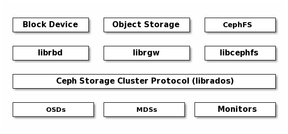
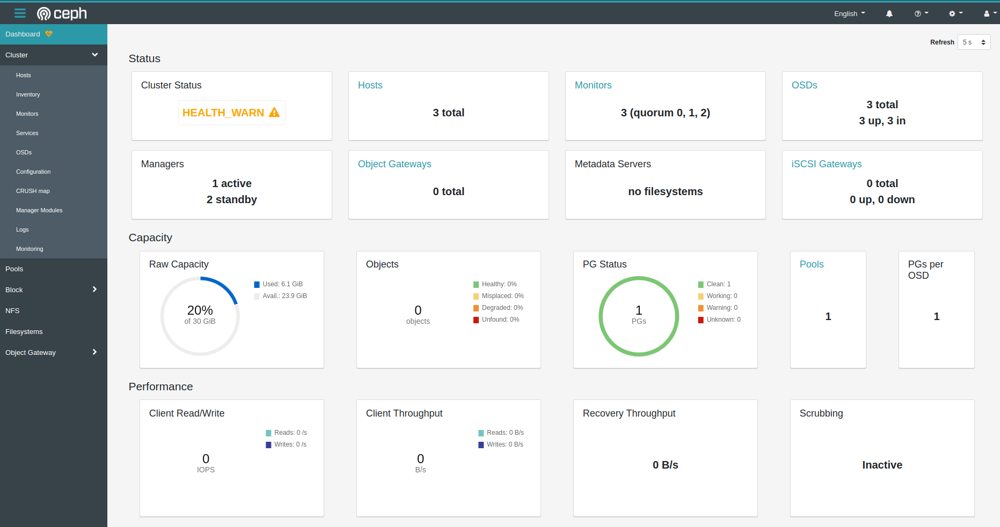

### Zor Yoldan Ceph Storage Kurulumu

Merhaba arkadaşlar, 

Bu yazımızda Red Hat'in açık kaynak distributed storage çözümlerinden biri olan Ceph'i herhangi bir deployment aracı kullanmadan tamamen dokümanlarında anlatıldığı şekliyle kurmaya çalışacağız.

Bu tarz bir kurulumu sadece eğitim amaçlı yapmanızı tavsiye ediyorum. Ayni amacımız Ceph'in kurulumu esnasında yapılan kurulumları ve konfigürayonları anlamaya çalışmak. Gerçek production ortamlarını'u şekilde kurup yönetmeye çalışmak çok yorucu olacaktır. Ayrıca hata yapmaya çok açık bir kurulum olacağı için de deployment araçlarını kullanmak daha mantıklı olacaktır.

- [Cephadm](https://docs.ceph.com/en/pacific/cephadm/#cephadm): Bağımsız cli ile depleyment aracı
- [Rook](https://rook.io/): Kubernetes ortamları için kurulum yöntemi
- [Ceph-Ansible](https://docs.ceph.com/ceph-ansible/): Ansible ile kurulum yöntemi
- Ceph-[deploy](https://docs.ceph.com/projects/ceph-deploy/en/latest/): Bu kurulum artık desteklenmiyor.
- [Deepsea](https://github.com/SUSE/DeepSea): Salt için deployment seçeneği
- [Puppet-ceph](https://github.com/openstack/puppet-ceph)
- **[Manual Installation](https://docs.ceph.com/en/pacific/install/index_manual/#install-manual)**: Biz yöntemle kurulum yapacağız

Ön şartımız biraz [Vagrant](https://www.vagrantup.com/docs) ve [Linux](https://linux-dersleri.github.io/) bilmek.

İyi okumalar umarım faydalı olur.


### Lab Ortamının Kurulumu

3 makina kullanacağız. Özellikler ve kurulacak ceph bileşenleri şu şekilde olacak

- Ubuntu 20.04, /dev/sdb dizininde ekstra bir disk
- Ceph MON, MGR,MDS, OSD bileşenleri üç makinaya da kurulacak.


Vagrant ile lab ortamını kurulumu için iki yöntemi de aşağıda bulabilirsiniz.

- libvirt (kvm-qemu): Sadece Linux'de çalışabilir
- Virtualbox: Mac, Windows ve Linux'de çalışabilir


#### Libvirt ile Vagrant Lab Ortamı Kurulumu

Eğer çok fazla uğraşmak istemezseniz alttaki Vagrant-VirtualBox kurulumunu tercih ediniz.

- kvm-qemu paketlerini kuruyoruz

```bash
sudo apt update && sudo apt install -y qemu qemu-kvm libvirt-daemon bridge-utils virt-manager virtinst libvirt-clients

sudo systemctl status libvirtd

sudo systemctl enable --now libvirtd

```

[Vagrant](https://www.vagrantup.com/downloads)'ı kuruyoruz.

```bash
curl -fsSL https://apt.releases.hashicorp.com/gpg | sudo apt-key add -
sudo apt-add-repository "deb [arch=amd64] https://apt.releases.hashicorp.com $(lsb_release -cs) main"
sudo apt-get update && sudo apt-get install vagrant
```

Daha sonra [vagrant-libvirt](https://github.com/vagrant-libvirt/vagrant-libvirt) plugin'ini kuruyoruz. 

```bash
sudo apt-get install libxslt-dev libxml2-dev libvirt-dev zlib1g-dev ruby-dev

vagrant plugin install vagrant-libvirt
```

**UYARI:** Plugin kurarken https://rubygems.org sayfasına erişememe ile ilgili hata alırsanız alttaki adımları uygulayınız. Detaylar için [şu sayfayı](https://stackoverflow.com/questions/49800432/gem-cannot-access-rubygems-org) ziyaret ediniz.


_/etc/gai.conf_ doyasını açıp en alta _"precedence  2a04:4e42::0/32  5"_ satırını tırnakları silip ekleyiniz. Daha sonra network servisini tekrar başlatınız.


**UYARI:** eger st.h dosyasının olmadığına dair hata alırsanız aşağıdaki komutu çalıştırınız. Versiyona numaranıza dikkat ediniz.

```bash
sudo ln -s /opt/vagrant/embedded/include/ruby-3.0.0/ruby/st.h /opt/vagrant/embedded/include/ruby-3.0.0/st.h
```


**UYARI:** Vagrant-libvirt kurulumunda yukarıdaki komutla hata alamya deam ederseniz alttaki komutla da kurmayı deneyebilirsiniz.

```bash
sudo apt install ruby-libvirt
```

Lab ortamımızı artık ayağa kaldırmaya hazırız. Alttaki komutla sistemi çalıştırıyoruz. İlk box'ın indirilmesi biraz vakit alacaktır.

```shell
mkdir -p ~/ceph/vagrant && cd ~/ceph/vagrant

cat <<EOF | Vagrantfile

# -*- mode: ruby -*-
# vi: set ft=ruby :


# centops kurmak isteseniz generic/ubuntu2004 yeine generic/centos8  yazmanız yeterli

# https://github.com/vagrant-libvirt/vagrant-libvirt
ENV['VAGRANT_DEFAULT_PROVIDER'] = 'libvirt'

Vagrant.configure("2") do |config|

# node1
config.vm.define "node1" do |node1|
    node1.vm.box = "generic/ubuntu2004"
    node1.vm.hostname="node1"
    node1.vm.network "private_network", ip: "10.200.10.10"
    
    node1.vm.provider :libvirt do |lv|
       lv.memory=2048
       lv.cpus=1
       #lv.host = "node1"
       lv.storage :file, :size => '10G'
# disk makinaya /dev/vdb olarak eklenecek
    end 
 end


# node2
config.vm.define "node2" do |node2|
    node2.vm.box = "generic/ubuntu2004"
    node2.vm.hostname="node2"
    node2.vm.network "private_network", ip: "10.200.10.11"
    
    node2.vm.provider :libvirt do |lv|
       lv.memory=2048
       lv.cpus=1
       #lv.host = "node2"
       lv.storage :file, :size => '10G'
# disk makinaya /dev/vdb olarak eklenecek
    end
 end


# node3
config.vm.define "node3" do |node3|
    node3.vm.box = "generic/ubuntu2004"
    node3.vm.hostname="node3"
    node3.vm.network "private_network", ip: "10.200.10.12"
    
    node3.vm.provider :libvirt do |lv|
       lv.memory=2048
       lv.cpus=1
       #lv.host = "node3"
       lv.storage :file, :size => '10G'
# disk makinaya /dev/vdb olarak eklenecek
    end 
 end

end


EOF

vagrant up

```

#### Virtualbox ile Vagrant Lab Ortamı Kurulumu

Makinamıza [VirtualBox](https://www.virtualbox.org/wiki/Downloads) ve ardından [Vagrant](https://www.vagrantup.com/downloads)'ı kurduktan sonra alttaki satırları bilgisayarımızda açtığımız bir klasöre [Vagrantfile](https://www.vagrantup.com/docs/providers/virtualbox/configuration) adında bir dosya açıp  içine kopyalıyoruz.

```Vagrantfile
# -*- mode: ruby -*-
# vi: set ft=ruby :


# centops kurmak isteseniz generic/ubuntu2004 yerine generic/centos8  yazmanız yeterli


Vagrant.configure("2") do |config|

# node1
config.vm.define "node1" do |node1|
    node1.vm.box = "generic/ubuntu2004"
    node1.vm.hostname="node1"
    node1.vm.network "private_network", ip: "10.200.10.10"
    
    node1.vm.provider :virtualbox do |lv|
       lv.memory=2048
       lv.cpus=1
       #lv.host = "node1"
       lv.storage :file, :size => '10G'
# disk makinaya /dev/vdb olarak eklenecek
    end 
 end


# node2
config.vm.define "node2" do |node2|
    node2.vm.box = "generic/ubuntu2004"
    node2.vm.hostname="node2"
    node2.vm.network "private_network", ip: "10.200.10.11"
    
    node2.vm.provider :virtualbox do |lv|
       lv.memory=2048
       lv.cpus=1
       #lv.host = "node2"
       lv.storage :file, :size => '10G'
# disk makinaya /dev/vdb olarak eklenecek
    end
 end


# node3
config.vm.define "node3" do |node3|
    node3.vm.box = "generic/ubuntu2004"
    node3.vm.hostname="node3"
    node3.vm.network "private_network", ip: "10.200.10.12"
    
    node3.vm.provider :virtualbox do |lv|
       lv.memory=2048
       lv.cpus=1
       #lv.host = "node3"
       lv.storage :file, :size => '10G'
# disk makinaya /dev/vdb olarak eklenecek
    end 
 end

end
```
daha sonra terminal veya command-com üzerinde Vagrantfile dosyasının bulunduğu dizinde iken _vagrant up_ komutunu çalıştırıyoruz

**Herhangi bir yöntemle kurulumu yaptıktan sonra ssh ile makinlarımıza bağlanıyoruz**


- Kullanıcı adı: vagrant
- Şifre: vagrant

halen terminalimiz Vagrantfile ile aynı dizindeyken alttaki komutla bağlanabiliriz.

```bash
vagrant ssh node1
```

Bütün makinalara bu şekide bağlanıp (10.200.10.10,11 ve 12) ip'ilerine ping attığımızda cevap almamız lazım. 

### Ceph Kurulumuna Başlıyoruz

Bazı komutları bütün makinalarda çalıştıracağız bu nedenle aynı anda birden fazla terminalde komut çalıştırabilek vakit kaandıracaktır. Ençok bilinenlerden birtanesi [Tmux](https://thevaluable.dev/tmux-config-mouseless/), linke tıklayıp detaylı olarak inceleyebilirsiniz.

**1. Öncelikle bütün makinlarda NTP servisinin çalıştığında emin olmamız lazım.**

Bunun  için timedatactl komutunu çalıştırıyoruz.

```bash
timedatectl

# sonuç
               Local time: Wed 2021-07-14 16:20:38 UTC
           Universal time: Wed 2021-07-14 16:20:38 UTC
                 RTC time: Wed 2021-07-14 16:20:39    
                Time zone: UTC (UTC, +0000)           
System clock synchronized: yes                        
              NTP service: active                     
          RTC in local TZ: no         

```

Sonuçta yukarıdaki gibi NTP service'in active olduğunu ve sync olduğu görebilmemiz gerekiyor. Eğer Ubuntu 20.04 ile Vagrant'ı ayağa kadırdıysanız kuludur ancak yine de problem yaşarsanız [şu linkten](https://linuxconfig.org/ubuntu-20-04-ntp-server) takip  ederek kurabilirsiniz.


**2. Bütün makinalara Ceph'i kuruyoruz**

```bash
wget -q -O- 'https://download.ceph.com/keys/release.asc' | sudo apt-key add -

release=lsb_release -sc

sudo apt-add-repository 'deb https://download.ceph.com/debian-octopus/ focal main'

sudo apt update && sudo apt upgrade

sudo apt install ceph
```

Kurulum için yaklaşım 1 GB alana ihtiyacımz olacak.

Kurulum bittiğinde version kontrolü yapıyoruz.

```bash
ceph -v

# sonuç olarak octopus versiyonunun kurulmuş olması lazım

ceph version 15.2.13 (c44bc49e7a57a87d84dfff2a077a2058aa2172e2) octopus (stable)

```


**3. Bütün makinaların host dosyasını düzenliyoruz**

aşağıdaki satırları ekiyoruz

```bsh
sudo vim /etc/hosts

# aşağıdaki satıları ekliyoruz

10.200.10.10 node1
10.200.10.11 node2
10.200.10.12 node3
```

**4. Root kullanıcısının şifresini değiştiriyoruz**

Bütün makinlarda root şifresini değiştiriyoruz

```bash
sudo passwd root
# vagrant olarak değiştiridik

```


### MON (Monitör) Kurulumu

Kuruluma başlamadan önce alttaki Monitör bileşenlerini inceleyelim.

- **Unique Identifier:** fsid, cluster için benzersiz bir tanımlayıcıdır.
- **Cluster Name:**  Ceph cluster için içinde boşluk olmayan tanımlayıcı bir addır. Varsayılan küme adı ceph'dir,ancak farklı bir isim de belirtilebilir. Örneğin, çok bölgeli bir yapılandırmada birden fazla cluster çalıştırdığınızda, küme adı (ör. Us-west, us-east) geçerli CLI oturumu için cluster'ı  tanımlar. Not: Küme adını komut satırı arayüzünde tanımlamak için, Ceph yapılandırma dosyasını küme adıyla belirtin (ör. Ceph.conf, us-west.conf, us-east.conf, vb.). Ayrıca CLI kullanımı için _ceph --cluster {küme-adı}_ komutuna bakın.
- **Monitor Name (mon):**  Bir cluster içindeki her monitör örneğinin benzersiz bir adı vardır. Genel uygulamada, CephMonitor adı ana bilgisayar adıdır (her ana bilgisayar için bir Ceph Monitor önerilir. Ayrıca Ceph Monitörler ile Ceph OSDDaemon'larının karıştırılmaması önerilir). Host'un kısa adını almak için _hostname -s_ komutunu kullanabilirsiniz.
- **Monitor Map:** Monitörleri ön yüklemek için  bir monitor map oluşturmanız gereklidir. monitor map, fsid, cluster adı (veya varsayılanı kullanır) ve en az bir ana hostname ve IPadresini gerektirir.
- **Monitor Keyring:**  Monitörler birbirleriyle gizli bir anahtar (keyring) aracılığıyla iletişim kurar. Monitor secret ile bir keyring  oluşturmalı ve monitörlerin  ilk yüklenmesinde kullanılmalıdır.
- **Administrator Keyring:** ceph CLI araçlarını kullanmak için bir _client.admin_ kullanıcısına sahip olmanız gerekir. Bu nedenle, yönetici kullanıcısı ve keyring oluşturmanız ve ayrıca _client.admin_ kullanıcısını monitor keyring' e eklemeniz gerekir.

**1. Bütün makinalarda ceph.conf dosyası oluşturuyoruz**


Sadece node1 makinamızda cluster id'yi oluşturup diğerlerinde de kullanacağız.

sadece node1 makinasında alttaki komutu çalıştırıyoruz.

```shell

uuidgen

# sonuçta alttaki gibi bir GUID oluşmuş oldu.

7fa60b7c-9d9c-46c2-a57b-e537ab26a58f
```

bu kodu, monitor node'larımızı ve gerekli tüm ayarları bütün makinalarda ceph.conf dosylarına ekliyoruz

```conf
cat <<EOF | sudo tee -a /etc/ceph/ceph.conf
[global]
fsid = 7fa60b7c-9d9c-46c2-a57b-e537ab26a58f
mon initial members = node1, node2, node3
mon host = 10.200.10.10, 10.200.10.11, 10.200.10.12
public_network = 10.200.10.0/24

auth cluster required = none # eğer auth isteniyorsa cephx yazılmalıdır
auth service required = none # eğer auth isteniyorsa cephx yazılmalıdır
auth client required = none # eğer auth isteniyorsa cephx yazılmalıdır
osd journal size = 1024
osd pool default size = 3
osd pool default min size = 2
osd pool default pg num = 50
osd pool default pgp num = 50
osd crush chooseleaf type = 1
EOF
```

**2. Keyring'leri oluşturuyoruz**

Tekrar node1'den devam ediyoruz, burada işimiz bittiğinde node1'de yaptıklarımızı diğerlerine de dağıtacağız. Secret Key'leri oluşturuyoruz.

```
# monitor secret key.
sudo ceph-authtool --create-keyring /tmp/ceph.mon.keyring --gen-key -n mon. --cap mon 'allow *'

# adminsitrator keyring oluşturuyoruz, client.admin kullanıcısı oluşturuyoruz ve kullanıcıyı keyring'e ekliyoruz
sudo ceph-authtool --create-keyring /etc/ceph/ceph.client.admin.keyring --gen-key -n client.admin --cap mon 'allow *' --cap osd 'allow *' --cap mds 'allow *' --cap mgr 'allow *'

# bootstrap-osd keyring oluşturyoruz, client.bootstrap-osd kullanıcı oluşturuyoruz ve kullanıcıyı keyring'e ekliyoruz.
sudo ceph-authtool --create-keyring /var/lib/ceph/bootstrap-osd/ceph.keyring --gen-key -n client.bootstrap-osd --cap mon 'profile bootstrap-osd' --cap mgr 'allow r'

# oluşturduğumuz bütün key'leri ceph.mon.keyring'e ekliyoruz

sudo ceph-authtool /tmp/ceph.mon.keyring --import-keyring /etc/ceph/ceph.client.admin.keyring
sudo ceph-authtool /tmp/ceph.mon.keyring --import-keyring /var/lib/ceph/bootstrap-osd/ceph.keyring
```

**3. Monitor Map'leri Oluşturuyoruz**

Halen node1 makinasından devam eddiyoruz.

```
monmaptool --create --add node1 10.200.10.10 --add node2 10.200.10.11 --add node3 10.200.10.12  --fsid 7fa60b7c-9d9c-46c2-a57b-e537ab26a58f /tmp/monmap

# Komut sonucu

monmaptool: monmap file /tmp/monmap
monmaptool: set fsid to 7fa60b7c-9d9c-46c2-a57b-e537ab26a58f
monmaptool: writing epoch 0 to /tmp/monmap (3 monitors)
```

**4. Oluşturduğumuz key'leri ve monitor map dosyalarını diğer sunuculaa taşıyoruz**

node1 makinasındayken


Aşağıdaki komutları çalıştırırken hata alırsanız _sudo su_ komutu ile root olarak çalıştırınız.

```bash
scp /tmp/monmap root@node2:/tmp/
scp /tmp/monmap root@node3:/tmp/


scp /etc/ceph/ceph.client.admin.keyring root@node2:/etc/ceph/
scp /etc/ceph/ceph.client.admin.keyring root@node3:/etc/ceph/

scp /tmp/ceph.mon.keyring root@node2:/tmp/
scp /tmp/ceph.mon.keyring root@node3:/tmp/

```
dosyaları daha sonra kullanacağız.


**5. Monitor için data klasörü oluşturuyoruz ve Monitorleri başlatıyoruz**

Bu komutu bütün makinalarda çalıştırıyoruz. Ancak bütün makinalarda ayrı ayrı hostname isimlerini kullanarak yapmalıyız.


Örneğin node1 makinası için 

```bash
sudo  mkdir /var/lib/ceph/mon/ceph-node1

sudo  ceph-mon --mkfs -i node1 --monmap /tmp/monmap --keyring /tmp/ceph.mon.keyring

sudo ls /var/lib/ceph/mon/ceph-node1

# sonuç
kv_backend  store.db
```

node2 için


```bash
sudo  mkdir /var/lib/ceph/mon/ceph-node2
sudo  ceph-mon --mkfs -i node2 --monmap /tmp/monmap --keyring /tmp/ceph.mon.keyring

sudo ls /var/lib/ceph/mon/ceph-node2

# sonuç
kv_backend  store.db
```


node3 için

```bash
sudo  mkdir /var/lib/ceph/mon/ceph-node3
sudo  ceph-mon --mkfs -i node3 --monmap /tmp/monmap --keyring /tmp/ceph.mon.keyring

sudo ls /var/lib/ceph/mon/ceph-node3

# sonuç
kv_backend  store.db
```

Dosya ve dizinlerin sahipliklerini değiştiriyoruz.

```bash
sudo chown -R ceph:ceph /var/lib/ceph/mon
sudo chown -R ceph:ceph /var/log/ceph
sudo chown -R ceph:ceph /var/run/ceph
sudo chown ceph:ceph /etc/ceph/ceph.client.admin.keyring
sudo chown ceph:ceph /etc/ceph/ceph.conf
sudo chown ceph:ceph /etc/ceph/rbdmap
```

Bütün makinalarda Monitörü restart ediyoruz.


node1 için

```bash
sudo systemctl start ceph-mon@node1
sudo systemctl status ceph-mon@node1
```

node2 için

```bash
sudo systemctl start ceph-mon@node2
sudo systemctl status ceph-mon@node2

```

node3 için

```bash
sudo systemctl start ceph-mon@node3
sudo systemctl status ceph-mon@node3

```

Bütün makinalarda monitörün çalıştığını gördükten sonra Manager kurulumuna devam ediyoruz.

### MGR (Manager) Kurulumu

Bütün makinalarda ayrı ayrı çalıştırmalıyız. node1 için örnek aşağıda diğerlerinde node1 yerine hangi makinada çalıştıracaksak onun hostname'ini (node,node3) yazmalıyız. 


node1 için
```bash
sudo -u ceph mkdir /var/lib/ceph/mgr/ceph-node1
sudo ceph auth get-or-create mgr.node1 mon 'allow profile mgr' osd 'allow *' mds 'allow *' -o /var/lib/ceph/mgr/ceph-node1/keyring
sudo chown -R ceph:ceph /var/lib/ceph/mgr
sudo systemctl enable ceph-mgr.target
sudo systemctl enable ceph-mgr@node1
sudo systemctl restart ceph-mgr@node1
ceph mon enable-msgr2
```

node2 için

```bash
sudo -u ceph mkdir /var/lib/ceph/mgr/ceph-node2
sudo ceph auth get-or-create mgr.node2 mon 'allow profile mgr' osd 'allow *' mds 'allow *' -o /var/lib/ceph/mgr/ceph-node2/keyring
sudo chown -R ceph:ceph /var/lib/ceph/mgr
sudo systemctl enable ceph-mgr.target
sudo systemctl enable ceph-mgr@node2
sudo systemctl restart ceph-mgr@node2
ceph mon enable-msgr2
```


node3 için

```bash
sudo -u ceph mkdir /var/lib/ceph/mgr/ceph-node3
sudo ceph auth get-or-create mgr.node3 mon 'allow profile mgr' osd 'allow *' mds 'allow *' -o /var/lib/ceph/mgr/ceph-node3/keyring
sudo chown -R ceph:ceph /var/lib/ceph/mgr
sudo systemctl enable ceph-mgr.target
sudo systemctl enable ceph-mgr@node3
sudo systemctl restart ceph-mgr@node3
ceph mon enable-msgr2
```


node'lardan herhangi birinde alttaki komutu çalıştırarak sistemi kontrol ediyoruz

```bash
ceph -s

# sonuç olarak services kısmında node1 in aktif olsuğunu diğer ikisinin standby durumunda beklediğini görebiliyoruz.

  cluster:
    id:     7fa60b7c-9d9c-46c2-a57b-e537ab26a58f
    health: HEALTH_WARN
            mons are allowing insecure global_id reclaim
            3 monitors have not enabled msgr2
            OSD count 0 < osd_pool_default_size 3
 
  services:
    mon: 3 daemons, quorum node1,node2,node3 (age 80m)
    mgr: node1(active, starting, since 1.35779s), standbys: node2, node3
    osd: 0 osds: 0 up, 0 in
 
  data:
    pools:   1 pools, 1 pgs
    objects: 0 objects, 0 B
    usage:   0 B used, 0 B / 0 B avail
    pgs:     100.000% pgs unknown
             1 unknown

```
Bu arada manager üzerine bir çok module kurmak mümkün. örneğin web ui dashboard için alttaki linke bakılabilir. 

- https://docs.ceph.com/en/latest/mgr/dashboard/#enabling


node1'de alttaki komutları çalıştırarak dashboard'u aktif edebiliriz.

```bash
ceph mgr module enable dashboard
ceph mgr module ls


# sonuç

   1 {
   2     "always_on_modules": [
   3         "balancer",
   4         "crash",
   5         "devicehealth",
   6         "orchestrator",
   7         "pg_autoscaler",
   8         "progress",
   9         "rbd_support",
  10         "status",
  11         "telemetry",
  12         "volumes"
  13     ],
  14     "enabled_modules": [
  15         "dashboard",
  16         "iostat",
  17         "restful"
  18     ],
  19     "disabled_modules": [
  20     ...   

```

Monitörler başlamadan önce dashboard ayarları da yapılırsa restart durumlarında problem yaşanmaz. _/etc/ceph/ceph.conf_ dosyasında aşağıdaki ayar eklenebilir.

```bash
[mon]
mgr initial modules = dashboard balancer
```


Daha bir çok module var.


- Dashboard module
- Ceph RESTful API
- Alerts module
- DiskPrediction module
- Local pool module
- RESTful module
- Zabbix module
- Prometheus module
- Influx module
- Hello module
- Telegraf module
- Telemetry module
- Iostat module
- Crash module
- Insights module
- Orchestrator module
- Rook module


### OSD (Object Storage Daemon) Kurulumu

- Öncelikle node1 üzerindeki bootstrap-osd klasörü altındaki _ceph.keyring_ dosyasını diğer node lara kopyalıyoruz.

Eğer bu madde de sorun yaşanırsa [şu linke](https://docs.ceph.com/en/latest/install/manual-deployment/#long-form) bakılmalıdır. keyring olmayabilir ve yeniden oluşturulması gerekebilir. linkteki madde 4 e bakınız.

node1 de iken

```bash
sudo scp /var/lib/ceph/bootstrap-osd/ceph.keyring root@node2:/var/lib/ceph/bootstrap-osd/
sudo scp /var/lib/ceph/bootstrap-osd/ceph.keyring root@node3:/var/lib/ceph/bootstrap-osd/

```
- Daha sonra makinalarımızda (node'larda) takılı olan ekstra diski OSD olarak ayarlıyoruz.

Bunun için bütün node'larda _fdisk -l_ komutu ile dislerimizin listesini alıyoruz.

Büyük ihtimalle _/dev/vdb olan_ sonradan takılan ektra disktir.

OSD'yi create ediyoruz. Node1 de iken alttaki komutu çalıştırıyoruz. Aynısını bütün node larda yapıyoruz.

```bash
sudo ceph-volume lvm create --data /dev/vdb
```

Komutlar çalıştırıldıklarında OSD'lere sırasıyla 0,1.2 etc şeklinde id'ler verildiğini görebiliriz.

Eğer bu id'leri karıştıracak olursanız makinada olmayan bir servisi çalıştırıyor olursunuz haliyle çalışmayacaktır. doğru id'yi doğru makinada çalıştırmak için her makinada _sudo ls /var/lib/ceph/osd_ dizinini kontol ettiğimizide ceph-0, ceph-1, ceph-2 adında klasörlerde birini göreceğiz. Örneğin kontrol ettiğimiz makinada ceph-1 klasörü varsa ozaman o makinada _sudo systemctl restart ceph-osd@1_ servisiniz çalıştıracağız.

Bütün node'larda hangi OSD id'si var onunla OSD'yi restart ediyoruz.

örneğin node1 de OSD id si 0 dı

```OSD
sudo systemctl restart ceph-osd@0
```

node 2 için

```OSD
sudo systemctl restart ceph-osd@1
```
node 3 için

```OSD
sudo systemctl restart ceph-osd@2
```

- volume listesi alınabilir. her makinada ayrı çalıştırılmalı

mesela benim cluster'ımda node1'de osd listesi

```OSD
sudo ceph-volume lvm list

====== osd.2 =======

  [block]       /dev/ceph-98012ae9-ce95-436d-b2f9-b109ce86e4c9/osd-block-13243528-50a7-4ca7-9181-15e8df77573f

      block device              /dev/ceph-98012ae9-ce95-436d-b2f9-b109ce86e4c9/osd-block-13243528-50a7-4ca7-9181-15e8df77573f
      block uuid                Mvi6eR-7O5X-kYjw-uoYT-duMq-p1rT-JHFJtM
      cephx lockbox secret      
      cluster fsid              7fa60b7c-9d9c-46c2-a57b-e537ab26a58f
      cluster name              ceph
      crush device class        None
      encrypted                 0
      osd fsid                  13243528-50a7-4ca7-9181-15e8df77573f
      osd id                    2
      osdspec affinity          
      type                      block
      vdo                       0
      devices                   /dev/vdb


```


- birde cluster'ımızın durumuna bakalım

```OSD
ceph -s

  cluster:
    id:     7fa60b7c-9d9c-46c2-a57b-e537ab26a58f
    health: HEALTH_WARN
            mons are allowing insecure global_id reclaim
 
  services:
    mon: 3 daemons, quorum node1,node2,node3 (age 2h)
    mgr: node1(active, since 2h), standbys: node2, node3
    osd: 3 osds: 3 up (since 13m), 3 in (since 3h)
 
  data:
    pools:   1 pools, 1 pgs
    objects: 0 objects, 0 B
    usage:   6.4 GiB used, 24 GiB / 30 GiB avail
    pgs:     1 active+clean

```

### MDS (Metadata Server) Kurulumu

Kaynak: https://docs.ceph.com/en/latest/install/manual-deployment/#adding-mds

- Aşağıdaki komutlar 3 node da da çalıştırılır.


node1 örneği
```OSD
sudo -u ceph mkdir -p /var/lib/ceph/mds/ceph-node1
sudo ceph-authtool --create-keyring /var/lib/ceph/mds/ceph-node1/keyring --gen-key -n mds.node1
sudo ceph auth add mds.node1 osd "allow rwx" mds "allow" mon "allow profile mds" -i /var/lib/ceph/mds/ceph-node1/keyring
sudo chown -R ceph:ceph /var/lib/ceph/mds
sudo systemctl restart ceph-mds@node1
```

node2 örneği

```OSD
sudo -u ceph mkdir -p /var/lib/ceph/mds/ceph-node2
sudo ceph-authtool --create-keyring /var/lib/ceph/mds/ceph-node2/keyring --gen-key -n mds.node2
sudo ceph auth add mds.node2 osd "allow rwx" mds "allow" mon "allow profile mds" -i /var/lib/ceph/mds/ceph-node2/keyring
sudo chown -R ceph:ceph /var/lib/ceph/mds
sudo systemctl restart ceph-mds@node2
```

node3 örneği

```OSD
sudo -u ceph mkdir -p /var/lib/ceph/mds/ceph-node3
sudo ceph-authtool --create-keyring /var/lib/ceph/mds/ceph-node3/keyring --gen-key -n mds.node3
sudo ceph auth add mds.node3 osd "allow rwx" mds "allow" mon "allow profile mds" -i /var/lib/ceph/mds/ceph-node3/keyring
sudo chown -R ceph:ceph /var/lib/ceph/mds
sudo systemctl restart ceph-mds@node3
```

- bütün node'larda _/etc/ceph/ceph.conf_ dosyasının sonuna  alttaki satırlar eklenir.


```conf
[mds.node1]
host = node1

[mds.node2]
host = node2

[mds.node3]
host = node3
```

- daha sonra bütün servisler bütün node'larda  baştan başlatırlır.

node1 örneği (osd 2 bende node1 makinasında)
```bash
sudo systemctl restart ceph-mon@node1
sudo systemctl restart ceph-mgr@node1
sudo systemctl restart ceph-mds@node1
sudo systemctl restart ceph-osd@2

```

node2 örneği
```bash
sudo systemctl restart ceph-mon@node2
sudo systemctl restart ceph-mgr@node2
sudo systemctl restart ceph-mds@node2
sudo systemctl restart ceph-osd@1

```

node3 örneği (osd 0 bende node3 makinasında)
```bash
sudo systemctl restart ceph-mon@node3
sudo systemctl restart ceph-mgr@node3
sudo systemctl restart ceph-mds@node3
sudo systemctl restart ceph-osd@0

```

- daha sonra cluster check edilir

```bash
ceph mds stat

#sonuç
 3 up:standby
```

diğer kontrol

```bash
ceph -s

  cluster:
    id:     7fa60b7c-9d9c-46c2-a57b-e537ab26a58f
    health: HEALTH_WARN
            mons are allowing insecure global_id reclaim
 
  services:
    mon: 3 daemons, quorum node1,node2,node3 (age 18s)
    mgr: node1(active, since 17s), standbys: node3, node2
    mds:  3 up:standby
    osd: 3 osds: 3 up (since 16s), 3 in (since 5h)
 
  task status:
 
  data:
    pools:   1 pools, 1 pgs
    objects: 0 objects, 0 B
    usage:   6.3 GiB used, 24 GiB / 30 GiB avail
    pgs:     1 active+clean
```

son kontrol OSD'lee  için


```bash
ceph osd tree


ID  CLASS  WEIGHT   TYPE NAME       STATUS  REWEIGHT  PRI-AFF
-1         0.02939  root default                             
-3         0.00980      host node1                           
 2    hdd  0.00980          osd.2       up   1.00000  1.00000
-5         0.00980      host node2                           
 1    hdd  0.00980          osd.1       up   1.00000  1.00000
-7         0.00980      host node3                           
 0    hdd  0.00980          osd.0       up   1.00000  1.00000

```

buraya kadar resimdeki en alt katmanı oluşturmuş olduk




şimdi bu clusterın üstüne object (amazon s3), block (disk) ve file storage (nfs, smb) kurulabilir


### Çalışması gereken sevisler

- bütün makinlarda aynı isimle çalışması gereken servisler. 

Bu servislerden ilki yani ceph.target alttaki target servislerini toplu halde çalıştırıp stop yapmayı sağlıyor. Target ile service arasındaki farklar için alttaki kaynaklara gözatabilirsiniz

- https://medium.com/@berkkarabacak/systemd-nedir-linuxda-nas%C4%B1l-servis-yarat%C4%B1l%C4%B1r-19eee923d02a
- https://unix.stackexchange.com/questions/159462/what-is-systemds-target-service-and-socket
- https://unix.stackexchange.com/questions/301987/how-to-create-a-systemd-target

basitçe sistem ayağa kalkarken belirli level'larda çalışması beklenen servisleri ilgili level'da ve gruplandırarak çalıştırır. Kendi target dosyamızı da yazabiliriz. Örneğin aynı anda beraber çalışması gereken 2 veya daha fazla servis için hangisinin önce hangisinin sonra çalışacağını, conflict olması durumunda hangi target'ın devreye gireceğini belirtebiliriz. 


```bash
sudo systemctl enable ceph.target
sudo systemctl enable ceph-mgr.target
sudo systemctl enable ceph-mon.target
sudo systemctl enable ceph-osd.target

sudo systemctl enable ceph-radosgw.target
```
node1 üzerinde çalışan bütün service ve target'lara bakacak olursak açıklamlarından target'ların ne iş yaptıklarını okuyabiliriz.

```bash
systemctl  | grep  ceph

  var-lib-ceph-osd-ceph\x2d2.mount   loaded active mounted   /var/lib/ceph/osd/ceph-2                                                     
  ceph-crash.service                 loaded active running   Ceph crash dump collector                                                    
  ceph-mds@node1.service             loaded active running   Ceph metadata server daemon                                                  
  ceph-mgr@node1.service             loaded active running   Ceph cluster manager daemon                                                  
  ceph-mon@node1.service             loaded active running   Ceph cluster monitor daemon                                                  
  ceph-osd@2.service                 loaded active running   Ceph object storage daemon osd.2                                             
  system-ceph\x2dmds.slice           loaded active active    system-ceph\x2dmds.slice                                                     
  system-ceph\x2dmgr.slice           loaded active active    system-ceph\x2dmgr.slice                                                     
  system-ceph\x2dmon.slice           loaded active active    system-ceph\x2dmon.slice                                                     
  system-ceph\x2dosd.slice           loaded active active    system-ceph\x2dosd.slice                                                     
  system-ceph\x2dvolume.slice        loaded active active    system-ceph\x2dvolume.slice                                                  
  ceph-fuse.target                   loaded active active    ceph target allowing to start/stop all ceph-fuse@.service instances at once  
  ceph-mds.target                    loaded active active    ceph target allowing to start/stop all ceph-mds@.service instances at once   
  ceph-mgr.target                    loaded active active    ceph target allowing to start/stop all ceph-mgr@.service instances at once   
  ceph-mon.target                    loaded active active    ceph target allowing to start/stop all ceph-mon@.service instances at once   
  ceph-osd.target                    loaded active active    ceph target allowing to start/stop all ceph-osd@.service instances at once   
  ceph.target                        loaded active active    ceph target allowing to start/stop all ceph*@.service instances at once      
```

ceph-mgr.target inceleyecek olursak biraz daha iyi anlaşılabilir.

```bash

cat /lib/systemd/system/ceph-mgr.target

[Unit]
Description=ceph target allowing to start/stop all ceph-mgr@.service instances at once
PartOf=ceph.target
After=ceph-mon.target
Before=ceph.target
Wants=ceph.target ceph-mon.target

[Install]
WantedBy=multi-user.target ceph.target
```

- alttaki satırların her biri farklı makinada çalışmalı. peki nereden anlayacağız hangi servisin hangi makinada çaışacağını. 

Her makinada _sudo ls /var/lib/ceph/osd_ dizinini kontrol ettiğimizide ceph-0, ceph-1, ceph-2 adında klasörlerde birini göreceğiz. Örneğin kontrol ettiğimiz makinada ceph-1 klasörü varsa ozaman o makinada _sudo systemctl restart ceph-osd@1_ servisiniz çalıştıracağız.

```bash
sudo systemctl start ceph-osd@0
sudo systemctl start ceph-osd@1
sudo systemctl start ceph-osd@2
```


- Her makinadana hostname e göre çalıştıracalak servisler

```bash
sudo systemctl enable ceph-mgr@node1
sudo systemctl start ceph-mgr@node1

sudo systemctl enable ceph-mgr@node2
sudo systemctl start ceph-mgr@node2

sudo systemctl enable ceph-mgr@node3
sudo systemctl start ceph-mgr@node3
```


- Her makinadana hostname e göre çalıştıracalak servisler

```bash
sudo systemctl enable ceph-mon@node1
sudo systemctl start ceph-mon@node1

sudo systemctl enable ceph-mon@node2
sudo systemctl start ceph-mon@node2

sudo systemctl enable ceph-mon@node3
sudo systemctl start ceph-mon@node3
```

- Her makinadana hostname e göre çalıştıracalak servisler

```bash
sudo systemctl restart ceph-mds@node1
sudo systemctl restart ceph-mds@node2
sudo systemctl restart ceph-mds@node3
```

### Problem Giderme


- **dashboard ile ilgili hatalar**
  1. modullerin yüklü olduğundan emin olun. Available veya alway on modullerin içinde olmalı

  ```bash
  ceph mgr module ls
  ```

  2. servislerin çalıştığıdan emin olun

  ```bash
  sudo systemctl status ceph-mgr@node1
  ```
  sonuçta tekrar hata varsa gelecektir.


  3. dashboard'la ilgili komutlar
  ```

  # ceph mgr module disable dashboard

  #  dashboard
  ceph config set mgr mgr/dashboard/server_addr 0.0.0.0
  ceph config set mgr mgr/dashboard/server_port 9000 # ssl için 443 veya 8443 kullanılır

  #  dashboard 
  # ceph dashboard create-self-signed-cert # sertifika oluşturmak için. kendi sertifikamızı kullanmak istersek dokümanlara bakılmalı


  #  dashboard  ssl
  ceph config set mgr mgr/dashboard/ssl false # ssl için true olmalı

  #  dashboard 
  ceph mgr module enable dashboard # üstteki komutları çalıştırabilmek için zaten enable olmalı yani ssl, ip ve port için

  #  dashboard 
  ceph dashboard set-login-credentials username_gelmeli -i sifrenin_oldugu_dosya_adresi


  #  mgr - herşey yolundadysa mgr servisleri altında dashbord görünmeli.
  ceph mgr services
  echo :
  {
    "dashboard": "https://0.0.0.0:9000/"
  }
  ```
Bu arada şuna da dikkat etmemiz gerekiyor bütün makinaların kendi host makinamızda dns kaydı olmalı yani bu örnek için ilk başta balirttiğimiz hosts dosyası ayarlarını host makinamızda da yapmalıyız.


```bash
sudo vim /etc/hosts

# aşağıdaki satıları ekliyoruz

10.200.10.10 node1
10.200.10.11 node2
10.200.10.12 node3
```

### Dashboard


tarayıcıda https://10.200.10.10:8443 adresine gittğimizde alttaki gibi bir sayfa görüyor olacağız. 




CRUSH map


### Kaynaklar

- https://access.redhat.com/documentation/en-us/red_hat_ceph_storage/3/html-single/administration_guide/index
- https://access.redhat.com/documentation/en-us/red_hat_ceph_storage/3/html/installation_guide_for_ubuntu/deploying-red-hat-ceph-storage (kesinlikle bakılmalı)
- https://documentation.suse.com/ses/6/html/ses-all/book-storage-deployment.html
- https://documentation.suse.com/ses/6/single-html/ses-admin/index.html