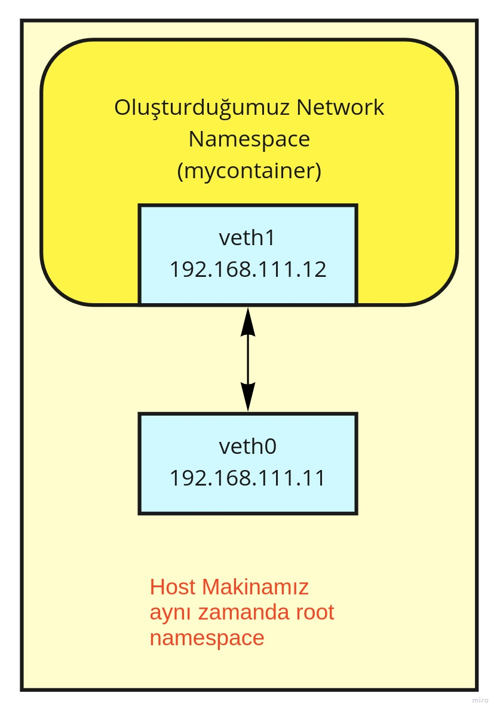
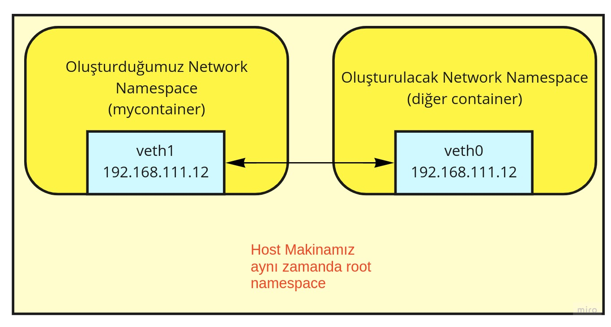
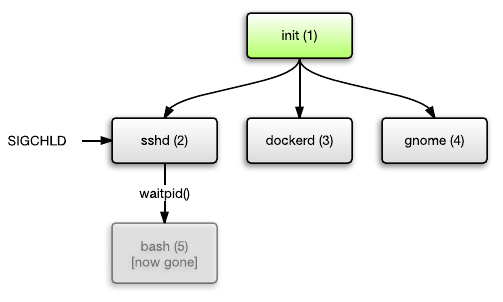
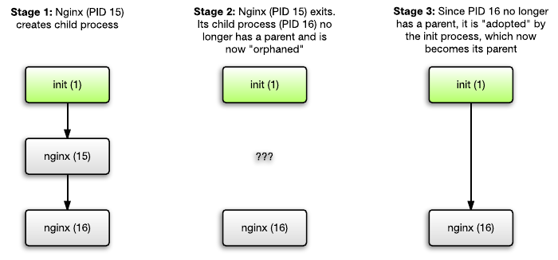

# Linux Namespace Kullanarak Container Oluşturuyoruz

Merhaba arkadaşlar,

Bu yazımızda aşağıdaki konu başlıklarını inceleyip öğrenmeye çalışacağız.  
- Linux namespace yapısı  
- Docker container'larına benzer bir yapıyı namespace'leri kullanarak kurmak
- Docker container üzerinde namespace'lerin tesbiti
- Rootless Docker kavramı 
- Init, zombie, orphan process kavramları    

Öncelikle şu gerçekle başlayalım. Container kavramı aslında Linux'de doğrudan yok. Yoktan kastım Linux'ün kaynak kodlarında normalde bildiğimiz anlamda container diye bir kavram geçmiyor. Linux kernel'in sunmuş olduğu [namespace](https://en.wikipedia.org/wiki/Linux_namespaces) özellikleri kullanılarak container oluşturulur. Docker ve benzeri container runtime'lar ise aşağıda çok ufak bir kısmını göreceğimiz bu özellikleri sarmalayarak bize kullanımı daha kolay hale getirilmiş bir ortam sunarlar. 


Cgroup'u da sayacak olursak yedi adet namespace var.

- **Mount (mnt)**: İzole file system tree oluşturmak için kullanılır
- **Process ID (pid)**: Process id'leri izole eder. Temel amaç oluşturduğumuz namespace'de bash'in (veya çalıştıracak başka bir uygulamanın) kendini 1 nolu process olarak görmesini sağlamak. Normalde process'ler nested (iç içe geçmiş) yapıdadır. Çalıştıracağımız uygulamayı (bash) kendi izole ortamında sanki bir tek kendi çalışıyormuş gibi davranmasını sağlamaya çalışacağız.
- **Network (net)**: Network namespace ile oluşturduğumuz container alt yapısının yani izole ettiğimiz process'lerin içinde çalışmış olduğu fiziksel altyapıdan izole bir network ortamında çalışmasını sağlamaktır.
- **Interprocess Communication (ipc)**: process'lerin birbiriyle (semaphores, message queue, shared memory segments,..) iletişimin izole edilmesini ifade eder.
- **UTS**: Hostname'in izole edilmesini sağlar. Asıl amaç process'in bağlı olduğu sistemin etki alanını izole etmektir. Böylece sistem saati'de izole edilmiş olur.
- **User ID (user)**: Process'in çalıştıran user'ın hem yetki olarak hem de kimlik olarak izole edilmesini ifade eder.

Bunlardan başka chroot ve control group'ları da kullanacağız.

- **Control group (cgroup)**: Çalıştırılan process'lerin sistemden kullanacağı kaynakları kısıtlamayı, önceliklendirmeyi, kontrol altında tutmayı ve kaynak kullanımının izlenmesini ifade eder.
- **chroot**: Çalıştırılacak process'in root klasörünü değiştirir. Root klasörünü izole eder.

Tabii ki bu başlıkların her biri ayrı ayrı incelenmesi gereken konular. Biz burada daha faydacı yaklaşacağız. Bu başlıklara dalıp boğulmaktansa container sisteminin Linux üzerinde nasıl oluşturulduğunu anlamaya çalışacağız.

Namespace oluşturmak için Kernel bize iki adet api sunar. Uygulama geliştirirken ilgili system call yapılarak namespace oluşturulur

- **clone**: Belirtilen namespace tiplerinde yeni bir process oluşturur. Uygulama geliştirirken ilgili CLONE_NEW* fonksiyonu çağrılarak oluşturulur. GoLang ile yapılmış örneği görmek isterseniz [şu linki](https://medium.com/@teddyking/linux-namespaces-850489d3ccf) ziyaret ediniz. 
- **unshare**: Halihazırda çalışan process'i bir namespace'e dahil eder. Terminal üzerinden kullanılabildiği için internette namespace kavramı genellikle bu uygulama ile anlatılır. Biz de aynı yolu takip edeceğiz.


Namespace'leri incelerken sık sık iki terminal arsında git gel yapacağız. Kolaylık olması adına ilk açtığımız ve namespace'i oluşturmaya başladığımız terminal için shell script'lerinin en üstüne "1111", ikinci açtığımız terminal için yazdığım shell script'leri için de "2222" tag'larını kullanacağım.

# User Namespace

Amacımız kullanıcıların kimliklerini (identity), özelliklerini (attributes), kullanıcı id'lerini (user id), kullanıcı gruplarını , root klasörlerini ve [capability](https://man7.org/linux/man-pages/man7/capabilities.7.html)'lerini izole etmektir.


- -U opsiyonu user namespace oluşturduğumuzu ifade ediyor
- --kill-child opsiyonu unshared process'i sona erdiğinde signame'i fork'lanan child process'lere iletilmesini sağlar. 

namespace oluştuktan sonra id ile kimliğimize baktığımızda nobody olarak açıldığını görebiliriz. Bu da aslında root namespace passwd dosyasında tanımlıdır. 


```shell
##################### 1111

cd $HOME

unshare -U --kill-child  /bin/bash

# id
uid=65534(nobody) gid=65534(nogroup) groups=65534(nogroup)

cat /etc/passwd

# nobody:x:65534:65534:nobody:/nonexistent:/usr/sbin/nologin
```

Şimdi bir dosya oluşturup hem yeni oluşturduğumuz namespace üzerinde hem de root namespace üzerinde sahipliğini kontrol edelim.

```shell
##################### 1111

echo merhaba dünya > test.txt

ls -l test.txt 
# -rw-rw-r-- 1 nobody nogroup 15 Tem  5 13:00 test.txt
```

Başka bir terminal açıp root namespace üzerinde aynı dosyanın sahipliğine bakalım.

kullanıcı adı kısmında komutu çalıştırırken kullandığını kullanıcı adınız olacaktır. Yani aslında sistem biz özellikle belirtmediğimiz için yeni oluşturduğumuz userspace'deki nobody kullanıcısını root namespace'deki unshare komutunu çalıştırdığımız kullanıcı ile eşleştirdi (map).  

```shell
##################### 2222
cd $HOME

ls -l test.txt
# -rw-rw-r-- 1 kullanici_adi group_adi 8 Tem  5 12:58 test.txt
```

Oluşturduğumuz namespace'deki terminalde yeni bir namespace oluşturmayı denediğimizde yetkimizin olmadığını görebiliriz. Hatta sudo ile birlikte bile denesek hata alacağız. Çünkü yeni oluşturduğumuz namespace'de passwd dosyasının sahipliği bile nobody olarak görünüyor.  Root namespace'de bakacak olursanız sahipliğin root kullanıcısı üzerinde olduğunu görebilirsiniz.

```shell
##################### 1111
unshare -iu /bin/bash
# unshare: unshare failed: Operation not permitted

sudo unshare -iu /bin/bash
# sudo: /etc/sudo.conf is owned by uid 65534, should be 0
# sudo: /usr/bin/sudo must be owned by uid 0 and have the setuid bit set
```
Yeni oluşturduğumuz namespace'de bu durumu düzeltmemiz gerekiyor. Bunun için Linux bize _subuid (subordinate )_ ve _subgid_ kavramlarını anlamamız gerekiyor. Bu sistemler ile Linux'de bir kullanıcının birden fazla user id ve group id almasını sağlayabiliyoruz. Peki bu ne işimize yarayacak? Bunun en iyi kullanıldığı yerlerden biri de container teknolojileri.

Normalde Linux user id olarak 0-65536 arasını kullanır. Ancak container'ı unprivileged bir user ile çalıştırmak için container'ı ana sistemden ve bazen diğer container'lardan izole etmek gereklidir. Bunun için container içindeki kullanıcının user id'sini ve group id'sini yükseltmek gerekir. Bu id'ler ana sistemle paylaşılmaz. Böylece kullanıcı container dışına bir şekilde çıkabilse bile hiçbir şey yapamaz. Çünkü kullanıcının ana sistemde karşılığı çok yetkisiz bir kullanıcıdır. Çünkü container içine örneğin 1.000.000 dan başlayan uid'lerin sistemde karşılığı normal kullanıcıdır. Container içinde root olan bir kullanıcı dışarıda alelade bir kullanıcı olacaktır.

Bu sistemi kullanmak için iki adet dosyayı düzenlememiz gerekiyor. Bunu cli ile yapabileceğimiz gibi doğrudan dosyalara müdahele ederek de yapabiliriz.

Öncelikle oluşturduğumuz namespace'de çalışan shell'in pid'sini alıyoruz.

```shell
##################### 1111
echo $$
# 38289
```
Daha sonra bu process'in subuid ve subgid map kayıtlarına ekleme yapıyoruz. Diğer terminalde aşağıdaki kodları çalıştırıyoruz.

```shell
##################### 2222

# 38289 id'si yerine siz kendi pid'nizi yazmalısınız.
echo "0 1000 65335" | sudo tee /proc/38289/uid_map
echo "0 1000 65335" | sudo tee /proc/38289/gid_map
```

Yani bu process üzerinde container namespace'de 0 id'li kullanıcı root namespace'de içinde 1000'id li kullanıcı olacak demektir. Bu işlemden sonra tekrar oluşturduğumuz namespace içinde çalıştırdığımız terminalde kimlik bilgimize bakalım.

```shell
##################### 1111
id
#uid=0(root) gid=0(root) groups=0(root),65534(nogroup),1(daemon)
```

Artık bu user namespace altında root kullanıcıyız. Bide dosya oluşturup sahipliğine bakalım.

```shell
##################### 1111
echo > test2.txt

ls -l test2.txt 

#-rw-rw-r-- 1 root root 1 Tem  5 15:46 test2.txt
```

Diğer terminalden sistemde hangi kullanıcıya denk geldiğine bakalım

```shell
##################### 2222
ls -l test2.txt
# -rw-rw-r-- 1 kullanici_adi group_adi 1 Tem  5 15:46 test2.txt


id
# uid=1000(kullanici_adi) gid=1000(grup_adi)...
```
Görüleceği üzere namespace içinde root olmamıza rağmen ana sistemde kendi kullanıcımız olarak görünüyoruz.

Biz _/proc/38289/uid_map_ ve _/proc/38289/gid_map_ dosyalarında değişiklik yaptığımızda aslında _/etc/subuid_ ve _/etc/subgid_ dosyalarına da kayıt girmiş olduk. Aynı işlemi doğrudan bu dosyalarda da yapabilirdik.

Root namespace'de açtığımız terminalde bu dosyaların içeriğine bakalım.

```shell
##################### 2222
cat /etc/subuid
#root:100000:65536

cat /etc/subgid
# root:100000:65536

```
Örneğin root namespace'de alttaki komutta aynı işi görecektir.
```shell
##################### 2222
sudo usermod --add-subuids 100000-165535 --add-subgids 100000-165535 root
```

Sonuç olarak şuna dikkat etmemiz gerekiyor oluşturduğumuz container içindeki kullanıcımız kendini bulunduğu ortamda root olarak görmesine rağmen host ortamında daha az yetkili bir kullanıcı olacaktır.


# IPC ve UTC Namespace

Artık container içinde root olduğumuza göre yeni namespace'ler oluşturabiliriz.


```shell
##################### 1111
unshare --ipc --uts --kill-child /bin/bash
hostname mycontainer
```
Container'ımızın hostname'ini mycontainer olarak değiştirmiş olduk. Şimdi hem hostname'imizin değişip değişmediğini hem de process'ler arasındaki iletişimi kontrol edelim.


```shell
##################### 1111
hostname
# mycontainer

ipcs

# ------ Message Queues --------
# key        msqid      owner      perms      used-bytes   messages    

# ------ Shared Memory Segments --------
# key        shmid      owner      perms      bytes      nattch     status      

# ------ Semaphore Arrays --------
# key        semid      owner      perms      nsems  

```
Aynı komutları bir de root namespace'de açmış olduğumuz diğer terminalde çalıştıralım. Root namespace ile oluşturduğumuz namespace arasında farklar görülmektedir.

```shell
##################### 2222
hostname
# pc adınız gelecektir

ipcs

# ------ Message Queues --------
# key        msqid      owner      perms      used-bytes   messages    

# ------ Shared Memory Segments --------
# key        shmid      owner      perms      bytes      nattch     status      
# 0x00000000 28         kullanici_adi 600        393216     2          dest         
# 0x00000000 32806      kullanici_adi 600        524288     2          dest         
# 0x00000000 32807      kullanici_adi 600        393216     2          dest         
# 0x00000000 47         kullanici_adi 600        524288     2          dest         

# ------ Semaphore Arrays --------
# key        semid      owner      perms      nsems   
```

# PID ve Mount Namespace

Oluşturduğumuz namespace'deki terminalde aktif shell'in PID'sini kontrol ettiğimizde (bendeki değer) 74942 olarak görünüyor. 


```shell
##################### 1111
echo $$
# 74942

```

Root namespace üzerinde _pstree_ veya _ps aux --forest_  komutlarını çağırırsak bütün process'lerin ağaç yapısını görebiliriz. Bizim çalıştırdığımız shell'de bu ağaç yapısı altında ve namespace altındaki PID ile root namespace altındaki PID aynı.

Root namespace altında bütün bash pid'leri listeleyecek olursak 74942 id'li bash process'ini görebiliriz.


```shell
##################### 2222
ps aux | grep bash

# kullanici_ad+   38288  0.0  0.0  10856   700 pts/1    S    12:54   0:00 unshare -U --kill-child /bin/bash
# kullanici_ad+   38289  0.0  0.0  14796  6592 pts/1    S    12:54   0:00 /bin/bash
# kullanici_ad+   74941  0.0  0.0  10856   772 pts/1    S    16:42   0:00 unshare --ipc --uts --kill-child /bin/bash
# kullanici_ad+   74942  0.0  0.0  14664  6360 pts/1    S+   16:42   0:00 /bin/bash
# kullanici_ad+   91343  0.0  0.0  11872  2992 pts/2    S+   18:39   0:00 grep --color=auto --exclude-dir=.bzr --exclude-dir=CVS --exclude-dir=.git --exclude-dir=.hg --exclude-dir=.svn --exclude-dir=.idea --exclude-dir=.tox bash

```
Çalıştırdığımız bu komutları oluşturduğumuz namespace üzerindeki terminalde de çalıştıracak olursak aynı sonuçları göreceğiz. Bu oluşturduğumuz namespace'in root ile aynı PID namespace'i paylaştığını gösteriyor. 

Amacımız PID namespace'i root'dan izole etmek. Bunu yapabilmek için aynı zamanda proc (process) dizinini de yeni namespace'imize mount etmemiz gerekiyor. Yani root ile aynı process'leri paylaşmamalıyız.

- -pid opsiyonu process namespace'i oluşturmak istediğimizi belirtiyor
- -mount opsiyonu mnt namespace'i oluşturmak istediğimizi belirtiyor
- --kill-child opsiyonu unshared process'i sona erdiğinde signame'i fork'lanan child process'lere iletilmesini sağlar.
- --fork ise unshare komutunun kendisini yeni namespace'e konumlandırabilmesi için önceki (root) namepace'deki ilgili process'leri fork'lar. Diğer türlü unshare yeni namespace'i oluşturur ancak içinde çalışacak olan bash ve ona ilişkin child process'ler oluşturulur ve işi biten process kapanır sistemde en son kalan process'in pid'si de sıfır olmadığı için kernel içinde PID'si 1 olan bir process olmayan namespace'i direk kapatacaktır. Fork opsiyonu ile ile root namespace'deki bash ve altındaki child process'ler fork'lanacak ve PID'leri ile oluşmuş olacaklardır. Böylece unshare komutumuz kendini yeni namespace'de konumlandırabilcektir.  


```shell
##################### 1111
unshare --pid --fork --mount --kill-child  /bin/bash
mount -t proc proc /proc


ps aux

# USER         PID %CPU %MEM    VSZ   RSS TTY      STAT START   TIME COMMAND
# root           1  0.0  0.0  14664  6284 pts/1    S    19:08   0:00 /bin/bash
# root          31  0.0  0.0  15192  3712 pts/1    R+   19:09   0:00 ps aux

echo $$
#1
```

Görüleceği üzere artık root namespace'den farklı izole bir PID namespace'imiz var. Kullandığımız bash'in pid'si de artık 1 yani init peocess olmuş oldu. Init process kavramını ileride göreceğiz.

Fakat bu haliyle sistem halen fiziksel olarak ana sitemin dosya sistemini kullanıyor. Halen _ls_ komutunu kullandığımızda ilk başta oluşturduğumuz _test.txt_ ve _test2.txt_  dosyalarının home dizininde olduğunu görebiliriz.

Bunun için root dosya sistemimizi değiştirmemiz gerekiyor.

# Chroot

Bunun için bir root dosya sistemine ihtiyacımız var. Tabii ki bunu manuel olarak yapabiliriz ancak bütün root klasörünü başka bir yere taşımak baya maliyetli ve gereksiz bir çok dosyayı da taşımamız anlamına geliyor. Neyse ki hali hazırda bunu yapmış olan bir çok kaynak bulabilirsiniz.
- [Alpine Linux'un mini root file system](https://dl-cdn.alpinelinux.org/alpine/v3.16/releases/x86_64/alpine-minirootfs-3.16.0-x86_64.tar.gz)
- [Ubuntu base root file system](http://cdimage.ubuntu.com/ubuntu-base/releases/)

Biz Alpine versiyonunu kullanıyor olacağız. Bunun için root namespace üzerinde açtığımız shell üzerinde aşağıdaki komutları çalıştırıyoruz.


```shell
##################### 2222
cd $HOME

mkdir mycontainer

wget https://dl-cdn.alpinelinux.org/alpine/v3.16/releases/x86_64/alpine-minirootfs-3.16.0-x86_64.tar.gz

tar -xvzf alpine-minirootfs-3.16.0-x86_64.tar.gz -C mycontainer

ls mycontainer
# bin   dev  home  lib32  libx32  mnt  proc  run   srv  tmp  var
# boot  etc  lib   lib64  media   opt  root  sbin  sys  usr
```

Tekrar oluşturduğumuz namespace üzerindeki terminalde alttaki komutları çalıştırıyoruz. 

```shell
##################### 1111
# ilgili klasörü kendi mnt namespace'imize kopyalıyoruz
mount --bind mycontainer mycontainer
cd mycontainer
ls
# bin   dev  home  lib32  libx32  mnt  proc  run   srv  tmp  var
# boot  etc  lib   lib64  media   opt  root  sbin  sys  usr


# pivot_root komutu gerçek ana sistemdeki root'u bağlamak için bir klasör istiyor.
mkdir old_rootfs

pivot_root . old_rootfs

cd /
ls

# bin   dev  home  lib32  libx32  mnt         opt   root  sbin  sys  usr
# boot  etc  lib   lib64  media   old_rootfs  proc  run   srv   tmp  var

cd bin

# root folder değiştiği için proc klasörünü tekrar mount ediyoruz
./mount -t proc proc ../proc

# ve son olarak eski root folder'u unmount ediyoruz.
./umount -l ../old_rootfs

./ls ../old_rootfs
# sonuçta hiç bir dosya veya klaör göremiyoruz. yani ana root klasörü ile ilgili bir bağımız kalmadı.

```

Root klasörümüzü değiştirdikten sonra root klasörüne gidip dosya ve klasör listesine baktığımızda üstte görüldüğü gibi artık process'imizin root klasörünün değiştiğini görebiliyoruz.
# Network Namespace

Network namespace tek başına bile bir makalede anlatılabilecek bir konu değil aslında. Öncelikle biraz Linux network bilgisi biraz [SDN](https://en.wikipedia.org/wiki/Software-defined_networking) bilmek gerekiyor. Ancak container'ları network'lerini nasıl izole edebildiklerini anlamak adına fazla detaya girmeden anlamaya çalışalım.

Root namesapce üzerindeki terminalde aşağıdaki komutları çalıştırıyoruz.

```shell
##################### 2222
sudo ip link add rootveth type veth peer name containerveth
sudo ip link set rootveth up
sudo ip addr add 192.168.111.11/24 dev rootveth
```
Şimdi yeni oluşturduğumuz namespace de network namespace oluşturalım

```shell
##################### 1111
cd /
unshare --net  /bin/sh

# Daha sonra shell'imizin PID'sini öğreniyoruz. `
# bu PID'nin içinde bulunduğumız network namespace'ine root namespce'de oluşturduğumuz network'ü bağlamak

echo $$
# 35
```

Üstte bulduğumuz PID'nin root namespace'deki karşılığını bulmamız gerekiyor bunun için alttaki komutları root namespace üzerindeki shell'de çalıştırıyoruz.

```shell
##################### 2222
# öncelikle process'lerde shell olaranları listeliyoruz

ps aux | grep /bin/sh

# kullanici_a+   124598  0.0  0.0   1716  1112 pts/1    S+   23:30   0:00 /bin/sh


# genellikle arada başka komut çalıştıramdıysanız listede en altın bir üstündekidir. en alttaki üstteki komuttan dolayı listeye gelir.


# ancak hala emin olamayız. Namespace'deki shell'in PID'si ile buraki shell'in aynı olduğundan emin olmak için alttaki komutu çlaıştırıyoruz.

cat /proc/124598/status | grep -i NSpid
# NSpid:  124598  35

# bu şekilde emin olmuş olduk

```
Şimdi root namespace'deki shell üzerinde alttaki komutla, daha önce oluşturduğumuz veth'in bir ucunun (container'a bağlayacağımız tarafın) namespace'ini değiştiriyoruz.

```shell
##################### 2222
sudo ip link set containerveth netns /proc/124598/ns/net
```

Tekrar oluşturduğumuz namespace'deki shell'e dönüp bağlanan network'ü ayarlayıp test edelim.

```shell
##################### 1111
# öcelikle bağlanan networkü kontrol edelim

ip link
# 1: lo: <LOOPBACK> mtu 65536 qdisc noop state DOWN qlen 1000
#     link/loopback 00:00:00:00:00:00 brd 00:00:00:00:00:00
# 19: containerveth@if20: <BROADCAST,MULTICAST,M-DOWN> mtu 1500 qdisc noop state DOWN qlen 1000
#     link/ether ee:bc:09:b2:00:32 brd ff:ff:ff:ff:ff:ff


# bağlandığını görebiliyoruz şimdi şekillendiriyoruz.

ip link set lo up
ip link set containerveth up
ip addr add  192.168.111.12/24 dev containerveth

# networkdeki diğer ip adresine ping atalım

ping -c 4  192.168.111.11

# PING 192.168.111.11 (192.168.111.11): 56 data bytes
# 64 bytes from 192.168.111.11: seq=0 ttl=64 time=0.111 ms
# 64 bytes from 192.168.111.11: seq=1 ttl=64 time=0.110 ms
# 64 bytes from 192.168.111.11: seq=2 ttl=64 time=0.114 ms
# 64 bytes from 192.168.111.11: seq=3 ttl=64 time=0.179 ms

# --- 192.168.111.11 ping statistics ---
# 4 packets transmitted, 4 packets received, 0% packet loss
# round-trip min/avg/max = 0.110/0.128/0.179 ms

```
Bir de root namespace'den 192.168.111.12 ip adresine pimg atalım

```shell
##################### 2222

ping -c 4  192.168.111.12

# PING 192.168.111.12 (192.168.111.12) 56(84) bytes of data.
# 64 bytes from 192.168.111.12: icmp_seq=1 ttl=64 time=0.069 ms
# 64 bytes from 192.168.111.12: icmp_seq=2 ttl=64 time=0.073 ms
# 64 bytes from 192.168.111.12: icmp_seq=3 ttl=64 time=0.109 ms
# 64 bytes from 192.168.111.12: icmp_seq=4 ttl=64 time=0.076 ms

# --- 192.168.111.12 ping statistics ---
# 4 packets transmitted, 4 received, 0% packet loss, time 3082ms
# rtt min/avg/max/mdev = 0.069/0.081/0.109/0.015 ms

```

Yukarıda ne yaptığımızı birde şekil üzerinde anlmaya çalışalım.




İstenirse tabiiki alttaki gibi bir yapı da kurulabilirdi. 



Ancak makine sayısı ikiyi geçtiğinde veya host makinesi iletişime geçmek gerekiğinde veya birden fazla subnet oluşturmak isteğimizde ortaya bir veya biden fazla bridge koymamız gerekecektir. Zaten Docker da bildiğiniz üzere bridge kullanarak network sistemini oluşturur. Bridge'leri gerçek hayattaki switch'ler benzetebiliriz.


Ancak network namespace'imizde bir problem var internete çıkamıyoruz. Bunun için öncelikle root namespace'de alttaki komutları çalıştırıyoruz.

```shell
##################### 2222
# network paketlerinin forward edilebilmesi gerekiyor
echo 1 > /proc/sys/net/ipv4/ip_forward


# internet çıkmak için kullanıdığınız interface adını bulmalıyız.
# eğer kablo ile bağlıysanız genellikle adı enp ile başlayan bir interface
# eğer wireless olarak bağlıysanız genellikle wlp ile başlayan interface


ifconfig
# komut çalıştırıldıktan sonra listede adını görebilirsiniz

# iptables a paketlerin iki taraflı forward edileceğini giriyoruz.
sudo iptables -A FORWARD -o wlp3s0 -i rootveth -j ACCEPT
sudo iptables -A FORWARD -i wlp3s0 -o rootveth -j ACCEPT

# daha sonra Nat işlemini container tarafı ( 192.168.111.12/24 containerveth) için yapıyoruz  

sudo iptables -t nat -A POSTROUTING -s 192.168.111.12/24 -o wlp3s0 -j MASQUERADE

```

Oluşturduğumuz namespace'de (container içinde) default gateway'i giriyoruz ve resolve.conf dosyamızı oluşturup DNS çözümlemesi için sunucu bilgisi giriyoruz.


```shell
##################### 1111

ip route add default via 192.168.111.11

echo "nameserver 8.8.4.4" > /etc/resolv.conf 


# ve artık internete çıkabildik

ping -c 4 google.com

# PING google.com (172.217.17.142): 56 data bytes
# 64 bytes from 172.217.17.142: seq=0 ttl=58 time=49.952 ms
# 64 bytes from 172.217.17.142: seq=1 ttl=58 time=48.569 ms
# 64 bytes from 172.217.17.142: seq=2 ttl=58 time=51.519 ms
# 64 bytes from 172.217.17.142: seq=3 ttl=58 time=74.650 ms

```

# Cgroup Namespace

Temel amacı sistem kaynaklarını (like processor time, number of processes per group, amount of memory per control group or combination of such resources) process'lere kontrollü şekilde paylaşmaktır. Bunu yaparken kaynak limitleme (resource limiting), önceliklendirme (prioritization), kaynak kullanımı ölçme (accounting) ve kontrol (control) özelliklerini kullanır.

Diğer bir anlatımla cgroups (Control Groups, Kontrol Grupları) görevleri (process) kümelendirerek işlemci, sistem hafızası, ağ bant genişliği gibi kaynakların kullanımlarını sınırlandırmaya ve izole etmeye yarayan Linux çekirdeğinin bir özelliğidir. Cgroups kullanılarak sistem yöneticileri görevler ve kullanıcılar arasında öncelik belirleyebilir, engelleme yapabilir, sistem kaynakların kullanımını daha verimli hale getirebilirler.

 Cgroups sekiz adet kaynak kontrolcüsü içerir. bunlar aynı zamanda aynı isimde susbsytem deinlen kaynak tiplerinden oluşur.

- **blkio**: Blok aygıtlarına (sabit disk, USB disk gibi) olan erişime dair sınırlandırmaları yapar.
- **cpu**: Cgrups'un işlemciye (CPU) erişimini planlar.
- **cpuacct**: Bir Cgroups altında çalışan görevin işlemci (CPU) kullanımını otomatik olarak rapor eder.
- **cpuset**: Görevleri çok işlemcili sistemlerde belirli bir işlemci veya hafıza düğümüne atamak için kullanılır.
devices: Görevlerin aygıtlara olan erişimini yasaklar veya erişimine izin verir.
- **freezer**: Görevin çalışmasını askıya alır veya devam ettirir.
- **memory**: Görevlerin hafıza kullanımını sınırlar ve kullanımları rapor eder.
- **net_cls**: Cgroups'un ağ aygıtının kullanımına dair sınırlandırmaları yapar.


[Kaynak](https://bidb.itu.edu.tr/seyir-defteri/blog/2013/09/06/cgroups-(kontrol-gruplari))

Biz konuyu anlamak adına kısa tutup sadece memory'yi kullanacağız.

Kaynak testlerimizi yapabilmek için oluşturduğumuz namespace üzerindeki shell ile stress-ng paketini yüklüyoruz.

```shell
##################### 1111
apk update
apk add python3

```
Amacımız oluşturduğumuz namespace için sınırlı ram vermek ve bu ram kullanımı aşıldığında çalışan uygulamaının sonlanmasını sağlamak.

Root namespace'de cgroup'larla çalışabilmek için aşağıdaki kurulumları yapıyoruz.

```shell
##################### 1111
sudo apt install libcgroup1 cgroup-tools cgroup-lite  cgroupfs-mount cpuset
```

Kurulumdan sonra  alttaki komutları kullanabilir olacağız. 
- **cgclassify**: Çalışan process'i istenilen cgroups'a taşır.
- **cgclear**: Cgroup dosya sistemini kaldırır.
- **cgcreate**:	Yeni group oluşturur.
- **cgdelete**: Control group'u siler.
- **cgexec**: Verilen komutu cgroup'da çalıştırır.
- **cgget**: İstenilen control group'dan subsystem'lere ait parametreleri getirir.
- **cgset**: İstenilen control group'daki parametleri set eder.
- **cgsnapshot**: verilen controller'dan konfigürasyon dosyası oluiturur.
- **lscgroup**: Bütün cgroup'ları listeler.
- **lssubsys**: Verilen subsystem'e ait hiyerarşileri listeler.

Uygulama yaprığımızda konu biraz daha anlaşılır olacak.

Root namespace üzerindeki shell'de memory cgroup oluşturuyoruz. Ardında memory limitimizi set ediyoruz.

```shell
##################### 2222
cd /sys/fs/cgroup

sudo cgcreate -g memory:mycontainercg

ls /sys/fs/cgroup/memory

# listede oluşturduğumuz control group görülebilir.

# --- kısaltıldı
init.scope                          memory.swappiness
machine.slice                       memory.usage_in_bytes
memory.failcnt                      memory.use_hierarchy
memory.force_empty                  -.mount
memory.kmem.failcnt                 mycontainercg
memory.kmem.limit_in_bytes          notify_on_release
memory.kmem.max_usage_in_bytes      proc-fs-nfsd.mount
memory.kmem.slabinfo                proc-sys-fs-binfmt_misc.mount
# --- kısaltıldı

# process'in kullnabilceği maksimum memory
sudo cgset -r memory.limit_in_bytes=100m mycontainercg
# process'in kullnabilceği maksimum swao alanı
sudo cgset -r memory.memsw.limit_in_bytes=50m mycontainercg

# istenirse swap alanı tamamen ipral ediledebilir
echo 0 | sudo tee /sys/fs/cgroup/memory/mycontainercg/memory.swappiness


# değerlerimizi okuyalım

sudo cgget -g memory:mycontainercg | grep byte


# memory.max_usage_in_bytes: 0
# memory.limit_in_bytes: 52428800 # <<-----50 mb bu kadarlık byte ediyor
# memory.memsw.max_usage_in_bytes: 0
# memory.kmem.max_usage_in_bytes: 0
# memory.usage_in_bytes: 0
# memory.memsw.limit_in_bytes: 52428800 # <<-----

```

OLuşturduğumuz namespace üzerindeki shell'de shell pid'isini alıyoruz.
```shell
##################### 1111
echo $$
# 33 

# root namespace'de  bu pid'nin karşılığını bulmamız gerekiyor.
```

Root namespace'ki shell üzerinde öncelikle /bin/sh process'llerini aratıyoruz. Ve onun üzerinden kendi açtığımız namespace'ki 33 pid'si ile eşleşen process'i bulmaya çalışıyoruz.

```shell
##################### 2222
cd $HOME
ps aux | grep /bin/sh
# kuallnici_adi+  40033  0.0  0.0   1716  1196 pts/1    S+   Tem07   0:00 /bin/sh


cat /proc/40033/status | grep -i NSpid
# NSpid:  40033  33

# Doğru process'i bulduktan sonra bu process'i oluşturduğumuz cgroup'a bağlıyoruz.

sudo cgclassify -g memory:mycontainercg 40033

# 40033 pid'li process'in bağlı olduğu cgroup'u kontrol ediyoruz.

cat /proc/40033/cgroup

# 12:net_cls,net_prio:/
# 11:blkio:/user.slice
# 9:rdma:/
# 8:memory:/mycontainercg   <--------------------
# 7:devices:/user.slice
# 6:freezer:/user/kullaniciadi/0
# 5:cpu,cpuacct:/user.slice
# 4:perf_event:/
# 3:cpuset:/
# 2:hugetlb:/

# yada cgroup un atandığı task'ler (cgroup jargonunda process task demektir)

cat /sys/fs/cgroup/memory/mycontainercg/tasks
#40033


# systemd üzerinden cgroup hierarcy'sini de görebiliriz
systemd-cgls


# control group hiearcy'si üzerinden top cgroup listesi görülebilir
systemd-cgtop 

```


Artık memory testimizi yapabiliriz. Eğer kendi oluşturduğumuz namespace üzerindeki shell'de 50 megabyte'dan daha fazla memory kullanan bir process çalıştırılırsa process'in kill olması gerekiyor.


Python kodu ile öncelikle verdiğimiz 100 mb lık limiti aşabilecek script'imizi çalıştırıyoruz.


```shell
##################### 1111
cd /


cat << EOF > memory_test_100mb.py                    
import time

def veri_olustur_1kb():
    s = ""
    for i in range(1024):
        s += '*'
    return s

def veri_olustur_1mb():
    s = ""
    x = veri_olustur_1kb()
    for i in range(1024):
        s += x
    return s

print("Test Başla")
s = ""
x = veri_olustur_1mb()
for i in range(1024):
    print(str(i) + "mb oluşturuldu")
    s += x
    print(str(len(s)) + ' bytes')
    if i % 10 == 0:
        time.sleep(1)
        print("--------------------------")

print("İşlem başarıyla tamamlandı")

EOF


python3 memory_test_100mb.py

# sonuçda işlem sistem taradından killed edildi

#  .... kısaltıldı
# 100663296 bytes
# 96mb oluşturuldu
# Killed


```


Daha sonra 100 mb limitini aşmadan hatasız çalışabilcek kodumuzu çalıştırıyoruz.

```shell
##################### 1111
cd /

cat << EOF > memory_test_50mb.py    
import time

def veri_olustur_1kb():
    s = ""
    for i in range(1024):
        s += '*'
    return s

def veri_olustur_1mb():
    s = ""
    x = veri_olustur_1kb()
    for i in range(1024):
        s += x
    return s

print("Test Başla")
s = ""
x = veri_olustur_1mb()
for i in range(50):
    print(str(i) + "mb oluşturuldu")
    s += x
    print(str(len(s)) + ' bytes')
    if i % 10 == 0:
        time.sleep(1)
        print("--------------------------")

print("İşlem başarıyla tamamlandı")

EOF


python3 memory_test_50mb.py


# sonuçda işlemimiz başarıyla tamamlanmış oldu.

# ... kısaltıldı
# 48mb oluşturuldu
# 51380224 bytes
# 49mb oluşturuldu
# 52428800 bytes
# İşlem başarıyla tamamlandı
```

Tabii ki Docker gibi container runtime'lar bundan daha karmaşık yapılara sahip. Ancak konsepti anlama konusunda umarın yeterli bir anlatım olmuştur.

isterseniz birde burada yaptığımız herşeyi tek seferde daha kısa bir yolla yapmayı deneyelim


# Hepsi Bir Arada

Root namespace üzerinde yeni bir shell açıyoruz ve alttaki komutla user namespace oluşturuyoruz. 

```shell
##################### 1111

cd $HOME

unshare -U --kill-child  /bin/bash

# shell pid alıyoruz aşağıda user map yapmak için
echo $$
# 47558
```

root namespace üzerindeki shell'de

```shell
##################### 2222
# 47558 id'si yerine siz kendi user namespace'inizeki pid yi yazmalısınız.
echo "0 1000 65335" | sudo tee /proc/47558/uid_map
echo "0 1000 65335" | sudo tee /proc/47558/gid_map
```


Tekrar user namespace oluşturduğumuz shell üzerinde iken username dışındaki namespace'leri tek seferde oluşturuyoruz. Ardında network oluşturuyoruz.

```shell
##################### 1111
unshare --mount --uts --ipc --net --pid --fork chroot mycontainer /bin/sh
mount -t proc proc /proc

id
# uid=0(root) gid=0(root) groups=0(root),65534(nogroup),1(daemon)

hostname mycontainer


# network işlemlerinde lazım olacak
echo $$
# 1

```
Bu noktadan sonra network kurulumarını yukarıdaki gibi yapabilirsiniz.

# Continer Runtime İncelemesi

## Docker Container Namespace Listesi ve Detayları

öcenlikle bir nginx container ayağa kaldıralım.

```shell
docker run -d --rm -p 8080:80 nginx
```
Çalışan container'ın pid'disini almak için alttaki komutu kullanıyoruz.

```shell
docker ps

# CONTAINER ID   IMAGE   COMMAND                  CREATED              STATUS              PORTS                                    NAMES
# f6fe50616d61   nginx   "/docker-entrypoint.…"   About a minute ago   Up About a minute   0.0.0.0:8080->80/tcp, :::8080->80/tcp    frosty_murdock

PID=$(docker inspect --format {{.State.Pid}} f6fe50616d61)
echo $PID
# 106519
```

Container'ın kullandığı namespace'leri görnek için

```shell
PID=$(docker inspect --format {{.State.Pid}} f6fe50616d61)
sudo ls -la /proc/$PID/ns

# dr-x--x--x 2 root root 0 Tem  9 21:07 .
# dr-xr-xr-x 9 root root 0 Tem  9 21:07 ..
# lrwxrwxrwx 1 root root 0 Tem  9 21:15 cgroup -> 'cgroup:[4026531835]'
# lrwxrwxrwx 1 root root 0 Tem  9 21:15 ipc -> 'ipc:[4026533818]'
# lrwxrwxrwx 1 root root 0 Tem  9 21:15 mnt -> 'mnt:[4026533816]'
# lrwxrwxrwx 1 root root 0 Tem  9 21:07 net -> 'net:[4026533822]'
# lrwxrwxrwx 1 root root 0 Tem  9 21:15 pid -> 'pid:[4026533820]'
# lrwxrwxrwx 1 root root 0 Tem  9 21:15 pid_for_children -> 'pid:[4026533820]'
# lrwxrwxrwx 1 root root 0 Tem  9 21:15 time -> 'time:[4026531834]'
# lrwxrwxrwx 1 root root 0 Tem  9 21:15 time_for_children -> 'time:[4026531834]'
# lrwxrwxrwx 1 root root 0 Tem  9 21:15 user -> 'user:[4026531837]'
# lrwxrwxrwx 1 root root 0 Tem  9 21:15 uts -> 'uts:[4026533817]'

```

Conrtainer namespace'ine bağlanmak için

```shell
PID=$(docker inspect --format {{.State.Pid}} f6fe50616d61)
sudo nsenter --target $PID --mount --uts --ipc --net --pid

# container'ın içine hiçbir docker cli komutu kullanmadan girmiş olduk
# root@f6fe50616d61:/#
```
Conatianer'ın networkünü görmek için

```shell

ID=$(docker inspect --format {{.Id}} f6fe50616d61)
PID=$(docker inspect --format {{.State.Pid}} f6fe50616d61)


sudo mkdir -p /var/run/netns && sudo touch /var/run/netns/$ID
sudo mount -o bind /proc/$PID/ns/net /var/run/netns/$ID

sudo ip netns ls
# f6fe50616d616940b784539a76356e5bdf93bf6f7686c921057368d1ddf4a109 (id: 3)


sudo ip netns exec $ID ip addr list

# 1: lo: <LOOPBACK,UP,LOWER_UP> mtu 65536 qdisc noqueue state UNKNOWN group default qlen 1000
#     link/loopback 00:00:00:00:00:00 brd 00:00:00:00:00:00
#     inet 127.0.0.1/8 scope host lo
#        valid_lft forever preferred_lft forever
# 51: eth0@if52: <BROADCAST,MULTICAST,UP,LOWER_UP> mtu 1500 qdisc noqueue state UP group default 
#     link/ether 02:42:c0:a8:01:05 brd ff:ff:ff:ff:ff:ff link-netnsid 0
#     inet 192.168.1.5/24 brd 192.168.1.255 scope global eth0
#        valid_lft forever preferred_lft forever

```

## User Namespace

Bidiğiniz üzere Docker daemon root yetkileri çalışmaktardır. Bu da haliyle geröek bir izolasyon sağlamamaktadır. Docker'ı root yetkileri olmadan da kurmak mümkün.[ Resmi sayfasında](https://docs.docker.com/engine/security/rootless/) çok detaylı kurulum ve yaşanabilcek problerle alakalı çözümleri bulabilceğiniz detaylı bir [doküman](https://docs.docker.com/engine/security/rootless/) bulunmaktadır. 

Bildiğiniz üzere oluşturduğumuz Docker image'larında çalışan komutlar aksini belirtmediğimiz sürece baz aldığımız image'daki tanımlı kullanıcı ile çalıştırılır. Genellikle de bu base image'lar da root kullanıcısı kullanılır.

Test etmek için alttki komutları kullnambilirsiniz.

```shell
docker run --rm ubuntu bash -c "whoami"
# root

docker run --rm centos bash -c "whoami"
# root

docker run --rm alpine /bin/sh -c "whoami"
# root
```

Bunu değiştirmekte oluşturduğumuz Dockerfile dosyasında kullanıcı oluşturmak ve yukarıda kendi konteynerimizi oluşturuken kullanığımız user mapping özelliğini kullanarak mümkün.

```shell
mkdir $HOME/DockerExample && cd $HOME/DockerExample

cat << EOF > Dockerfile
FROM ubuntu:18.04
RUN useradd --create-home kullanici
WORKDIR /home/kullanici
USER kullanici
EOF

docker build . -t usertest

# aynı kullanıcıyı host makinamıda da oluşturmuş olmalıyız
sudo useradd --no-create-home kullanici
id kullanici
# host makinasındaki kullanıcı bilgileri
# uid=1001(kullanici) gid=1004(kullanici) groups=1004(kullanici) 

docker run --rm --user kullanici usertest /bin/sh -c "whoami && id"
# docker içindeki kullanıcı bilgileri
# kullanici
# uid=1000(kullanici) gid=1000(kullanici) groups=1000(kullanici)

```

Konu ile ilgili alttaki _stackoverflow.com_ wesitesinde alttaki linkleri takip edebilirsiniz.

- Docker referanslar sayfasında ayrıca best practice'ler de [konu ilgili başlığıda](https://docs.docker.com/develop/develop-images/dockerfile_best-practices/#user) inceleyebilirsiniz. 
- [Kaynak 1](https://stackoverflow.com/questions/69180020/make-an-existing-docker-container-rootless)
- [Kaynak 2](https://stackoverflow.com/questions/35734474/connect-to-docker-container-as-user-other-than-root/35736699#35736699)

Ayrıca bunu sisteminizde çalıştırdığınız bütün image'lar için yapılmasını isterseniz. Yukarıda user namespace bağlığında işlediğimiz user mapping özelliğini kullanarak yapbilirsiniz. Docker resmi sayfalarında konu ile ilgili bağlığı ([Isolate containers with a user namespace](https://docs.docker.com/engine/security/userns-remap/)) inceleyebilirsiniz

## Init, Zombie ve Orphan Process

Konuyu anlamak öncelikle defunct process (zombie process) ve orphan process (yetim) kavramını anlamamız gerekiyor. Bunun için Ahmet Alp Balkan'ın blog sayfasındaki [konu ile ilgili yazısından](https://ahmet.im/blog/minimal-init-process-for-containers/) ve [şu linkteki blog'dan](https://blog.phusion.nl/2015/01/20/docker-and-the-pid-1-zombie-reaping-problem/) faydalanarak konuyu anlamaya çalışalım.

Örneğin alttaki grafikte pid'si 5 olan bash process'i sona erdiğinide. Eğer parent process bu bir şekilde prsocess'i kapatamazsa veya bunu yapmak için yeteneği yoksa bu durumda bu process zombie process olmuş olur. Bir process zonbie olduğunda aslında sistemden kalakar ancak pid'si kalmaya devam eder. Meomory'de sorun olacak kadar yer tutumaz ama tabii ki bir kirlilik oluşturur. Bu process'i de ancak parent process kaldırabilir. Process aslında ölü olduğu için biz kaldıramayın bu yüzden de zombie denmiştir.

Bir süre sonra ana process (init process)  waitpid() aksiyonunu çağırarak alt process'lerden  zombie process'leri tamamen öldürmesini ister. Bu temizleme işmenine de **zombie reaping** denir. Bu süreç o kadar hızlı olurki çoğunlukla process'ler için de zombie göremeyiz.

Bu süreci manuel olarak da tetitklyebiliriz.

```shell
kill -s SIGCHLD parent_pid
```


[Resim Kaynak](https://blog.phusion.nl/2015/01/20/docker-and-the-pid-1-zombie-reaping-problem/)


Orphan Process ise parent'i ölmüş ama halen çalışmaya devam eden process'lerdir. Normal şartlarda bir child process'in parent'ı öldüdünde Linux kernel'i child preocess'i init process'e bağlar. Init process orphan process'i yok eder (reap).  



[Resim Kaynak](https://blog.phusion.nl/2015/01/20/docker-and-the-pid-1-zombie-reaping-problem/)

Ancak eğer init process'imiz init process'in gereklerini yerine getiremeyecek bir process ise ne olacak? Normal şartlarda bash çok iyi bir init process'dir ancak container çalışmaya başladığında bir şekilde init process'in değiştiğini varsayalım. Eğer init process olan bu process zombie ve orphan process'leri handle edemeycek olursa hatta bide bu child process orneğin ctrl+c SIGTERM'ünü anlayamayacak bir process ise container'ımını kapatamayabiliriz.

Tabii gerçek bir Linux işletim sisteminde en  çok kullanılan init process olan Systemd benzeri bir çok init uygulaması var. Ancak container'lerın daha hafif olması için Systemd yerine community tarafından geliştirilmiş bir çok init alternatifi var.

En çok bilinenleri,

- [tini](https://github.com/krallin/tini)
- [s6](https://skarnet.org/software/s6/)
- [runit](http://smarden.org/runit/)
- [monit](https://mmonit.com/monit/#download)

tini ile örnek Dockerfile dosyası

```Dockerfile
# Add Tini
ENV TINI_VERSION v0.19.0
ADD https://github.com/krallin/tini/releases/download/${TINI_VERSION}/tini /tini
RUN chmod +x /tini
ENTRYPOINT ["/tini", "--"]

# Run your program under Tini
CMD ["/your/program", "-and", "-its", "arguments"]
# or docker run your-image /your/program ...
```

Umarım faydalı olmuştır.

Kendinize iyi bakın iyi çalışmalar.


# Kaynaklar
- https://www.funtoo.org/LXD/What_are_subuids_and_subgids%3F
- https://wiki.t-firefly.com/en/ROC-RK3399-PC/linux_build_ubuntu_rootfs.html
- https://wiki.ubuntu.com/Base
- http://cdimage.ubuntu.com/ubuntu-base/releases/
- https://blog.quarkslab.com/digging-into-linux-namespaces-part-2.html
- https://ericchiang.github.io/post/containers-from-scratch/
- https://kevinboone.me/containerfromscratch_unshare.html
- https://man7.org/linux/man-pages/man4/veth.4.html
- https://bidb.itu.edu.tr/seyir-defteri/blog/2013/09/06/cgroups-(kontrol-gruplari)
- https://medium.com/@saschagrunert/demystifying-containers-part-i-kernel-space-2c53d6979504
- https://stackoverflow.com/questions/69180020/make-an-existing-docker-container-rootless
- https://stackoverflow.com/questions/35734474/connect-to-docker-container-as-user-other-than-root/35736699#35736699
- https://docs.docker.com/engine/security/userns-remap/
- https://www.scaler.com/topics/operating-system/zombie-and-orphan-process-in-os/