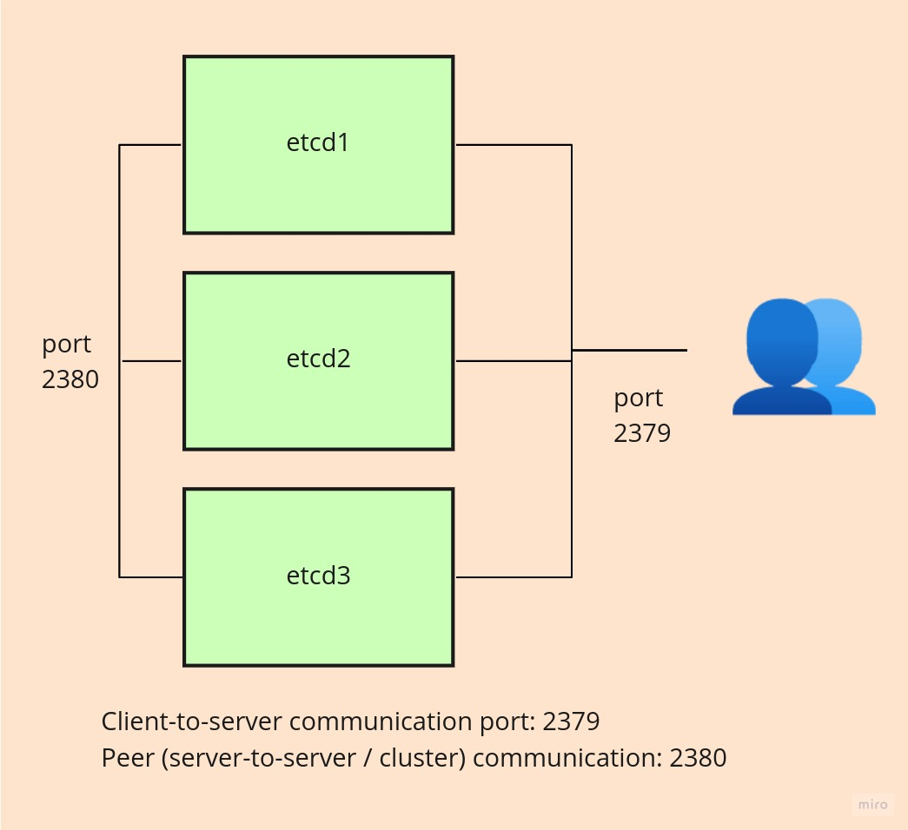

# ETCD Cluster Kurulumu ve Backup-Restore İşlemleri

Merhaba arkadaşlar, 

Bu yazımızda high available secure etcd cluster kurulumu yapacağız ve ardından backup restore işlemlerini inceleyeceğiz. 

Genellikle adı hep Kubernetes ile anılıyor ancak aslında etcd bağımsız bir araç. Yani etcd kurmak için yada projelerimizde kullanmak için Kuberntes'e ihtiyacımız yok. Ayrıca bir çok [programlama dili için SDK](https://etcd.io/docs/v3.4/integrations/)'i de mevcut. Eğer persistent bir key-value veri tabanına ihtiyacınız varsa rahatlıkla kullanabilirsiniz.

Kurgumuz şu şekilde olacak.



## Virtualbox ile Vagrant Lab Ortamı Kurulumu

Makinamıza [VirtualBox](https://www.virtualbox.org/wiki/Downloads) ve ardından [Vagrant](https://www.vagrantup.com/downloads)'ı kurduktan sonra alttaki satırları bilgisayarımızda açtığımız bir klasöre [Vagrantfile](https://www.vagrantup.com/docs/providers/virtualbox/configuration) adında bir dosya açıp  içine kopyalıyoruz.

```Vagrantfile
# -*- mode: ruby -*-
# vi: set ft=ruby :


# centos kurmak isteseniz generic/ubuntu2004 yerine generic/centos8  yazmanız yeterli


Vagrant.configure("2") do |config|

# node1
config.vm.define "node1" do |node1|
    node1.vm.box = "generic/ubuntu2004"
    node1.vm.hostname="node1"
    node1.vm.network "private_network", ip: "10.200.10.10"
    
    node1.vm.provider :virtualbox do |lv|
       lv.memory=1024
       lv.cpus=1
    end 
 end


# node2
config.vm.define "node2" do |node2|
    node2.vm.box = "generic/ubuntu2004"
    node2.vm.hostname="node2"
    node2.vm.network "private_network", ip: "10.200.10.11"
    
    node2.vm.provider :virtualbox do |lv|
       lv.memory=1024
       lv.cpus=1

    end
 end


# node3
config.vm.define "node3" do |node3|
    node3.vm.box = "generic/ubuntu2004"
    node3.vm.hostname="node3"
    node3.vm.network "private_network", ip: "10.200.10.12"
    
    node3.vm.provider :virtualbox do |lv|
       lv.memory=1024
       lv.cpus=1

    end 
 end

end
```
Daha sonra terminal veya command-com üzerinde Vagrantfile dosyasının bulunduğu dizinde iken _vagrant up_ komutunu çalıştırıyoruz

ssh ile makinalarımıza bağlanıyoruz.


- Kullanıcı adı: vagrant
- Şifre: vagrant

halen terminalimiz Vagrantfile ile aynı dizindeyken alttaki komutla bağlanabiliriz.

```bash
vagrant ssh node1
```

Bütün makinalara bu şekilde bağlanıp (10.200.10.10,11 ve 12) ip'ilerine ping attığımızda cevap almamız lazım. 

Bütün makinalarda aşağıdaki işlemleri yapıyoruz
- _/etc/ssh/sshd_config_ dosyasında _#PasswordAuthentication yes_ satırını açıklama satırından çıkarıyoruz.
- _PermitRootLogin yes_ satırını ekliyoruz.
- olarak _sudo passwd root_ komutu ile root password ataması yapıyoruz.
- _systemctl reload sshd_ ile servisi  güncelliyoruz

## Sertifikaların Oluşturulması

Host makinamızda sertifikalarımızı oluşturup etcd makinalarımıza paylaştıracağız.

Bunun için cfssl aracını kullanacağız. Detaylar için _https://github.com/cloudflare/cfssl_ adresini ziyaret ediniz.

Kurulu yapmak için _https://github.com/cloudflare/cfssl/releases_ adresine gidiyoruz. 1.6.1 versiyonunu kullacağız.

**Linux İçin**

- https://github.com/cloudflare/cfssl/releases/download/v1.6.1/cfssl_1.6.1_linux_amd64
- https://github.com/cloudflare/cfssl/releases/download/v1.6.1/cfssljson_1.6.1_linux_amd64


```bash

wget -q --show-progress --https-only --timestamping \
  https://github.com/cloudflare/cfssl/releases/download/v1.6.1/cfssl_1.6.1_linux_amd64 \
  https://github.com/cloudflare/cfssl/releases/download/v1.6.1/cfssljson_1.6.1_linux_amd64


chmod +x cfssl_1.6.1_linux_amd64 cfssljson_1.6.1_linux_amd64
sudo mv cfssl_1.6.1_linux_amd64 /usr/local/bin/cfssl
sudo mv cfssljson_1.6.1_linux_amd64  /usr/local/bin/cfssljson

cfssl version

# sonuc
Version: 1.6.1
Runtime: go1.12.12

```
**Mac İçin**

Linux için yapılan işlemlerin aynısını sadece dosya isminde darwin olanları kullanmanız yeterli olacaktır. 

**Windows İçin**

Alttaki dosyaları uygun bir yere indirmeniz yeterli olacak.

- https://github.com/cloudflare/cfssl/releases/download/v1.6.1/cfssljson_1.6.1_windows_amd64.exe
- https://github.com/cloudflare/cfssl/releases/download/v1.6.1/cfssl-scan_1.6.1_windows_amd64.exe

**Artık sertifikalarımızı oluşturabiliriz**

Öncelikle Certificate Authority (CA Oluşturuyoruz. Daha sonra bunu kullanarak etcd sertifikalarımızı oluşturacağız.

```bash

cd /tmp
cat > ca-config.json << EOF
{
    "signing": {
        "default": {
            "expiry": "8760h"
        },
        "profiles": {
            "etcd-cluster": {
                "expiry": "8760h",
                "usages": [
                    "signing",
                    "key encipherment",
                    "server auth",
                    "client auth"
                ]
            }
        }
    }
}
EOF 


cat > ca-csr.json << EOF
{
    "CN": "My own CA",
    "key": {
        "algo": "rsa",
        "size": 2048
    },
    "names": [
        {
            "C": "US",
            "L": "CA",
            "O": "My Company Name",
            "ST": "San Francisco",
            "OU": "Org Unit 1",
            "OU": "Org Unit 2"
        }
    ]
}
EOF 


cfssl gencert -initca ca-csr.json | cfssljson -bare ca

```
Sonuç olarak aşağıdaki dosyalar oluşmuş olmalı.

```bash
ls

#sonuc
ca-config.json
ca.csr
ca-csr.json
ca-key.pem
ca.pem
```

Artık sertifikalarımızı oluşturabiliriz.

```bash
cat > ca-csr.json << EOF
{
    "CN": "etcd-cluster",
    "hosts": [
        "localhost",
        "10.200.10.10",
        "10.200.10.11",
        "10.200.10.12",
        "127.0.0.1"
    ],
    "key": {
        "algo": "ecdsa",
        "size": 256
    },
    "names": [
        {
            "C": "US",
            "L": "CA",
            "ST": "San Francisco"
        }
    ]
}
EOF

# ca-config.json
# ca.csr
# ca-csr.json
# ca-key.pem
# ca.pem

cfssl gencert -ca=ca.pem -ca-key=ca-key.pem -config=ca-config.json -profile=etcd-cluster ca-csr.json | cfssljson -bare etcd-cluster

```
sonuçta aşağıdaki 3 dosya oluşmuş olacak

```bash

etcd-cluster.csr
etcd-cluster-key.pem
etcd-cluster.pem
```


Sertifikalarımızı etcd node'larımıza kopyalıyoruz. Alttaki komutu sertifikalarımızın olduğu klasörde local makinamızda çalıştırıyoruz.

```bash

nodes=(10.200.10.10 10.200.10.11 10.200.10.12)

for node in ${nodes[@]}; do
    scp ca.pem etcd-cluster.pem etcd-cluster-key.pem root@$node:
done

```

Bütün node'larımıza root kullanıcımızı kullanarak ssh ile bağlanıp alttaki komutları çalıştırıyoruz. Hepsinde aynı anda aynı komutu çalıştırmak için Linux'de [Tmux](https://github.com/tmux/tmux) kullanabilirsiniz. Bildiğim kadarıyla Windows ortamları için de [Cmder](https://cmder.net/) aynı işi yapabiliyor.

```bash

mkdir -p /etc/etcd/pki

mv ca.pem etcd-cluster.pem etcd-cluster-key.pem /etc/etcd/pki/

```

## Etcd Kurulumu

Daha sonra etcd binary indireceğiz. Halen ssh ile bağlıyken bütün node'larda alttaki komutları çalıştırıyoruz.


```bash
wget -q --show-progress "https://github.com/etcd-io/etcd/releases/download/v3.5.1/etcd-v3.5.1-linux-amd64.tar.gz"
tar zxf etcd-v3.5.1-linux-amd64.tar.gz
mv etcd-v3.5.1-linux-amd64/etcd* /usr/local/bin/
rm -rf etcd*
```

Artık service (unit) dosyamızı oluşturabiliriz.

- 2380: bu port sunucular kendi aralarında haberleşirken kullanılır.
- 2379: node'ların kendi aralarında haberleşmesi için gerekli.


Alttaki komutu her node'da ayrı ayrı localip değerini değiştirerek çalıştırınız.


Bütün konfigürasyon flag'lari için : https://etcd.io/docs/v3.5/op-guide/configuration

Alttaki konfigürasyonda --data-dir parametresini belirtmediğimiz ve root kullanıcısı ile kurulum yaptığımız için veritabanları root (/) dizinde oluşturulacak (node1.etcd, node2.etcd, node3.etcd).

```bash
localip="10.200.10.12" # her node da kendi ipsi gelecek. yani ayrı ayrı çalıştırmamız gerekiyor

nodename=$(hostname -s)

node1="10.200.10.10"
node2="10.200.10.11"
node3="10.200.10.12"


cat <<EOF >/etc/systemd/system/etcd.service
[Unit]
Description=etcd

[Service]
Type=notify
ExecStart=/usr/local/bin/etcd --name ${nodename} --cert-file=/etc/etcd/pki/etcd-cluster.pem --key-file=/etc/etcd/pki/etcd-cluster-key.pem --peer-cert-file=/etc/etcd/pki/etcd-cluster.pem --peer-key-file=/etc/etcd/pki/etcd-cluster-key.pem --trusted-ca-file=/etc/etcd/pki/ca.pem --peer-trusted-ca-file=/etc/etcd/pki/ca.pem --peer-client-cert-auth --client-cert-auth --initial-advertise-peer-urls https://${localip}:2380 --listen-peer-urls https://${localip}:2380 --advertise-client-urls https://${localip}:2379 --listen-client-urls https://${localip}:2379,https://127.0.0.1:2379 --initial-cluster-token etcd-cluster-1 --initial-cluster node1=https://${node1}:2380,node2=https://${node2}:2380,node3=https://${node3}:2380 --initial-cluster-state new
Restart=on-failure
RestartSec=5

[Install]
WantedBy=multi-user.target
EOF
```

Dosya üzerindeki alttaki satırlar oluşturduğumuz sertifika adreslerini ve kendi aralarında (peer) haberleşirken kullanacakları sertifikaların adresini göstermektedir.

```
  --cert-file=/etc/etcd/pki/etcd-cluster.pem \\
  --key-file=/etc/etcd/pki/etcd-cluster-key.pem \\
  --peer-cert-file=/etc/etcd/pki/etcd-cluster.pem \\
  --peer-key-file=/etc/etcd/pki/etcd-cluster-key.pem \\
  --trusted-ca-file=/etc/etcd/pki/ca.pem \\
  --peer-trusted-ca-file=/etc/etcd/pki/ca.pem \\
```

Eğer konfigürasyonda değişiklik yaptıysanız ve "couldn't find local name ..." ile başlana bir hata alırsanız ilk satırda --name parametresi ile hostname'i kullandığımız isim ile  --initial-cluster parametresinde belirttiğimiz isim aynı olmalı.


Daha sonra servisi enable edip çalıştırıyoruz.

```bash

systemctl daemon-reload
systemctl enable --now etcd

```

Eğer her şey yolunda gittiyse etcd servisimiz çalışıyor olmalı. Test etmek için alttaki komutu kullanabiliriz.

```bash
systemctl status etcd
# sonuçta servisin çalıştığını görmeliyiz.


# alttaki komutlarla etcdctl üzerinden cluster'ımız hakkında bilgi alabiliriz. Herhangi bir node üzerinde çalıştırabiliriz.
ETCDCTL_API=3 etcdctl --endpoints=https://127.0.0.1:2379 --cacert=/etc/etcd/pki/ca.pem --cert=/etc/etcd/pki/etcd-cluster.pem --key=/etc/etcd/pki/etcd-cluster-key.pem  member list

# sonuç
# 2c23f7e5644642b8, started, node1, https://10.200.10.10:2380, https://10.200.10.10:2379, false
# 77ae7dbb2fcbe2cc, started, node2, https://10.200.10.11:2380, https://10.200.10.11:2379, false
# e97ff5301dcea58e, started, node3, https://10.200.10.12:2380, https://10.200.10.12:2379, false


ETCDCTL_API=3 etcdctl --endpoints=https://127.0.0.1:2379 --cacert=/etc/etcd/pki/ca.pem --cert=/etc/etcd/pki/etcd-cluster.pem --key=/etc/etcd/pki/etcd-cluster-key.pem  endpoint status

ETCDCTL_API=3 etcdctl --endpoints=https://127.0.0.1:2379 --cacert=/etc/etcd/pki/ca.pem --cert=/etc/etcd/pki/etcd-cluster.pem --key=/etc/etcd/pki/etcd-cluster-key.pem  endpoint health
```

Son olarak etcdctl ile host makinamızdan da etcd cluster'ımıza bağlanabiliriz. Tek yapmamız gereken etcd'yi kurmak ver sertifikaları göstererek cluster'a bağlanmak.

```bash
wget -q --show-progress "https://github.com/etcd-io/etcd/releases/download/v3.5.1/etcd-v3.5.1-linux-amd64.tar.gz"
tar zxf etcd-v3.5.1-linux-amd64.tar.gz
sudo mv etcd-v3.5.1-linux-amd64/etcd* /usr/local/bin/
rm -rf etcd*


ETCDCTL_API=3 etcdctl --endpoints=https://10.200.10.10:2379 --cacert=ca.pem --cert=etcd-cluster.pem --key=etcd-cluster-key.pem member list

# sonuç

2c23f7e5644642b8, started, node1, https://10.200.10.10:2380, https://10.200.10.10:2379, false
77ae7dbb2fcbe2cc, started, node2, https://10.200.10.11:2380, https://10.200.10.11:2379, false
e97ff5301dcea58e, started, node3, https://10.200.10.12:2380, https://10.200.10.12:2379, false
```

Biraz da kayıt girelim. Ancak öncelikle her komutta uzun uzun sertifika ve endpoint bilgisi girmemek için host makinamızda alttaki tanımlamaları yapalım. 

Sertifikalarımızın olduğu klasörde alttaki komutları çalıştırıyoruz.

Amacımız host makinamızdan uzak etcd üzerinde komut çalıştırmk.


```bash

export ETCDCTL_API=3 
export ETCDCTL_ENDPOINTS=https://10.200.10.10:2379,https://10.200.10.11:2379,https://10.200.10.12:2379
export ETCDCTL_CACERT=ca.pem
export ETCDCTL_CERT=etcd-cluster.pem
export ETCDCTL_KEY=etcd-cluster-key.pem
```
Artık kayıt girebiliriz.


```bash
etcdctl put key1 value1
# result OK

etcdctl put key2 value2
# result OK

etcdctl get key1
# sonuç
key1
value1


etcdctl del key1
#sonuç 1


etcdctl get key1
#sonuç : boşluk

```

Veri tabanını yönetmek ve kullanmak için sadece etcdctl yok.  Şu [linkten](https://etcd.io/docs/v3.5/integrations/) daha bir çok araca ulaşabilirsiniz.


Etcdctl hakkında daha deataı bilgi için [şu linkten](https://github.com/etcd-io/etcd/tree/main/etcdctl) faydalanabilirsiniz.

### Backup-Restore İşlemleri

Backup almak için kullanabileğimiz araçlardan birisi [Etcd-backup-restore](https://github.com/gardener/etcd-backup-restore). Etcd veritabanınızı düzenli (zamanlanmış) backup almak için kullanabileceğimiz bir araç. Aynı zamanda cloud sistemlere backup alabildiği gibi local diske de backup alabiliyor. Zaten sayfasında yeterli bilgi mevcut. 

Biz diğer yolu yani manuel olarak backup ve restore yapmayı deneyeceğiz.


Etcd kurlumu yaptıktan sonra  host makinamızdan etcd cluster'ımıza bağlanmıştık. Aynı şekilde alttaki komutları çalıştırara etcdctl cli'mız üzer,nde backup-restore yapacağız.

Sertifikalarımızın olduğu klasörde alttaki komutları çalıştırıyoruz.

```bash
export ETCDCTL_API=3 
export ETCDCTL_ENDPOINTS=https://10.200.10.10:2379,https://10.200.10.11:2379,https://10.200.10.12:2379
export ETCDCTL_CACERT=ca.pem
export ETCDCTL_CERT=etcd-cluster.pem
export ETCDCTL_KEY=etcd-cluster-key.pem

```

artık etcdctl için uzun uzun komut yazmak durumunda kalmayacağız.

Öncelikle veri tabanımızda bir kaç key ekleyelim.

```bash
etcdctl put backupkey "backup öncesi eklendi"
# sonuç OK

# aynı key i okuyalım
etcdctl get backupkey

#sonuç
backupkey
backup öncesi eklendi

```

Daha sonra snapshot alıyoruz. Tek bir sunucunun adresini girmeliyiz bu yüzden endpoint'i değiştirdikten sonra snapshot alıyoruz.

```bash
export ETCDCTL_ENDPOINTS=https://10.200.10.10:2379

etcdctl snapshot save snapshotdb

# sonuç
{"level":"info","ts":1642365289.2360406,"caller":"snapshot/v3_snapshot.go:68","msg":"created temporary db file","path":"snapshotdb.part"}
{"level":"info","ts":1642365289.2391188,"logger":"client","caller":"v3/maintenance.go:211","msg":"opened snapshot stream; downloading"}
{"level":"info","ts":1642365289.2391815,"caller":"snapshot/v3_snapshot.go:76","msg":"fetching snapshot","endpoint":"https://10.200.10.10:2379"}
{"level":"info","ts":1642365289.2411199,"logger":"client","caller":"v3/maintenance.go:219","msg":"completed snapshot read; closing"}
{"level":"info","ts":1642365289.2462823,"caller":"snapshot/v3_snapshot.go:91","msg":"fetched snapshot","endpoint":"https://10.200.10.10:2379","size":"20 kB","took":"now"}
{"level":"info","ts":1642365289.246416,"caller":"snapshot/v3_snapshot.go:100","msg":"saved","path":"snapshotdb"}
Snapshot saved at snapshotdb

```
Snaphot'ı doğrulayalım

```bash

etcdctl --write-out=table snapshot status snapshotdb

# sonuç
+----------+----------+------------+------------+
|   HASH   | REVISION | TOTAL KEYS | TOTAL SIZE |
+----------+----------+------------+------------+
| afc822ab |        5 |         12 |      20 kB |
+----------+----------+------------+------------+
```

Daha sonra restore yapalım. Backup tek bir node üzerinden alınıyordu ancak tabii ki restore'u tüm node'lara yapıyor olacağız.

Öncelikle bütün node'larda etcd servisini durduruyoruz.

```bash
systemctl stop etcd
```
Restore yapmadan önce bütün node'larda root dizininde olan veritabanı klasörlerinin (node1.etcd, node2.etcd, node3.etcd) adını değiştirelim. 

Restore sonrası zaten yenisini kopyalayacağız.

```bash
etcdctl snapshot restore snapshotdb
```

Komut sonrasında host makinamızda default.etcd adında bir klasör oluşacaktır. Bu klasörü bütün node'lara kopyalıyoruz.

```bash
# node1
scm -r default.etcd root@10.200.10.10:/

# node2
scm -r default.etcd root@10.200.10.11:/

# node3
scm -r default.etcd root@10.200.10.12:/
```
Daha sonra her bir node'un root dizinin de bu dosyanın adını değiştiriyoruz.

```bash
# node 1 de çalıştırılacak
mv default.etcd node1.etcd

# node 2 de çalıştırılacak
mv default.etcd node2.etcd

# node 3 de çalıştırılacak
mv default.etcd node3.etcd
```

Etcd servisini bütün node'larda çalıştırıyoruz. 

```bash
systemctl start etcd
```
Son olarak testimizi yapalım.

host makinamızda alttaki komutla daha önce kaydettiğimiz key'i çağırıyoruz. Aynı

```bash
etcdctl get backupkey

#sonuç
backupkey
backup öncesi eklendi
```

Bu yazımızda bu kadar. Umarım faydalı olmuştur.


### Kaynaklar
- https://kubernetes.io/docs/tasks/administer-cluster/configure-upgrade-etcd/
- https://etcd.io/docs/v3.5/op-guide/clustering/
- https://etcd.io/docs/v3.5/op-guide/security/
- https://etcd.io/docs/v3.5/op-guide/configuration/
- https://etcd.io/docs/v3.5/op-guide/monitoring/
- https://pcocc.readthedocs.io/en/latest/deps/etcd-production.html
- https://thenewstack.io/tutorial-set-up-a-secure-and-highly-available-etcd-cluster/
- https://etcd.io/docs/v3.5/op-guide/recovery/
- https://etcd.io/docs/v3.3/dev-guide/interacting_v3/
