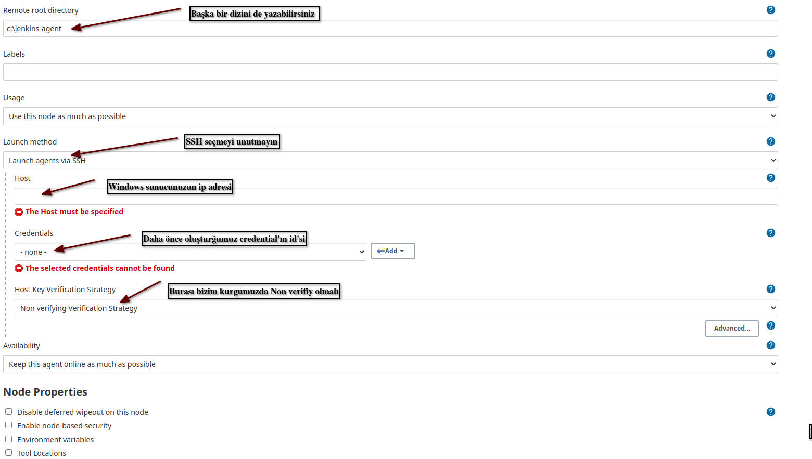

# Jenkins Windows Agent'ı SSH ile Jenkins'e Bağlamak 

Merhaba arkadaşlar,

Amacımız Windows bir makinayı SSH public key kullanarak, password veya known_host dosyasını kullanmadan Non-verify olarak Jenkins'e agent olarak tanıtmak olacak.

Bildğiniz üzere Windows uzun süredir SSH ile uzak bağlantıyı destekliyor. Ancak public key kullanak bağlnamayı denediğinizde resmi dokümanlarında da değinmediği bazı durumlar yaşanıyor. 

İkinci bir problem de Jenkins'in doğrudan Windows agent'ların SSH ile bağlanamsına yönelik özel bir doküman sunmaması. Dolayısiyle SSH ile bağlanamyı düşündüğünüzde yaşayacağınız problemlere yönelik çözüm sunmaması.

Belki bir süre sonra bu makalede bahsedeğim sorunlar giderilecektir ancak o vakte kadar bütün agent'larını SSH ile yönetmek isteseniz bu makalede umarım aradığınızı bulabilirsiniz.


# Ön Gereksinimlerin Kurulumu


Öncelikle zorunluluk değil ancak tavsiyem sunucunuza powershell'in yeni versiyonunu kurmanız. Bunun [resmi sayfasından](https://docs.microsoft.com/tr-tr/powershell/scripting/install/installing-powershell-on-windows?view=powershell-7.2) faydalanabilirsiniz.

İkinci olarak Java'yı kuruyoruz. Bunun  için resmi sayfasındaki [şu linki](https://www.java.com/download/ie_manual.jsp) kullanabiliriz. JavaSetup8u321.exe dosyasını download edip kuruyoruz. Burada kullandığınız Jenkins versiyonun destekleridiği Java versiyonunu indirdiğinizden emin olun.

Ardından Windows environment variable'lara Java Home klasörünü eklememiz gerekiyor.

Bunun alttaki resimde de görüleceği üzere JavaYı kurduğumuz klsörü path'lere ekliyoruz. Sadece System Variable olarak eklemeniz de yeterli olacaktır.


Bu path'i aktif edebilmek için öncelikle Powershell üzerinde geçici environment variable ekleyip okuyoruz

```powershell

set a=1

echo %a%
```

Artık SSH kurulumuna gecebiliriz.


# SSH Kurulumu ve Ayarları


Alttaki komutlara doğrudan [resmi sayfasından](https://docs.microsoft.com/en-us/windows-server/administration/openssh/openssh_install_firstuse) aldın oradan da erişebilirsiniz.

```powershell

Get-WindowsCapability -Online | Where-Object Name -like 'OpenSSH*'

# sonuç

# Name  : OpenSSH.Client~~~~0.0.1.0
# State : NotPresent

# Name  : OpenSSH.Server~~~~0.0.1.0
# State : NotPresent

# OpenSSH Client ın kurulumu
Add-WindowsCapability -Online -Name OpenSSH.Client~~~~0.0.1.0

# OpenSSH Server ın kurulumu
Add-WindowsCapability -Online -Name OpenSSH.Server~~~~0.0.1.0

# Path          :
# Online        : True
# RestartNeeded : False

# sshd servisinin kurulumu
Start-Service sshd

# servisi otomatik çalışacak şekilde ayarlıyoruz
Set-Service -Name sshd -StartupType 'Automatic'

# firewall kurallarını kontrol ediyoruz
if (!(Get-NetFirewallRule -Name "OpenSSH-Server-In-TCP" -ErrorAction SilentlyContinue | Select-Object Name, Enabled)) {
    Write-Output "Firewall Rule 'OpenSSH-Server-In-TCP' does not exist, creating it..."
    New-NetFirewallRule -Name 'OpenSSH-Server-In-TCP' -DisplayName 'OpenSSH Server (sshd)' -Enabled True -Direction Inbound -Protocol TCP -Action Allow -LocalPort 22
} else {
    Write-Output "Firewall rule 'OpenSSH-Server-In-TCP' has been created and exists."
}

```
Kurulum sonrasında paswordless giriş yapabilmek ve publickey ile giriş yapabilmek için _C:\ProgramData\ssh\sshd_config_ dosysında alttaki ayaraları yapıyoruz.

- _PubkeyAuthentication yes_ satırını aktif ediyoruz. Başındaki _#_ isaretini siliyoruz ve _no_ yazıyorsa _yes_'e çeviriyoruz.
- Alttaki satırları açıklama satırına çeviriyoruz.

```config
# Match Group administrators
#       AuthorizedKeysFile __PROGRAMDATA__/ssh/administrators_authorized_keys
```
 
# Key Oluşturma ve Yetkilendirme

alttaki komutla public ve private key'lerimizi oluşturuyoruz. Sorulan bütün sorualda enter'a basıp boş geçebiliriz.

```
ssh-keygen
```

_C:\Users\KULLANICIADINIZ\\.ssh_ (yada %USERPROFILE%\\.ssh) klasöründe _id_rsa_ ve _id_rsa.pub_ adında iki dosya oluşmuş olacak. _id_rsa.pub_ dosyasını bir kopyasını adını authorized_keys olacak şekilde kopyalıyoruz. Poweshell ile aşağıdaki komutla yapabilirsiniz.

```powershell
Copy-Item id_rsa.pub -Destination authorized_keys
```

Son tahlilde .ssh klasöründe üç adet dosya olmalı

- id_rsa
- id_rsa.pub
- authorized_keys

Linux slave agent'lardan farklı olarak Windows'da yapmanız gereken ve ne yazıkki resmi domümanlarda da bulamayacağınız kısım burası.


_authorized_keys_ dosyasının yetkilerinde gelişmiş ayarlardan bütün inheritance'ları (miras alma) kırmalısınız. Ve daha sonra aktif kullanıcınız ve SYSTEM kullanıcına full yetki vermelisiniz.

dosyaya sağ tıklayıp menüden properties'i seçiyoruz. Daha sonra Security tabından alttaki Advance butonuna tıklıyoruz ve açılan pencerede en alttaki "Disable Inheritance" butonuna tıklyarak yetki miras almayı kaldırıyoruz. Ok deyip penceyi kapatıyoruz. 

Açık olan security tabında iken Edit butonuna tıklayıp aktif kullanıcımızı yada Jenkins'de kullanak için açtığımız kullanıcıyı ve SYSTEm kullanıcısını ekliyoruz. Eklerken Full Control veridiğimizden emin olmalıyız.


Diğer dikkat etmemiz gereken konulardan biri de ssh-agent servisinin kapalı olması. Bunun için Powershell'de  __Stop-Service ssh-agent__ komutunu çalıştırıyoruz.

# Jenkins Credential Oluşturmak

Artık tek yapmamız gereken private key'imizi Jenkins'e credential oluştururken vermek.

Jenkins dashboard'unda yer alan "Manage Jenkins" menüsüne girip  "Manage Credentials" sayfasına geçiyoruz. Eğer özellikle başka bir store olulştuamdıysanız varsayılan Jenkins store'una (jenkins) tıklayıp açılan sayfada "Global credentials (unrestricted)" linkine tıklıyoruz. "Add Credential" deyip alttaki şekildeki gibi dolduruyoruz.


# Windows Slave Node/Agent Oluşturmak 

Jenkins dashboard'unda yer alan "Manage Jenkins" menüsüne girip "Manage Nodes and Clouds" sayfasına geçiyoruz ve "Add Node" linkine tıklıyoruz.




"Remote root directory" bölümüne Windows agent'ımızda Jenkins'in kullanması için gerekli klasörü oluşturup path'ini giriyoruz.

Diğer ayarları da resinde görüldüğü gibi yaptıktan sonra kaydediyoruz. Kaydetme işlemi bittikten sonra açılan sayfada "Launch Agent" butonuna tıklıyoruz. İlk etapta her şey normal giderken biraz sonra remote.jar dosyasının çalıştırılamadığı için SSH bağlantımızın kapatıldığına dair mesaj alacağız.

Bunu sebebi ise Jenkins'ın bizim verdiğimiz path'a remote.jar dosyasını kopyaladıktan sonra "cd c:\jenkins-agent"  komutu ile dizine gidip remote.jar dosyasını çalıştırmayı denemesi ancak arkada çalışan command-com  "cd c:\jenkins-agent" komutu ile doğrudan bu dizine gitmediği için remote.jar dosyasının bulamamasıdır.

Jenkins Linux agent'a SSH bağlanırken hangi komutu çalıştırıyorsa Windows'da da aynı komutu çalıştırıyor. Bundan dolayı da gidemediği bir path üzerinde remote.jar dosyasını aramaya çalışıyor.

Bu nedenle remote.jar dosyanızı _C:\Users\KULLANICIADINIZ_ (yada %USERPROFILE%) klasörüne kopyalamalıyız. Çünkü SSH bağlantısı yapıldığında Linux'de home, Windows'da ise oluşturduğumuz kullanıcının profil klasörüne düşmüş oluyoruz.

Dosyayı kopyaladıktan sonra "Launch Agent" butonuna tekrar tıklıyoruz. 

Artık Windows Agent'ımızın çalıştığını görebiliriz.

Umarım faydalı olmuştur.


 # Kaynaklar
 - https://docs.microsoft.com/en-us/windows-server/administration/openssh/openssh_install_firstuse
 - https://docs.microsoft.com/en-us/windows-server/administration/openssh/openssh_keymanagement
