# OpenID (Keycloak) Kullanarak Kubernetes için Kimlik Doğrulama

Merhaba Arkadaşlar


Bu makalemizde Oauth2 ve OpenId nedir? Keycloak nedir? Keycloak ile Kubernetes kimlik doğrulaması nasıl yapılır? gibi sorulara cevap arayacağız.

Bir oidc provider ile Kubernetes'i entegre etmemizin avantajlarını şöyle sıralayabiliriz.

- Aynı provider'ı kullanarak diğer uygulamalarımıza da aynı kullanıcı ve kullanıcı gruplarını yetkilendirebiliriz.
- SSO (Single-Sign-On) sistemine dahil olmuş oluruz. Yani Kubernetes'e login olmuş bir kullanıcı yetkili olduğu bütün uygulamalara da login olmuş olur. 
- Karmaşık kullanıcı oluşturma ve yetkilendirme süreçleri ile uğraşmamış oluruz. Kubernetes cluster'ımıza fazladan iş yaptırmamış oluruz.
- Daha güvenli bir sistem kurma şansı elde etmiş oluruz. Keycloak ve benzeri sistemler multi factor authentication gibi teknikleri de uygulayabilirler. 

Makaledeki örnekleri yapabilmek için biraz linux, biraz sanallaştırma, Docker ve biraz da Kubernetes bilmek gerekiyor.

Konuyu bölmek istemediğim için biraz uzun bir yazı oldu. Umarım faydalı olur.

iyi okumalar.


## Kubetnetes Authentication

Bildiğiğniz üzere Kubetnetes'de gerçek kullanıcılar için bir obje yok. Sadece service account oluşturabiliyoruz. Konu hakkında [resmi dokümanı](https://kubernetes.io/docs/reference/access-authn-authz/authentication/#users-in-kubernetes) da okuyabilirsiniz.  

Peki biz nasıl kubectl ile komutlar çalıştırabiliyoruz? Burada aslında bir kullanıcı olarak değil Kubernetes tarafından onaylanmış bir sertifika ile Kubernetes'e gidiyoruz. Onaylanan bu sertifikada bizim Kubernetes tarafında hangi rollere sahip olduğumuz bilgisini de tutuyor. Konun çok detaylarına girmeyeceğiz amacımız X.509 sertifikası ile kimlik doğrulama yapmak değil. Yani özetle Kubernetes bir kullanıcı veri tabanı yönetmiyor. Zaten genel anlamda da bakacak olursak Kubernetes hiç bir işi kendini yapmıyor aslında Sadece işin kurallarını koyuyor ve bu kurallara ve prensiplere uygun yazılmış araçları birbirleriyle uyumlu çalışabilecekleri bir ortam sunuyor. Kimlik yönetimi de bunlardan biri. 

Kubernetes Authentication [resmi sayfasını](https://kubernetes.io/docs/reference/access-authn-authz/authentication/#users-in-kubernetes) da inceleyecek olursak alttaki stratejileri desteklediğini görebiliriz.
- X509 Client Certs
- Static Token File
- Bootstrap Tokens
- Service Account Tokens
- OpenID Connect Tokens
- Webhook Token Authentication

Biz bu makalemizde OpenID Connect Tokens ile kimlik doğrulamanın nasıl yapıldığını göreceğiz.
## OpenID Nedir?

OpenID, kullanıcıların çeşitli web sitelerindeki hesaplarını kullanarak tek oturum açma (SSO) sağlayan bir kimlik doğrulama protokolüdür. OpenID, kullanıcıların farklı web sitelerine tek bir kimlikle erişmelerine olanak tanır ve her bir web sitesi için ayrı ayrı kullanıcı adı ve parola hatırlama zorunluluğunu ortadan kaldırır.

Açık bir standarttır ve OpenID Foundation tarafından yönetilmektedir. Protokol, kullanıcının kimlik sağlayıcısının (OpenID sağlayıcısı) doğrulama hizmetini kullanarak bir kimlik doğrulama sürecini gerçekleştirir. Kullanıcı, OpenID hesabıyla bir web sitesine girmek istediğinde, web sitesi kimlik sağlayıcısına yönlendirilir. Kullanıcı, kimlik sağlayıcısında kimlik doğrulamasını gerçekleştirir ve ardından web sitesine yönlendirilir. Web sitesi, kimlik sağlayıcının doğrulama sonucunu doğrular ve kullanıcıyı oturum açmış olarak kabul eder.

OpenID, web sitesi sahiplerine kullanıcı hesaplarını yönetme yükünden kurtarır ve kullanıcılara daha kolay bir deneyim sunar. Aynı zamanda güvenliği artırır, çünkü kullanıcılar tek bir güvenilir kimlik sağlayıcısına kimlik bilgilerini verirken, farklı web siteleriyle ayrı ayrı hesap bilgilerini paylaşmak zorunda kalmazlar.

OpenID, sosyal medya hesaplarıyla da entegre edilebilir. Kullanıcılar, Facebook, Google, GitHub gibi sosyal medya hesaplarını kullanarak OpenID hesabı oluşturabilir ve bu hesaplarını farklı web sitelerinde kullanabilirler.

OpenID, internet üzerinde kimlik doğrulama ve tek oturum açma işlemlerini kolaylaştıran bir standarttır ve birçok web sitesi ve hizmet tarafından desteklenmektedir.

OpenID ve OAuth 2.0, farklı ama birbirini tamamlayan iki farklı protokoldür.  Temel farklarına ve benzerliklerine bakalım.

- Protokol Ailesi: OpenID, OAuth 2.0 protokolünü temel alarak geliştirilmiştir. OAuth 2.0, yetkilendirme ve erişim kontrolü için kullanılan bir protokoldür. OpenID, OAuth 2.0'nin üzerine inşa edilen bir kimlik doğrulama protokolüdür.

- Kimlik Doğrulama: OAuth 2.0, yetkilendirme ve erişim kontrolü sağlar, ancak kimlik doğrulama yetenekleri yoktur. OpenID, OAuth 2.0 protokolünün yetkilendirme özelliklerini kullanarak kimlik doğrulama sürecini genişletir. Yani OpenID, kullanıcının kimlik bilgilerini doğrulama yeteneği ekler.

- Kimlik Sağlayıcı: OAuth 2.0, kaynak sunucu ile istemci arasında yetkilendirme sürecini yönetir. Kimlik doğrulaması gerektiren bir istemci, kullanıcının kaynak sunucusuna erişimi için bir yetki belgesi (access token) alır. OpenID, OAuth 2.0'yi temel alırken, aynı zamanda bir kimlik sağlayıcı (OpenID sağlayıcısı) kullanarak kimlik doğrulamasını gerçekleştirir. Kullanıcı, kimlik sağlayıcısı üzerinden doğrulama yapar ve ardından OAuth 2.0 ile yetkilendirme süreci gerçekleştirilir.

- İstemci Uygulama: Hem OpenID hem de OAuth 2.0, istemci uygulamaları (örneğin web siteleri veya mobil uygulamalar) tarafından kullanılır. İstemci, OAuth 2.0 protokolü aracılığıyla yetkilendirme sürecini gerçekleştirir ve kullanıcının kimlik bilgilerini doğrulayan OpenID sağlayıcısıyla etkileşime girer.

- OpenID Connect: OpenID Connect, OpenID'in OAuth 2.0 üzerine inşa edilen bir profilidir. OpenID Connect, kimlik doğrulama sürecini kolaylaştırmak için OAuth 2.0'nin yetkilendirme mekanizmalarını kullanır. Bu sayede OAuth 2.0'nin yetkilendirme yetenekleriyle birlikte kimlik doğrulaması da sağlanır.


Kubernetes de OpenID ile kimlik doğrulamayı destekler. Aşağıdaki şemada OpenID ile kimlik doğrulama sürecini görebilirsiniz.

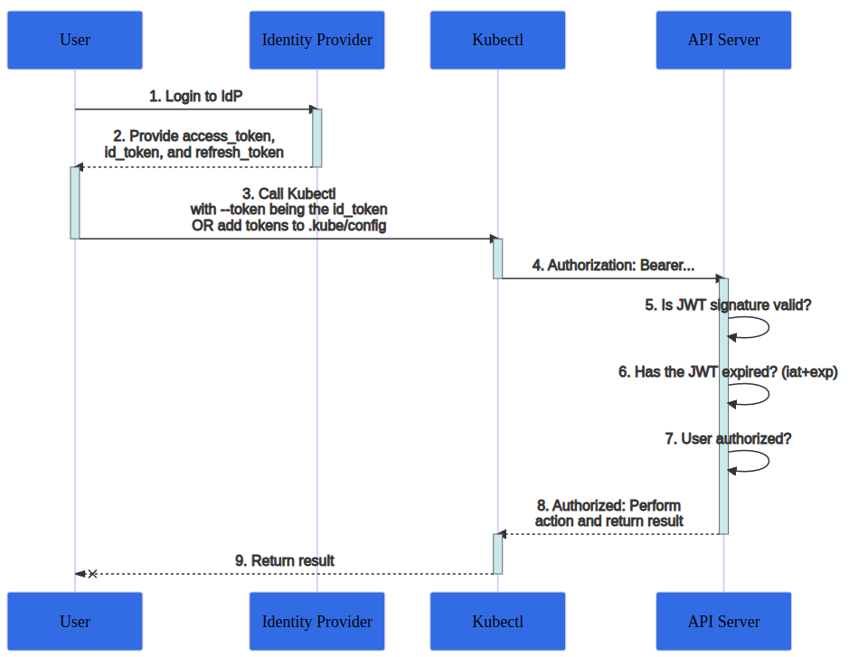

[Resim Kaynak](https://kubernetes.io/docs/reference/access-authn-authz/authentication/#openid-connect-tokens)

## Keycloak Nedir?

Keycloak, açık kaynaklı bir kimlik ve erişim yönetimi çözümüdür. Java ile yazılmış bir uygulamadır.Kullanıcıların kimlik doğrulamasını ve yetkilendirilmesini yönetmek için kullanılır. Ücretli/ücretsiz birçok kimlik doğrulama sistemi var ancak Keycloak hem kimlik yönetimi hem de  erişim yönetimi yapan bir araç ve arkasında RedHat'in de olması onu öne çıkarıyor. Biraz araştırmayla açık kaynak kimlik yönetim sistemleri arasında ne kadar önce olduğunu görebilirsiniz

Keycloak birçok farklı uygulama ve hizmetin kullanıcı yönetimini tek bir merkezi noktada sağlar. Bu sayede kullanıcıların tek bir hesapla birden çok uygulamaya erişmeleri mümkün olur. Keycloak, OAuth 2.0 ve OpenID Connect gibi standart protokoller üzerine inşa edilmiştir ve kimlik sağlayıcı olarak çalışır.

Temel yetenekleri şunlardır:

- Kimlik doğrulama ve yetkilendirme: Keycloak, kullanıcıları doğrulama sağlar ve yetkilendirme kurallarını uygular. Kullanıcıların kimliklerini ve erişim haklarını yönetir.

- Tek oturum açma (SSO): Keycloak, kullanıcının bir kez kimlik doğrulaması yaptığında birden çok uygulamaya erişmesini sağlar. Kullanıcılar farklı uygulamalara tekrar tekrar oturum açma gereksinimi olmadan erişebilirler.

- Sosyal kimlik sağlayıcılarıyla entegrasyon: Keycloak, popüler sosyal medya platformlarındaki hesaplarla entegrasyon sağlar. Bu sayede kullanıcılar Facebook, Google, GitHub gibi sosyal hesapları kullanarak oturum açabilirler.

- İstemci yönetimi: Keycloak, uygulamaların yönetimini kolaylaştırır. İstemci uygulamaları oluşturma, yapılandırma ve yönetme imkanı sunar.

- Yetkilendirme ve erişim kontrolü: Keycloak, kullanıcılara özelleştirilmiş erişim hakları ve yetkilendirmeler tanımlama imkanı sağlar. Rol tabanlı erişim kontrolü sağlar ve izinlerin yönetimini kolaylaştırır.


## Keycloak Kurulum ve Konfigürasyonu

Yapacağımız çalışmada her şey Linux üzerinde çalışıyor olacak bu nedenle bir sanal Linux makine kullanmamız  gerekiyor.

Kubernetes OpenID kullanılırken SSL sertifikasını zorunlu tutuyor. Bu nedenleKeycloak'ın ssl ile yayınlanması gerekiyor. 

Keyclock normalde karmaşık ve uzmanlaşması zor bir araç. Zaten temel konumuuz Keycloak'ı öğrenmek değil. Amacımız OpenId desteği sunacak bir araçla Kubernetes entegrasyonu sağlamak. Bir başka araçla da aynı entegrasyonu yapabiliriz.

Öncelikle kendi custom Keycloak imajımızı oluşturacağız. Daha sonra bunu docker compose dosyamızı kullanarak Postgresql ile birlikte ayağa kaldıracağız. 

Attaki yaml kodları içinde geçen **192.168.0.25** ip adresini kendi host makinenizin ip adresi ile değiştirmeyi unutmayın.

alttaki yaml kodlarını bir  Dockerfile dosyasına kopyalayıp build ediyoruz. Build ederken **_docker build . -t mykeycloak:latest_** komutunu kullanıyoruz.

```yaml
FROM ubuntu:22.04 as openssl


RUN apt -y update && apt -y upgrade
RUN apt -y install openssl

RUN mkdir /cert
WORKDIR /cert

# CA certificate
RUN openssl req -x509 \
            -sha256 -days 356 \
            -nodes \
            -newkey rsa:2048 \
            -subj "/CN=mykeycloak/C=US/L=San Fransisco" \
            -keyout rootCA.key -out rootCA.crt

#Server Private Key
RUN openssl genrsa -out server.key 2048

# create CSR conf file
RUN echo  '\
[ req ] \n\
default_bits = 2048 \n\
prompt = no \n\
default_md = sha256 \n\
req_extensions = req_ext \n\
distinguished_name = dn \n\
[ dn ] \n\
C = US \n\
ST = California \n\
L = San Fransisco \n\
O = muratcabuk \n\
OU = muratcabuk \n\
CN = mykeycloak \n\
[ req_ext ] \n\
subjectAltName = @alt_names \n\
[ alt_names ] \n\
DNS.1 = mykeycloak \n\
DNS.2 = demo.mykeycloak \n\
IP.1 = 192.168.0.25 \n\
IP.2 = 192.168.0.25 \n\
' > csr.conf

#Generate Certificate Signing Request (CSR) Using Server Private Key

RUN openssl req -new -key server.key -out server.csr  -config csr.conf

# create cer conf file
RUN echo '\
authorityKeyIdentifier=keyid,issuer \n\
basicConstraints=CA:FALSE \n\
keyUsage = digitalSignature, nonRepudiation, keyEncipherment, dataEncipherment \n\
subjectAltName = @alt_names \n\
[alt_names] \n\
DNS.1 = mykeycloak \n\
' > cert.conf

# Generate SSL certificate With self signed CA
RUN openssl x509 -req \
    -in server.csr \
    -CA rootCA.crt -CAkey rootCA.key \
    -CAcreateserial -out server.crt \
    -days 365 \
    -sha256 -extfile cert.conf


# PKCS12 keystore
RUN openssl pkcs12 -export -out keystore.p12 -inkey server.key -in server.crt -certfile server.crt -CAfile rootCA.crt -caname root -chain -passout pass:Abc123

RUN chmod -R 777 /cert

FROM quay.io/keycloak/keycloak:21.0 as builder

# Enable health and metrics support
ENV KC_HEALTH_ENABLED=true
ENV KC_METRICS_ENABLED=true

# Configure a database vendor
ENV KC_DB=postgres

WORKDIR /opt/keycloak

COPY --from=openssl /cert /opt/keycloak/cert

WORKDIR /opt/keycloak/cert


# Convert p12 to Keystore
RUN keytool -importkeystore -destkeystore ../conf/server.keystore -srckeystore keystore.p12 -srcstoretype PKCS12 -srcstorepass Abc123 -deststorepass password


WORKDIR /opt/keycloak

RUN /opt/keycloak/bin/kc.sh build


FROM quay.io/keycloak/keycloak:21.0

COPY --from=builder /opt/keycloak/ /opt/keycloak/

ENTRYPOINT ["/opt/keycloak/bin/kc.sh"]

```

Alttaki yaml kodlarını bir docker-compose.yml dosyasına kopyalıyoruz. Daha sonra **_docker compose -f docker-compose.yml up -d_** komutunu kullanarak uygulamaları ayağa kaldırıyoruz.


```yaml
version: '3.9'
services:
  mypostgres:
    image: postgres:12-alpine
    container_name: mykeycloak-postgres
    hostname: mypostgres
    environment:
      POSTGRES_DB: keycloak
      POSTGRES_USER: keycloak
      POSTGRES_PASSWORD: keycloak
      HOSTNAME: mypostgres
    healthcheck:
      test: ["CMD-SHELL", "pg_isready"]
      interval: 10s
      timeout: 5s
      retries: 5
    volumes:
      - 'psql_data:/var/lib/postgresql/data'

# https://www.keycloak.org/server/containers
  mykeycloak:
    image: mykeycloak:latest
    container_name: mykeycloak
    command: start --optimized 
    environment:
       KC_DB: postgres
       KC_DB_URL: jdbc:postgresql://mypostgres:5432/keycloak
       KC_DB_DATABASE: keycloak
       KC_DB_USERNAME: keycloak
       KC_DB_SCHEMA: public
       KC_DB_PASSWORD: keycloak

       KC_HOSTNAME_STRICT: false
       KC_HOSTNAME_STRICT_HTTPS: false

       KC_HOSTNAME: mykeycloak

       KEYCLOAK_ADMIN: admin
       KEYCLOAK_ADMIN_PASSWORD: keycloak

       KEYCLOAK_USER: user
       KEYCLOAK_PASSWORD: keycloak

    depends_on:
       mypostgres:
         condition: service_healthy

    ports:
      - "8444:8443"

volumes:
  psql_data:
    driver: local
```

Bu aşamada hosts dosyamıza keycloak domainimizi ve ip adresini eklememiz gerekiyor.  **_192.168.0.25 mykeycloak_** satırını ip adresini kendimize göre değiştirerek hosts dosyamıza ekliyoruz.

Kubernetes Keycloak'a bağlanırken CA sertifikasını isteyecek. Docker container içinden oluşturmuş olduğumuz sertifikaları almak için alttaki komutu kullanabiliriz. Klasörü kopyaladığınız yeri iyi seçin çünkü ileride bu path'i master node'lara map etmemiz gerekecek.


```shell
docker cp mykeycloak:/opt/keycloak/cert ./
```
Alttak resimdeki gibi dosyaları görüyor olmamız lazım. 

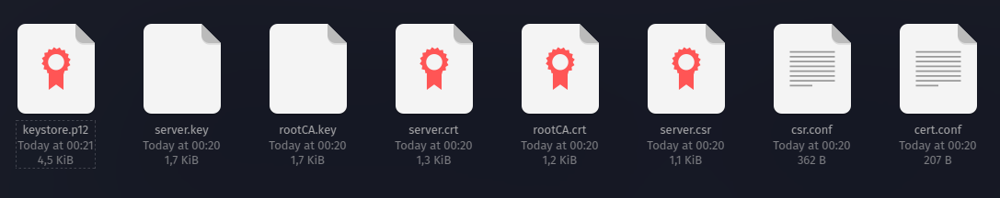

ootCA.crt dosyasını rootCA.pem olarak değiştirmemiz gerekiyor. Detaylara girmeden şunu belirtmek istiyorum eğer crt uzantılı dosyamızın içeriği BEGIN CERTIFICATE ve END CERTIFICATE arasında ise pem dosyası oluşturmak için sadece crt uzantılı dosyamızın pem uzantılı kopyasını alamız yeterli. Bizim oluşturduğumuz crt dosyası bu şekilde olduğu için sadece kopyasını alıyoruz.

```shell
cp rootCA.crt rootCA.pem
```


rootCA.pem dosyasını kubernetes master nodelarına kopyalamamız gerekiyor. Bunu da Kubernetes cluster'ımızı oluşturduktan sonra yapacağız.

Artık tarayıcı üzerinde **_https://mykeycloak:8444_** adresine giderek keycloak admin paneline ulaşabiliriz. 

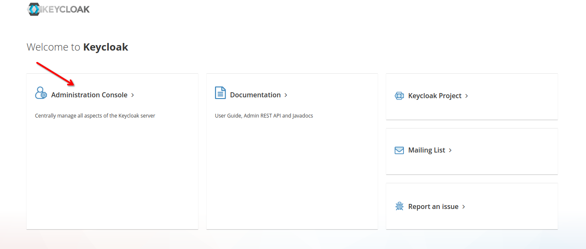

Öncelikle bir Realm oluşturuyoruz.  Bir realm, kullanıcıların, rollerin, erişim politikalarının ve yetkilendirme mekanizmalarının tanımlandığı bir güvenlik sınırları bölgesidir. Bir realm, farklı uygulamalar veya hizmetler için ayrı ayrı yapılandırılabilir ve her biri kendi kimlik doğrulama ve erişim kontrol kurallarına sahip olabilir.

Her bir realm içinde kullanıcılar ve uygulamalar yönetilir. Kullanıcılar, realm'e kaydedilir ve kimlik doğrulaması için kullanıcı adı-şifre kombinasyonu veya sosyal medya hesapları gibi dış kimlik sağlayıcıları aracılığıyla giriş yapabilirler. Kullanıcılara roller atanabilir ve bu roller, uygulamalara veya hizmetlere erişimi kontrol etmek için kullanılabilir.

Bir realm, ayrı ayrı yapılandırılabilir erişim politikaları ve yetkilendirme mekanizmaları sağlar. Bu, kullanıcıların hangi kaynaklara erişebileceğini ve hangi operasyonları gerçekleştirebileceğini tanımlamak için kullanılır. Örneğin, bir realm içindeki bir kullanıcının yalnızca belirli bir uygulamaya erişimi olabilir veya belirli bir rol atanmışsa belirli operasyonları gerçekleştirebilir.

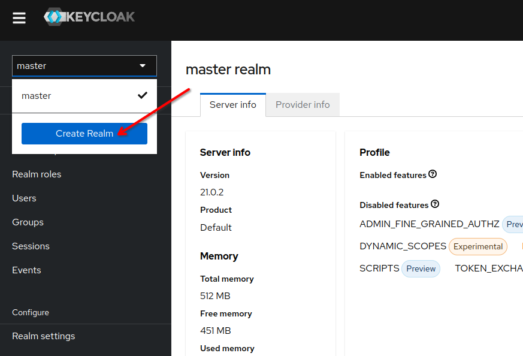

Açılan sayfada Realm Name olarak Keycloak yazıp kaydediyoruz.


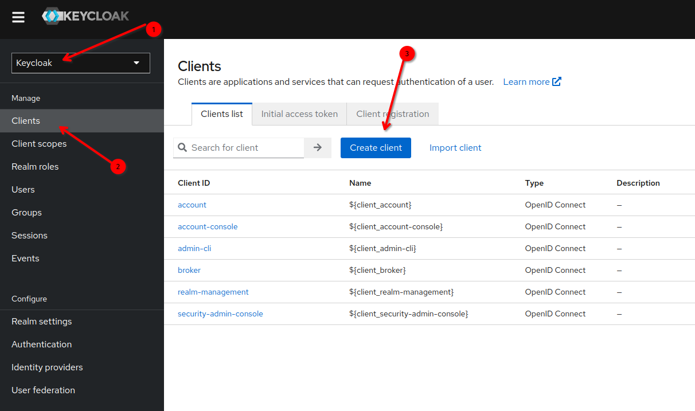

Daha sonra yeni bir client oluşturuyoruz. Bu client bilgisini daha sonra OpenId ile kimlik doğrulama yaparken kullanacağız. 


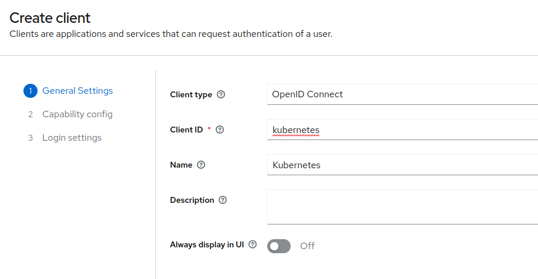

Sonraki ekranda confidential access type etkinleştirerek için client authentication'ı aktif ediyoruz.

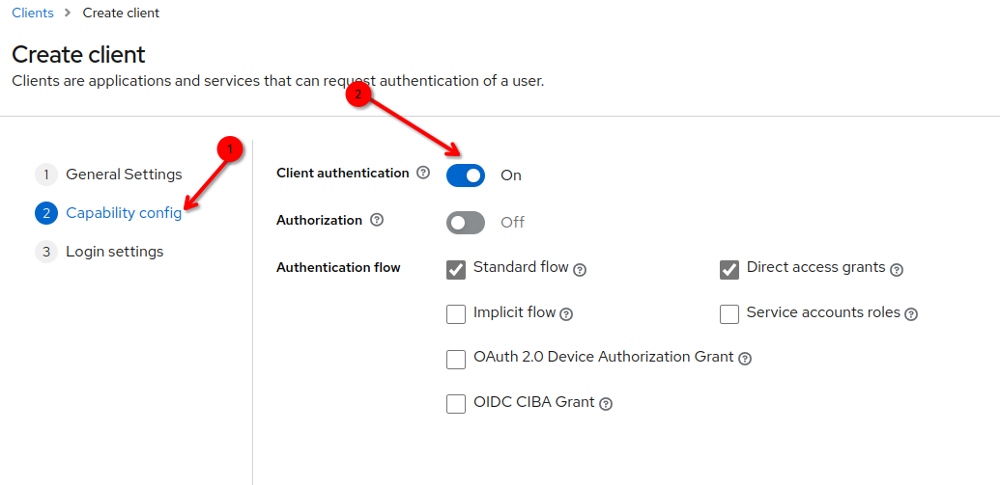

Sonraki ekranda wildcard (*) kullanarak redirect url'i tanımlıyoruz. Tabii ki production ortamlarında wildcard yerine doğru adresleri girmeye dikkat edin.

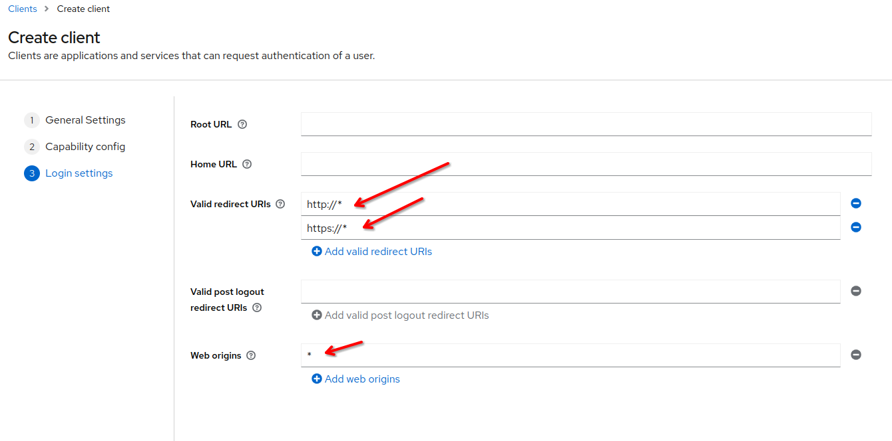

Bu ekrandan sonra kaydediyoruz. 

Artık login yapacağımız kullanıcı grupları, kullanıcılar ve rollerini oluşturabiliriz.

Bunun için daha önce oluşturduğumuz kubernetes adlı client'ımıza geçiş yapalım.

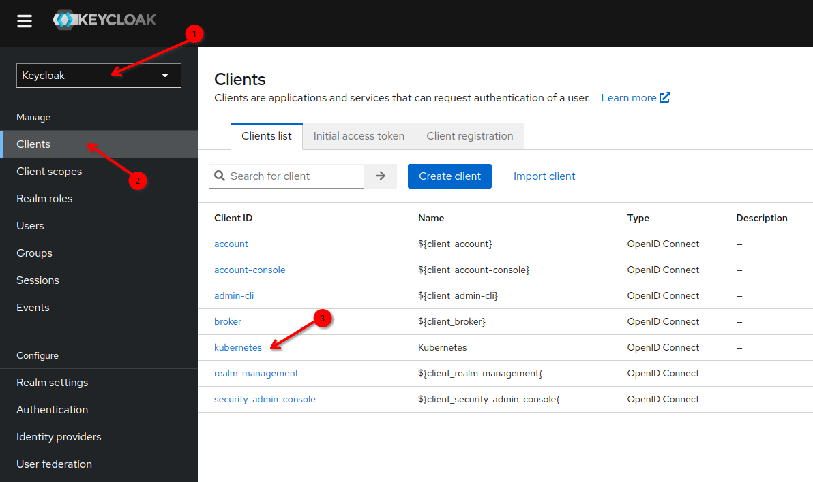

Daha sonra role tabına geçiş yapalım ve iki adet role (admin ve developer) oluşturalım.


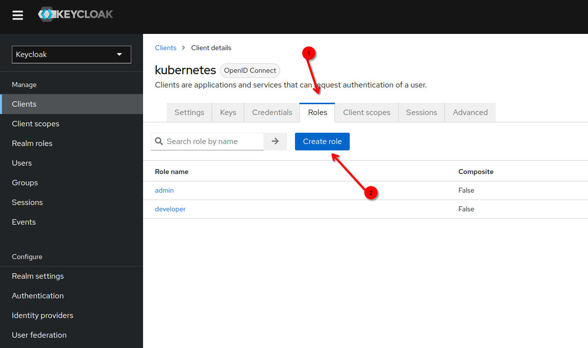


Daha sonra gruplarımızı oluşturalım. developer-group ve admin-group adında iki grup oluşturuyoruz.

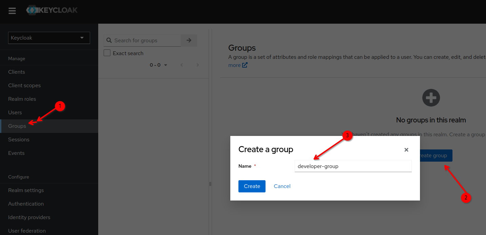

Daha sonra users menüsünden yeni kullanıcılar oluşturuyoruz. admin1use, admin2user, developer1user ve developer2user adında 4 adet kullanıcı oluşturuyoruz.

Alttaki ekranda Email verified'i aktif etmeyi unutmayın. Bu ekran görüntüsünde yapmayı unutmuşum ama siz yapın :). Test ettiğinizde "Unable to authenticate the request" err="[invalid bearer token, oidc: email not verified]" hatası alırsanız sebebi budur. 


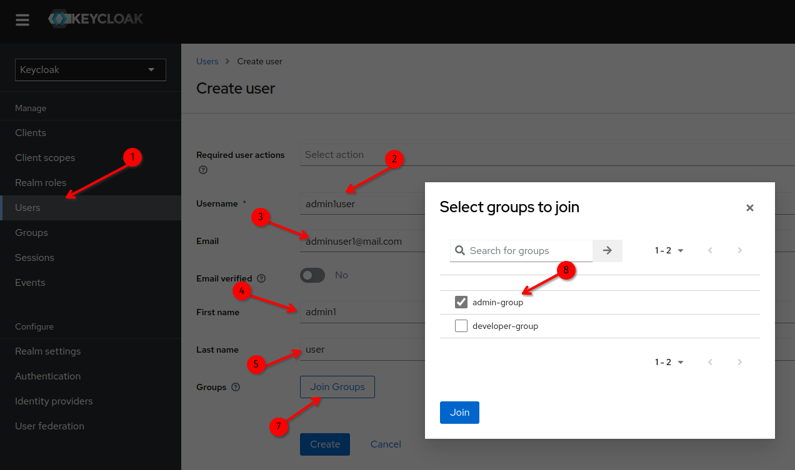

alttaki gibi 4 adet kullanımız olmalı

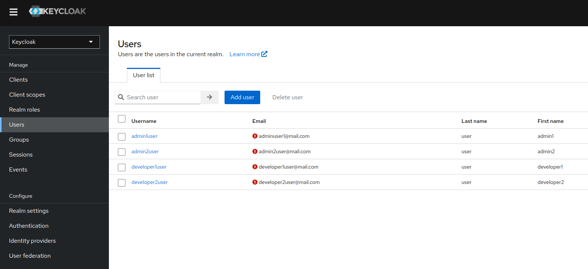

Daha sonra her kullanıcıya name adında bir attribute ekliyoruz.

Bu sayfada ayrıca credentials'a tıklayıp kullanıcılara şifre eklemeyi de unutmayalım.

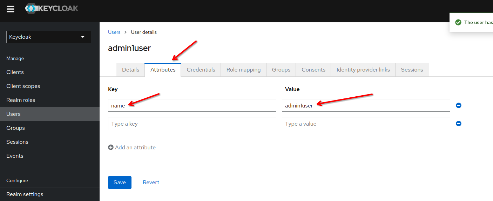

Bu sistemi kullanacak uygulamalar bizden well-known dokümanının adresini isteyecek. Bu adresteki bilgileri kullanarak da Keycloak ile kurmuş olduğumuz OpenId sistemiyle haberleşecekler.

Well-known  dokümanının adresi: https://mykeycloak:8444/realms/Keycloak/.well-known/openid-configuration

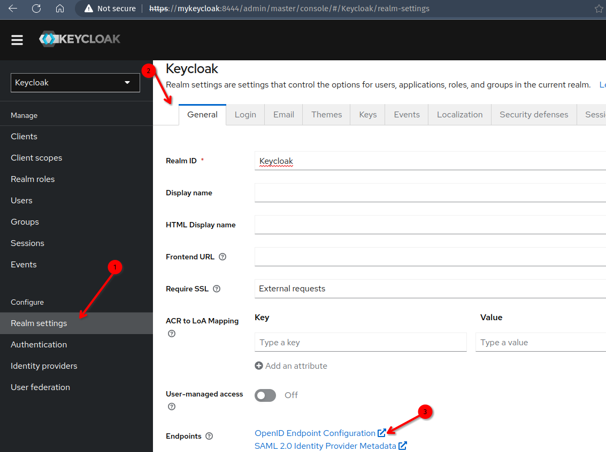

Şuna benzer bir doküman görüyor olmamız lazım
`
```json
{"issuer":"https://mykeycloak:8444/realms/Keycloak",
"authorization_endpoint":"https://mykeycloak:8444/realms/Keycloak/protocol/openid-connect/auth",
"token_endpoint":"https://mykeycloak:8444/realms/Keycloak/protocol/openid-connect/token",
"introspection_endpoint":"https://mykeycloak:8444/realms/Keycloak/protocol/openid-connect/token/introspect",
"userinfo_endpoint":"https://mykeycloak:8444/realms/Keycloak/protocol/openid-connect/userinfo",
"end_session_endpoint":"https://mykeycloak:8444/realms/Keycloak/protocol/openid-connect/logout",
"frontchannel_logout_session_supported":true,
"frontchannel_logout_supported":true,
"jwks_uri":"https://mykeycloak:8444/realms/Keycloak/protocol/openid-connect/certs",
"check_session_iframe":"https://mykeycloak:8444/realms/Keycloak/protocol/openid-connect/login-status-iframe.html",
"grant_types_supported":["authorization_code","implicit","refresh_token","password","client_credentials","urn:ietf:params:oauth:grant-type:device_code","urn:openid:params:grant-type:ciba"],
"acr_values_supported":["0","1"],
"response_types_supported":["code","none","id_token","token","id_token token","code id_token","code token","code id_token token"],
"subject_types_supported":["public","pairwise"],
"id_token_signing_alg_values_supported":["PS384","ES384","RS384","HS256","HS512","ES256","RS256","HS384","ES512","PS256","PS512","RS512"],
"id_token_encryption_alg_values_supported":["RSA-OAEP","RSA-OAEP-256","RSA1_5"],
"id_token_encryption_enc_values_supported":["A256GCM","A192GCM","A128GCM","A128CBC-HS256","A192CBC-HS384","A256CBC-HS512"],
"userinfo_signing_alg_values_supported":["PS384","ES384","RS384","HS256","HS512","ES256","RS256","HS384","ES512","PS256","PS512","RS512","none"],"userinfo_encryption_alg_values_supported":["RSA-OAEP","RSA-OAEP-256","RSA1_5"],
"userinfo_encryption_enc_values_supported":["A256GCM","A192GCM","A128GCM","A128CBC-HS256","A192CBC-HS384","A256CBC-HS512"],
"request_object_signing_alg_values_supported":["PS384","ES384","RS384","HS256","HS512","ES256","RS256","HS384","ES512","PS256","PS512","RS512","none"],
"request_object_encryption_alg_values_supported":["RSA-OAEP","RSA-OAEP-256","RSA1_5"],
"request_object_encryption_enc_values_supported":["A256GCM","A192GCM","A128GCM","A128CBC-HS256","A192CBC-HS384","A256CBC-HS512"],
"response_modes_supported":["query","fragment","form_post","query.jwt","fragment.jwt","form_post.jwt","jwt"],
"registration_endpoint":"https://mykeycloak:8444/realms/Keycloak/clients-registrations/openid-connect",
"token_endpoint_auth_methods_supported":["private_key_jwt","client_secret_basic","client_secret_post","tls_client_auth","client_secret_jwt"],"token_endpoint_auth_signing_alg_values_supported":["PS384","ES384","RS384","HS256","HS512","ES256","RS256","HS384","ES512","PS256","PS512","RS512"],"introspection_endpoint_auth_methods_supported":["private_key_jwt","client_secret_basic","client_secret_post","tls_client_auth","client_secret_jwt"],
"introspection_endpoint_auth_signing_alg_values_supported":["PS384","ES384","RS384","HS256","HS512","ES256","RS256","HS384","ES512","PS256","PS512","RS512"],
"authorization_signing_alg_values_supported":["PS384","ES384","RS384","HS256","HS512","ES256","RS256","HS384","ES512","PS256","PS512","RS512"],"authorization_encryption_alg_values_supported":["RSA-OAEP","RSA-OAEP-256","RSA1_5"],
"authorization_encryption_enc_values_supported":["A256GCM","A192GCM","A128GCM","A128CBC-HS256","A192CBC-HS384","A256CBC-HS512"],
"claims_supported":["aud","sub","iss","auth_time","name","given_name","family_name","preferred_username","email","acr"],
"claim_types_supported":["normal"],
"claims_parameter_supported":true,
"scopes_supported":["openid","profile","web-origins","roles","acr","phone","microprofile-jwt","offline_access","address","email"],
"request_parameter_supported":true,
"request_uri_parameter_supported":true,
"require_request_uri_registration":true,
"code_challenge_methods_supported":["plain","S256"],
"tls_client_certificate_bound_access_tokens":true,
"revocation_endpoint":"https://mykeycloak:8444/realms/Keycloak/protocol/openid-connect/revoke",
"revocation_endpoint_auth_methods_supported":["private_key_jwt","client_secret_basic","client_secret_post","tls_client_auth","client_secret_jwt"],
"revocation_endpoint_auth_signing_alg_values_supported":["PS384","ES384","RS384","HS256","HS512","ES256","RS256","HS384","ES512","PS256","PS512","RS512"],"backchannel_logout_supported":true,
"backchannel_logout_session_supported":true,"device_authorization_endpoint":"https://mykeycloak:8444/realms/Keycloak/protocol/openid-connect/auth/device","backchannel_token_delivery_modes_supported":["poll","ping"],
"backchannel_authentication_endpoint":"https://mykeycloak:8444/realms/Keycloak/protocol/openid-connect/ext/ciba/auth","backchannel_authentication_request_signing_alg_values_supported":["PS384","ES384","RS384","ES256","RS256","ES512","PS256","PS512","RS512"],"require_pushed_authorization_requests":false,
"pushed_authorization_request_endpoint":"https://mykeycloak:8444/realms/Keycloak/protocol/openid-connect/ext/par/request",
"mtls_endpoint_aliases":{"token_endpoint":"https://mykeycloak:8444/realms/Keycloak/protocol/openid-connect/token",
"revocation_endpoint":"https://mykeycloak:8444/realms/Keycloak/protocol/openid-connect/revoke",
"introspection_endpoint":"https://mykeycloak:8444/realms/Keycloak/protocol/openid-connect/token/introspect",
"device_authorization_endpoint":"https://mykeycloak:8444/realms/Keycloak/protocol/openid-connect/auth/device",
"registration_endpoint":"https://mykeycloak:8444/realms/Keycloak/clients-registrations/openid-connect",
"userinfo_endpoint":"https://mykeycloak:8444/realms/Keycloak/protocol/openid-connect/userinfo",
"pushed_authorization_request_endpoint":"https://mykeycloak:8444/realms/Keycloak/protocol/openid-connect/ext/par/request",
"backchannel_authentication_endpoint":"https://mykeycloak:8444/realms/Keycloak/protocol/openid-connect/ext/ciba/auth"}}
```


Belgedeki bilgiler, OpenID sağlayıcısının kimlik doğrulama ve yetkilendirme hizmetlerini yapılandırmak için gereken verileri içerir. Belgedeki önemli bazı alanlar şunlardır:


- issuer: OpenID sağlayıcısının kimlik sağlayıcı adını temsil eden bir URL.
- authorization_endpoint: Yetkilendirme işlemini gerçekleştirmek için kullanılan URL.
- token_endpoint: Erişim tokenlarını almak için kullanılan URL.
- userinfo_endpoint: Kullanıcı bilgilerini almak için kullanılan URL.
- jwks_uri: JSON Web Key Set (JWKS) URL'si, kimlik sağlayıcının kullanılan şifreleme anahtarlarını ve imza anahtarlarını içerir.
- response_types_supported: Desteklenen yanıt tiplerinin bir listesi (örneğin, code, id_token, token).
- scopes_supported: Desteklenen erişim izinlerinin bir listesi.
- claim_types_supported: Desteklenen kimlik iddia tiplerinin bir listesi.


Yaptıklarımızı test edebiliriz. Test edebilmemiz için client_secret bilgisine ihtiyacımız var. client_secret bilgisini Keycloack altında açmış olduğumuz Keycloak realm'ı altındaki kubernetes client sayfasındaki Credential tab'ından alabilirsiniz. 

```shell
curl -X POST https://mykeycloak:8444/realms/Keycloak/protocol/openid-connect/token -d "client_secret=GiSI4a3Z2rgmxV6G4JIkvcYtIhkJbnGz"  -d "grant_type=password" -d "client_id=kubernetes" -d "username=admin1user" -d "password=Abc-123" -d "scope=openid" -d "response_type=id_token" --cacert cert/rootCA.pem
```

Bu komutu çalıştırdığımda ben şöyle bir sonuç aldım.

```json

{"access_token":"eyJhbGciOiJSUzI1NiIsInR5cCIgOiAiSldUIiwia2lkIiA6ICJfQmxKblVDYzBub1dMbld4YWNQaHY5cGtwOTFCV1R2N2ZJUFd2MTNYenE0In0.eyJleHAiOjE2ODgxMTk3MzYsImlhdCI6MTY4ODExOTQzNiwianRpIjoiNjY1ODgwM2MtMDJjMC00ODc1LWFhYzctOTlhNDZlOWNlZWRhIiwiaXNzIjoiaHR0cHM6Ly9teWtleWNsb2FrOjg0NDQvcmVhbG1zL0tleWNsb2FrIiwiYXVkIjoiYWNjb3VudCIsInN1YiI6ImY1MzY4N2UyLTI2ZWYtNDhmZi05NGMxLWY4NzJjNjg0MjU4MSIsInR5cCI6IkJlYXJlciIsImF6cCI6Imt1YmVybmV0ZXMiLCJzZXNzaW9uX3N0YXRlIjoiMjFjZmRkMGUtOTcxNy00ZDc2LTlhNmQtZDgzYWY3NzM1OTFlIiwiYWNyIjoiMSIsImFsbG93ZWQtb3JpZ2lucyI6WyIqIl0sInJlYWxtX2FjY2VzcyI6eyJyb2xlcyI6WyJkZWZhdWx0LXJvbGVzLWtleWNsb2FrIiwiYWRtaW4tcm9sZSIsIm9mZmxpbmVfYWNjZXNzIiwidW1hX2F1dGhvcml6YXRpb24iXX0sInJlc291cmNlX2FjY2VzcyI6eyJhY2NvdW50Ijp7InJvbGVzIjpbIm1hbmFnZS1hY2NvdW50IiwibWFuYWdlLWFjY291bnQtbGlua3MiLCJ2aWV3LXByb2ZpbGUiXX19LCJzY29wZSI6Im9wZW5pZCBwcm9maWxlIGVtYWlsIiwic2lkIjoiMjFjZmRkMGUtOTcxNy00ZDc2LTlhNmQtZDgzYWY3NzM1OTFlIiwiZW1haWxfdmVyaWZpZWQiOmZhbHNlLCJuYW1lIjoiYWRtaW4xIHVzZXIiLCJwcmVmZXJyZWRfdXNlcm5hbWUiOiJhZG1pbjF1c2VyIiwiZ2l2ZW5fbmFtZSI6ImFkbWluMSIsImZhbWlseV9uYW1lIjoidXNlciIsImVtYWlsIjoiYWRtaW4xdXNlckBtYWlsLmNvbSJ9.dwkk7trNbIuH1v4-3q8-pw7S0w0xMeA0nmwElbPq5WJFTIh77N27U7XPX6mZwMd1gFl5a26qi73lF0g1AbRpx_6bxS51_Jv6cN6Agw_sq8Rxh05WK36-JSHkqevWOm3IVwJkyncU46a0kbcqc15kHF2kRA855e8lxPgEpF8IEZjuknrQwrmtyP55xKlyapdHAZOILmEGoOg7SmH-P3jBAq_gqt0CRM1Hn_lDXV5OHD4pZWAUwMSYQWGMaz-O9x8rpEY2o2h7Dq6NKo5e_Ee04T6PaLqR8N7Rf-Sn2JoeLk3GD96mw83WbHEFB6_QY7zD1Dw4OVKFfaZR7Q1QVHL7pQ",

"expires_in":300,

"refresh_expires_in":1800,

"refresh_token":"eyJhbGciOiJIUzI1NiIsInR5cCIgOiAiSldUIiwia2lkIiA6ICJmYWU2MjdjMC0xODJjLTRhZmEtOTlmNS05MWY2OTQ0YzE3NmYifQ.eyJleHAiOjE2ODgxMjEyMzYsImlhdCI6MTY4ODExOTQzNiwianRpIjoiZmNiZjIwMjAtZmJmMS00Mjk4LTkyNTItNGE3MWY1Mjg2MGM1IiwiaXNzIjoiaHR0cHM6Ly9teWtleWNsb2FrOjg0NDQvcmVhbG1zL0tleWNsb2FrIiwiYXVkIjoiaHR0cHM6Ly9teWtleWNsb2FrOjg0NDQvcmVhbG1zL0tleWNsb2FrIiwic3ViIjoiZjUzNjg3ZTItMjZlZi00OGZmLTk0YzEtZjg3MmM2ODQyNTgxIiwidHlwIjoiUmVmcmVzaCIsImF6cCI6Imt1YmVybmV0ZXMiLCJzZXNzaW9uX3N0YXRlIjoiMjFjZmRkMGUtOTcxNy00ZDc2LTlhNmQtZDgzYWY3NzM1OTFlIiwic2NvcGUiOiJvcGVuaWQgcHJvZmlsZSBlbWFpbCIsInNpZCI6IjIxY2ZkZDBlLTk3MTctNGQ3Ni05YTZkLWQ4M2FmNzczNTkxZSJ9.H-zOSRkDK9me2woVO7AclsaK6s-9r9xnFQbrk4p_2V0",

"token_type":"Bearer",

"id_token":"eyJhbGciOiJSUzI1NiIsInR5cCIgOiAiSldUIiwia2lkIiA6ICJfQmxKblVDYzBub1dMbld4YWNQaHY5cGtwOTFCV1R2N2ZJUFd2MTNYenE0In0.eyJleHAiOjE2ODgxMTk3MzYsImlhdCI6MTY4ODExOTQzNiwiYXV0aF90aW1lIjowLCJqdGkiOiI5NGRiMTcwZS1hMGY1LTQzOGMtODhjYi05NTBlYWNlZWEzYWMiLCJpc3MiOiJodHRwczovL215a2V5Y2xvYWs6ODQ0NC9yZWFsbXMvS2V5Y2xvYWsiLCJhdWQiOiJrdWJlcm5ldGVzIiwic3ViIjoiZjUzNjg3ZTItMjZlZi00OGZmLTk0YzEtZjg3MmM2ODQyNTgxIiwidHlwIjoiSUQiLCJhenAiOiJrdWJlcm5ldGVzIiwic2Vzc2lvbl9zdGF0ZSI6IjIxY2ZkZDBlLTk3MTctNGQ3Ni05YTZkLWQ4M2FmNzczNTkxZSIsImF0X2hhc2giOiJVazVqMndqSi1GLUFkdDdhRHN2TjVnIiwiYWNyIjoiMSIsInNpZCI6IjIxY2ZkZDBlLTk3MTctNGQ3Ni05YTZkLWQ4M2FmNzczNTkxZSIsImVtYWlsX3ZlcmlmaWVkIjpmYWxzZSwibmFtZSI6ImFkbWluMSB1c2VyIiwicHJlZmVycmVkX3VzZXJuYW1lIjoiYWRtaW4xdXNlciIsImdpdmVuX25hbWUiOiJhZG1pbjEiLCJmYW1pbHlfbmFtZSI6InVzZXIiLCJlbWFpbCI6ImFkbWluMXVzZXJAbWFpbC5jb20ifQ.JcEwEJBWWagSrlTUHoy_SP9gPdQyRsWIaNriX2M-WUObft2NfX1NG1h2oAcmQLOfz1WpBpwbG32Bu6q9peRAS9q9L9JmJURsBnY03AKIYaWuCmLOto9O2p7C1u5plNyq4cHe95FcVU45OgsfSGGscQ3jqYdAnzt4_NI6MILXzQPzxiQ9oZol9X9hAFGbGFyTiE-tXNfgicjourjYYXX_M8CHeHMJygpljtUuartuERnUKdLLn1OTBisBAI3gbNVkhYd5jRv_PDikyoeFqvhmDB_R0shf29Bcw1urBdJSMqWTC53FWemBoftRjaz9lgA991uwvMyxdsqjeQ698lUoPw",

"not-before-policy":0,

"session_state":"21cfdd0e-9717-4d76-9a6d-d83af773591e",

"scope":"openid profile email"}

```

Burada üretilen token bir JWT (Json Web Token) token'dır. JWT token'larda 3 bölüm vardır. Bunlarda token içinde nokta kullanılarak belirtilir. access_token'a bakacak olursanız 3 nokta ile ayrıldığını görebiliyoruz. Bu alanlardan birincisi token'ın header bilgisini yani tokenın meta data'sını, ikincisi payload (claims) yani token'ın içeriğini ve üçünsü de signature yani tokenın imzasını içerir. İmza  JWT'nin bütünlüğünü doğrulamak için kullanılan bir imzadır. İmza, başlık (header), içerik (payload) ve bir sırrın (secret) birleştirilerek belirlenir. İmza, JWT'nin doğru ve güvenilir bir kaynaktan geldiğini doğrulamak için kullanılır.

Şimdi bu token'ın içeriğinde ne olduğuna bakalım. bunun için acces_token'ın içerğini jwt.io sayfasında encoded alanına kopyalıyoruz.


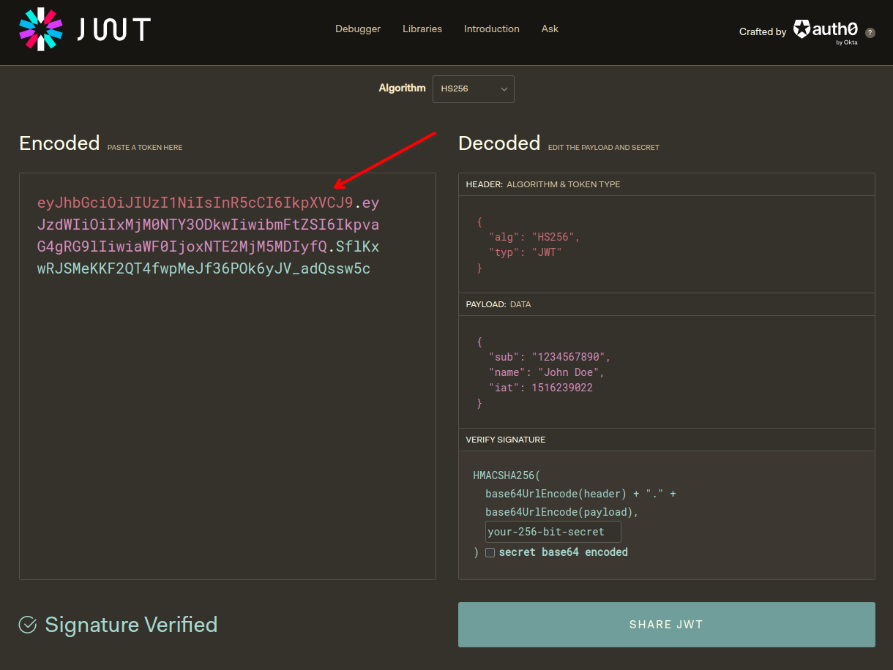


Benimkisi şu şekilde çözümlendi.


```json
{
  "exp": 1688119736,
  "iat": 1688119436,
  "jti": "6658803c-02c0-4875-aac7-99a46e9ceeda",
  "iss": "https://mykeycloak:8444/realms/Keycloak",
  "aud": "account",
  "sub": "f53687e2-26ef-48ff-94c1-f872c6842581",
  "typ": "Bearer",
  "azp": "kubernetes",
  "session_state": "21cfdd0e-9717-4d76-9a6d-d83af773591e",
  "acr": "1",
  "allowed-origins": [
    "*"
  ],
  "realm_access": {
    "roles": [
      "default-roles-keycloak",
      "admin-role",
      "offline_access",
      "uma_authorization"
    ]
  },
  "resource_access": {
    "account": {
      "roles": [
        "manage-account",
        "manage-account-links",
        "view-profile"
      ]
    }
  },
  "scope": "openid profile email",
  "sid": "21cfdd0e-9717-4d76-9a6d-d83af773591e",
  "email_verified": false,
  "name": "admin1 user",
  "preferred_username": "admin1user",
  "given_name": "admin1",
  "family_name": "user",
  "email": "admin1user@mail.com"
}
```

Ancak burada kubernetes tarafında kullanmyı planladığımız groups bilgisi yok. Role bilgisi de kullanılabilir tabiiki. yada biz tokenımıza group bilgisini'de ekleyebilirz.Ayrıca biz username için token'la gelen name verisini kullanırız diye düşünmüştük ancak orada aradığımız bilgi yok. Username bilgisi preferred_username alanında var yada email bilgisini de kullnabiiriz tabiiki.

Şimdi isterseniz group bilgisini nasıl token ekleyebilceğimize bakalım. Bunun için client scope eklememiz gerekiyor

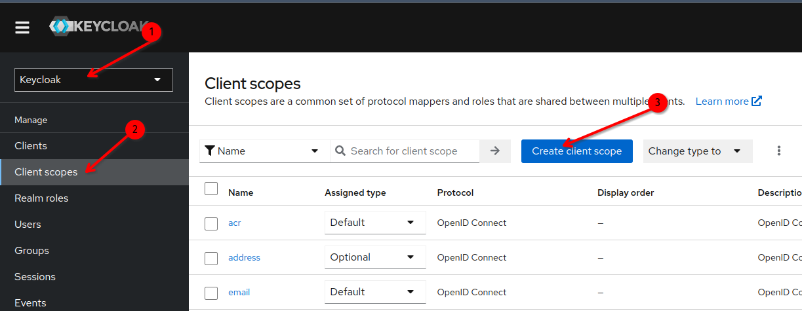

Scope adına groups yazıypruz. Protokolün OpenId oldundan emin oluyoruz.

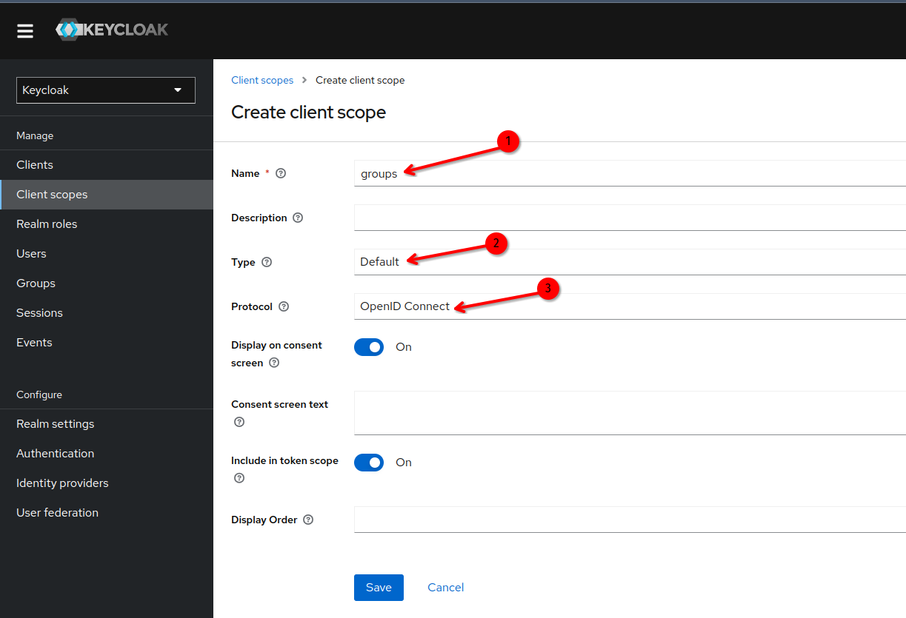

Daha sonra bu client scope'u client'lar altındaki kubernetes'e tıklayıp client scopes tab'ından add client scope'a tıklayarak seçiyoruz. 

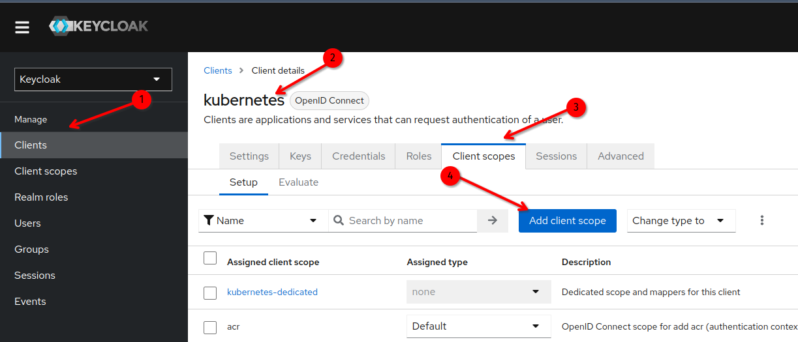

Add diyoruz ve böylece token'ımınz artık group bilgisini de veriyor olacak. Test etmek için yukarıdaki curl komutu ile token'ı alıp jwt.io da decompile ettiğimizde alttaki gibi artık groups bilgisinin de geldiğini görebiliriz.

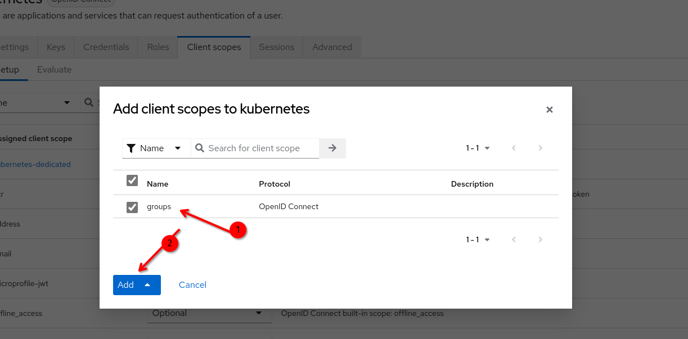

```json
{
  "exp": 1688129206,
  "iat": 1688128906,
  "jti": "0b7fc2ed-3eed-4bf5-a8c4-467ca2db9be8",
  "iss": "https://mykeycloak:8444/realms/Keycloak",
  "aud": "account",
  "sub": "f53687e2-26ef-48ff-94c1-f872c6842581",
  "typ": "Bearer",
  "azp": "kubernetes",
  "session_state": "cac33257-72b8-4563-9383-c4e9b870dfb7",
  "acr": "1",
  "allowed-origins": [
    "*"
  ],
  "realm_access": {
    "roles": [
      "default-roles-keycloak",
      "admin-role",
      "offline_access",
      "uma_authorization"
    ]
  },
  "resource_access": {
    "account": {
      "roles": [
        "manage-account",
        "manage-account-links",
        "view-profile"
      ]
    }
  },
  "scope": "openid profile email groups",
  "sid": "cac33257-72b8-4563-9383-c4e9b870dfb7",
  "email_verified": false,
  "name": "admin1 user",
  "groups": [
    "admin-group"
  ],
  "preferred_username": "admin1user",
  "given_name": "admin1",
  "family_name": "user",
  "email": "admin1user@mail.com"
}
```
Artık kubernetes tarafındaki ayarlarmıza geçebiliriz.


## KinD (Kubernetes in Docker) ile Kubernetes Cluster Kurulumu

Genellikle development ve test ortamlarında Kubernetes kurulumu için Minikube, K3d veya Mikrok8s gibi deployment araçları kullanılıyor. KinD çok fazla bilinien bir araç değil. Temel özelliği Kubetnetes cluster'ını Docker container'ları üzerinde kuruyor olmasıdır. Bu sayede cluster'ı oluşturmak için ekstra bir makineye ihtiyaç duymuyoruz. Ayrıca cluster'ı oluşturmak için Docker imajları kullanıldığı için cluster'ı oluşturmak çok hızlı oluyor. 

Diğer araçlardan farklı olarak bize tem bir Kubernetes cluster'ı veriyor olması. Diğer araçlar ise kısıtlanmış veya belirli amaçlar için optimize edilmiş olduıjlarında Kubernetes için geliştirilen bir çok bileşeni bir addon olarak kısıtlı sunar. Ayrıca hepsi multinode cluster desteği sunmaz. Multinode sunanlardan bazıları mesela Microk8s birden fazla makine ister. Tabi bu bazen iyi bazen kötü olabilir. Ancak ihtiyacımız hızlı kurulup kaldırılabilen, mümkün olduğunca gerçek bir Kubernetes deneyimi sunan, test ve development için kullnabileğimiz bir depoymen aracıysa KinD bize bunu sunuyor.


[Resim Kaynak](https://kind.sigs.k8s.io/docs/design/initial/)


KinD ile ilgili detaylı bilgi için [buraya](https://kind.sigs.k8s.io/) bakabilirsiniz.

Öncelikle KinD'ı makinemize kuruyoruz.

```shell
[ $(uname -m) = x86_64 ] && curl -Lo ./kind https://kind.sigs.k8s.io/dl/v0.20.0/kind-linux-amd64
chmod +x ./kind
sudo mv ./kind /bin/kind
```

Daha sonra alttaki komutla cluster'ımızı oluşturuyoruz. Daha önce Keycloak container'ımızdan kopyaladığımız sertifikalarımız yer aldığı cert adlı klasörü home dizinimize ssl adıyla kopyalamayı unutmayın. 

Ayrıca home dizininize kind adında bir klasör oluşturuyoruz. 

```shell
kind create cluster --name=keycloak-kubernetes --config - <<EOF
kind: Cluster
apiVersion: kind.x-k8s.io/v1alpha4
networking:
  kubeProxyMode: "ipvs"
kubeadmConfigPatches:
- |-
  kind: ClusterConfiguration
  apiServer:
    extraArgs:
      oidc-client-id: kubernetes
      oidc-issuer-url: https://mykeycloak:8444/realms/Keycloak
      oidc-username-claim: email
      oidc-groups-claim: groups
      oidc-ca-file: /etc/ca-certificates/keycloak/rootCA.pem
    controllerManager:
      extraArgs:
        bind-address: 0.0.0.0
    scheduler:
      extraArgs:
        bind-address: 0.0.0.0
nodes:
- role: control-plane
  extraMounts:
  - hostPath: ${HOME}/ssl/rootCA.pem
    containerPath: /etc/ca-certificates/keycloak/rootCA.pem
    readOnly: true
- role: worker
  extraMounts:
  - hostPath: ${HOME}/ssl/rootCA.pem
    containerPath: /etc/ca-certificates/keycloak/rootCA.pem
    readOnly: true
EOF

```

Bu komut ile Kube-apiserver manifest dosyamıza alttaki satırları ekmiş oluyoruz.

```
oidc-client-id: kubernetes
oidc-issuer-url: https://mykeycloak:8444/realms/Keycloak
oidc-username-claim: email
oidc-groups-claim: groups
oidc-ca-file: /etc/ca-certificates/keycloak/rootCA.pem
```

Bu bilgilerin hepsi daha önce curl komutu ile aldığımız token içinde geçen bilgiler. issuer-url bilgisini ise well-known dokümanımızdan alıyoruz. 

KinD docker container'ları üzerine kurulduğu için sertifikamızı mount ederek Kubernetes master node'larımıza bağlamış olduk.

Devam etmeden önce eğer kubectl host makineniz de kueulu değilse onu da alttaki komutla kurabilirsiniz.

```shell
curl -LO "https://dl.k8s.io/release/$(curl -L -s https://dl.k8s.io/release/stable.txt)/bin/linux/amd64/kubectl"

chmod +x kubectl
mkdir -p ~/.local/bin
sudo mv ./kubectl /bin/kubectl
```

Kurulum sonrası oluşturulan config dısyamıza bakalım. Yeni bir cluster eklendiğini görebiliyoruz.

```shell

cat ${HOME}/.kube/config

--- KISALTILDI

- cluster:
    certificate-authority-data: LS0tLS1CRUdJTiBDRVJUSUZJQ0FURS0tLS0tCk1JSUMvakNDQWVhZ0F3SUJBZ0lCQURBTkJna3Foa2lHOXcwQkFRc0ZBREFWTVJNd0VRWURWUVFERXdwcmRXSmwKY201bGRHVnpNQjRYRFRJek1EY3dNakUwTlRJeU5Wb1hEVE16TURZeU9URTBOVEl5TlZvd0ZURVRNQkVHQTFVRQpBeE1LYTNWaVpYSnVaWFJsY3pDQ0FTSXdEUVlKS29aSWh2Y05BUUVCQlFBRGdnRVBBRENDQVFvQ2dnRUJBSm5mCitTa2hGLzhObk5LbDlrR3VoczVD---KISALTILDI
    server: https://127.0.0.1:35529
  name: kind-keycloak-kubernetes

--- KISALTILDI

```

Container listesine bakacak olursak KinD ile oluştulmuş container'ları  da görebiliriz.

```shell 
docker container ls --format "table {{.Image}}\t{{.Names}}\t{{.Ports}}"


IMAGE                  NAMES                               PORTS
kindest/node:v1.27.3   keycloak-kubernetes-worker
kindest/node:v1.27.3   keycloak-kubernetes-control-plane   127.0.0.1:35529->6443/tcp
mykeycloak:latest      mykeycloak                          8080/tcp, 0.0.0.0:8444->8443/tcp, :::8444->8443/tcp
postgres:12-alpine     mykeycloak-postgres                 5432/tcp


```
Basit bir test yapalım. 

```shell
kubectl get nodes
NAME                                STATUS   ROLES           AGE     VERSION
keycloak-kubernetes-control-plane   Ready    control-plane   3m30s   v1.27.3
keycloak-kubernetes-worker          Ready    <none>          3m10s   v1.27.3

```

evet cluster'ımız kurulu görünüyor. Şimdi kube-system namespace'indeki podları listelemeye çalışalım.

```shell

kubectl get pods -n kube-system

NAME                                                        READY   STATUS    RESTARTS   AGE
coredns-5d78c9869d-kbwbp                                    1/1     Running   0          4m11s
coredns-5d78c9869d-sscfp                                    1/1     Running   0          4m11s
etcd-keycloak-kubernetes-control-plane                      1/1     Running   0          4m25s
kindnet-bpdwd                                               1/1     Running   0          4m10s
kindnet-zcd4n                                               1/1     Running   0          4m8s
kube-apiserver-keycloak-kubernetes-control-plane            1/1     Running   0          4m24s
kube-controller-manager-keycloak-kubernetes-control-plane   1/1     Running   0          4m24s
kube-proxy-gx7pj                                            1/1     Running   0          4m8s
kube-proxy-zwknn                                            1/1     Running   0          4m10s
kube-scheduler-keycloak-kubernetes-control-plane            1/1     Running   0          4m24s
```

kube-apiserver pod'umuzun detaylarını inceleyelim.

```shell
kubectl describe pods kube-apiserver-keycloak-kubernetes-control-plane -n kube-system

--- KISALTILDI

Containers:
kube-apiserver:
Container ID:  containerd://a7dcf6ffd581246c23eadd46db40eadc18b23281e8e18e2b6a5388bcd54445b0
Image:         registry.k8s.io/kube-apiserver:v1.27.3
Image ID:      docker.io/library/import-2023-06-15@sha256:0202953c0b15043ca535e81d97f7062240ae66ea044b24378370d6e577782762
Port:          <none>
Host Port:     <none>
Command:
kube-apiserver
--advertise-address=172.21.0.2
--allow-privileged=true
--authorization-mode=Node,RBAC
--client-ca-file=/etc/kubernetes/pki/ca.crt
--enable-admission-plugins=NodeRestriction
--enable-bootstrap-token-auth=true
--etcd-cafile=/etc/kubernetes/pki/etcd/ca.crt
--etcd-certfile=/etc/kubernetes/pki/apiserver-etcd-client.crt
--etcd-keyfile=/etc/kubernetes/pki/apiserver-etcd-client.key
--etcd-servers=https://127.0.0.1:2379
--kubelet-client-certificate=/etc/kubernetes/pki/apiserver-kubelet-client.crt
--kubelet-client-key=/etc/kubernetes/pki/apiserver-kubelet-client.key
--kubelet-preferred-address-types=InternalIP,ExternalIP,Hostname
--oidc-ca-file=/etc/ca-certificates/keycloak/rootCA.pem
--oidc-client-id=kubernetes
--oidc-groups-claim=groups
--oidc-issuer-url=https://mykeycloak:8444/realms/Keycloak
--oidc-username-claim=email
--proxy-client-cert-file=/etc/kubernetes/pki/front-proxy-client.crt
--proxy-client-key-file=/etc/kubernetes/pki/front-proxy-client.key
--requestheader-allowed-names=front-proxy-client
--requestheader-client-ca-file=/etc/kubernetes/pki/front-proxy-ca.crt
--requestheader-extra-headers-prefix=X-Remote-Extra-
--requestheader-group-headers=X-Remote-Group
--requestheader-username-headers=X-Remote-User
--runtime-config=
--secure-port=6443
--service-account-issuer=https://kubernetes.default.svc.cluster.local
--service-account-key-file=/etc/kubernetes/pki/sa.pub
--service-account-signing-key-file=/etc/kubernetes/pki/sa.key
--service-cluster-ip-range=10.96.0.0/16
--tls-cert-file=/etc/kubernetes/pki/apiserver.crt
--tls-private-key-file=/etc/kubernetes/pki/apiserver.key
State:          Running
Started:      Sun, 02 Jul 2023 17:52:33 +0300

--- KISALTILDI
```
Görüleceği üzere oidc ile ilgili parametreler bizim KinD komutu ile veridiğimiz bilgileri içeriyor.

## Keycloak ile Kubernetes Kimlik Doğrulama

Peki bu yaptığımız ne işimize yaracacak bunu anlamaya çalışalım. Daha önce belirttiğimiz gibi Kubernetes bir kimlik yönetim mekanizması bize sunmuyor. Biz bir role ve bunların yetkileri oluşturabiliriz. Ancak doğrudan user diye bir obje oluşturamıyoruz. İşte tam bu noktada Kubernetes'in kimlik yönetimi ve doğruma işlemleri için Keycloak'ı tanımasını sağlayarak kullanıcı oluşturma ve onu ilgili rollere atama işini Keycloak üzerinden yapılamsını sağlamış olacağız.


Şu ana kadar yaptıklarımıla aslında entegrasyon işini halletmiş olduk. Şimdi oluşturduğumuz sistemi kullanalım.


Öncelikle Keycloak üzerinde oluşturğumuz gruplara uygun Kubernetes tarafında ClusterRole ve ClusterRoleBinding'ler oluşturalım.

Developer-group için ClusterRole ve ClusterRoleBinding oluşturuyoruz.


```shell

cat <<EOF | kubectl apply  -f -
kind: ClusterRole
apiVersion: rbac.authorization.k8s.io/v1
metadata:
  name: developer-clusterrole
rules:
  - apiGroups: [""]
    resources: ["namespaces","pods"]
    verbs: ["get", "watch", "list"]
---
kind: ClusterRoleBinding
apiVersion: rbac.authorization.k8s.io/v1
metadata:
  name: developer-clusterrolebinding
roleRef:
  apiGroup: rbac.authorization.k8s.io
  kind: ClusterRole
  name: developer-clusterrole
subjects:
- kind: Group
  name: "developer-group"
  apiGroup: rbac.authorization.k8s.io
EOF

```
Admin-group için ClusterRole ve ClusterRoleBinding oluşturuyoruz.


```shell

cat << EOF | kubectl apply -f -

apiVersion: rbac.authorization.k8s.io/v1
kind: ClusterRole
metadata:
  name: admin-clusterrole
rules:
- apiGroups: [""]
  resources: ["namespaces"]
  verbs: ["get", "list", "watch"]
- apiGroups: ["rbac.authorization.k8s.io"]
  resources: ["clusterroles", "clusterrolebindings"]
  verbs: ["get", "list", "watch"]

---
apiVersion: rbac.authorization.k8s.io/v1
kind: ClusterRoleBinding
metadata:
  name: admin-clusterrolebinding
subjects:
roleRef:
  kind: ClusterRole
  name: admin-clusterrole
  apiGroup: rbac.authorization.k8s.io
subjects:
- kind: Group
  name: "admin-group"
  apiGroup: rbac.authorization.k8s.io
EOF
```

Artık Keycloak ile authentication yapabiliriz. Temelde yapmamız gerekenler aslında şu şekilde: Öncelikle Keycloak üzerinde oluşturduğumuz kullanıcılardan biri ile token oluşturacağız, daha sonra bu token bilgisini ve aşağıdaki örnek komutta görülen diğer bilgileri de toplarlayarak kube.config dosyamıza gerekli bilgileri ekleyeceğiz.

```shell
 kubectl config set-credentials USER_NAME \
    --auth-provider=oidc \
    --auth-provider-arg=idp-issuer-url=( issuer url ) \
    --auth-provider-arg=client-id=( your client id ) \
    --auth-provider-arg=client-secret=( your client secret ) \
    --auth-provider-arg=refresh-token=( your refresh token ) \
    --auth-provider-arg=idp-certificate-authority=( path to your ca certificate ) \
    --auth-provider-arg=id-token=( your id_token )
```

Ancak bu işi daha pratik yapmamızı sağlayan oidc-login adında bir plugin de mevcut. Bu plugin sayasnde bütün bu kurguyu çok daha pratik ve hızlı bir şekilde ypabiliyoruz. Bu plugin'i yükleyebilmek için öncelikle krew adında bir plugin yöneticisi yüklememiz gerekiyor. Krew'i yüklemek için aşağıdaki komutu çalıştırıyoruz.

```shell
(
  set -x; cd "$(mktemp -d)" &&
  OS="$(uname | tr '[:upper:]' '[:lower:]')" &&
  ARCH="$(uname -m | sed -e 's/x86_64/amd64/' -e 's/\(arm\)\(64\)\?.*/\1\2/' -e 's/aarch64$/arm64/')" &&
  KREW="krew-${OS}_${ARCH}" &&
  curl -fsSLO "https://github.com/kubernetes-sigs/krew/releases/latest/download/${KREW}.tar.gz" &&
  tar zxvf "${KREW}.tar.gz" &&
  ./"${KREW}" install krew
)


export PATH="${KREW_ROOT:-$HOME/.krew}/bin:$PATH"

source ~/.bashrc
```

Daha sonra plugin'i yükleyebiliriz.

```shell
  kubectl krew install oidc-login

```

Plugin'i alttaki komutla çalıştırıyoruz. Komutu çalıştıdığımızda bir browser açılacak ve bize Keycloak'da daha önce oluşturduğumuz kullanılardan birinin bilgileri girmemizi isteyecek. Login işlemi bitince de bize hazır bir komut verecek. Bu komuu kullnarak kube.config dosyamızı güncelleyeceğiz.

```shell
kubectl oidc-login setup \
--oidc-issuer-url=https://mykeycloak:8444/realms/Keycloak \
--oidc-client-id=kubernetes \
--oidc-client-secret=GiSI4a3Z2rgmxV6G4JIkvcYtIhkJbnGz \
--certificate-authority=$HOME/ssl/rootCA.pem \
--insecure-skip-tls-verify
```


Komut çalıştırıldığında açılan sayfada kullanıcı adı ve şifremizi girdikten sonra alttaki gibi sonuç aldık. Dönen token bilgisine dikkat edecek olursak group  bölümünde Keycloak'da oluşturduğumuz ve kullanıcımızı atadığımız group bilgisi görünüyor. Bu grubu ayrıca ClusterRoleBinging (admin-clusterrolebinding) içinde tanımlamıştık. Bu sayede kullanıcımızın cluster içindeki yetkilerini de belirlemiş olduk. Kullanıcımız Keycloak tarafından verify edildikten sonra Kubernetes'e dönen token bilgisinde group bilgisi de yer aldığından ve bu bilginin Kubernetes tarafından okunmasını kube-apiserver konfigürasyonunda belirttiğimiz için Kubernetes ilgili rolu kullanıcımıza atayacak.

```shell
## 2. Verify authentication

You got a token with the following claims:

{
"exp": 1688287386,
"iat": 1688287086,
"auth_time": 1688286890,
"jti": "2263a3e5-8b78-450b-bf3e-c49edd80f24f",
"iss": "https://mykeycloak:8444/realms/Keycloak",
"aud": "kubernetes",
"sub": "f53687e2-26ef-48ff-94c1-f872c6842581",
"typ": "ID",
"azp": "kubernetes",
"nonce": "MoxYCXQ1XzClqtTSnkVvl38RLvsIzc8EwtJcVeEXgbk",
"session_state": "ba5f3e07-bfd2-44f9-806d-457dfcc3b6c9",
"at_hash": "hoMQl5skcdpMf9c57u0IaQ",
"acr": "0",
"sid": "ba5f3e07-bfd2-44f9-806d-457dfcc3b6c9",
"email_verified": true,
"name": "admin1 user",
"groups": [
"admin-group"
],
"preferred_username": "admin1user",
"given_name": "admin1",
"family_name": "user",
"email": "admin1user@mail.com"
}

## 3. Bind a cluster role

Run the following command:

kubectl create clusterrolebinding oidc-cluster-admin --clusterrole=cluster-admin --user='https://mykeycloak:8444/realms/Keycloak#f53687e2-26ef-48ff-94c1-f872c6842581'

## 4. Set up the Kubernetes API server

Add the following options to the kube-apiserver:

--oidc-issuer-url=https://mykeycloak:8444/realms/Keycloak
--oidc-client-id=kubernetes

## 5. Set up the kubeconfig

Run the following command:

kubectl config set-credentials oidc \
--exec-api-version=client.authentication.k8s.io/v1beta1 \
--exec-command=kubectl \
--exec-arg=oidc-login \
--exec-arg=get-token \
--exec-arg=--oidc-issuer-url=https://mykeycloak:8444/realms/Keycloak \
--exec-arg=--oidc-client-id=kubernetes \
--exec-arg=--oidc-client-secret=GiSI4a3Z2rgmxV6G4JIkvcYtIhkJbnGz \
--exec-arg=--certificate-authority=/home/muratcabuk/ssl/rootCA.pem \
--exec-arg=--insecure-skip-tls-verify

## 6. Verify cluster access

Make sure you can access the Kubernetes cluster.

kubectl --user=oidc get nodes

You can switch the default context to oidc.

kubectl config set-context --current --user=oidc

You can share the kubeconfig to your team members for on-boarding.
```


Biz 5. maddeye kadar olan adımları aslında yaptık. Tek yapmamız gereken 5. maddedeki komutu kubeconfig dosyamızın yolulunu belirterek çalıştırmak.

```shell
kubectl --kubeconfig ${HOME}/kind/kube.config config set-credentials oidc \
--exec-api-version=client.authentication.k8s.io/v1beta1 \
--exec-command=kubectl \
--exec-arg=oidc-login \
--exec-arg=get-token \
--exec-arg=--oidc-issuer-url=https://mykeycloak:8444/realms/Keycloak \
--exec-arg=--oidc-client-id=kubernetes \
--exec-arg=--oidc-client-secret=GiSI4a3Z2rgmxV6G4JIkvcYtIhkJbnGz \
--exec-arg=--certificate-authority=/home/muratcabuk/ssl/rootCA.pem \
--exec-arg=--insecure-skip-tls-verify

# Komut çalıştırılsığında alttaki sonucu alıyor olmalıyız.

# User "oidc" set.
```

kube.config dosyasmızın içerğine bakacak olursak alttaki gibi bir bölümün eklendiğini göreceğiz.

```yaml
- name: oidc
  user:
    exec:
      apiVersion: client.authentication.k8s.io/v1beta1
      args:
      - oidc-login
      - get-token
      - --oidc-issuer-url=https://mykeycloak:8444/realms/Keycloak
      - --oidc-client-id=kubernetes
      - --oidc-client-secret=GiSI4a3Z2rgmxV6G4JIkvcYtIhkJbnGz
      - --certificate-authority=/home/kullaniciadiniz/ssl/rootCA.pem
      - --insecure-skip-tls-verify
      command: kubectl
      env: null
      provideClusterInfo: false
```

Şimdi oidc kullanıcı ayarlarımızı kullanarak bazı işlemleri yapmayı deneyelim.


```shell
kubectl get namespace --user oidc

NAME                 STATUS   AGE
default              Active   139m
kube-node-lease      Active   139m
kube-public          Active   139m
kube-system          Active   139m
local-path-storage   Active   139m
```

Eğer session'ınımız kapandıysa bu komut ile browser açılacak ve bizden yetkili bir kullanıcı adı ve şifre isteyecek. Eğer kullanıcımız namespace listesini almaya yetkiliyse namespace listesini alabileceğiz. Hatırlarsanız admin kullanıcılarımıza namespace listesi alma yetkisi vermiştik.

Eğer hata ile karşılaaşırsanız aşağıdaki yöntemleri deneyeiniz.

- Keycloak OIDC sağlayıcınızın doğru şekilde yapılandırıldığından emin olun. oidc-issuer-url, oidc-client-id, oidc-username-claim, oidc-groups-claim ve oidc-ca-file gibi ayarlarınızın doğru olduğundan emin olun. Keycloak yönetim panelinde doğru kullanıcılar ve gruplar oluşturulduğundan emin olun.

- Kubectl komutunu çalıştırdığınızda kullandığınız kubeconfig dosyasını kontrol edin. Doğru bir şekilde yapılandırıldığından ve OIDC sağlayıcısıyla uyumlu olduğundan emin olun. kubeconfig dosyasında doğru kullanıcı kimlik bilgileri (token, cert, key vb.) olduğundan emin olun.

- Keycloak üzerinde oluşturduğunuz kullanıcıların ve grupların, Kubernetes rolleri ve rollerin atandığı kullanıcı ve grupların doğru şekilde yapılandırıldığından emin olun. Kullanıcılara ve gruplara gerekli rolleri ve izinleri atadığınızdan emin olun.

- Keycloak OIDC sağlayıcısıyla entegrasyonu doğrulamak için kubectl yerine curl veya benzeri bir araç kullanarak OIDC sağlayıcısıyla doğrulama isteği yapabilirsiniz. Bu şekilde, kullanıcının OIDC sağlayıcısıyla başarılı bir şekilde kimlik doğrulaması yapılıp yapılmadığını kontrol edebilirsiniz.

- KinD yapılandırmasında, API sunucusu, kontrol yöneticisi ve scheduler için doğru OIDC ayarlarının yapılandırıldığından emin olun. Yaptığınız değişikliklerin KinD kümesine başarıyla uygulandığından emin olun.

- Kubernetes API sunucusunun loglarını kontrol edin. Bu loglarda herhangi bir hata veya uyarı mesajı bulunuyor mu? API sunucusunun Keycloak ile iletişim kurarken herhangi bir hata yaşamadığından emin olun.

- Ağ erişimini kontrol edin: Kubernetes API sunucusu ve Keycloak arasındaki ağ erişimini kontrol edin. Her iki hizmetin de aynı ağda veya ağa erişebilir durumda olduğundan emin olun. Ayrıca, API sunucusu ile Keycloak arasındaki güvenlik grupları veya ağ politikalarını kontrol edin. Gerekli portların açık olduğundan ve trafikin engellenmediğinden emin olun.

- SSL/TLS sertifikalarını kontrol edin: Keycloak ile API sunucusu arasındaki güvenli iletişim için kullanılan SSL/TLS sertifikalarını kontrol edin. Keycloak'un kullandığı sertifika (oidc-ca-file) ve API sunucusunun kullandığı sertifikaların (ca.crt) geçerli olduğunu ve birbirini doğrulayabileceğini doğrulayın.

Umarım faydalı olmuştur. Kendinize iyi bakın

Diğer yazılarmızda görüşmek üzere.


