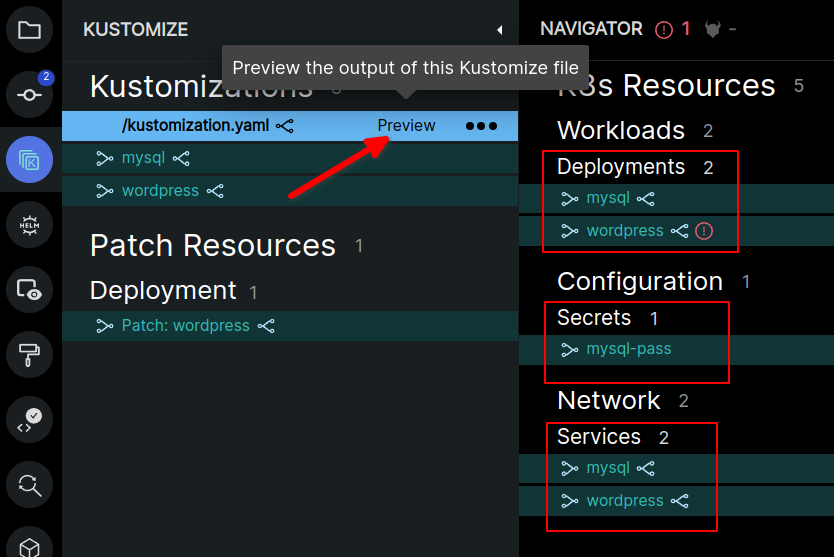

### Monokle Desktop ile Kustomize ve Helm ile Çalışma
[Bir önceki](readme.md) yazımızda Monokle Desktop hakkında  alttaki başlıklara değinmiştik.
- Monokle Desktop nedir, ne işe yarar?
- Monokle ile Proje yönetimi,
- Cluster yönetimi,
- Deployment yapmak ve lokal konfigürasyon ile Kubernetes arasındaki farklılıkları gözlemlemek
- İki cluster arasındaki farklılıkları gözlemlemek ve iki cluster'ı eşitlemek  
  

Bu yazımızda Monokle ile Helm ve Kustomize üzerinde neler yapılabileceğini inceleyeceğiz.

Önceki yazımızda Kind ile kurduğumuz iki cluster üzerinden devam edeceğiz. Eğer Lab ortamınız hazır değilse önceki yazıdan kurulum yapabilirsiniz.

### Kustomize Kullanımı

Örnek proje olarak Kubernetes-sigs'in Github sayfasındaki örneklerini kullanacağız. Bunun için [şu repoyu](git@github.com:kubernetes-sigs/kustomize.git) fork'ladıktan sonra lokalinize clone'lıyoruz. Adını kustomize-example olarak değiştirerek clone'ladım.

Monokle Desktop'u açtıktan sonra new project'e gelip "open a local folder" seçeneğine tıklıyoruz. Açılan ekranda "kustomize-examples/examples/wordpress/" dizinini seçiyoruz.

İki cluster'ında yüklü olduğundan emin olmalıyız.

Kustomize ayarlamak için sağ üstten Setting menüsüne giriyoruz.

Kustomize'ı kullanmak için kubectl yeterli. Kubectl 1.14 ve üstünde Kustomize native olarak kubectl içine eklenmiş durumda. Ayrıca "Enable Helm-related functionality when invoking Kustomize" seçeneğini de aktif ediyoruz.

Soldan Kustomize menüsüne geçtiğimizde kustomization.yaml dosyalamızın içeriği görülebilir.

Örneğin Mysql'in sağındaki küçük link ikonuna tıklayacak olursak bu Mysql ile birlikte hangi kaynakların Kubernetes'de oluşturacağını da görebiliriz.

İlgili kaynakların üzerine geldiğimizde çıkan "preview" linkine tıklayacak olursak oluşturulacak kaynaklar hakkında daha detaylı bilgi alabiliriz.

Üstteki resimde de görebileceğiniz üzere Monokle bize wordpress üzerinde bir hata olduğunu söylüyor Wordpress altındaki deployment.yaml üzerinde  "hostPath: {}" keyinin boş olmayacağını söylüyor. Yani daha deployment yapmadan hatayı görme şansını veriyor.

"hostPath: {}" satırını "#" işreti ile açıklama satırına çeviriyoruz.

Artık deploy edebiliriz. Bunun için kind-mycluster cluster'ının seçiyoruz ve Deploy butonuna tıklıyoruz. 

Cluster moda geçip deployment'ları kontrol ettiğimizde mysql ve wordpress'in deploy olduğunu görebiliriz.

Bir önceki yazımızda yaptığımz gibi burada da iki cluster'ı senkronize edebiliriz.

Bunun için öncelikle soldaki menüden File Explorer'a geçip ortadaki Navigator panelinden Compare & Sync butonuna tıklıyoruz. Daha sonra alttaki adımları uygulamamız gerekiyor. Kind-MyCluster ile Kind-MyCluster2 arasındaki farklılıkları filtreleyip  Kind-MyCluster'da yer alan mysql ve wordpress uygulamaları ile ilgili olan deployment, secret ve service kaynaklarını sync ediyoruz. Alttaki resimde sadece deployment seçili görünüyor diğerlerini seçmeyi unutmayın.

### Helm Kullanımı

Helm nedir? Nasıl kurulur? vb konulara hiç girmiyorum. Zaten bunu anlatan bir çok kaynak var.

Örneğimiz için Bitnami'nin Helm Chart'larını kullanacağız. [Github](https://github.com/bitnami/charts) sayfasından fork'layıp kullanıyoruz. 

Monokle Desktop üzerinde Joomla klasörünü new project üzerinden açıyoruz.

Preview yapabilmek için Preview Configuration üzerinden (+) işaretini tıklayarak paneli açıyoruz.

Konfigürasyon adını yazıyoruz. Values dosyalarını seçiyoruz ancak zaten standartlara uygun bir Helm chart açtığımız için zaten gerek kalmadı. Save and Preview butonuna tıklayarak kaydediyoruz.

Helm dependency'lerini yüklemek için Joomla klasöründeyken "helm dependency update" komutunu çalıştırıyoruz. Ardında values.yaml üzerinden preview'e tıklayarak preview moda geçiyoruz.

Yine bazı hatalar var validation burada da devrede ancak bu sefer onlara takılmayacağız. Sadece burada sağ üstte install butonuna tıklayarak kurulum yapabileceğimizi göstermek istedim.

Install butonuna tıkladığımızda alttaki gibi bir mesaj göreceğiz.

Bilindiği üzere Helm karmaşıklığı ile bilinen bir araç. Haliyle büyük bir sistem için oluşturulmuş bir Helm template'ini anlamak için Monokle çok iyi bir araç. Örneğin Joomla için Joomla, MariaDb,ingress, secret, network policy, volume gibi bir çok kaynak ayarlanıyor ve kuruluyor. Navigator üzerinde herhangi bir kaynağa tıkladığınızda ilgili kaynağın bağlantılı olduğu diğer kaynakları görme şansımız oluyor.

Bu yazı ile Monokle Desktop'un hemen hemen bütün özelliklerine değinmiş olduk. Görüleceği üzere öğrenmesi ve kullanımı çok kolay bir araç. Özellikle birden fazla cluster yönetiyorsanız işinizi çok kolaylaştıracak bşr araç. Öncelikle state tutmuyor yani illa bir veritabanı vs kullanmak durumunda değilsiniz. Web Uygulaması değil bu nedenle sunucu kurulumu vb gerek yok. 

Umarım faydalı olmuştur.