### Monokle Desktop ile Kubetnetes Cluster ve Konfigürasyon Yönetimi

Bu yazımızda Kubernetes cluster'larımızı ve kaynaklarımızı GUI üzerinden yöntebilmemizi sağlayan Monokle adlı aracı inceleyeceğiz.

[Monokle](https://monokle.io/) kelime anlamı tek gözlük demek. Tabi böyle çok anlamsız oluyor ama alttaki resme bakarsanız ne olduğu anlaşılacaktır. Zaten logosu da andırıyor. Monokle "ˈmänək(ə)l" (mooanıkıl) şeklinde okunur.


[Resmi sayfasındaki](https://monokle.io/) tanıma göre "Monokle, tüm uygulama yaşam döngüsü boyunca yüksek kaliteli Kubernetes yapılandırmaları oluşturmaya ve sürdürmeye yönelik bir araç setidir".

Araç setinde bulunan araçlar.
- **Monokle Desktop**, oluşturmadan doğrulamaya (validation) ve dağıtıma (deployment) kadar tüm konfigürasyon yaşam döngüsünü kapsayan, Kubernetes konfigürasyonlarının yazılması, analizi ve devreye alınması için birleşik bir görsel araçtır. 
- **Monokle CLI**, mevcut dağıtım öncesi iş akışlarınızın bir parçası olarak Kubernetes yapılandırmalarını doğrulamak için esnek ve kullanımı kolay bir komut satırı aracıdır. 
- **Monokle Cloud**, GitHub'da Kubernetes yapılandırmalarınızı ve GitOps repolarınızı keşfetmek, doğrulamak ve yönetmek için ücretsiz, tarayıcı tabanlı bir araçtır. 


Biz de bu yazımızda çoğunlukla  Monokle Desktop'u inceliyor olaağız.


Yani ne gibi faydaları var?


- Şablonları kullanarak realtime olarak  konfigürasyon hatalarımızı düzeltebiliriz.
- Deployment'a çıkmadan sonuçları görebiliriz ayrıca Helm ve Kustomize üzerindeki inventory değişikliklerini takip edebiliriz.

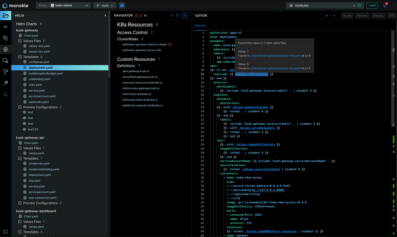

- Kubernetes kaynakları ve konfigürasyonları arasındaki bağımlılıkları ve ilişkileri anlamamızı kolaylaştırır.
  
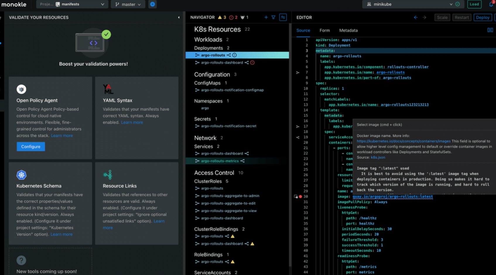

- Git branch'keri ve repo'ları arasında desired states karşılaştırması yapabiliriz.
- Kubernetes namespace ve cluster'ları arasındaki farklılıkları karşılaştırabiliriz.
- Gerçek ortamımız ile elimizdeki konfigürasyon arasındaki farklılıkları daha kolay anlayabiliriz.
  
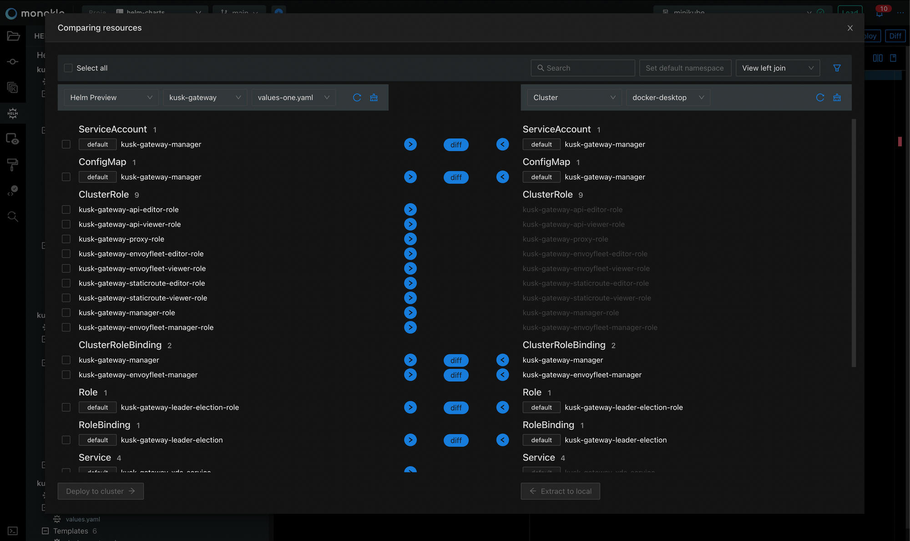
- Git'e doğrudan update geçebiliriz.
  
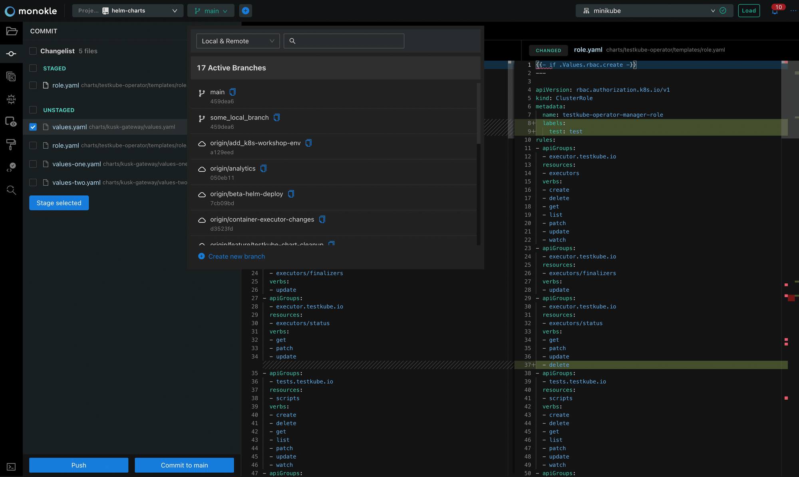

### Lab Ortamı Kurulumu  

Lab ortamımızı [Kind](https://kind.sigs.k8s.io/) ile kuracağız. Kind Kubernetes'in testlerinde kullanılmaz için geliştirilmiş bir Kubernetes cluster deployment aracı.

Docker container'ları üzerinden Kubernetes deployment yapmamızı sağlıyor. Sanal makine oluşturmadığımız için hem çok hızlı bir şekilde cluster'ımızı ayağa kaldırabiliyoruz hem de kaynak tüketimimiz de azalmış oluyor. Ayrıca native Kubernetes kullandığı için Kubernetes için geliştirilen bir çok native aracı (Nginx ingress, Calico, Istio, MetalLB..vb) kullanabilirsiniz.

Kind dışında başka Lightweight Kubernetes deployment araçları da var.

- [Minikube](https://minikube.sigs.k8s.io/docs/start/): Cross Multinode desteklenmez. Yani sadece aynı makine üzerinde multinode desteklenir. Tam native çözün sunmaz bu nedenle bazı araçların yerine kendi çözümü vardır. Mesela service mesh, load balancing, storage vb. 
- [Microk8s](https://microk8s.io/): Canonical firmasının geliştirdiği bir araçtır. IoT cihazları, test ortamları ve development için kullanılmak üzere geliştirilmiştir. Ayrıca büyük olmayan production ortamlarında da kullanılabilir. Tam native bir çözüm sunmaz. Bu nedenle bazı ihtiyaçlar için plugin sistemi vardır. Cross Multinode desteklenir. High Availability için  ETCD yerine [Dqlite](https://dqlite.io/docs/explanation/architecture) adında Sqlite üzerine kurulu bir distributed veri tabanı kullanır. 
- [K3s](https://docs.k3s.io/): IoT cihazları, test ve development için geliştirilmiştir. 100 MB'lık binary tekbir dosyadır. Bu haliyle Mikrok8s kadar gelişmiş değildir. Sanal makineler üzerinden cluster kurmayı destekler. Ancak native bir kurulum sunmadığı için Kubernetes için geliştirilmiş  her aracı kullanmak mümkün olmayabilir.
- [K3d](https://k3d.io/): Kendi başına bir Kubernetes deployment aracı değildir. K3s'i bir nevi sarmayalarak cli üzerinden docker container'ları üzerinde çalışacak cluster oluşturmamızı sağlar. Bu haliyle aslında K3s ile K3d'nin birleşimi bir Minikube veya Microk8s gibi bir araca denk geliyor diyebilir.


Bu durumda IoT , dev, test ve küçük production ortamları için en uygunu Microk8s gibi görünüyor. Ancak tam native test ortamı arıyorsanız o zaman da Kind uygun gibi görünüyor. Amacınız doğrudan native Kubernetes araçlarını kurmak ve test etmekse KinD native bir ortam sunduğu mantıklı görünüyor.

Öncelikle Kind'ı local makinemize kurmamız gerekiyor. Bunun için resmi sayfasından işletim sisteminize uygun kurulumu yapabilirsiniz. MacOs için brew, Windows için Chocolatey paket yöneticileri mevcut. Ayrıca isterseniz doğrudan binary üzerinden de çalıştırabilirsiniz.

Linux için alttaki komutları kullanabilirsiniz.


```bash
curl -Lo ./kind https://kind.sigs.k8s.io/dl/v0.17.0/kind-linux-amd64
chmod +x ./kind
sudo mv ./kind /usr/local/bin/kind
```

Kind cli kullanarak cluster'ımızı oluşturuyoruz. Bunun için cluster.yaml adında bir dosyaya alttaki kodları kopyalıyoruz.

```bash

kind: Cluster
apiVersion: kind.x-k8s.io/v1alpha4
nodes:
- role: control-plane
- role: worker
- role: worker
- role: worker
```


Daha sonra dosyanın bulunduğu dizinde iken terminalde alttaki komutla cluster'ımızı oluşturuyoruz.

```bash
kind create cluster --name mycluster --config cluster.yaml
```
Kubectl kurmak için 

- [Linux](https://kubernetes.io/docs/tasks/tools/install-kubectl-linux/)
- [Mac Os](https://kubernetes.io/docs/tasks/tools/install-kubectl-macos/)
- [Windows](https://kubernetes.io/docs/tasks/tools/install-kubectl-windows/)


Linux için kurulum

```bash
curl -LO "https://dl.k8s.io/release/$(curl -L -s https://dl.k8s.io/release/stable.txt)/bin/linux/amd64/kubectl"

chmod +x kubectl
mv ./kubectl /usr/local/bin/kubectl
```

Test etmek için alttaki komut kullanıyoruz. Home klasörümüzde .kube klasörü altında config adında bir doya oluşturulduğunu görebiliriz. Bu dosya içinde kind-mycluster adında bir context oluşturuldu bunu kullanarak cluster'ımız üzerinde komut çalıştırabiliriz.


```bash
kubectl cluster-info --context kind-mycluster

# Kubernetes control plane is running at https://127.0.0.1:41415
# CoreDNS is running at https://127.0.0.1:41415/api/v1/namespaces/kube-system/services/kube-dns:dns/proxy

# To further debug and diagnose cluster problems, use 'kubectl cluster-info dump'.

```

Artık lab ortamımız hazır olduğuna göre Monokle'yi incelyebiliriz.


### Monokle Desktop

Bütün işlerim sistemleri için [şu sayfada](https://monokle.io/download) kurulum dosyaları mevcut.

İlk açılışta istersek yeni bir proje oluşturabiliriz. Proje oluştuma ekranının ikinci adımında Kubernetes resource'larını oluşturabileceğimiz hazır şablonlar var. Tabi bunları hazır projelerimizde de oluşturabiliriz.

Ancak biz Kubernetes resmi [Github repo'sundaki](https://github.com/kubernetes/examples) örnekleri kullanacağız. Bunun öncelikle repo'yu kendi hesabınıza fork'latın. Ben adını kubernetes-examples olarak değiştirerek fork'ladım. Daha sonra repo'yu lokalinize klonlayın.

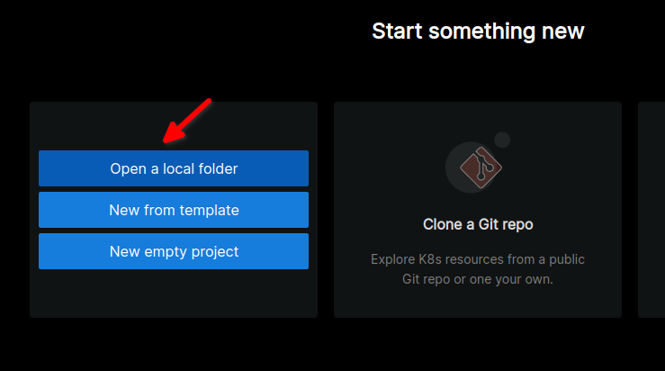

New Project Butonuna geldiğimizde "Open a local folder" butonuna tıklayıp klasörümüzü seçiyoruz. Yükleme tamamlandığında sağ üstte Kubernetes clusterımızı görebiliriz. İleride iki cluster arasındaki farkları inceleyeceğimiz zaman ikinci cluster'ımız da oluşturacağız.

Eğer cluster görünmüyorsa öncelikle ayakta olduğunda emin olun. Eğer orası çalışıyor görünüyorsa [Monokle dokümanlarından](https://kubeshop.github.io/monokle/cluster-integration/) nasıl entegre edeceğinizi öğrenebilirsiniz.

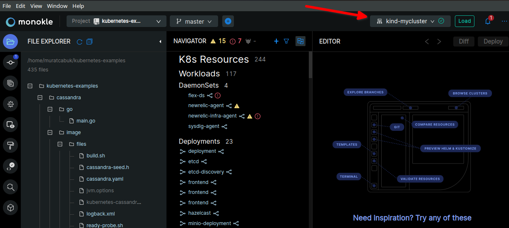


#### Image Yönetimi

Soldaki menüden Images'a tıklayacak olursak projemizde kullandığımız bütün image'ların listesine ulaşabiliriz.


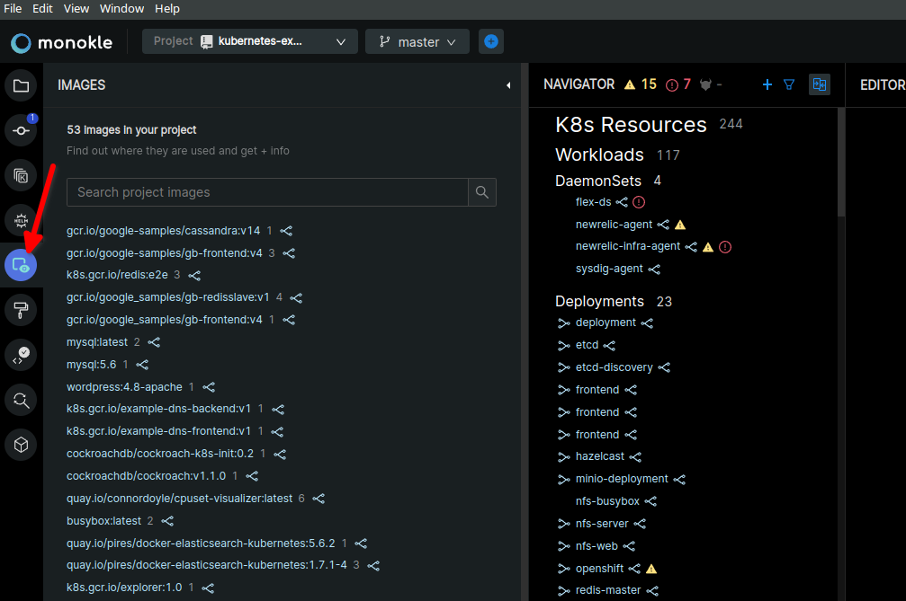


Mouse ile image'ların üreinde gezdiğimizde replace linki görünecektir. Tıkladığımızda image'ın tag'ini değiştirebiliriz.

#### Cluster Yönetimi

Sol menüden Clusters'a tıklayacak olursak sağ üstten bağlı olduğumuz cluster'lardan birini yüklememiz gerekiyor. Lab ortamında yüklediğimiz cluster'ı seçip yüklediğimizde bütün kaynaklarımız görebiliriz. Tabi şuan bir deployment yapmadığımız için sadece sistem kaynakları görünüyor.

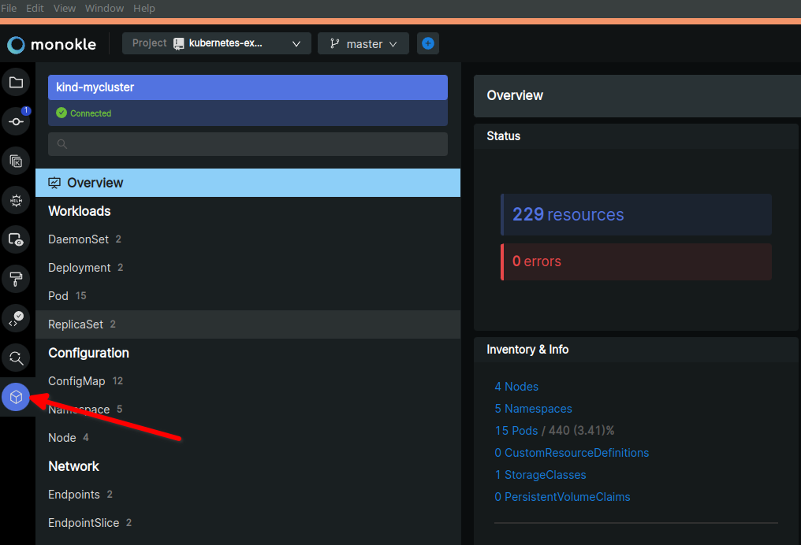


Uygulamızı deploy edebilmek için cluster'ı yüklediğimiz sağ üstteki bölümden exit'a tıklıyoruz. 

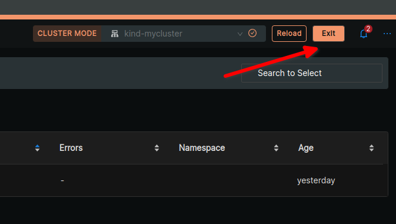

#### Deployment

Tekrar File Explorer menüsüne tıklıyoruz.

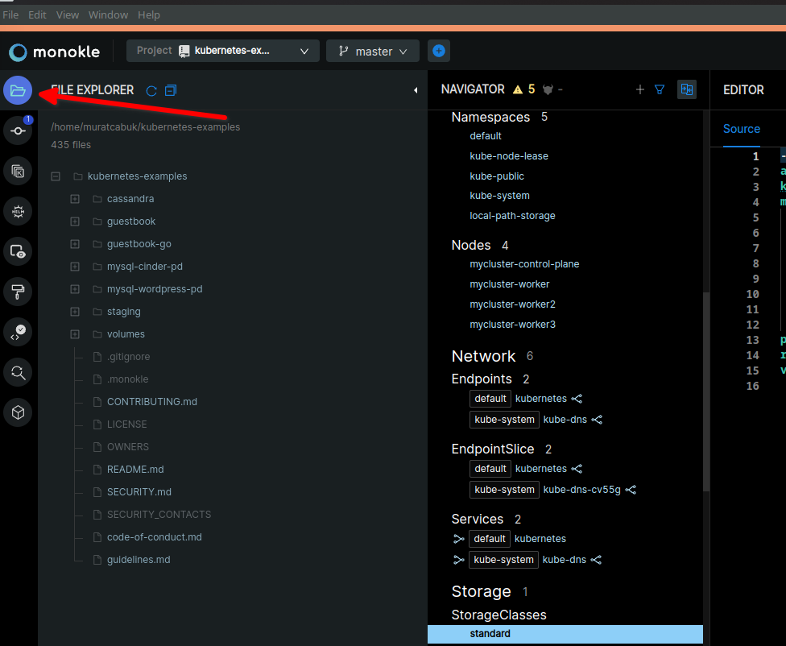


Test için ne uygun olanı guestbook yazan uygulama. Alttaki dosyaları sırasıyla deploye ediyoruz.

- redis-replica-deployment.yaml
- redis-replica-service.yaml
- frontend-deployment.yaml
- frontend-service.yaml

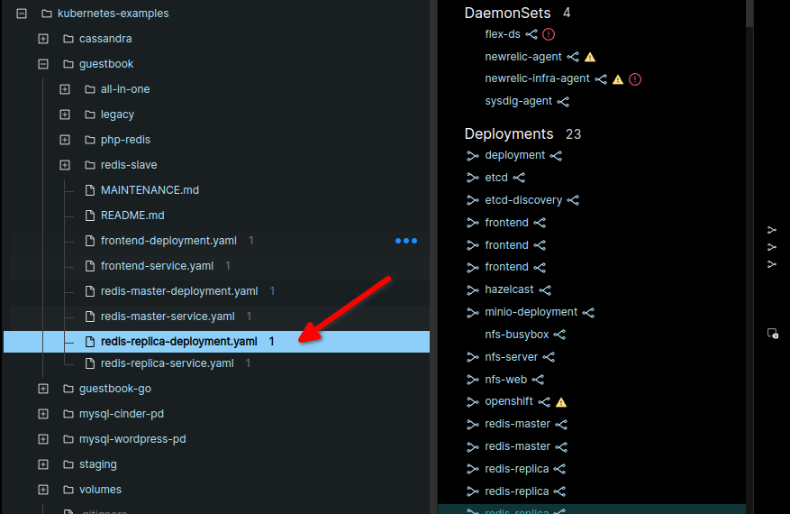

Dosya seçili iken sağ üstten deploy butonuna tıklıyoruz.

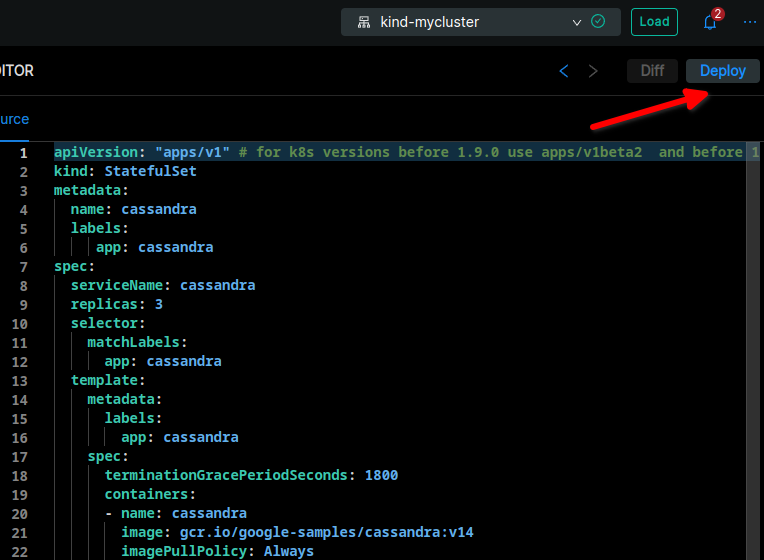

Şimdi cluster mode'a tekrar dönüp guestbook kaynaklarının deploy olup olmadığını görebiliriz.

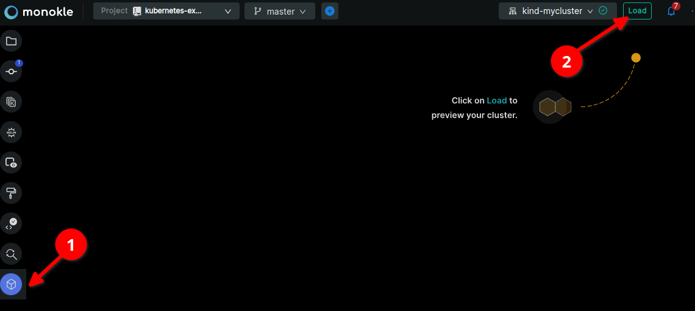

Daha sonra deployment'lara geçip redis ve php uygulamalarımızın deploy edildiğini görebiliriz.

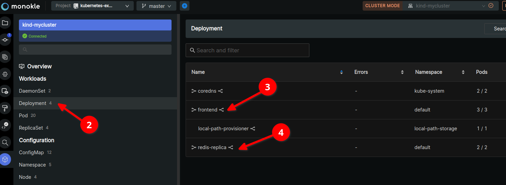

#### Deployment Diff

Cluster moddan çıkıp tekrar file explorer'a geçip frontend-deployment-yaml soyasna tıklayıp sağdan replica sayısını 2'ye düşürelim.

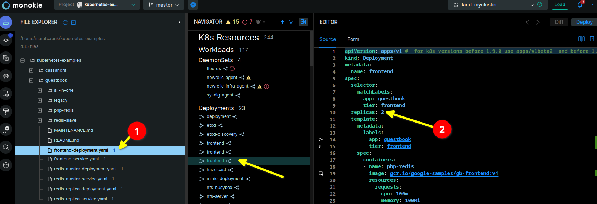

Halen file explorer'da iken sağ üstten cluster'ımızı load edelim. Cluster modda olmamalıyız.

Navigator panelinden frontend uygulamamızı seçip sağ üstten Diff butonuna tıklıyoruz. 


Açılan panelden sağ üstten /guestbook/frontend-deployment.yaml dosyasını seçtiğimizde attaki gibi bir ekran görüyor olmalıyız. 

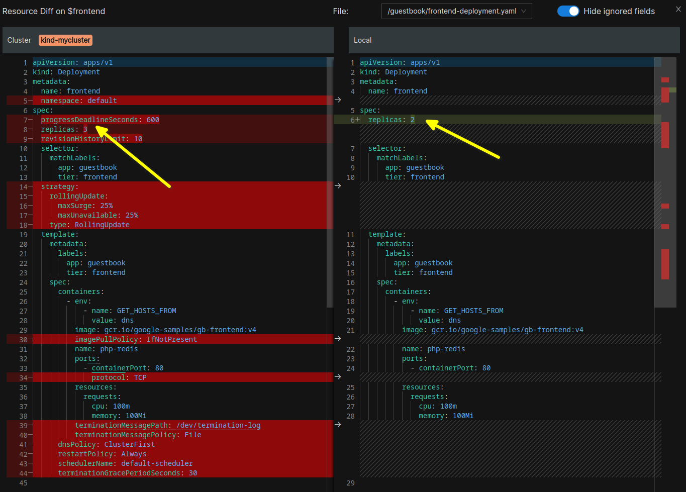

Bu ekranın en altında ki butonları kullanarak  cluster'a yeni halini deploy edebileceğimiz gibi cluster üzerinden local'imizi de değiştirebiliriz.

Ayrıca ilgili kaynak seçili iken form moduna geçerek görsel olarak da kaynaklarımızı gözlemleyebiliriz.  


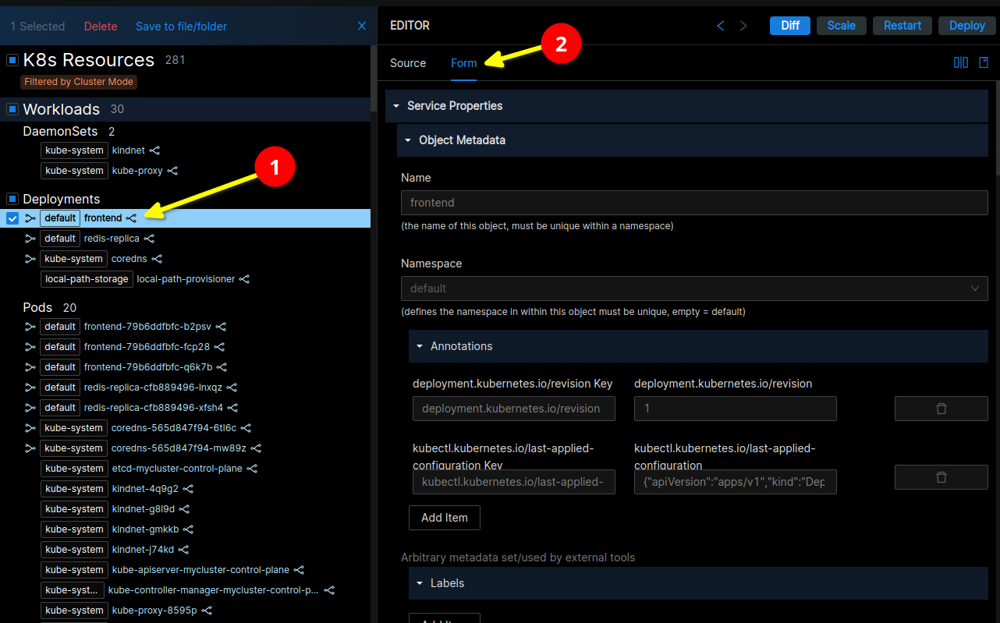

Ayrıca ilgili kaynağın üzerine geldiğimizde çıkan 3 nokta ile kaynağı cluster'dan silebiliriz.


Navigator panelinden bütün kaynakları local'deki manifest/konfigürasyon (yaml) dosyaları içinde tanımlnamış kaynaklarla karşılaştırabiliriz. Örneğin Nemaspace tanımları. pod'lar, network kuralları, storage'lar, controller'lar, RBAC'ler ... vb.


### Cluster Karşılaştırmaları

Bunu için ikinci bir cluster'a ihtiyacımız olacak. Bunun için tek yapmamız gereken  daha önce oluşturmuş olduğumuz Kind cluster konfigürasyon doyasını kullanarak ikinci cluster'ı ayağa kaldırmak olacaktır.

Bir klasörde cluser.yaml adında bir dosya oluşturmuştuk. Bu dizinde iken konsol üzerinde alttaki komutu çalıştırıyoruz.

```bash
kind create cluster --name mycluster2 --config cluster.yaml
```


Cluster'ımızı kurulduktan sonra halen file explorer üzerindeyken yine sağ üst köşeden kind-mycluster2 cluster'ımızı load ediyoruz. Ardından Navigator panelindeki "Compare & Sync" butonuna tıklıyoruz.


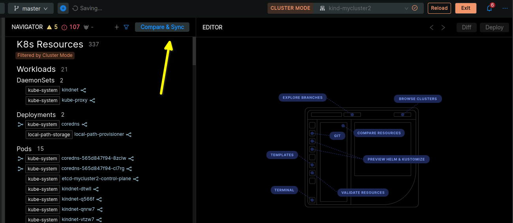

Açılan pencerede iki cluster'ı da seçtiğimizde aynı olan kaynaklarda diff butonunu görebiliriz. Eğer bir kaynak bir tarafta varken diğerinde yoksa olan taraftaki kaynağı olmayan taraftaki cluster'a deploy edebiliriz.


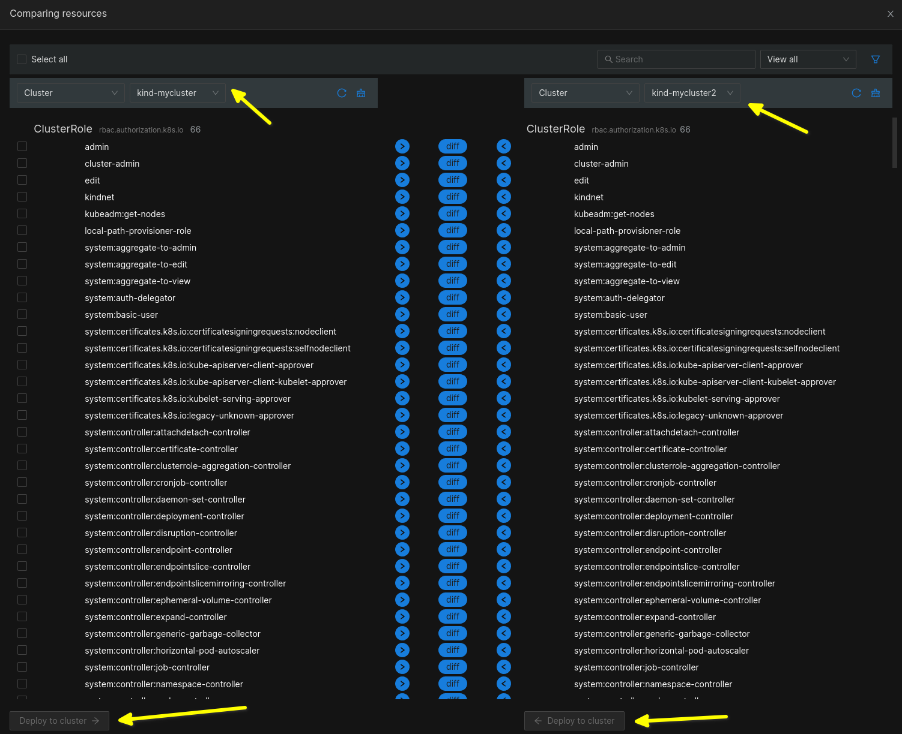

Daha önce deploy ettiğimiz guestbook uygulamamızı yeni oluşturduğumuz cluster'a deploy etmek için kaynakları seçiyoruz. 


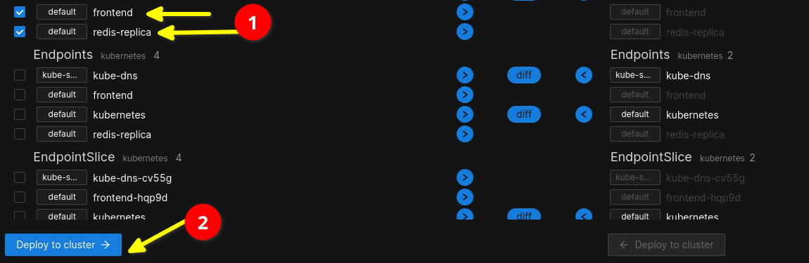

Kaynakları seçtiğimizde alttaki "Deploy to cluster" butonunun aktif olduğunu görebiliriz. Bu buton'a tıklıyoruz.

Kısa bir süre sonra ikinci cluster'da da uygulamalrı görebiliyoruz.

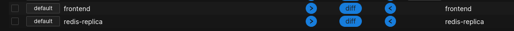

#### Git Yönetimi

Bunların haricinde dosyalar üzerinde yapmış olduğumuz değişikliklier de Git'e gönderebiliriz.

Bunun için soldaki menüden Git tab'ına geçiş yapıyoruz. Göndermek istediğimiz dosyaları seçiyoruz. Öncelikle "Stage selected" butonuna sonrasında da alttaki "Sync" butonuna tıklayarak değişiklikler gönderiyoruz.

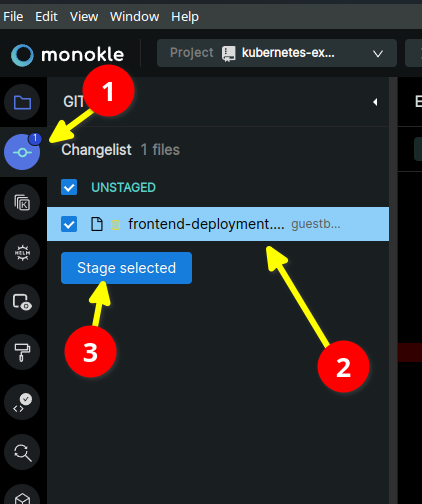


Şimdilik bu kadar. Amacımız Monokle'a bir giriş yapmak, arayüzünü ve yeteneklerini biraz keşfetmekti. Ancak Monokle bu kadar değil tabii ki. [Kustomize](https://kubeshop.github.io/monokle/kustomize/) ve [Helm](https://kubeshop.github.io/monokle/helm/) başlıklarını da okumanızı tavsiye ederim. Özellikle birden fazla cluster yönetiyorsanız ve kaynklarınızı Git üzerinde tutuyorsanız işini yeterince yapan bir araç.

Umarım faydalı olmuştur.

Diğer yazılarımızda görüşmek üzere.

