3 adet makinamız olacak


vagrant klasöründeki vagranfile çalıştırdıktan sonra kurumları yapıyoruz.

toplamda 3 makina var 

1. master1 : 10.200.10.41
2. worker1 : 10.200.10.51
3. worker2 : 10.200.10.52

### LAB Ortamını Kuruyoruz

Vagrant kurulumu [vagrant resmi sayfasını](https://www.vagrantup.com/downloads) ziyaret ediniz.


Host makinamızda ssh'ın kurulu olması gerekiyor. Linux dağıtımlarında Mac OS'da  kurulu geliyor ancak Windows için kurulum yapmak gekiyor.

- [Windows için kurulum](https://docs.microsoft.com/en-us/windows-server/administration/openssh/openssh_install_firstuse)
- [Ubuntu için kurulum](https://ubuntu.com/server/docs/service-openssh)
- [Centos için kurulum](https://linuxhint.com/enable_ssh_centos8/)

Daha sonra vagrant adında bir klasör oluşturup daha sonra içinde Vagrantfile adında bir dosya oluşturuyoruz.

Vagrantfile dosyasına alttaki kodları kopyalıyoruz.

```Vagrantfile
# -*- mode: ruby -*-
# vi: set ft=ruby :

MASTER_COUNT = 1
WORKER_COUNT  = 2


MASTER_IP_PREFIX  = "192.168.56.4"
WORKER_IP_PREFIX  = "192.168.56.5"

PROVIDER = "virtualbox"

ENV['VAGRANT_DEFAULT_PROVIDER'] = PROVIDER
# https://github.com/vagrant-libvirt/vagrant-libvirt
#ENV['VAGRANT_DEFAULT_PROVIDER'] = 'libvirt'


ENV['VAGRANT_NO_PARALLEL'] = 'yes'

$allscript = <<-ALLSCRIPT
  
MASTER_COUNT=$1
WORKER_COUNT=$2
MASTER_IP_PREFIX=$3
WORKER_IP_PREFIX=$4
   
echo $MASTER_COUNT
echo $WORKER_COUNT
echo $MASTER_IP_PREFIX
echo $WORKER_IP_PREFIX

echo "====================================================== root user aktif ediliyor ====================="
   
sudo su
   
echo -e "rkeadmin\nrkeadmin" | passwd root
echo "export TERM=xterm" | tee -a /etc/bash.bashrc
   
echo "====================================================== swap iptal ediliyor =========================="
   
sed -i "/swap/d" /etc/fstab
swapoff -a
systemctl disable --now ufw
   
echo "======================== kubernetes network için sysctl update ediliyor ============================="
   
modprobe overlay
modprobe br_netfilter
   
cat <<EOF | sudo tee -a /etc/sysctl.d/kubernetes.conf
net.bridge.bridge-nf-call-ip6tables = 1
net.bridge.bridge-nf-call-iptables  = 1
net.ipv4.ip_forward                 = 1
EOF
sysctl --system
   
echo "====================================================== ssh ayarları yapılıyor======================"
   
sed -i "s/#PasswordAuthentication yes/PasswordAuthentication yes/" /etc/ssh/sshd_config
echo "PermitRootLogin yes" | sudo tee -a /etc/ssh/sshd_config
   
systemctl reload sshd
   
echo "====================================================== host dosyaları düzenleniyor ==================="
for i in $(seq 1 $MASTER_COUNT); do
   echo "$MASTER_IP_PREFIX_VAR$i master$i" >>/etc/hosts
done
   
for i in $(seq 1 $WORKER_COUNT); do
   echo "$WORKER_IP_PREFIX$i worker$i" >>/etc/hosts
done
   

echo "====================================================== docker kuruluyor =================================="
   
curl -fsSL https://download.docker.com/linux/ubuntu/gpg | sudo gpg --dearmor -o /usr/share/keyrings/docker-archive-keyring.gpg
   
echo \
   "deb [arch=amd64 signed-by=/usr/share/keyrings/docker-archive-keyring.gpg] https://download.docker.com/linux/ubuntu \
   $(lsb_release -cs) stable" | sudo tee /etc/apt/sources.list.d/docker.list >/dev/null
   
apt update
   
apt-get install -y docker-ce docker-ce-cli containerd.io
   
groupadd docker
   
gpasswd -a $USER docker
   
usermod -aG docker $USER
   
chmod 666 /var/run/docker.sock
   
systemctl enable docker
   
systemctl restart docker

ALLSCRIPT


Vagrant.configure("2") do |config|

# master
(1..MASTER_COUNT).each do |i|

config.vm.define "master#{i}" do |master|
   master.vm.box = "generic/ubuntu2004"
   master.vm.network "private_network", ip: MASTER_IP_PREFIX+"#{i}"
   master.vm.hostname = "master#{i}"

   master.vm.provider :PROVIDER do |lv|
       lv.memory=2048
       lv.cpus=2
    end
 end
end


# worker
(1..WORKER_COUNT).each do |i|

config.vm.define "worker#{i}" do |worker|
   worker.vm.box = "generic/ubuntu2004"
   worker.vm.network "private_network", ip: WORKER_IP_PREFIX+"#{i}"
   worker.vm.hostname = "worker#{i}"
   

   worker.vm.provider :PROVIDER do |lv|
       lv.memory=2048
       lv.cpus=2
       lv.storage :file, :size => '10G'

   end
 end
end

# global olrak tWindows'da anımlanmış shell provision. Bütün vm lerde şalışacak 
config.vm.provision :shell, run: "once" do |s|
   s.args = [MASTER_COUNT,WORKER_COUNT, MASTER_IP_PREFIX,WORKER_IP_PREFIX] 
   s.inline = $allscript
end

end

```

Vagrant klasörünün olduğu dizinde iken terminalde alttaki komutla makinalarımızı ayağa kaldırıyoruz.

```bash
vagrant up
```
İlk makinanın indirilmesi biraz uzun sürebilir. Hepsi çalışmaya başladığında host makinamızda oluşturacağımız ssh key'i tüm makinalara kopyalıyoruz amacımız şifresiz giriş yapabilmek.

Linux ve Mac kullanıcıları  alttaki komutla kopyalama işlemini yapabilir.

```bash
MASTER_COUNT=1
WORKER_COUNT=2
MASTER_IP_PREFIX="192.168.56.4"
WORKER_IP_PREFIX="192.168.56.5"


ssh-keygen -t rsa -N "" -f ~/.ssh/rkekey

for i in $(seq 1 $MASTER_COUNT); do
    ssh-copy-id -i ~/.ssh/rkekey.pub -o StrictHostKeyChecking=no root@$MASTER_IP_PREFIX$i
    echo key kopyalandı: $MASTER_IP_PREFIX$i
done


for i in $(seq 1 $WORKER_COUNT); do
    ssh-copy-id -i ~/.ssh/rkekey.pub -o StrictHostKeyChecking=no root@$WORKER_IP_PREFIX$i
    echo key kopyalandı: $WORKER_IP_PREFIX$i
done

```

Windows için cmd üzeinden alttaki komutu çalıştınız. Kullanıcı adını değiştirmeyi unutmayınız.

```powershell
# komutu çalıştırdığınızda key'in adını rkekey olarak giriniz ve password'ü boş geçiniz
ssh-keygen

# kullanıcı adı kısmını değiştirmeyi unutmayınız
type C:\Users\kullanici_adiniz\.ssh\id_rsa.pub | ssh root@192.168.56.41 'cat >> .ssh/authorized_keys'
type C:\Users\kullanici_adiniz\.ssh\id_rsa.pub | ssh root@192.168.56.51 'cat >> .ssh/authorized_keys'
type C:\Users\kullanici_adiniz\.ssh\id_rsa.pub | ssh root@192.168.56.52 'cat >> .ssh/authorized_keys'
}

```

### RKE Kuruyoruz

[Rancher'ın sayfasından](https://rancher.com/docs/rke/latest/en/installation/) local makinamıza binary yi indiriyoruz.

Örnek konfigürasyon dosyaları için [resmi sayfaya](https://rancher.com/docs/rke/latest/en/example-yamls/) bakabilirsiniz.  


Host makinamızda rke adında bir klasör oluşturup rke binary'sini indiriyoruz. Linux ve Mac için alttaki komutları kullanabilirsiniz. Mac ve windows için [release sayfasından](https://github.com/rancher/rke/releases/tag/v1.3.6) işletim sisteminiz için doğru adresi alttaki komutta kullanınız. Windows için işlemler imanuel yapınız.


```bash

wget  https://github.com/rancher/rke/releases/download/v1.3.6/rke_linux-amd64

mv rke_linux-amd64 rke

chmod +x rke

# alttaki komut bize sorular sorarak örnek cluster.yaml dosyamızı oluşturacak.
./rke config --name cluster.yml
```
sorular ve vediğimiz cevaplar

```
[+] Cluster Level SSH Private Key Path [~/.ssh/id_rsa]: ~/.ssh/rkekey
[+] Number of Hosts [1]: 3
[+] SSH Address of host (1) [none]: 192.168.56.41
[+] SSH Port of host (1) [22]: 
[+] SSH Private Key Path of host (192.168.56.41) [none]: 
[-] You have entered empty SSH key path, trying fetch from SSH key parameter
[+] SSH Private Key of host (192.168.56.41) [none]: 
[-] You have entered empty SSH key, defaulting to cluster level SSH key: ~/.ssh/rkekey
[+] SSH User of host (192.168.56.41) [ubuntu]: root
[+] Is host (192.168.56.41) a Control Plane host (y/n)? [y]: 
[+] Is host (192.168.56.41) a Worker host (y/n)? [n]: n
[+] Is host (192.168.56.41) an etcd host (y/n)? [n]: y
[+] Override Hostname of host (192.168.56.41) [none]: master1
[+] Internal IP of host (192.168.56.41) [none]: 192.168.56.41
[+] Docker socket path on host (192.168.56.41) [/var/run/docker.sock]: 
[+] SSH Address of host (2) [none]: 192.168.56.51
[+] SSH Port of host (2) [22]: 
[+] SSH Private Key Path of host (192.168.56.51) [none]: 
[-] You have entered empty SSH key path, trying fetch from SSH key parameter
[+] SSH Private Key of host (192.168.56.51) [none]: 
[-] You have entered empty SSH key, defaulting to cluster level SSH key: ~/.ssh/rkekey
[+] SSH User of host (192.168.56.51) [ubuntu]: root
[+] Is host (192.168.56.51) a Control Plane host (y/n)? [y]: n
[+] Is host (192.168.56.51) a Worker host (y/n)? [n]: y
[+] Is host (192.168.56.51) an etcd host (y/n)? [n]: n
[+] Override Hostname of host (192.168.56.51) [none]: worker1
[+] Internal IP of host (192.168.56.51) [none]: 192.168.56.51
[+] Docker socket path on host (192.168.56.51) [/var/run/docker.sock]: 
[+] SSH Address of host (3) [none]: 192.168.56.52
[+] SSH Port of host (3) [22]: 
[+] SSH Private Key Path of host (192.168.56.52) [none]: 
[-] You have entered empty SSH key path, trying fetch from SSH key parameter
[+] SSH Private Key of host (192.168.56.52) [none]: 
[-] You have entered empty SSH key, defaulting to cluster level SSH key: ~/.ssh/rkekey
[+] SSH User of host (192.168.56.52) [ubuntu]: root
[+] Is host (192.168.56.52) a Control Plane host (y/n)? [y]: n
[+] Is host (192.168.56.52) a Worker host (y/n)? [n]: y
[+] Is host (192.168.56.52) an etcd host (y/n)? [n]: n
[+] Override Hostname of host (192.168.56.52) [none]: worker2
[+] Internal IP of host (192.168.56.52) [none]: 192.168.56.52
[+] Docker socket path on host (192.168.56.52) [/var/run/docker.sock]: 
[+] Network Plugin Type (flannel, calico, weave, canal, aci) [canal]: calico
[+] Authentication Strategy [x509]: 
[+] Authorization Mode (rbac, none) [rbac]: 
[+] Kubernetes Docker image [rancher/hyperkube:v1.21.8-rancher2]: 
[+] Cluster domain [cluster.local]: 
[+] Service Cluster IP Range [10.43.0.0/16]: 
[+] Enable PodSecurityPolicy [n]: 
[+] Cluster Network CIDR [10.42.0.0/16]: 
[+] Cluster DNS Service IP [10.43.0.10]: 
[+] Add addon manifest URLs or YAML files [no]: 
```

sonuçta bir cluster.yaml ve bir de admin config (kube_config_cluster.yml) dosyamız oluştu.


artık cluster'ımızı ayağa kaldırabiliriz.

```bash

rke up

```

Testlerimizi yapalım.
kube_config_cluster.yml dosyasını kubectl config dosyası olarak kullanacağız.


### Ekstra disk ekliyoruz

Öncelikle makinalarımızı kapatıyoruz. Çünkü vagrant ile makinalarımızı Vagrant ile ayağa kaldırdığımız için ve halen çalışıyor durumda oldukları için VirtualBox disk eklememize izin vermeyecektir.

vagrant klasöründeyken aşağıdaki komutu çalıştırıyoruz.

```bash
vagrant halt
```


Virtualbox üzerindeki vm listesini alıyoruz

``` bash
 
VBoxManage list vms

# sonuç

"vagrant-installation_master1_1643664669743_678" {e35e9c91-8c52-4c32-b840-a17caaafb82e}
"vagrant-installation_worker1_1643664750271_11503" {db5e7aeb-4cb6-4145-95b2-06fc13ff873a}
"vagrant-installation_worker2_1643664827019_17988" {d7d363f2-62e4-4021-81da-622a5748688a}
```

Worker node'lara disk attach edeceğiz. Bunun için 2 disk oluşturuyoruz.


```bash
VBoxManage createmedium disk --filename "./disk1.vdi" --size 10000 --format VDI --variant Fixed
VBoxManage createmedium disk --filename "./disk2.vdi" --size 10000 --format VDI --variant Fixed
```

daha sonra sata controller ekleyip disk attach ediyoruz.

```bash
# sata controller ekle
vboxmanage storagectl vagrant-installation_worker1_1643664750271_11503 --name "SATA Controller" --add sata --controller IntelAHCI --portcount 1 --bootable on
# sata controller a disj attacher et
VBoxManage storageattach vagrant-installation_worker1_1643664750271_11503 --storagectl "SATA Controller" --device 0 --port 0 --type hdd --medium "./disk1.vdi"

# sata controller ekle
vboxmanage storagectl vagrant-installation_worker2_1643664827019_17988 --name "SATA Controller" --add sata --controller IntelAHCI --portcount 1 --bootable on
# sata controller a disj attacher et
VBoxManage storageattach vagrant-installation_worker2_1643664827019_17988 --storagectl "SATA Controller" --device 0 --port 0 --type hdd --medium "./disk2.vdi"
```

makinalarımı tekrar çalıştırabiliriz.

```bash
vagrant up
```

makinalar açıldıktan sonra attach ettiğimiz diksleri mount edeceğiz. Mount etmeden önce format atmamız gerekiyor.


worker1 için makinaya ssh ile bağlandıktan sonra alttaki komutları çlaıştırıyoruz

```bash

ssh root@192.168.56.51 -i ~/.ssh/rkekey

mkdir /mnt/data

mkfs -t ext4 /dev/sdb


# diskimizin UUID'sini öğreniyporuz
blkid /dev/sdb

# /dev/sdb: UUID="e4daf767-18eb-4b94-a569-594a484b00ad" TYPE="ext4"

```
kalıcı mount için fstab dosyasını düzenleyeceğiz.


```bash
vim /etc/fstab

# alttaki satırı ekliyoruz. Ancak eklerken VAGRANT-BEGIN diye başlayan satırı üstüne ekleyiniz


UUID=e4daf767-18eb-4b94-a569-594a484b00ad  /mnt/data ext4  defaults  0  0


# hata varsa çalışmayacaktır
mount -a

df -h

```

worker2 için de aynı komutları çalıştırıyoruz.

daha sonra makinları restart ediyoruz.

```bash

vagrant reload

```


### Longhorn Kuruyoruz


Kaynak: [Longhorn](https://longhorn.io/docs/1.2.3/concepts/)


Kurulumu yaparken çıkan en son sürüm 1.2.3 versiyonuydu. Farklı kurulum yöntemleri var ancak biz bugün kubectl ile kurulum yapacağız. [Resmi  sayfasında](https://longhorn.io/docs/1.2.3/deploy/install/install-with-kubectl/)  kurulum dokümanıa erişebilirsiniz.


```bash
kubectl --kubeconfig kube_config_cluster.yml  apply -f https://raw.githubusercontent.com/longhorn/longhorn/v1.2.3/deploy/longhorn.yaml
```


kontrol edelim. 2-3 dk sürebilir tamamen kurulması.

```bash
kubectl --kubeconfig kube_config_cluster.yml get pods --namespace longhorn-system


# tamamen kurulduğunda aşağıdaki gibi bir sonuç görmeliyiz

NAME                                        READY   STATUS    RESTARTS   AGE
csi-attacher-5f46994f7-6fmmh                1/1     Running   0          7m7s
csi-attacher-5f46994f7-k9d65                1/1     Running   0          7m7s
csi-attacher-5f46994f7-ph97c                1/1     Running   0          7m7s
csi-provisioner-6ccbfbf86f-l9fp4            1/1     Running   0          7m7s
csi-provisioner-6ccbfbf86f-n4ksb            1/1     Running   0          7m7s
csi-provisioner-6ccbfbf86f-q6ftj            1/1     Running   0          7m7s
csi-resizer-6dd8bd4c97-d855d                1/1     Running   0          7m6s
csi-resizer-6dd8bd4c97-nlnv4                1/1     Running   0          7m6s
csi-resizer-6dd8bd4c97-tnlz8                1/1     Running   0          7m6s
csi-snapshotter-86f65d8bc-6t9gx             1/1     Running   0          7m6s
csi-snapshotter-86f65d8bc-p7tmz             1/1     Running   0          7m6s
csi-snapshotter-86f65d8bc-wmc54             1/1     Running   0          7m6s
engine-image-ei-fa2dfbf0-65fnn              1/1     Running   0          7m19s
engine-image-ei-fa2dfbf0-j7vqx              1/1     Running   0          7m19s
instance-manager-e-03f0a7a7                 1/1     Running   0          7m16s
instance-manager-e-7b546830                 1/1     Running   0          7m19s
instance-manager-r-1a43ec1c                 1/1     Running   0          7m19s
instance-manager-r-a5fc21fa                 1/1     Running   0          7m16s
longhorn-csi-plugin-5wpzr                   2/2     Running   0          7m6s
longhorn-csi-plugin-ls29s                   2/2     Running   0          7m6s
longhorn-driver-deployer-784546d78d-dzwnj   1/1     Running   0          8m1s
longhorn-manager-gg2vw                      1/1     Running   0          8m1s
longhorn-manager-v96xd                      1/1     Running   1          8m1s
longhorn-ui-9fdb94f9-hssvk                  1/1     Running   0          8m1s

```


Bir de pod dışında neler kurulmuş onları ineleyelim

```bash

kubectl --kubeconfig kube_config_cluster.yml get all --namespace longhorn-system


NAME                               TYPE        CLUSTER-IP      EXTERNAL-IP   PORT(S)     AGE
service/csi-attacher               ClusterIP   10.43.76.160    <none>        12345/TCP   9m52s
service/csi-provisioner            ClusterIP   10.43.34.194    <none>        12345/TCP   9m52s
service/csi-resizer                ClusterIP   10.43.43.125    <none>        12345/TCP   9m51s
service/csi-snapshotter            ClusterIP   10.43.215.4     <none>        12345/TCP   9m51s
service/longhorn-backend           ClusterIP   10.43.36.237    <none>        9500/TCP    10m
service/longhorn-engine-manager    ClusterIP   None            <none>        <none>      10m
service/longhorn-frontend          ClusterIP   10.43.178.210   <none>        80/TCP      10m
service/longhorn-replica-manager   ClusterIP   None            <none>        <none>      10m

NAME                                      DESIRED   CURRENT   READY   UP-TO-DATE   AVAILABLE   
daemonset.apps/engine-image-ei-fa2dfbf0   2         2         2       2            2  
daemonset.apps/longhorn-csi-plugin        2         2         2       2            2  
daemonset.apps/longhorn-manager           2         2         2       2            2  

NAME                                       READY   UP-TO-DATE   AVAILABLE   AGE
deployment.apps/csi-attacher               3/3     3            3           9m52s
deployment.apps/csi-provisioner            3/3     3            3           9m52s
deployment.apps/csi-resizer                3/3     3            3           9m51s
deployment.apps/csi-snapshotter            3/3     3            3           9m51s
deployment.apps/longhorn-driver-deployer   1/1     1            1           10m
deployment.apps/longhorn-ui                1/1     1            1           10m

NAME                                                  DESIRED   CURRENT   READY   AGE
replicaset.apps/csi-attacher-5f46994f7                3         3         3       9m52s
replicaset.apps/csi-provisioner-6ccbfbf86f            3         3         3       9m52s
replicaset.apps/csi-resizer-6dd8bd4c97                3         3         3       9m51s
replicaset.apps/csi-snapshotter-86f65d8bc             3         3         3       9m51s
replicaset.apps/longhorn-driver-deployer-784546d78d   1         1         1       10m
replicaset.apps/longhorn-ui-9fdb94f9                  1         1         1       10m

```
Dikkate edilirse servislerin içinde "service/longhorn-frontend" adında bir servis var. Portforward yaparak bu servisi locahost'dan inceleyelim.

```
kubectl --kubeconfig kube_config_cluster.yml --namespace longhorn-system port-forward service/longhorn-frontend 8080:80
```


host makinamızda http://localhost:8080 adresine gittiğimizde  longhorn arayüzünü görebiliriz. Şimdi servisi editleyip nortPort'a çevirelim.


```bash
kubectl --kubeconfig kube_config_cluster.yml --namespace longhorn-system patch svc longhorn-frontend --type='json' -p '[{"op":"replace","path":"/spec/type","value":"NodePort"},{"op":"replace","path":"/spec/ports/0/nodePort","value":31999}]'

```
Artık kalıcı olarak bir port başlamış olduk servisimize. Ancak artık localhost üzerinden değil worker node'lardan herhangi biri üzerinden bağlanamız gerekiyor. Örneğin http://192.168.56.51:31999 adresini tarayacıda çalıştırdığımızda dashboard'u görebiliriz.

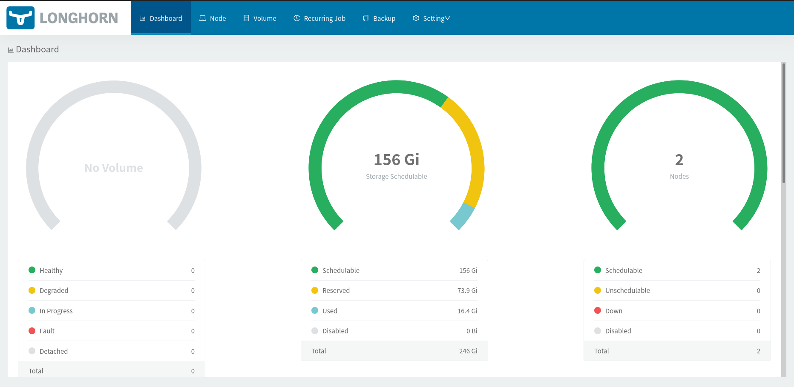

#### Yeni Disk Eklemek

Dashboard üzerinde üstteki Node tabına tıklayıp aşağıdaki resimde de görülen her node'un sağnda yer alan hamburger menüye (Edit Node and Disks) tıklıyoruz. Daha sonra açılan popup üzerinde "add disk" butonuna tıklıyoruz.

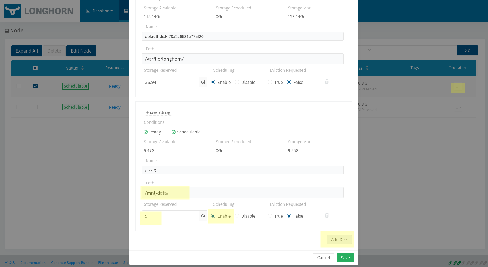

Makinalar üzerinde kalıcı olarak eklediğimiz diskin mount adresini ve ve diskin ne kadarının kullanılacağını yazıyoruz. Biz örneğimizde 5 Gb olarak allocate etmiş olduk. Longhorn bu ekelşdğimiz 2 Gb'lık alanı da havuza ekliyor. Toplam alandan da bize istediğimiz volume kadarını kullandırıyor. Yani volume oluştururken disk seçme gibi bir durumumz yok.

Yine istesek dashboard üzerinden volume de ekleyebiliriz. Bunun için üstteki menüden volmes tab'ına tıklıyoruz. Açılan sayfada sağ üztteki "Create Volume" butonuna tıklıyoruz.


**UYARI**: worker node sayımız 2 olduğu için replica sayısını da 2 girmeyi unutmayınız. Eğer uyumsuz olursa ilerşde hata alabilirsiniz. Bu nedenle üstteki menüde yer alan settings tabına tıklyarak default replica sayısını 2 olarak ayarlamak mantıklı olacaktır.

ReadWriteOnce olarka ayaraladığımıza dikkaet edin. Yani buraa oluşturduğumuz volume tek bir node'a bağlanabilecek. ReadWriteMany örneğini ileride yapıyor olacağız.


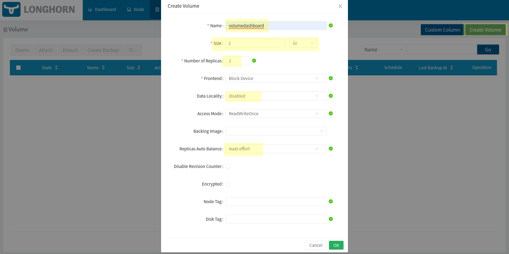

- [Data Locality](https://longhorn.io/docs/1.2.3/references/settings/#default-data-locality) : Mümkün olduğunca pod'un bulunduğu node üzerinden replikaları tutmaya çalışır.
- [Auto-balance-replicas](https://longhorn.io/docs/1.2.3/references/settings/#replica-auto-balance):  Yeni node eklendiğinde replikaları tekrar düzenler ve yeni node'lara da dağıtılıp dağıtılmayacağını ayarlar.


oluşturma işlemi bittikten sonra volme detaylarına gidecek olursak alttaki gibi bir ekran göreceğiz.

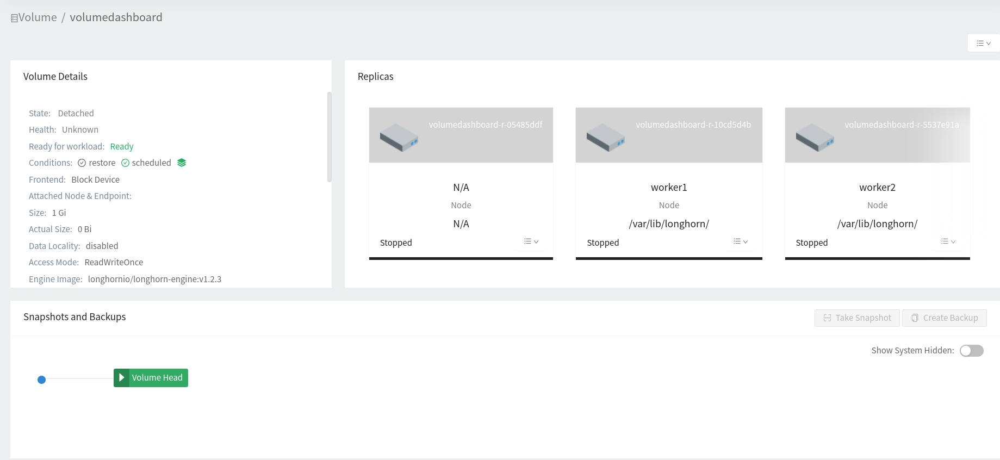

Volume kullanıktan sonra gelip bu ekarana tekrar bakacağız. Şimdi bir [PersistentVolumeClaim](https://kubernetes.io/docs/concepts/storage/persistent-volumes/#persistentvolumeclaims) oluşturalım.

PVC'yi de öncelikle dashboard üzerinden yapalım bunun için oluşturduğumuz volume'un hemen sağındaki hamburger menüden "create pvc" linkine tıklıyoruz. namespace kısmına default deyip kaydedebiliriz. Aşağıdaki gibi pv/pvc sütuynu artık Bound olarka görünecek.


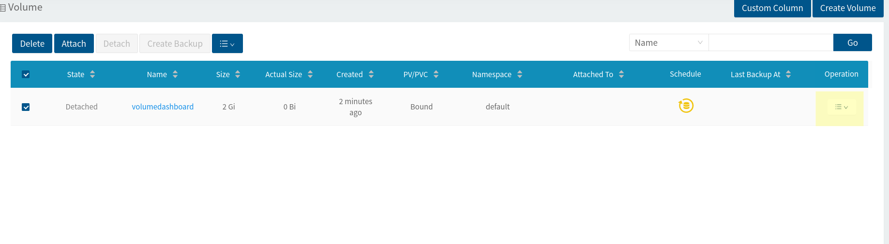


volume detaylarına bakacak olursak artık pvc adını atandığını görebiliriz.

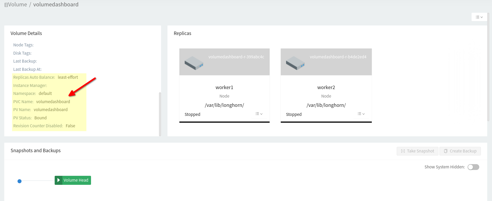


Şimdi bu eklediğimiz volume'u kullnacak bir uygulama ayağa kaldıralım.


```bash
cat <<EOF | kubectl --kubeconfig kube_config_cluster.yml apply -f -
apiVersion: v1
kind: Pod
metadata:
  name: mypod
spec:
  containers:
    - name: myfrontend
      image: nginx
      volumeMounts:
      - mountPath: "/var/www/html"
        name: mypd
  volumes:
    - name: mypd
      persistentVolumeClaim:
        claimName: volumedashboard
EOF
```

daha sonra pod'un özelliklerini incelyeccek olursak volumedashboard pvc'nin kullanıldığını görebiliriz.


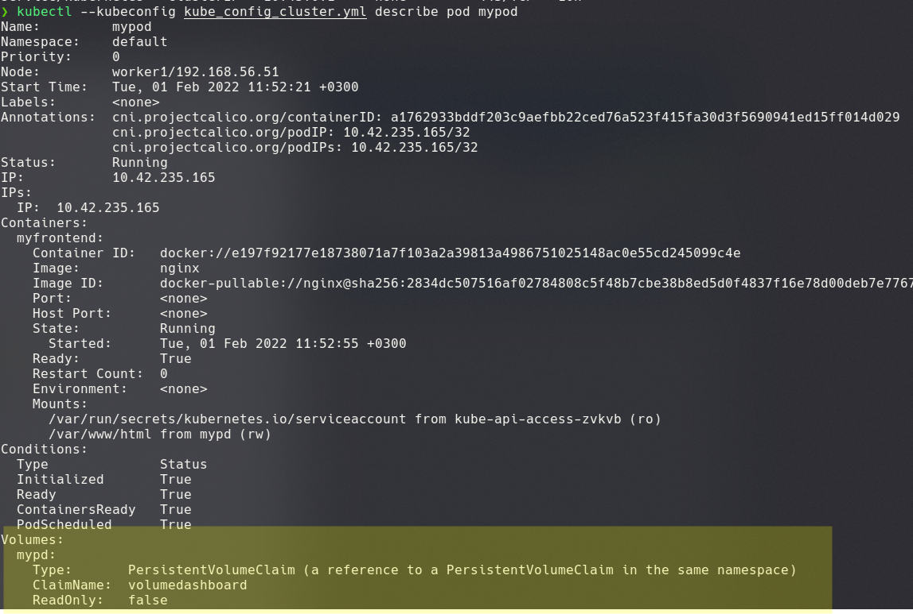


Ayrıca dashboard'dan da bakacak olursak sağlıklı bir şekilde mypod adlı pod'a bağlandığını görebiliriz.

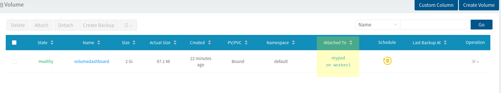


ikinci bir pod daha ekleyelim.


```bash
cat <<EOF | kubectl --kubeconfig kube_config_cluster.yml apply -f -
apiVersion: v1
kind: Pod
metadata:
  name: mypod2
spec:
  containers:
    - name: myfrontend2
      image: nginx
      volumeMounts:
      - mountPath: "/var/www/html"
        name: mypd2
  volumes:
    - name: mypd2
      persistentVolumeClaim:
        claimName: volumedashboard
EOF
```

pvc detaylarını inceleyelim. 2 pod tarafından kullanıldığını görebiliriz.


```bash

kubectl --kubeconfig kube_config_cluster.yml describe pvc volumedashboard

# sonuç

Name:          volumedashboard
Namespace:     default
StorageClass:  longhorn-static
Status:        Bound
Volume:        volumedashboard
Labels:        <none>
Annotations:   pv.kubernetes.io/bind-completed: yes
Finalizers:    [kubernetes.io/pvc-protection]
Capacity:      2Gi
Access Modes:  RWO
VolumeMode:    Filesystem
Used By:       mypod
               mypod2
Events:        <none>
```


### Backup / Restore

Öncelikle pod'lardan birinin /var/www/html dizinine gidip bir dosya oluşturalım

```bash

kubectl --kubeconfig kube_config_cluster.yml exec -it mypod -- bash

# pod'giriş yaptıktan sonra alttaki komutlarla dosya oluşturuyoruz.

echo test > /var/www/html/test.txt

exit

```

daha sonra volume  detaylarında yer alan "take snaphot" butonuna tıklyarak backup alıyoruz.

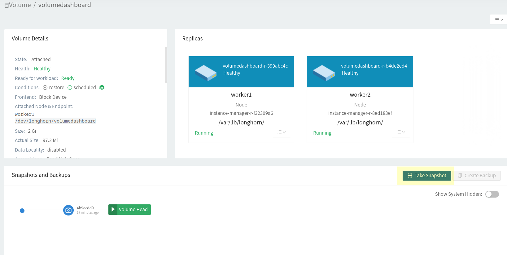

daha önce bir backup aldığım için ben de ikincisi oluştu.


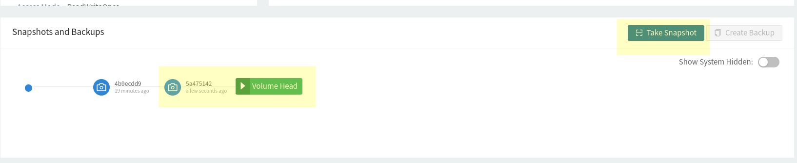


şimdi oluşturduğumuz dosyayı silelim.

```bash

kubectl --kubeconfig kube_config_cluster.yml exec -it mypod -- bash

# pod'giriş yaptıktan sonra alttaki komutlarla dosya oluşturuyoruz.

rm -rf /var/www/html/test.txt

ls /var/www/html/
# sonuçta dosya silnmiş oldu

exit

```

test edebimek için öncelikle pod'u silmemiz gerekiyor. Zaten restore ettiğimizde önceki pod'u kullnamıyor olacağız. Tabi bu durumda bizde 2 pod olduğu için ikisini de silmemiz gerekiyor.

```bash

kubectl --kubeconfig kube_config_cluster.yml delete pod mypod --force
kubectl --kubeconfig kube_config_cluster.yml delete pod mypod2 --force

kubectl --kubeconfig kube_config_cluster.yml get all

# 2 pod da silnmiş olmalı

```
Artık volume detached durumuna geri dönmüş oldu.

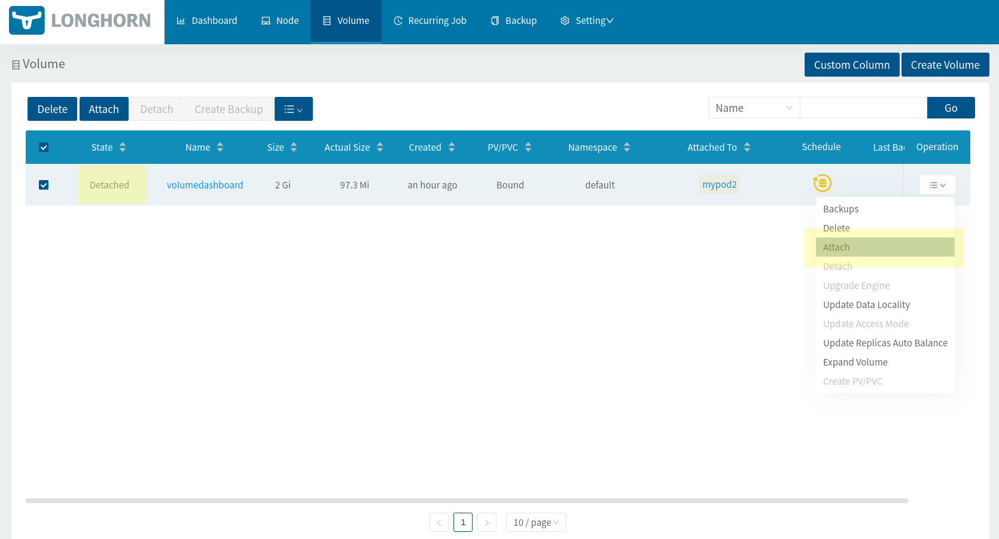


Attach butonuna tıklayıp daha önce worker2 üzerinde oluşturulmuş olan volume'ü bu sefer worker2 node'u üzerinde oluşturmayı deneyelim. Maintenance modu seçip OK butonuna tıklıyoruz.

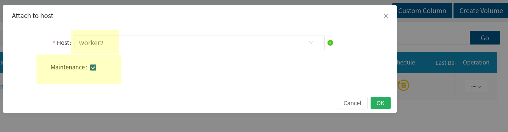


Attache olduğunda volume özelliklerinde oluşturduğumuz snapshot'a tıkladığımızda Revert butonu aktif olmuş olduğunu görebiliriz. Buna tıklayabiliriz artık.

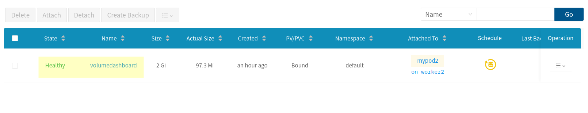

Daha sonra volume'ü yeni podlarımıza bğlamyabilmek için tekrar detach etmemiz gerekiyor.

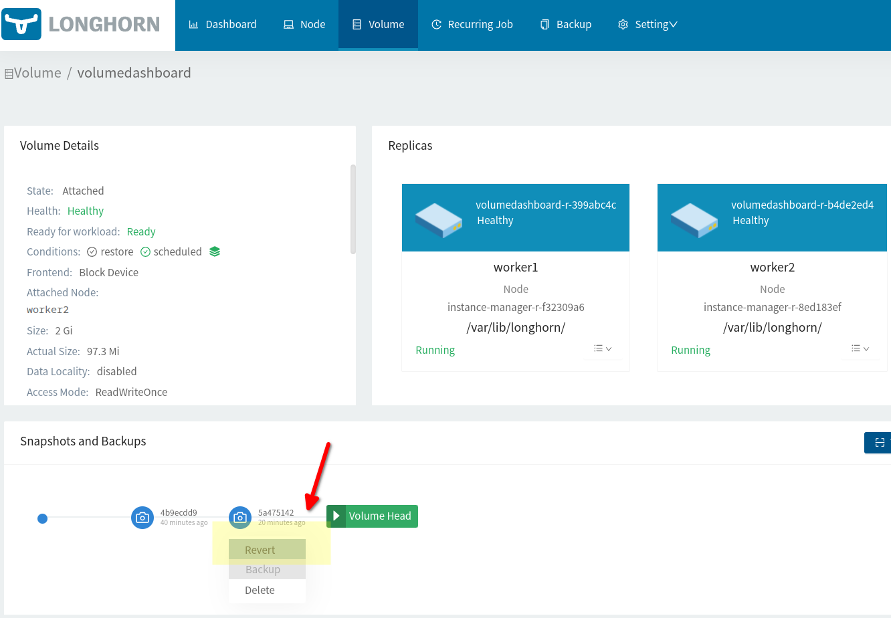


artık ilk podumuzu tekrar ayağa kaldırabiliriz.


```bash
cat <<EOF | kubectl --kubeconfig kube_config_cluster.yml apply -f -
apiVersion: v1
kind: Pod
metadata:
  name: mypod
spec:
  containers:
    - name: myfrontend
      image: nginx
      volumeMounts:
      - mountPath: "/var/www/html"
        name: mypd
  volumes:
    - name: mypd
      persistentVolumeClaim:
        claimName: volumedashboard
EOF
```

dosyamızın geri gelip gelmediğini test edelim.

```bash
kubectl --kubeconfig kube_config_cluster.yml exec -it mypod -- bash

# poda giriş yaptıran sonra dosys listesini alıyoruz.

ls /var/www/html/

# sonuçta test.txt dosyaının geri geldiğini göebiliriz.


```


Düzenli snapshot almak için volume özelliklerinden scheduled job tanımlayabilirsiniz.


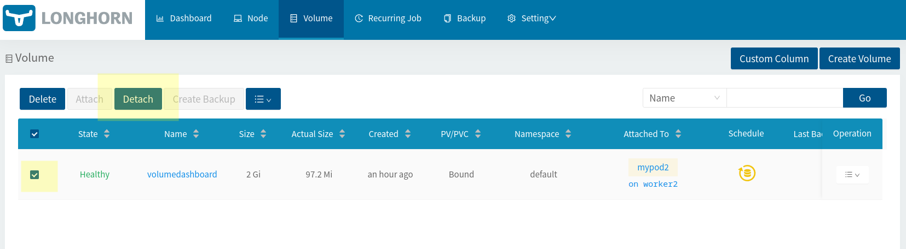


#### ReadWriteMany Volume Oluşturmak


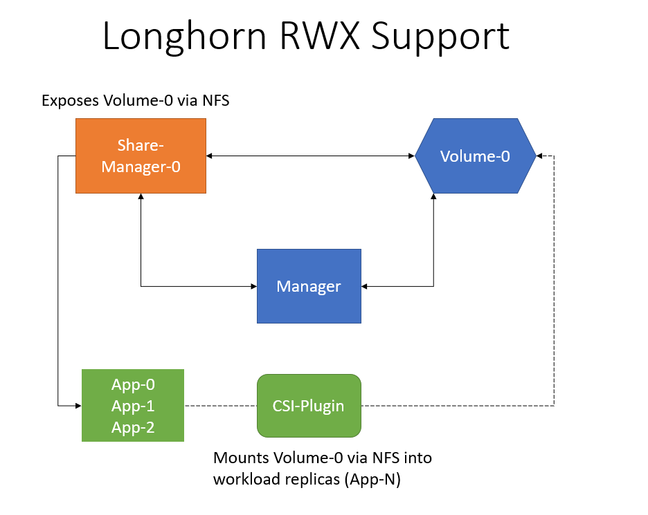


Şimdi aynı işlemleri kubectl ile yapalım. Ancakbu örneğimizde access mode'u **[ReadWriteMany](https://longhorn.io/docs/1.2.3/advanced-resources/rwx-workloads/)** olarak kullanalım.

Ancak **[ReadWriteMany](https://longhorn.io/docs/1.2.3/advanced-resources/rwx-workloads/)** için worker node'larımıza nfs client kurmamız gerekiyor. Bunun için worker node'larımı ssh ile bağlanıp nfs-common paketini kuruyoruz.

```bash

# worker1 için
ssh root@192.168.56.51 -i ~/.ssh/rkekey
# bağlandıktan sonra alttaki komutla kuruyoruz
apt install nfs-common


#worker2 için
ssh root@192.168.56.52 -i ~/.ssh/rkekey
apt install nfs-common


```

Öncelikle storage class oluturmamız gerekiyor. Bi bu örneğimizde oluşturmayacağız çünkü zaten bir tane var ve o da default olan zaten. İlk Longhorn'u kurduğumuzda oluşlturulmuştu. Ancak başka bir tane oluşturmak isteseniz [resmi dokümanı](https://longhorn.io/docs/1.2.3/volumes-and-nodes/create-volumes/#creating-longhorn-volumes-with-kubectl) takip edebilirsiniz.

```bash

kubectl --kubeconfig kube_config_cluster.yml get sc

NAME       PROVISIONER          RECLAIMPOLICY   VOLUMEBINDINGMODE   ALLOWVOLUMEEXPANSION   AGE
longhorn   driver.longhorn.io   Delete          Immediate           true                   13h

```

Bu storage class üzeriden [PVC](https://kubernetes.io/docs/concepts/storage/persistent-volumes/#persistentvolumeclaims) oluşturuyoruz. Ancak

```bash

cat <<EOF | kubectl --kubeconfig kube_config_cluster.yml apply -f -
apiVersion: v1
kind: PersistentVolumeClaim
metadata:
  name: myclaimmany
spec:
  accessModes:
    - ReadWriteMany
  resources:
    requests:
      storage: 1Gi
  storageClassName: longhorn
EOF

```


kontrol edelim. Access Mode sütununa dikket ediniz. son oluşturduğumuzda (myclaimmany) RWX

```bash
kubectl --kubeconfig kube_config_cluster.yml get pvc -o wide

NAME              STATUS   VOLUME                                     CAPACITY   ACCESS MODES   STORAGECLASS      AGE     VOLUMEMODE
myclaimmany       Bound    pvc-f5731e65-4005-4ee6-96b6-c346ad309d80   1Gi        RWX            longhorn          64s     Filesystem
volumedashboard   Bound    volumedashboard                            2Gi        RWO            longhorn-static   5h55m   Filesystem


kubectl --kubeconfig kube_config_cluster.yml get volume -A

NAMESPACE         NAME                                       STATE      ROBUSTNESS   SCHEDULED   SIZE         NODE      AGE
longhorn-system   pvc-f5731e65-4005-4ee6-96b6-c346ad309d80   attached   degraded     False       1073741824   worker2   118s
longhorn-system   volumedashboard                            attached   healthy      True        2147483648   worker1   5h57m


```
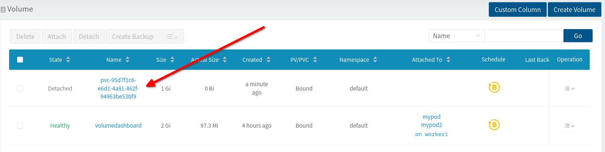


şimdi bir deployment oluşturalım


```bash

cat <<EOF | kubectl --kubeconfig kube_config_cluster.yml apply -f -
apiVersion: apps/v1
kind: Deployment
metadata:
  name: nginx-deployment
  labels:
    app: myapp
spec:
  replicas: 2
  selector:
    matchLabels:
      app: myapp
  template:
    metadata:
      labels:
        app: myapp
    spec:
      containers:
        - name: nginx
          image: nginx:1.14.2
          volumeMounts:
          - mountPath: "/var/www/html"
            name: mypd
          ports:
          - containerPort: 80

      volumes:
        - name: mypd
          persistentVolumeClaim:
            claimName: myclaimmany
EOF


```

deployment ve pod'larımızın durumuna bakalım. depleyment (nginx-deployment-cf4dc9684) ile ilişkili iki adet pod'un çalışıyor olduğunu görebiliriz.

```bash
kubectl --kubeconfig kube_config_cluster.yml get all
NAME                                   READY   STATUS    RESTARTS   AGE
pod/mypod                              1/1     Running   0          4h39m
pod/mypod2                             1/1     Running   0          3h47m
pod/nginx-deployment-cf4dc9684-bt56b   1/1     Running   0          2m13s
pod/nginx-deployment-cf4dc9684-vlf8c   1/1     Running   0          2m13s

NAME                 TYPE        CLUSTER-IP   EXTERNAL-IP   PORT(S)   AGE
service/kubernetes   ClusterIP   10.43.0.1    <none>        443/TCP   16h

NAME                               READY   UP-TO-DATE   AVAILABLE   AGE
deployment.apps/nginx-deployment   2/2     2            2           2m13s

NAME                                         DESIRED   CURRENT   READY   AGE
replicaset.apps/nginx-deployment-cf4dc9684   2         2         2       2m13s
```

Şimdi isterseniz pod'lardan birine bir dosya koyup diğerinden erişilip erişilmemediğine bakalım.


```bash

kubectl --kubeconfig kube_config_cluster.yml exec -it nginx-deployment-cf4dc9684-bt56b -- bash

# başlandıkran sonra doyayı oluşturuyoruz
echo test > /var/www/html/test.txt

exit

# diğer pod'a bağlanıyoruz

kubectl --kubeconfig kube_config_cluster.yml exec -it nginx-deployment-cf4dc9684-vlf8c -- bash

ls /var/www/html/

# sonuçta test.txt dsyasını görebiliyor olmamız gerekiyor.

```


Şimdilik bu kadar. daha fazla ne var derseniz resmi dokümanlarında detaylı oalrak anlatılmış olan [monitoring](https://longhorn.io/docs/1.2.3/monitoring/) başlığına göz atmanızı tavsiye ederim.


