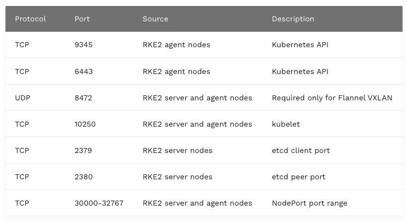

### Lab Ortamı Kurulumu


```vagrantfile

# -*- mode: ruby -*-
# vi: set ft=ruby :


# 1-9 arası rakam giriniz
MASTER_COUNT = 3
WORKER_COUNT  = 3


MASTER_IP_PREFIX  = "192.168.56.4"
WORKER_IP_PREFIX  = "192.168.56.5"

PROVIDER = "virtualbox"

BASTION_IP = "192.168.56.31"

ROOT_PASS = "rkeadmin"


ENV['VAGRANT_DEFAULT_PROVIDER'] = PROVIDER

$allscript = <<-ALLSCRIPT
  
MASTER_COUNT=$1
WORKER_COUNT=$2
MASTER_IP_PREFIX=$3
WORKER_IP_PREFIX=$4
BASTION_IP=$5
ROOT_PASS=$6

   
echo master count : $MASTER_COUNT
echo worker count : $WORKER_COUNT
echo master ip prefix : $MASTER_IP_PREFIX
echo master worker prefix : $WORKER_IP_PREFIX
echo bastion ip : $BASTION_IP
echo root pass : $ROOT_PASS

sudo apt update && sudo apt upgrade -y

echo "===================== root user aktif ediliyor ====================="
   
sudo su


  
echo -e "$ROOT_PASS\n$ROOT_PASS" | passwd root
echo "export TERM=xterm" | tee -a /etc/bash.bashrc
   
echo "===================== swap iptal ediliyor =========================="
   
sed -i "/swap/d" /etc/fstab
swapoff -a
systemctl disable --now ufw
   
echo "=================== kubernetes network için sysctl update ediliyor =============="
   
modprobe overlay
modprobe br_netfilter
   
cat <<EOF | sudo tee -a /etc/sysctl.d/kubernetes.conf
net.bridge.bridge-nf-call-ip6tables = 1
net.bridge.bridge-nf-call-iptables  = 1
net.ipv4.ip_forward                 = 1
EOF
sysctl --system
   
echo "============= ssh ayarları yapılıyor ============="
   
sed -i "s/#PasswordAuthentication yes/PasswordAuthentication yes/" /etc/ssh/sshd_config
echo "PermitRootLogin yes" | sudo tee -a /etc/ssh/sshd_config
   
systemctl reload sshd
   
echo "===================== host dosyaları düzenleniyor ==================="
for i in $(seq 1 $MASTER_COUNT); do
   echo "$MASTER_IP_PREFIX$i master$i" >>/etc/hosts
done
   
for i in $(seq 1 $WORKER_COUNT); do
   echo "$WORKER_IP_PREFIX$i worker$i" >>/etc/hosts
done

echo "$BASTION_IP bastion" >>/etc/hosts
echo "$BASTION_IP rke.kubernetes.local" >>/etc/hosts

   
ALLSCRIPT


$bastionscript = <<-BASTION

MASTER_COUNT=$1
WORKER_COUNT=$2
MASTER_IP_PREFIX=$3
WORKER_IP_PREFIX=$4
BASTION_IP=$5
ROOT_PASS=$6

   
echo master count : $MASTER_COUNT
echo worker count : $WORKER_COUNT
echo master ip prefix : $MASTER_IP_PREFIX
echo master worker prefix : $WORKER_IP_PREFIX
echo bastion ip : $BASTION_IP
echo root pass : $ROOT_PASS


sudo apt install sshpass -y

sudo su

ssh-keygen -t rsa -N "" -f ~/.ssh/id_rsa

for i in $(seq 1 $MASTER_COUNT); do
    sshpass -p $ROOT_PASS ssh-copy-id -i ~/.ssh/id_rsa.pub -o StrictHostKeyChecking=no root@$MASTER_IP_PREFIX$i
    echo "yes \n" | scp ~/.ssh/id_rsa root@$MASTER_IP_PREFIX$i:.ssh/
    echo key kopyalandı: $MASTER_IP_PREFIX$i
done


for i in $(seq 1 $WORKER_COUNT); do
    sshpass -p $ROOT_PASS ssh-copy-id -i ~/.ssh/id_rsa.pub -o StrictHostKeyChecking=no root@$WORKER_IP_PREFIX$i
    echo "yes \n" | scp ~/.ssh/id_rsa root@$WORKER_IP_PREFIX$i:.ssh/
    echo key kopyalandı: $WORKER_IP_PREFIX$i
done

BASTION


Vagrant.configure("2") do |config|

# master
(1..MASTER_COUNT).each do |i|

config.vm.define "master#{i}" do |master|
   master.vm.box = "generic/ubuntu2004"
   master.vm.network "private_network", ip: MASTER_IP_PREFIX+"#{i}"
   master.vm.hostname = "master#{i}"

   master.vm.provider :PROVIDER do |lv|
       lv.memory=2048
       lv.cpus=2
    end
 end
end


# worker
(1..WORKER_COUNT).each do |i|

config.vm.define "worker#{i}" do |worker|
   worker.vm.box = "generic/ubuntu2004"
   worker.vm.network "private_network", ip: WORKER_IP_PREFIX+"#{i}"
   worker.vm.hostname = "worker#{i}"
   

   worker.vm.provider :PROVIDER do |lv|
       lv.memory=2048
       lv.cpus=2
       lv.storage :file, :size => '10G'

   end
 end
end


# bastion
config.vm.define "bastion" do |bastion|
   bastion.vm.box = "generic/ubuntu2004"
   bastion.vm.network "private_network", ip: BASTION_IP
   bastion.vm.hostname = "bastion"

   bastion.vm.provider :PROVIDER do |lv|
       lv.memory=2048
       lv.cpus=2
    end

   bastion.vm.provision "shell", run: "once", inline: $bastionscript, args: [MASTER_COUNT,WORKER_COUNT, MASTER_IP_PREFIX,WORKER_IP_PREFIX, BASTION_IP, ROOT_PASS]
 end


# global olarak tanımlanmış shell provision. Bütün vm lerde çalışacak 
config.vm.provision :shell, run: "once" do |s|
   s.args = [MASTER_COUNT,WORKER_COUNT, MASTER_IP_PREFIX,WORKER_IP_PREFIX, BASTION_IP, ROOT_PASS] 
   s.inline = $allscript
end

end
```


### Nginx External Load Balancer Kurulumu

Bütün kurum işlemlerimizi bastion sunucumuzda yapacağız.Bu sunucu aynı zamanda load balancer görevi de görecek. Bunun için Nginx kuracağız. Bastion sunucuna giriş yaptıktan sonra root kullanıcısına geçiş yapıyoruz ve kuruluma başlıyoruz.

Servislerin kullandığı portlar.




```shell
sudo su
# apt update && apt upgrade -y
apt install nginx

mv /etc/nginx/nginx.conf /etc/nginx/nginx.conf.bak

cat << EOF > /etc/nginx/nginx.conf

worker_processes 4;
worker_rlimit_nofile 40000;


#stream kullanabilmek için dinamik mobullerde strem modülünü yüklüyoruz
include /usr/share/nginx/modules/*.conf;
load_module /usr/lib/nginx/modules/ngx_stream_module.so;


events {
   worker_connections 8192;
}


# stream modülünü yüklediğimiz için kullanabiliyoruz.
stream {

   upstream master_backend {
         least_conn;
         server master1:9345 max_fails=3 fail_timeout=5s;
         server master1:9345 max_fails=3 fail_timeout=5s;
         server master1:9345 max_fails=3 fail_timeout=5s;
      }

   server {
         listen 9345;
         proxy_pass master_backend;
      }


   upstream kube_api {
         least_conn;
         server master1:6443 max_fails=3 fail_timeout=5s;
         server master2:6443 max_fails=3 fail_timeout=5s;
         server master3:6443 max_fails=3 fail_timeout=5s;
      }
   server {
         listen     6443;
         proxy_pass kube_api;
      }


   upstream rancher_web {
         least_conn;
         server master1:80 max_fails=3 fail_timeout=5s;
         server master1:80 max_fails=3 fail_timeout=5s;
         server master1:80 max_fails=3 fail_timeout=5s;
      }
   server {
         listen     80;
         proxy_pass rancher_web;
      }


   upstream rancher_web_https {
         least_conn;
         server master1:443 max_fails=3 fail_timeout=5s;
         server master1:443 max_fails=3 fail_timeout=5s;
         server master1:443 max_fails=3 fail_timeout=5s;
      }
   server {
         listen     443;
         proxy_pass rancher_web_https;
      }

}

EOF


systemctl status nginx


```
### RKE2 Server Kurulumu

RKE 2  dokümanlarına baktığımızda server kavramı Kubernetes Master node'larını ifade ederken, agent kavramı ise Kubernetes worker node'larını ifade eder.

Öncelikle master ve worker node'lardan birer tane kurup daha sonra diğer node'ları ekleyeceğiz. 

Halen bastion sunucusunda root kullanıcısında iken master1 node'una geçiyoruz ve server kurulum script'ini çalıştırıyoruz.


[Kaynak](https://docs.rke2.io/install/configuration)

Bilerek eski bir versiyonu kurup daha sonra upgrade edeceğiz.

Versiyonları [resmi Github](https://github.com/rancher/rke2/releases) sayfasından takip edebilirsiniz.

Server konfigürasyon referansları için [şu sayfayı](https://docs.rke2.io/reference/server_config) ziyaret ediniz.

```shell

ssh root@master1

curl -sfL https://get.rke2.io --output install.sh
chmod +x install.sh
INSTALL_RKE2_CHANNEL="stable" INSTALL_RKE2_TYPE="server" INSTALL_RKE2_VERSION="v1.22.4+rke2r2" sh install.sh

mkdir -p /etc/rancher/rke2

cat << EOF > /etc/rancher/rke2/config.yaml
write-kubeconfig-mode: "0644"
tls-san:
  - rke.kubernetes.local
  - 192.168.56.31
cni: "calico"
cluster-domain: "rke.kubernetes.local"
node-ip: "192.168.56.41"
EOF

# once enable sonra start bu şekilde

systemctl enable rke2-server

systemctl start rke2-server


```
kubectl aracını "/var/lib/rancher/rke2/bin" dizininde bulabiliriz. Ayrıca RKE 2'i tamamen sistemden kaldırmak için "/usr/local/bin" dizinindeki "rke2-killall.sh" ve "rke2-uninstall.sh" script'lerini kullnabiliriz.

```shell
export PATH=$PATH:/var/lib/rancher/rke2/bin

export KUBECONFIG=/etc/rancher/rke2/rke2.yaml

source ~/.bashrc
```

logları takip etmek için alttaki komutu kullnabilirsiniz

```bash
journalctl -u rke2-server -f
```

Test ettiğimizde master1 node'unun geldiğini görebiliriz. Version numaramız da v1.22.4 olarak görünüyor. 

```shell
kubectl get nodes -owide
NAME      STATUS   ROLES                       AGE    VERSION          INTERNAL-IP     EXTERNAL-IP   OS-IMAGE             KERNEL-VERSION      CONTAINER-RUNTIME
master1   Ready    control-plane,etcd,master   112s   v1.22.4+rke2r2   192.168.56.41   <none>        Ubuntu 20.04.5 LTS   5.4.0-132-generic   containerd://1.5.8-k3s1


```

Diğer master ve worker node'ları ekleyebilmemiz için node-token bilgisine ihtiyacımız olacak.

```shell
cat /var/lib/rancher/rke2/server/node-token
# alttaki gibi bir token görmeniz gerekiyor

K1033e47d23de84c5fc84e596090feac30fca35c2a31d89b609ace433720bcc3692::server:47ae5521c9ba374917118eefb9f66c50
```

### RKE2 Agent Kurulumu

RKE 2 kurulumunda yukarı da da bahsettiğimiz gibi agent kavramı Kubernetes'deki worker node anlamına geliyor.


Bastion sunucumuzda root kullanıcısında iken worker1 node'una root olarak ssh yapıyoruz. Ardından kuruluma geçiyoruz.

```shell

ssh root@worker1

curl -sfL https://get.rke2.io --output install.sh
chmod +x install.sh
INSTALL_RKE2_CHANNEL="stable" INSTALL_RKE2_VERSION="v1.22.4+rke2r2" INSTALL_RKE2_TYPE="agent" sh install.sh

mkdir -p /etc/rancher/rke2

cat << EOF > /etc/rancher/rke2/config.yaml
server: https://rke.kubernetes.local:9345
token: K1033e47d23de84c5fc84e596090feac30fca35c2a31d89b609ace433720bcc3692::server:47ae5521c9ba374917118eefb9f66c50
node-ip: "192.168.56.51"
EOF

systemctl enable rke2-agent

systemctl start rke2-agent
```

logları takip etmek için alttaki komutu kullnabilirsiniz

```bash
journalctl -u rke2-agent -f
```


olurda hata alırsanız ve işlemleri baştan almak isteseniz "/usr/local/bin" dizinindeki "rke2-killall.sh" ve "rke2-uninstall.sh" script'lerini kullanabiliriz. Ancak eğer worker node kubernetes'e kaydedildiyse yani node listesinde görebiliyorsanız o zaman Kubernetes tarafında da silmeniz gerekiyor. 

```shell
kubectl delete node worker1
```

### Diğer Server ve Agent Kurulumları

Bundan sonra kuracağımız bütün server ve agent kurulumlarını, üstte yaptığımı agent kurulumu ile aynı şekilde yapıyoruz. Sadece konfigürasyon dosyasında farklılık olacak.


- **Server için kurulum script'i**

Node ip adresini değiştirmeyi unutmayın. İlk kurduğumuz server'dan farklı olarak  token ekledik.


```shell
ssh root@master2

curl -sfL https://get.rke2.io --output install.sh
chmod +x install.sh
INSTALL_RKE2_CHANNEL="stable" INSTALL_RKE2_TYPE="server" INSTALL_RKE2_VERSION="v1.22.4+rke2r2" sh install.sh

mkdir -p /etc/rancher/rke2

cat << EOF > /etc/rancher/rke2/config.yaml
server: https://rke.kubernetes.local:9345
tls-san:
  - rke.kubernetes.local
  - 192.168.56.31
token: K1033e47d23de84c5fc84e596090feac30fca35c2a31d89b609ace433720bcc3692::server:47ae5521c9ba374917118eefb9f66c50
cni: "calico"
cluster-domain: "rke.kubernetes.local"
node-ip: "192.168.56.42"
EOF

# once enable sonra start bu şekilde

systemctl enable rke2-server

systemctl start rke2-server

```
- **Agent için kurulum script'i**

```shell
ssh root@worker2

curl -sfL https://get.rke2.io --output install.sh
chmod +x install.sh
INSTALL_RKE2_CHANNEL="stable" INSTALL_RKE2_VERSION="v1.22.4+rke2r2" INSTALL_RKE2_TYPE="agent" sh install.sh

mkdir -p /etc/rancher/rke2

cat << EOF > /etc/rancher/rke2/config.yaml
server: https://rke.kubernetes.local:9345
token: K1033e47d23de84c5fc84e596090feac30fca35c2a31d89b609ace433720bcc3692::server:47ae5521c9ba374917118eefb9f66c50
node-ip: "192.168.56.52"
EOF

systemctl enable rke2-agent

systemctl start rke2-agent

```

Kurulumlar bittikten sonra master1 sunucumuda node'ların listesini alalım

```shell
kubectl get nodes -owide


NAME      STATUS   ROLES                       AGE     VERSION          INTERNAL-IP     EXTERNAL-IP   OS-IMAGE             KERNEL-VERSION      CONTAINER-RUNTIME
master1   Ready    control-plane,etcd,master   10h     v1.22.4+rke2r2   192.168.56.41   <none>        Ubuntu 20.04.5 LTS   5.4.0-135-generic   containerd://1.5.8-k3s1
master2   Ready    control-plane,etcd,master   31m     v1.22.4+rke2r2   192.168.56.42   <none>        Ubuntu 20.04.5 LTS   5.4.0-135-generic   containerd://1.5.8-k3s1
master3   Ready    control-plane,etcd,master   22m     v1.22.4+rke2r2   192.168.56.43   <none>        Ubuntu 20.04.5 LTS   5.4.0-135-generic   containerd://1.5.8-k3s1
worker1   Ready    <none>                      7h37m   v1.22.4+rke2r2   192.168.56.51   <none>        Ubuntu 20.04.5 LTS   5.4.0-135-generic   containerd://1.5.8-k3s1
worker2   Ready    <none>                      108m    v1.22.4+rke2r2   192.168.56.52   <none>        Ubuntu 20.04.5 LTS   5.4.0-135-generic   containerd://1.5.8-k3s1
worker3   Ready    <none>                      96m     v1.22.4+rke2r2   192.168.56.53   <none>        Ubuntu 20.04.5 LTS   5.4.0-135-generic   containerd://1.5.8-k3s1

```


Test etmek için bir uygulama yayınlayalım.

```shell

kubectl apply -f - <<EOF
apiVersion: apps/v1
kind: Deployment
metadata:
  name: nginx-deployment
spec:
  selector:
    matchLabels:
      app: nginx
  replicas: 2 
  template:
    metadata:
      labels:
        app: nginx
    spec:
      containers:
      - name: nginx
        image: nginx:latest
        ports:
        - containerPort: 80
EOF


kubectl expose deployment nginx-deployment --type=NodePort --port=80

```

port numarasını almak için alttaki komutu çalıştrıyoruz

```shell

kubectl get svc

# nginx-deployment   NodePort    10.43.159.62   <none>        80:30016/TCP   44s
```
curl ile test ediyoruz.Nginx den cevap geldiğini görebiliriz.

```shell

curl worker1:30016
# <!DOCTYPE html>
# <html>
# <head>
# <title>Welcome to nginx!</title>
# <style>
# html { color-scheme: light dark; }
# body { width: 35em; margin: 0 auto;
# font-family: Tahoma, Verdana, Arial, sans-serif; }
# </style>
# </head>
# <body>
# <h1>Welcome to nginx!</h1>
# <p>If you see this page, the nginx web server is successfully installed and
# working. Further configuration is required.</p>

# <p>For online documentation and support please refer to
# <a href="http://nginx.org/">nginx.org</a>.<br/>
# Commercial support is available at
# <a href="http://nginx.com/">nginx.com</a>.</p>

# <p><em>Thank you for using nginx.</em></p>
# </body>
# </html>
```


kubectl komutlarımızı master1 üzerinde çalıştırıyorduk. Bastion sunucumuda çalıştırmak için kube.config dosyamızı kopyalamamız ve kubectl cli kurmamız gerekiyor. Bastion sunucusunda iken alttaki komutları çalıştırıyoruz.


```shell

sudo su

curl -LO "https://dl.k8s.io/release/$(curl -L -s https://dl.k8s.io/release/stable.txt)/bin/linux/amd64/kubectl"
chmod +x kubectl
cp ./kubectl /usr/local/bin/


apt install bash-completion
source /usr/share/bash-completion/bash_completion
kubectl completion bash | sudo tee /etc/bash_completion.d/kubectl > /dev/null


mkdir -p $HOME/.kube
scp root@master1:/etc/rancher/rke2/rke2.yaml $HOME/.kube/config

```


### RKE2 ile Kubernetes Upgrade

- **Bütün Sunucularda**

```shell
curl -sfL https://get.rke2.io | INSTALL_RKE2_CHANNEL=latest sh -

systemctl restart rke2-server
```

Server'ları upgrade ettiğimizde en son versiyona geçtiklerini görebiliriz.

```shell
NAME      STATUS   ROLES                       AGE     VERSION
master1   Ready    control-plane,etcd,master   12h     v1.26.0+rke2r1
master2   Ready    control-plane,etcd,master   132m    v1.26.0+rke2r1
master3   Ready    control-plane,etcd,master   122m    v1.26.0+rke2r1
worker1   Ready    <none>                      9h      v1.22.4+rke2r2
worker2   Ready    <none>                      3h28m   v1.22.4+rke2r2
worker3   Ready    <none>                      3h17m   v1.22.4+rke2r2
```


- **Bütün Agent'larda**


```shell

curl -sfL https://get.rke2.io | INSTALL_RKE2_CHANNEL=latest sh -

systemctl restart rke2-agent

```

Agent'ları da upgrade ettiğimizde en son versiyona geçtiklerini görebiliriz.


```shell
master1   Ready      control-plane,etcd,master   13h     v1.26.0+rke2r1
master2   Ready      control-plane,etcd,master   156m    v1.26.0+rke2r1
master3   Ready      control-plane,etcd,master   147m    v1.26.0+rke2r1
worker1   Ready      <none>                      9h      v1.26.0+rke2r1
worker2   Ready      <none>                      3h52m   v1.26.0+rke2r1
worker3   NotReady   <none>                      3h41m   v1.26.0+rke2r1
```

### Sertifikaları Güncellemek


Master1 sunucusu üzerinde sertifikaları listeliyoruz. Varsayılan olarak  sertifikalar 1 yıllıktır. Eğer sertifikalaın bitmesine 90 gün veya daha az kaldıysa RKE2 kendisi günceller.

Kendimiz manuel olarkta yapmak istersek aşağıdaki adımları takip etmeliyiz. Sertifikaları güncellemek için öncelikle rke2-server servisini durduruyoruz. Sertifikaları güncelleyip restart ediyoruz.

Master1 sunucumuzda çalışmaya başlayalım.

```shell

systemctl stop rke2-server
rke2 certificate rotate
systemctl start rke2-server


```
Kontrol ettiğimizde bütün sertifikaların güncellendiğini görebiliriz.
```shell

ls -lsh /var/lib/rancher/rke2/server/tls
total 124K
4.0K -rw-r--r-- 1 root root 1.2K Jan  3 18:12 client-admin.crt
4.0K -rw------- 1 root root  227 Jan  3 18:12 client-admin.key
4.0K -rw-r--r-- 1 root root 1.2K Jan  3 18:12 client-auth-proxy.crt
4.0K -rw------- 1 root root  227 Jan  3 18:12 client-auth-proxy.key
4.0K -rw-r--r-- 1 root root  574 Jan  2 10:10 client-ca.crt
4.0K -rw------- 1 root root  227 Jan  2 10:10 client-ca.key
4.0K -rw-r--r-- 1 root root 1.2K Jan  3 18:12 client-controller.crt
4.0K -rw------- 1 root root  227 Jan  3 18:12 client-controller.key
4.0K -rw-r--r-- 1 root root 1.2K Jan  3 18:12 client-kube-apiserver.crt
4.0K -rw------- 1 root root  227 Jan  3 18:12 client-kube-apiserver.key
4.0K -rw------- 1 root root  227 Jan  3 18:12 client-kubelet.key
4.0K -rw-r--r-- 1 root root 1.2K Jan  3 18:12 client-kube-proxy.crt
4.0K -rw------- 1 root root  227 Jan  3 18:12 client-kube-proxy.key
4.0K -rw-r--r-- 1 root root 1.2K Jan  3 18:12 client-rke2-cloud-controller.crt
4.0K -rw------- 1 root root  227 Jan  3 18:12 client-rke2-cloud-controller.key
4.0K -rw-r--r-- 1 root root 1.2K Jan  3 18:12 client-rke2-controller.crt
4.0K -rw------- 1 root root  227 Jan  3 18:12 client-rke2-controller.key
4.0K -rw-r--r-- 1 root root 1.2K Jan  3 18:12 client-scheduler.crt
4.0K -rw------- 1 root root  227 Jan  3 18:12 client-scheduler.key
8.0K -rw-r--r-- 1 root root 4.9K Jan  3 18:13 dynamic-cert.json
4.0K drwxr-xr-x 2 root root 4.0K Jan  3 18:12 etcd
4.0K -rw-r--r-- 1 root root  591 Jan  2 10:10 request-header-ca.crt
4.0K -rw------- 1 root root  227 Jan  2 10:10 request-header-ca.key
4.0K -rw-r--r-- 1 root root  574 Jan  2 10:10 server-ca.crt
4.0K -rw------- 1 root root  227 Jan  2 10:10 server-ca.key
4.0K -rw------- 1 root root 1.7K Jan  2 10:10 service.key
4.0K -rw-r--r-- 1 root root 1.4K Jan  3 18:12 serving-kube-apiserver.crt
4.0K -rw------- 1 root root  227 Jan  3 18:12 serving-kube-apiserver.key
4.0K -rw------- 1 root root  227 Jan  3 18:12 serving-kubelet.key
4.0K drwx------ 2 root root 4.0K Jan  2 10:10 temporary-certs

```

### RKE2 ile ETCD Backup Restore İşlemleri

Varsayılan olarak rke2 data klasörü olarak  "/var/lib/rancher/rke2" dizinini kullanır. Ancak bunu konfigürasyon dosyasında data-dir parametresi ile değiştirmek mümkündür.

Snapshot dosyalarında  "/var/lib/rancher/rke2/server/db/snapshots" adresine atılır ancak onu da etcd-snapshot-dir parametresi ile değiştirmek mümkündür. Bu arada backup işlemleri için S3 API'sini de kullanmak mümkündür.

Konfigürasyonlar hakkında daha fazla bilgi almak için [şu adresi](https://docs.rke2.io/reference/server_config) kontrol ediniz.

Backup restore için öncelikle bir uygulama deploy edip daha sonra backup alacağız. Uygulamayı sildikten sonra  tekrar restore edip uygulamanın gelip gelmediğini kontrol edeceğiz. 

Öncelikle default namespace altındaki pod'ların listesini alalım. Daha önce oluşturduğum nginx deployment'ının pod'ları görünüyor.

```shell

kubectl get pods

# NAME                               READY   STATUS    RESTARTS        AGE
# nginx-deployment-585449566-nxt7t   1/1     Running   1 (3h59m ago)   20h
# nginx-deployment-585449566-s5ln4   1/1     Running   3 (4h ago)      22h

```


Şimdi bir nginx daha ayağa kaldıralım. 


```shell

kubectl apply -f - <<EOF
apiVersion: apps/v1
kind: Deployment
metadata:
  name: nginx-deployment-before-backup
spec:
  selector:
    matchLabels:
      app: nginx
  replicas: 3 
  template:
    metadata:
      labels:
        app: nginx
    spec:
      containers:
      - name: nginx
        image: nginx:latest
        ports:
        - containerPort: 80
EOF
```

Kontrol ediyoruz ve yeni eklediğimiz pod'ları görebiliyoruz.

```shell
kubectl get pods

NAME                                              READY   STATUS    RESTARTS       AGE
nginx-deployment-585449566-nxt7t                  1/1     Running   1 (4h3m ago)   20h
nginx-deployment-585449566-s5ln4                  1/1     Running   3 (4h3m ago)   22h
nginx-deployment-before-backup-6b7f675859-2djqq   1/1     Running   0              8s
nginx-deployment-before-backup-6b7f675859-5hl6l   1/1     Running   0              8s
nginx-deployment-before-backup-6b7f675859-jxq5n   1/1     Running   0              8s

```
Deployment'ı silmeden önce backup alıyoruz.

Master1 üzerindeyken alttaki komutla backup alabiliriz.  Sistemi durdurmaya gerek yok bu arada.

```shell
rke2 etcd-snapshot save --name  before-delete-deployment

```
snapshot listesine bakalım. esn üstte en son aldığımız görülüyor.

```shell

rke2 etcd-snapshot ls

Name                                        Location                                                                                     Size    Created
before-delete-deployment-master1-1672776097 file:///var/lib/rancher/rke2/server/db/snapshots/before-delete-deployment-master1-1672776097 8241184 2023-01-03T20:01:37Z
etcd-snapshot-master1-1672660800            file:///var/lib/rancher/rke2/server/db/snapshots/etcd-snapshot-master1-1672660800            7938080 2023-01-02T12:00:00Z
pre-upgrade-snapshot-master1-1672774069     file:///var/lib/rancher/rke2/server/db/snapshots/pre-upgrade-snapshot-master1-1672774069     8241184 2023-01-03T19:27:49Z


```


Şimdi deployment'ı silelim. Bunu için deployment listemize bakalım.

```shell

kubectl get deployment

NAME                             READY   UP-TO-DATE   AVAILABLE   AGE
nginx-deployment                 2/2     2            2           22h
nginx-deployment-before-backup   3/3     3            3           23m
```

ikisini de silebiliriz.

```shell
kubectl delete deployment nginx-deployment nginx-deployment-before-backup
```
Kontrol ettiğimizde silindiğini görebiliriz.


```shell
kubectl get deployment

No resources found in default namespace.
```

Sistemi geri getirmek için bütün master node'lar üzerinde alttaki komutla RKE2 servisini stop ediyoruz.

```shell

systemctl stop rke2-server
```


Daha sonra master1 üzerinde aldığımız snapshot ile cluster'ı resetliyoruz.

```shell

rke2 server --cluster-reset --cluster-reset-restore-path=/var/lib/rancher/rke2/server/db/snapshots/before-delete-deployment-master1-1672776097
```
Biz bu işlemi yaptığımızda restore oncesindeki db "/var/lib/rancher/rke2/server/db/etcd-old-%date%/" adresine backup alınır.


```shell
ls -lhs  /var/lib/rancher/rke2/server/db/
total 12K
4.0K drwx------ 3 root root 4.0K Jan  3 20:10 etcd
4.0K drwx------ 3 root root 4.0K Jan  3 18:12 etcd-old-1672776630
   0 -rw------- 1 root root    0 Jan  3 20:10 reset-flag
4.0K drwx------ 2 root root 4.0K Jan  3 20:01 snapshots
```

Artık  cluster'ı ayağa kaldırabiliriz.

Master1 üzerinde alttaki komutla RKE2 servisin, çalıştırıyoruz.

```shell
systemctl start rke2-server
```
Diğer master sunucuları başlatmadan önce üzerlerindeki db'leri siliyoruz. Biz silmeyip taşıyalı ne olur ne olmaz.


```shell
mv /var/lib/rancher/rke2/server/db /var/lib/rancher/rke2/server/db_old
```

Artık bu sunucularda da RKE2 servisini çalıştırabiliriz.


```shell
systemctl start rke2-server
```

Bütün sunucular çalışmaya başladıktan sonra pod'ların geri gelip gelmediğini kontrol edelim.


```shell
kubectl get pods

NAME                                              READY   STATUS    RESTARTS       AGE
nginx-deployment-585449566-nxt7t                  1/1     Running   1 (5h4m ago)   21h
nginx-deployment-585449566-s5ln4                  1/1     Running   3 (5h5m ago)   23h
nginx-deployment-before-backup-6b7f675859-2djqq   1/1     Running   0              61m
nginx-deployment-before-backup-6b7f675859-5hl6l   1/1     Running   0              61m
nginx-deployment-before-backup-6b7f675859-jxq5n   1/1     Running   0              61m
```
Bütün pod'ların geri geldiğini görebiliyoruz.

### Kaynaklar
- https://docs.rke2.io/install/configuration#configuration-file
- https://docs.rke2.io/reference/server_config
- https://docs.rke2.io/reference/linux_agent_config
- https://docs.rke2.io/advanced#certificate-rotation
- https://docs.rke2.io/upgrade/manual_upgrade