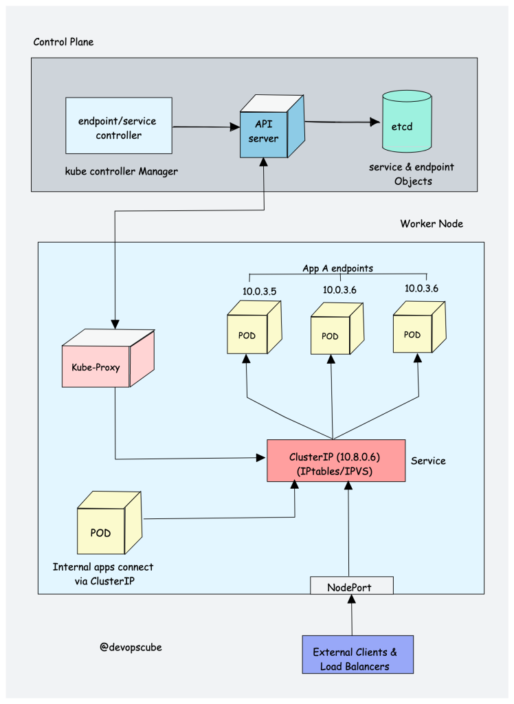
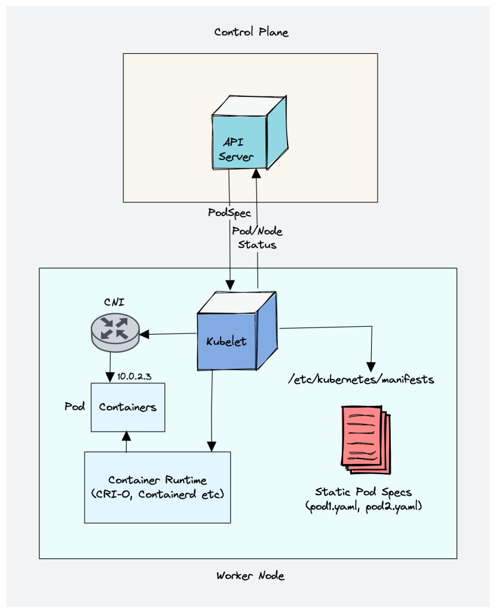
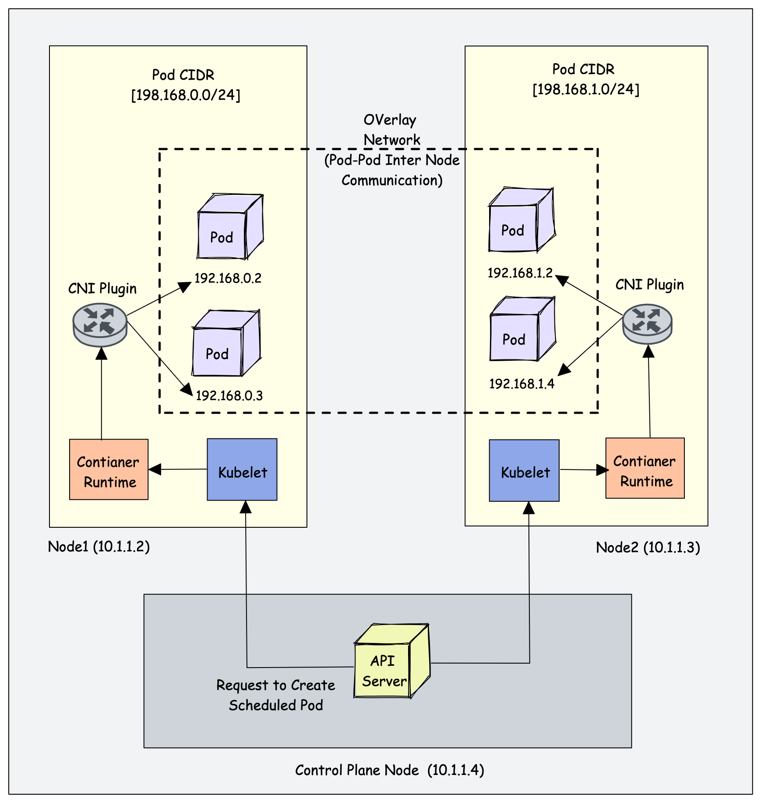

# Zor Yoldan Kubernetes Kurulumu (Tek Makale ve 2024 Güncel Versiyon)

Yaklaşık 2 yıl kadar önce 17 makaleden oluşan çok daha geniş kapsamlı "[Zor Yoldan Kubernetes Kurulumu](https://medium.com/devopsturkiye/zor-yoldan-kubernetes-1-41ae00a0e77f)" adlı bir yazı serisi yayınlamıştım. Lab ortamı olarak LXD, KVM, Vagrant-Libvirt ve Vagramt-Virtualbox olmak üzere 4 farklı şekilde kurmuştuk. Aradan yaklaış 2 yıl geçmiş. İçinde bir çok detay va halen bir çok konu için o makalelerden faydalanmak mümkün. Hatta bu yazı da bazı yerlede o sayfalara atıf yapacağım.

Diğer yazı serisini hiç okumadan buraya gelecekler için girizgahı eski makalemden alacağım.   

Başlığın aslı Kelsey Hightower'ın "[Kubernetes The Hard Way](https://github.com/kelseyhightower/kubernetes-the-hard-way)" başlıklı Github’daki yazı dizisinden geliyor. İsterseniz öncelikle duymayanlar için nedir şu "Kubernetes The Hard Way" meselesi ondan bahsedelim.

Basitçe Kelsey Hightower makalesinde Kubernetes'in Controller Plane ve Node (Worker) bileşenlerini herhangi bir deployment aracı (örneğin Kubeadm, Ansible, RKE..vb) kullanmadan kuruyor. 

İlk zamanlar kurduğu cluster'lar her zaman Google Cloud üzerindeydi ama en son gücellemesinde artık bare-metal  ARM64 bir sistem üzerine kurulum yapmış.

Bu sefer Kelsey'nin yaptığı kuruluma mümkün olduğunda bağlı  kalacağım ancak biz x64 mimari üzerinden kurulum yapacağız. Aralarda bolca not düşeceğim. Biraz troubleshooting yapmaya çalışacağız.

Şİmdi hangi bileşenlerin hangi versiyonlarını kuracağız buna bakalım Birde ufak bi hatıralamya 


[resim kaynak](https://devopscube.com/kubernetes-architecture-explained/)


- **kubectl  1.30.3:** Kullanıcıların Kubernetes API Server ile iletişim kurmasını sağlar ve çeşitli yönetim görevlerini gerçekleştirmek için kullanılır.
- **kube-apiserver  1.30.3**: Kubernetes API'sini sunar ve tüm işlemler bu API üzerinden gerçekleştirilir. Kullanıcılar, yönetim araçları ve diğer bileşenler bu sunucu ile iletişime geçerek kaynak oluşturma, silme veya güncelleme gibi işlemleri gerçekleştirir. Ayrıca, API Server, doğrulama ve yetkilendirme işlemlerini de yönetir.
- **kube-controller-manager 1.30.3:** Kubernetes denetleyicilerini çalıştıran bir bileşendir. Denetleyiciler, Kubernetes nesnelerinin durumunu gözlemler ve istenen durum ile mevcut durumu karşılaştırır. Eğer farklılık varsa, denetleyiciler gerekli düzeltici eylemleri gerçekleştirir. Örneğin, bir Deployment denetleyicisi, belirtilen sayıda Pod'un çalıştığından emin olur.
- **kube-scheduler: 1.30.3:**  Yeni oluşturulan Pod'ların hangi düğümlerde çalıştırılacağını belirler. Bu karar, düğümlerin mevcut kaynak kullanımı, donanım kapasiteleri, ağ konumları ve belirli politikalar gibi çeşitli faktörler göz önünde bulundurularak verilir. Scheduler, Pod'ların dengeli ve verimli bir şekilde dağıtılmasını sağlar.
- **kube-proxy: 1.30.3:** Her düğümde çalışır ve Kubernetes Service nesnelerine trafik yönlendirilmesini sağlar. Ağ kurallarını uygulayarak, Pod'lar arasındaki iletişimi düzenler ve dış dünyadan içeri gelen trafiği ilgili Pod'lara yönlendirir. Bu, Kubernetes içinde dinamik IP adreslemeyi yönetmenin ve yük dengeleme yapmanın bir yoludur.
- **kubelet: 1.30.3:** Her Kubernetes düğümünde çalışan bir ajan olup, düğümdeki Pod'ların ve konteynerların yaşam döngüsünü yönetir. Kubelet, API Server'dan gelen talimatları alır ve konteynerları başlatmak, durdurmak veya yeniden başlatmak için Container Runtime ile etkileşime girer. Ayrıca, Pod'ların sağlık durumunu izler ve gerektiğinde yeniden başlatma işlemlerini gerçekleştirir.
- **crictl: 1.30.1:** Kubernetes cluster'ı debug yapmak için kullanılır. Kubernetes API'yi kullanmadn doğrudan Kubernetes bileşenleri (pod, container...vb) üzerinde işlem yapılabilir. Docker cli gibi düşünebiliriz. CRI tabanalı continer runtime'lari ile iletişim kurabilen bir araç.
- **runc 1.1.13:** Düşük seviyeli bir container runtime'dir cgroup, namespace vb özellikleri kullanrak izolasyon sağlar. Aslında Docker, Containerd veya CRI-O gibi üst seviye runtime'lar runc'yi kullanır.
- **containerd 1.7.20:** CRI uyumlu bir Container Runtime'dır.
- **etcd 3.5.15:**  Kubernetes kümesindeki tüm durum bilgilerini (örn. Pod, Service, ConfigMap) saklar. Bu bilgiler, kümenin mevcut durumunun yanı sıra istenen durumu da içerir, böylece sistem herhangi bir aksaklık durumunda doğru durumu yeniden oluşturabilir.


Listedeki Kubernetes bileşenleri icin servis dosyası, sertifika ve kubeconfig dosyası oluşturup calıştıracağız. Aslında bir sihir yok. Sadece bir uygulamayı ayağa kaldırmak icin bir cok servisi TLS ile ayağa kaldırmamız gerekiyor.

Lab ortamımızı Vagrant-Virtulbox ile yapacağız. Altta Vagrantfile dosyasını bulabilirsiniz. 

Vagrant daha önce kullanmadıysanız takılmanıza gerek yok. Vagrant komutlarıyla çok işimiz olamayacak. Sadece [şu sayfadan](https://developer.hashicorp.com/vagrant/install?product_intent=vagrant) Vagrant'ı kurmalısınız. Birde tabi Virtualbox'ı kurmanız gerekiyor.

Şöyle bir sistemimiz olacak.


|Hostname|DNS|ip|Açıklama|CPU|RAM|Disk|
|--------|---|---|--------|---|---|----|
|bastion|bastion|192.168.56.31|Kurulumlarımı yapacağımız ve cluster'ımızı  yöneteceğimiz makine|2|2|10|
|master1|master1.kubernetes.local|192.168.56.41|Kubernetes Server Node|2|2|10|
|worker1|worker0.kubernetes.local|192.168.56.51|Kubernetes Worker Node 1|2|2|10|
|worker2|worker1.kubernetes.local|192.168.56.52|Kubernetes Worker Node 2|2|2|10|


## Lab Ortamının Kurulumu

Kubernetes cluster kurabilmemiz için sistemimizin sağlaması gereken bazı ön şartları sağlaması lazım.

- Makineler birbirine root hesabı ile ssh üzerinden şifresiz bağlanabiliyor olmalı
- [Resmi Kubernetes dokümanlarından](https://kubernetes.io/docs/reference/networking/ports-and-protocols/) kontol edebileceğiniz portlar cluster içinde açık olmalı. Biz kolaylık olsun diye sunucular arasında firewall'u kapalı tutacağız. 
- Swap kapalı olmalı
- Sunucularn [NTP](https://tr.wikipedia.org/wiki/Network_Time_Protocol) ayarları yapılmış olmalı. Yani bütün sunucularda tarih ve saat aynı olmalı.
- Network engeli olmamalı. Biz zaten bütün sunucuları aynı subnet üzerinde açtık ve firewall kapalı.
- (tavsiye) Eğer büyük bir veri merkesiniz ve bir çok sunucu ve farklı subnet'leriniz varsa sunuculara hostname üzerinden değil de DNS isimleri üzerinden erişmek daha mantıklı olacaktır. Biz de kendi sistemimizde DNS olmadığı için hosts dosyamıza DNS isimlerini yazarak durumu simule etmiş olacağız.
- (tavsiye) Production ortamlarınızda pod network subnet ile servis networklerinin subnetlerini verimerkezi genelinde bloklayın.

Tabi production ortamları için daha bir çok konuya dikkat etmek lazım. Ben sadece oluşturduğumuz lab ortamını çalıştıracağınız yeri bilmedğim için bir problem yaşatmyacak ufak tefek şeyleri söyledim.

Production ortamı için Kubernetes resmi dokğmanları çok detaylı bir sayfa hazırlamış. [Şu linkten](https://kubernetes.io/docs/setup/production-environment/) okuyabilirsiniz.

Kubernetes kurulumu için gerekli olan ön şartları Vagrantfile içindeki scriptler hallediyor. Detaylar script içindeki açıklama satırlarında yazıyor. Eğer Vagranfile içine yazmasaydık alttaki komutları sunucular üzerinde çalıştıracaktırç Hangi sunucuda hangi komutların çalıştırılacağı da yine scriptlerde yazıyor.


Alttaki kodları bir klasörde `Vagrantfile` adında bir dosya oluşturup içine kopyalıyoruz. Ardından aynı dizinde iken `vagrant up` komutunu çalıştırıyoruz. 

`Ubuntu 22.04 (jammy64)` versiyonunu kullanıyor olacağız.

```ruby
# -*- mode: ruby -*-
# vi: set ft=ruby :

MASTER_COUNT = 1
WORKER_COUNT  = 2

MASTER_IP_PREFIX  = "192.168.56.4"
WORKER_IP_PREFIX  = "192.168.56.5"

PROVIDER = "virtualbox"

BASTION_IP = "192.168.56.31"

ROOT_PASS = "vagrant"

ENV['VAGRANT_DEFAULT_PROVIDER'] = PROVIDER

$allscript = <<-ALLSCRIPT

MASTER_COUNT=$1
WORKER_COUNT=$2
MASTER_IP_PREFIX=$3
WORKER_IP_PREFIX=$4
BASTION_IP=$5
ROOT_PASS=$6

echo master count : $MASTER_COUNT
echo worker count : $WORKER_COUNT
echo master ip prefix : $MASTER_IP_PREFIX
echo master worker prefix : $WORKER_IP_PREFIX
echo bastion ip : $BASTION_IP
echo root pass : $ROOT_PASS

sudo su

echo "============== gerekli kurulumlar yapılıyor ====="

sudo apt install ntpstat socat conntrack ipset -y
sudo apt install ntp -y

 

echo "============== root user aktif ediliyor ===="

echo -e "$ROOT_PASS\n$ROOT_PASS" | (passwd root)
echo -e "$ROOT_PASS\n$ROOT_PASS" | (passwd vagrant)
echo "export TERM=xterm" | tee -a /etc/bash.bashrc

echo "============== ntp aktif ediliyor ===="

sudo apt install ntp
sudo systemctl restart ntp

timedatectl status

echo "============== swap ve firewall iptal ediliyor ===="

sed -i "/swap/d" /etc/fstab
swapoff -a
systemctl disable --now ufw

echo "============== kubernetes network için sysctl update ediliyor ===="

# gerekli kernel moduller kuruluyor

modprobe overlay
modprobe br_netfilter

cat <<EOF | sudo tee -a /etc/sysctl.d/kubernetes.conf
net.bridge.bridge-nf-call-ip6tables = 1
net.bridge.bridge-nf-call-iptables  = 1
net.ipv4.ip_forward                 = 1
EOF
sysctl --system

echo "============= ssh ayarları yapılıyor ====="

sed -i "s/#PasswordAuthentication yes/PasswordAuthentication yes/" /etc/ssh/sshd_config
sed -i "s/#PermitRootLogin prohibit-password/PermitRootLogin yes/" /etc/ssh/sshd_config
sed -i "s/#PubkeyAuthentication yes/PubkeyAuthentication yes/" /etc/ssh/sshd_config

sudo systemctl restart ssh

echo "============= host dosyaları düzenleniyor ==="
for i in $(seq 1 $MASTER_COUNT); do
    echo "$MASTER_IP_PREFIX$i master$i" >>/etc/hosts
    echo "$MASTER_IP_PREFIX$i master$i.kubernetes.local" >>/etc/hosts
done

for i in $(seq 1 $WORKER_COUNT); do
    echo "$WORKER_IP_PREFIX$i worker$i" >>/etc/hosts
    echo "$WORKER_IP_PREFIX$i worker$i.kubernetes.local" >>/etc/hosts
done

echo "$BASTION_IP bastion" >>/etc/hosts

ALLSCRIPT

$bastionscript = <<-BASTION

MASTER_COUNT=$1
WORKER_COUNT=$2
MASTER_IP_PREFIX=$3
WORKER_IP_PREFIX=$4
BASTION_IP=$5
ROOT_PASS=$6

echo master count : $MASTER_COUNT
echo worker count : $WORKER_COUNT
echo master ip prefix : $MASTER_IP_PREFIX
echo master worker prefix : $WORKER_IP_PREFIX
echo bastion ip : $BASTION_IP
echo root pass : $ROOT_PASS

sudo apt install sshpass -y

sudo su

ssh-keygen -t rsa -N "" -f ~/.ssh/id_rsa

for i in $(seq 1 $MASTER_COUNT); do
    sshpass -p $ROOT_PASS ssh-copy-id -i ~/.ssh/id_rsa.pub -o StrictHostKeyChecking=no root@$MASTER_IP_PREFIX$i
    echo "yes \n" | scp ~/.ssh/id_rsa root@$MASTER_IP_PREFIX$i:.ssh/
    echo key kopyalandı: $MASTER_IP_PREFIX$i
done


for i in $(seq 1 $WORKER_COUNT); do
    sshpass -p $ROOT_PASS ssh-copy-id -i ~/.ssh/id_rsa.pub -o StrictHostKeyChecking=no root@$WORKER_IP_PREFIX$i
    echo "yes \n" | scp ~/.ssh/id_rsa root@$WORKER_IP_PREFIX$i:.ssh/
    echo key kopyalandı: $WORKER_IP_PREFIX$i
done

BASTION

Vagrant.configure("2") do |config|

    # master
    (1..MASTER_COUNT).each do |i|

        config.vm.define "master#{i}" do |master|
            master.vm.box = "gusztavvargadr/ubuntu-server-2404-lts"
            master.vm.network "private_network", ip: MASTER_IP_PREFIX+"#{i}"
            master.vm.hostname = "master#{i}"
            master.ssh.username = "vagrant"
            master.ssh.password = $ROOT_PASS
            master.ssh.insert_key = "true"

            master.vm.provider :PROVIDER do |lv|
                lv.memory=2048
                lv.cpus=2
            end
        end
    end

    # worker
    (1..WORKER_COUNT).each do |i|

        config.vm.define "worker#{i}" do |worker|
            worker.vm.box = "gusztavvargadr/ubuntu-server-2404-lts"
            worker.vm.network "private_network", ip: WORKER_IP_PREFIX+"#{i}"
            worker.vm.hostname = "worker#{i}"
            worker.ssh.username = "vagrant"
            worker.ssh.password = $ROOT_PASS
            worker.ssh.insert_key = "true"


            worker.vm.provider :PROVIDER do |lv|
                lv.memory=2048
                lv.cpus=2
                lv.storage :file, :size => '10G'

            end
        end
    end

    # bastion 
    config.vm.define "bastion" do |bastion|
            bastion.vm.box = "gusztavvargadr/ubuntu-server-2404-lts"
            bastion.vm.network "private_network", ip: BASTION_IP
            bastion.vm.hostname = "bastion"
            bastion.ssh.username = "vagrant"
            bastion.ssh.password = $ROOT_PASS
            bastion.ssh.insert_key = "true"

            bastion.vm.provider :PROVIDER do |lv|
                lv.memory=2048
                lv.cpus=2
            end

            bastion.vm.provision "shell", run: "once", inline: $bastionscript, args: [MASTER_COUNT,WORKER_COUNT, MASTER_IP_PREFIX,WORKER_IP_PREFIX, BASTION_IP, ROOT_PASS]
    end

    # global olarak tanımlanmış shell provision. Bütün vm lerde çalışacak
    config.vm.provision :shell, run: "once" do |s|
        s.args = [MASTER_COUNT,WORKER_COUNT, MASTER_IP_PREFIX,WORKER_IP_PREFIX, BASTION_IP, ROOT_PASS]
        s.inline = $allscript
    end

end


```


Kurulum bittikten sonra alttaki testleri yapıyoruz. 

- Bastion bakinesine yine Vagrantfile dosyasının bulunduğu dizinde iken `vagrant ssh bastion` komutuyla giriş yapıyoruz. Giriş yapar yapmaz root kullanıcısına geçip bütün makinelere hostname adıyla ping atıp test ediyoruz.
- Bastion makinesinden bürün makinelere root kullanıcısı ile şifresiz olarak ssh yapabilmemiz grekiyor. Bunu test edin mutlaka.
- Testleri yaparken DNS isimleriyle de yapmamız gerekiyor. Yani örneğin bastion'dan worker1'e ssh ypacaksak domain adı olarak `worker1.kubernetes.local` kullanmalıyız.

Eğer testlerde sorun çıktıysa Vagranfile üzerinde yaptığımız adımlardan birinde veya bir kaçında problem çıkmış olabilir. Bu durumda `vagrant up` komutunu tekrar çalıştırabilirsiniz veya `vagrant destroy` komutuyla bütün makineleri sislip tekrar `vagrant up` komutuyla kurulum yapabiliriz. Son olarak yine düzelmezse hata adlığımız yerlerde Vagrantfile dosyasındaki ilgili komutu manuel olarak çalıştırabiliriz.

Ayrıca Kelsey'in [GitHub sayfasından](https://github.com/kelseyhightower/kubernetes-the-hard-way/blob/a9cb5f7ba50b3ed496a18a09c273941f80c6375a/docs/03-compute-resources.md) da kontrol edebilirsiin.


## Bastion Sunucusunun Kurulum İçin Hazırlanmsı

Bastion sunucumuz üzerinden bitin sunucular kurulum ve konfigürasyon yapacağız. Dolayısıyle hem sunucunun ihtiyacı olan uygulamaların hem de diğer sunuculara kurulacak binary'lerin de bu sunucu üzerinden paylaşacağımız için onların da indirilmesi gerekiyor.

İhtiyaç olması muhtemel openssl, git, curl, wget ve ssh gibi araçlar kurulu geliyor zaten. Diğer kurlumlar için bastion sunucumuza `vagrant ssh bastion` komutu ile bağlanıp root kullanıcısına geçiyoruz. Dosylarımız için bir dizin oluşturuyoruz.

```bash
KHOME=$HOME/kubernetes-files
mkdir $KHOME
cd $KHOME
```
İndireceğimiz bütün uygulamarın isdirme adreslerini `downloads.txt` dosyasına ekliyoruz. Gerekli bütün binary'leri alttaki linklerden bulabilirsiniz.

- https://www.downloadkubernetes.com
- https://github.com/opencontainers/runc/releases
- https://github.com/kubernetes-sigs/cri-tools/releases
- https://github.com/containerd/containerd/releases
- https://github.com/etcd-io/etcd/releases

```bash

mkdir -p $KHOME/downloads

cat << EOF > $KHOME/downloads/downloads.txt
https://dl.k8s.io/v1.30.3/bin/linux/amd64/kubectl
https://dl.k8s.io/v1.30.3/bin/linux/amd64/kube-apiserver
https://dl.k8s.io/v1.30.3/bin/linux/amd64/kube-controller-manager
https://dl.k8s.io/v1.30.3/bin/linux/amd64/kube-scheduler
https://dl.k8s.io/v1.30.3/bin/linux/amd64/kube-proxy
https://dl.k8s.io/v1.30.3/bin/linux/amd64/kubelet
https://github.com/containernetworking/plugins/releases/download/v1.5.1/cni-plugins-linux-amd64-v1.5.1.tgz
https://github.com/kubernetes-sigs/cri-tools/releases/download/v1.30.1/crictl-v1.30.1-linux-amd64.tar.gz
https://github.com/opencontainers/runc/releases/download/v1.1.13/runc.amd64
https://github.com/containerd/containerd/releases/download/v1.7.20/containerd-1.7.20-linux-amd64.tar.gz
https://github.com/etcd-io/etcd/releases/download/v3.5.15/etcd-v3.5.15-linux-amd64.tar.gz
EOF
```

Alltaki komutla binary'leri indiriyoruz

```bash

KHOME=$HOME/kubernetes-files 

wget -q --show-progress \
  --https-only \
  --timestamping \
  -P $KHOME/downloads \
  -i $KHOME/downloads/downloads.txt
```
Dosyaları listelediğimizde alttaki bir liste görmeliyiz.

```
cni-plugins-linux-amd64-v1.5.1.tgz
containerd-1.7.20-linux-amd64.tar.gz
crictl-v1.30.1-linux-amd64.tar.gz
downloads.txt
etcd-v3.5.15-linux-amd64.tar.gz
kube-apiserver
kube-controller-manager
kubectl
kubelet
kube-proxy
kube-scheduler
runc.amd64
```

Bastion sunucumuza kubectl'i kurabiliriz.

```bash
KHOME=$HOME/kubernetes-files

chmod +x $KHOME/downloads/kubectl

cp $KHOME/downloads/kubectl /usr/local/bin/

kubectl version --client

# Client Version: v1.30.3
# Kustomize Version: v5.0.4-0.20230601165947-6ce0bf390ce3


```

## TLS Sertifikalarının Oluşturulması

Sertifikaları openssl ile oluşturacağız. Bunun için alttaki komutla sertifika konfigürasyon dosyasmızı oluşturuyoruz. Alttaki sertifikaları oluşturacağız.

- admin
- worker1
- worker2
- kube-proxy
- kube-scheduler
- kube-controller-manager
- kube-api-server
- service-accounts

Sertika isimlerinin konfigürasyonda görebilirsiniz.


```bash

KHOME=$HOME/kubernetes-files

mkdir $KHOME/certs

cat << EOF > $KHOME/certs/ca.conf
[req]
distinguished_name = req_distinguished_name
prompt             = no
x509_extensions    = ca_x509_extensions

[ca_x509_extensions]
basicConstraints = CA:TRUE
keyUsage         = cRLSign, keyCertSign

[req_distinguished_name]
C   = US
ST  = Washington
L   = Seattle
CN  = CA

[admin]
distinguished_name = admin_distinguished_name
prompt             = no
req_extensions     = default_req_extensions

[admin_distinguished_name]
CN = admin
O  = system:masters

# Service Accounts: hem admin kullanıcısı hem de sistemin tamamında yetkili işlemler için gerekli olan sertifika

[service-accounts]
distinguished_name = service-accounts_distinguished_name
prompt             = no
req_extensions     = default_req_extensions

[service-accounts_distinguished_name]
CN = service-accounts

# Worker Nodes: Buradaki sertifikalar aslında kubelet için oluşturuluyor.
# authorization işlemleri için system:node:<nodeName> şeklinde CN (CommonName) isimledirmesi gerekiyor.
# https://kubernetes.io/docs/concepts/overview/components/#kubelet

[worker1]
distinguished_name = worker1_distinguished_name
prompt             = no
req_extensions     = worker1_req_extensions

[worker1_req_extensions]
basicConstraints     = CA:FALSE
extendedKeyUsage     = clientAuth, serverAuth
keyUsage             = critical, digitalSignature, keyEncipherment
nsCertType           = client
nsComment            = "Worker 1 Certificate"
subjectAltName       = DNS:worker1, IP:127.0.0.1
subjectKeyIdentifier = hash

[worker1_distinguished_name]
CN = system:node:worker1
O  = system:nodes
C  = US
ST = Washington
L  = Seattle

[worker2]
distinguished_name = worker2_distinguished_name
prompt             = no
req_extensions     = worker2_req_extensions

[worker2_req_extensions]
basicConstraints     = CA:FALSE
extendedKeyUsage     = clientAuth, serverAuth
keyUsage             = critical, digitalSignature, keyEncipherment
nsCertType           = client
nsComment            = "Worker 2 Certificate"
subjectAltName       = DNS:worker2, IP:127.0.0.1
subjectKeyIdentifier = hash

[worker2_distinguished_name]
CN = system:node:worker2
O  = system:nodes
C  = US
ST = Washington
L  = Seattle


# Kube Proxy Section
[kube-proxy]
distinguished_name = kube-proxy_distinguished_name
prompt             = no
req_extensions     = kube-proxy_req_extensions

[kube-proxy_req_extensions]
basicConstraints     = CA:FALSE
extendedKeyUsage     = clientAuth, serverAuth
keyUsage             = critical, digitalSignature, keyEncipherment
nsCertType           = client
nsComment            = "Kube Proxy Certificate"
subjectAltName       = DNS:kube-proxy, IP:127.0.0.1
subjectKeyIdentifier = hash

[kube-proxy_distinguished_name]
CN = system:kube-proxy
O  = system:node-proxier
C  = US
ST = Washington
L  = Seattle


# Controller Manager
[kube-controller-manager]
distinguished_name = kube-controller-manager_distinguished_name
prompt             = no
req_extensions     = kube-controller-manager_req_extensions

[kube-controller-manager_req_extensions]
basicConstraints     = CA:FALSE
extendedKeyUsage     = clientAuth, serverAuth
keyUsage             = critical, digitalSignature, keyEncipherment
nsCertType           = client
nsComment            = "Kube Controller Manager Certificate"
subjectAltName       = DNS:kube-proxy, IP:127.0.0.1
subjectKeyIdentifier = hash

[kube-controller-manager_distinguished_name]
CN = system:kube-controller-manager
O  = system:kube-controller-manager
C  = US
ST = Washington
L  = Seattle


# Scheduler
[kube-scheduler]
distinguished_name = kube-scheduler_distinguished_name
prompt             = no
req_extensions     = kube-scheduler_req_extensions

[kube-scheduler_req_extensions]
basicConstraints     = CA:FALSE
extendedKeyUsage     = clientAuth, serverAuth
keyUsage             = critical, digitalSignature, keyEncipherment
nsCertType           = client
nsComment            = "Kube Scheduler Certificate"
subjectAltName       = DNS:kube-scheduler, IP:127.0.0.1
subjectKeyIdentifier = hash

[kube-scheduler_distinguished_name]
CN = system:kube-scheduler
O  = system:system:kube-scheduler
C  = US
ST = Washington
L  = Seattle


# API Server

[kube-api-server]
distinguished_name = kube-api-server_distinguished_name
prompt             = no
req_extensions     = kube-api-server_req_extensions

[kube-api-server_req_extensions]
basicConstraints     = CA:FALSE
extendedKeyUsage     = clientAuth, serverAuth
keyUsage             = critical, digitalSignature, keyEncipherment
nsCertType           = client
nsComment            = "Kube Scheduler Certificate"
subjectAltName       = @kube-api-server_alt_names
subjectKeyIdentifier = hash


# Burada eğer bir load balancer konfigurasyonumuz olsaydı onunda domainini girmemiz gerekiyordu.

[kube-api-server_alt_names]
IP.0  = 127.0.0.1
IP.1  = 10.32.0.1
DNS.0 = kubernetes
DNS.1 = kubernetes.default
DNS.2 = kubernetes.default.svc
DNS.3 = kubernetes.default.svc.cluster
DNS.4 = kubernetes.svc.cluster.local
DNS.5 = server.kubernetes.local
DNS.6 = api-server.kubernetes.local

[kube-api-server_distinguished_name]
CN = kubernetes
C  = US
ST = Washington
L  = Seattle


[default_req_extensions]
basicConstraints     = CA:FALSE
extendedKeyUsage     = clientAuth
keyUsage             = critical, digitalSignature, keyEncipherment
nsCertType           = client
nsComment            = "Admin Client Certificate"
subjectKeyIdentifier = hash
EOF

```

Dosyamız `/root/kubernetes-files/ca.conf` adresinde oluştu. Alttaki komutla sertifiakalrı oluşturabiliriz.

```bash
KHOME=$HOME/kubernetes-files

cd $KHOME/certs

{
  openssl genrsa -out ca.key 4096
  openssl req -x509 -new -sha512 -noenc \
    -key ca.key -days 3653 \
    -config ca.conf \
    -out ca.crt
}

certs=(
  "admin" "worker1" "worker2"
  "kube-proxy" "kube-scheduler"
  "kube-controller-manager"
  "kube-api-server"
  "service-accounts"
)


for i in ${certs[*]}; do
  openssl genrsa -out "${i}.key" 4096

  openssl req -new -key "${i}.key" -sha256 \
    -config "ca.conf" -section ${i} \
    -out "${i}.csr"
  
  openssl x509 -req -days 3653 -in "${i}.csr" \
    -copy_extensions copyall \
    -sha256 -CA "ca.crt" \
    -CAkey "ca.key" \
    -CAcreateserial \
    -out "${i}.crt"
done

```

Alttaki listedeki sertifikaların oluşmuş olması lazım.

```bash
ls -1 *.crt *.key *.csr

# sonuç
# 
# admin.crt
# admin.csr
# admin.key
# ca.crt
# ca.key
# kube-api-server.crt
# kube-api-server.csr
# kube-api-server.key
# kube-controller-manager.crt
# kube-controller-manager.csr
# kube-controller-manager.key
# kube-proxy.crt
# kube-proxy.csr
# kube-proxy.key
# kube-scheduler.crt
# kube-scheduler.csr
# kube-scheduler.key
# service-accounts.crt
# service-accounts.csr
# service-accounts.key
# worker1.crt
# worker1.csr
# worker1.key
# worker2.crt
# worker2.csr
# worker2.key
```

## Client ve Server Sertifikalarının Dağıtılması

Öncelikle client sertifikalarını dağıtalım. Worker node'larımız kubeapi için birer client.


```bash

# dikkat edin worker node'lar için hazırladığımız worker1 ve worker2 sertifikalarını kubelet sertifikası olarak kullanıyoruz.

# Kubelet: düğümdeki Pod'ların ve konteynerların yaşam döngüsünü yönetir. Kubelet, API Server'dan gelen talimatları alır ve konteynerları başlatmak, durdurmak veya yeniden başlatmak için Container Runtime ile etkileşime girer. Ayrıca, Pod'ların sağlık durumunu izler ve gerektiğinde yeniden başlatma işlemlerini gerçekleştirir.
KHOME=$HOME/kubernetes-files

cd $KHOME/certs

for host in worker1 worker2; do
  ssh root@$host mkdir /var/lib/kubelet/
  
  scp ca.crt root@$host:/var/lib/kubelet/
    
  scp $host.crt \
    root@$host:/var/lib/kubelet/kubelet.crt
    
  scp $host.key \
    root@$host:/var/lib/kubelet/kubelet.key
done
```
Şimdi de server sertifikalarını dağıtalım. Şimdilir root'a kopyalayalım. İleride doğru dizinlere toplayacağız.

```bash
scp ca.key ca.crt kube-api-server.key kube-api-server.crt service-accounts.key service-accounts.crt root@master1:~/
```

## Authentication için Kubernetes Konfigürasyon Dosyalarının Oluşturulması 

Şimdi bir önceki başlıkta oluştuduğumuz sertifikaları kullanarak authentication için konfigürasyon dosyalarını oluşturalım. Bu oluşturacağımız konfigürasyon dosyalarına genel olarak kubeconfig deniliyor.

Ne yapmaya çalıştığımızı bir anlayalım. Alttaki remsimde gördüğümüxz bütün bileşenler kube-api-server'a bağlanıyorlar. Bu bağlantıların hepsi için TLS gerekli ki zaten sertifikaları oluşturduk. Ayrıca bu bileşenlerin çalışabilmesi için bir çok parametre gerekiyor. Ayrıca sunucular restart edildiğinde bileşenlerin de otomatik olarak çalışması için uygulamaları servis olarak ayağa kaldırmamız gerekiyor gerekiyor.  Bütün bunlar için de kubelet'lerin konfigurasyonu içinde kubeconfig dosyamıza ihtiyacımız var. Bunu da kubectl cli ile oluşturabiliriz. 

Tabi sadece kubelet için değil bütü n ileşenler için bu konfigürasyon dosyalarına ihtiyacımız olacak.


[resim kaynak](https://devopscube.com/kubernetes-architecture-explained/)
 

Bastion sunucusundan devam ediyoruz. Konfigürasyonları oluşturmak için certs klasöründe olmamız gerekiyor.

Komutlarda `--embed-certs=true` parametresi serfika verisini doğrudan kubeconfig dosyasına base64 alınarak yazmak icibn kullanılıyor. Tabiiki bu paramerte kullanılmayıp adres olarka da kulalnılması sağlanabilir. Biz burada bunu tercih etmedik. İki kullanımında artı ve eksileri var.

Bu arada bütün kubeconfig doyaları ayn yontemle oluşturluyor dikkaet ederseniz. Yani bir magic yok. kubectl ile admin kullanıcısu ile işlem yaparken kullandığımız kubeconfig dosyası ile aynı işi yapıyor buradaki dosyalar da. Bildiğiniz gibi Kubernetes'da user amangement yok sadece servis herapları var.

### Client Authentication Konfigürasyonlarının Oluşturulması

- **Kubelet Kubeconfig**


```bash

KHOME=$HOME/kubernetes-files

cd $KHOME/certs

for host in worker1 worker2; do
  kubectl config set-cluster kubernetes-the-hard-way \
    --certificate-authority=ca.crt \
    --embed-certs=true \
    --server=https://master1.kubernetes.local:6443 \
    --kubeconfig=${host}.kubeconfig

  kubectl config set-credentials system:node:${host} \
    --client-certificate=${host}.crt \
    --client-key=${host}.key \
    --embed-certs=true \
    --kubeconfig=${host}.kubeconfig

  kubectl config set-context default \
    --cluster=kubernetes-the-hard-way \
    --user=system:node:${host} \
    --kubeconfig=${host}.kubeconfig

  kubectl config use-context default \
    --kubeconfig=${host}.kubeconfig
done
```


İşlem bittiğinde iki tane kube config oluşmuş olacak.

```
worker1.kubeconfig
worker2.kubeconfig
```


- **Kube-proxy Kubeconfig**

Alttaki komu çalıştırdığımızda `kube-proxy.kubeconfig` adından bir dosya oluşmuş olacak.

```bash
{
  kubectl config set-cluster kubernetes-the-hard-way \
    --certificate-authority=ca.crt \
    --embed-certs=true \
    --server=https://master1.kubernetes.local:6443 \
    --kubeconfig=kube-proxy.kubeconfig

  kubectl config set-credentials system:kube-proxy \
    --client-certificate=kube-proxy.crt \
    --client-key=kube-proxy.key \
    --embed-certs=true \
    --kubeconfig=kube-proxy.kubeconfig

  kubectl config set-context default \
    --cluster=kubernetes-the-hard-way \
    --user=system:kube-proxy \
    --kubeconfig=kube-proxy.kubeconfig

  kubectl config use-context default \
    --kubeconfig=kube-proxy.kubeconfig
}
```

- **Kube-controller-manager Kubeconfig**
Alttaki komu çalıştırdığımızda `kube-controller-manager.kubeconfig` adından bir dosya oluşmuş olacak.

```bash
{
  kubectl config set-cluster kubernetes-the-hard-way \
    --certificate-authority=ca.crt \
    --embed-certs=true \
    --server=https://master1.kubernetes.local:6443 \
    --kubeconfig=kube-controller-manager.kubeconfig

  kubectl config set-credentials system:kube-controller-manager \
    --client-certificate=kube-controller-manager.crt \
    --client-key=kube-controller-manager.key \
    --embed-certs=true \
    --kubeconfig=kube-controller-manager.kubeconfig

  kubectl config set-context default \
    --cluster=kubernetes-the-hard-way \
    --user=system:kube-controller-manager \
    --kubeconfig=kube-controller-manager.kubeconfig

  kubectl config use-context default \
    --kubeconfig=kube-controller-manager.kubeconfig
}
```

- **Kube-scheduler Kubeconfig**


[resim kaynak](https://devopscube.com/kubernetes-architecture-explained/)


Alttaki komu çalıştırdığımızda `kube-scheduler.kubeconfig` adından bir dosya oluşmuş olacak.


```bash
{
  kubectl config set-cluster kubernetes-the-hard-way \
    --certificate-authority=ca.crt \
    --embed-certs=true \
    --server=https://master1.kubernetes.local:6443 \
    --kubeconfig=kube-scheduler.kubeconfig

  kubectl config set-credentials system:kube-scheduler \
    --client-certificate=kube-scheduler.crt \
    --client-key=kube-scheduler.key \
    --embed-certs=true \
    --kubeconfig=kube-scheduler.kubeconfig

  kubectl config set-context default \
    --cluster=kubernetes-the-hard-way \
    --user=system:kube-scheduler \
    --kubeconfig=kube-scheduler.kubeconfig

  kubectl config use-context default \
    --kubeconfig=kube-scheduler.kubeconfig
}

```

- **Admin Kullanıcısı İçin Kubeconfig**

Alttaki komu çalıştırdığımızda `admin.kubeconfig` adından bir dosya oluşmuş olacak.

Dikkat ederseniz server adresi olarak üsttekiler gibi `https://master1.kubernetes.local:6443` adresi yerine `https://127.0.0.1:6443` adresini kullandık.

```bash
{
  kubectl config set-cluster kubernetes-the-hard-way \
    --certificate-authority=ca.crt \
    --embed-certs=true \
    --server=https://127.0.0.1:6443 \
    --kubeconfig=admin.kubeconfig

  kubectl config set-credentials admin \
    --client-certificate=admin.crt \
    --client-key=admin.key \
    --embed-certs=true \
    --kubeconfig=admin.kubeconfig

  kubectl config set-context default \
    --cluster=kubernetes-the-hard-way \
    --user=admin \
    --kubeconfig=admin.kubeconfig

  kubectl config use-context default \
    --kubeconfig=admin.kubeconfig
}
```

### Kubeconfig Dosyalarının Dağıtılması


Kubelet ve kube-proxy konfigürasyonlarını sunuculara kopyalayalım. 

```bash

KHOME=$HOME/kubernetes-files

cd $KHOME/certs

for host in worker1 worker2; do
  ssh root@$host "mkdir /var/lib/{kube-proxy,kubelet}"
  
  scp kube-proxy.kubeconfig \
    root@$host:/var/lib/kube-proxy/kubeconfig \ # dikkat kube-proxy.kubeconfig dosylarını kubeconfig olarak kayediyoruz
  
  scp ${host}.kubeconfig \
    root@$host:/var/lib/kubelet/kubeconfig # dikkat worker1.kubeconfig ve worker2.kubeconfig dosylarını kubeconfig olarak kayediyoruz
done
```

Birde controller (yani master1) sunucumuzun kubeconfig dosyalarını dağıtalım. 


```bash

scp admin.kubeconfig \
  kube-controller-manager.kubeconfig \
  kube-scheduler.kubeconfig \
  root@master1:~/

```


### Gizli Verilerin Kaynağında Şifrelenmesi için Encryption Key ve Config Oluşturulması


Kubernetes, cluster durumu, uygulama yapılandırmaları ve secret'lar dahil olmak üzere çeşitli verileri depolar. Bu verilerin güvenli saklanmasını da sağlamaya çalışır. Detaylar için [şu sayfayı](https://kubernetes.io/docs/tasks/administer-cluster/encrypt-data/#understanding-the-encryption-at-rest-configuration) ziyaret edebilirsiniz.


```bash
# Öncelikle ana dizinde configs adından bir klasör oluşturuyoruz
KHOME=$HOME/kubernetes-files

mkdir $KHOME/configs

cat << EOF > $KHOME/configs/encryption-config-template.yaml
apiVersion: apiserver.config.k8s.io/v1
kind: EncryptionConfiguration
resources:
  - resources:
      - secrets
    providers:
      - aescbc:
          keys:
            - name: key1
              secret: ${ENCRYPTION_KEY}
      - identity: {}
EOF


# key oluşturuyoruz
export ENCRYPTION_KEY=$(head -c 32 /dev/urandom | base64)

# envsubst komutu ile template dosyasını kullanarak config dosyamızı oluşturuyoruz.
envsubst < configs/encryption-config-template.yaml > configs/encryption-config.yaml

```
Konfigürasyon dosyamızı da master1 sunucumuza root dizinine kopyalıyoruz. Vakti gelince oradaki dosyaların hepsini kullanacağız. Kube-apiserver'ı ayağa kaldırırken bu konfigürasyonu kullanacağız.
```bash
scp $KHOME/configs/encryption-config.yaml root@master1:~/
```

## Etcd Sunucumuzu Ayağa Kaldırıyoruz


Etcd veritabanımızı server1 sunucumuza kuracağız. Etcd yi ayağa kaldırabilmek için systemd (unit) dosyamıza ihtiyacımız olacak.

Dikkat ederseniz daha önceki "[Zor Yoldan Kubernetes Kurulumu](https://mcabuk.medium.com/zor-yoldan-kubernetes-11-760b7a0c7162)" makalemizde yaptığımız gibi burada ETCD icin sertifika kullanmadık. Tabi bu production ortamlarında asla yapılmamalı. Burada grek duymadık cünkü ETCD ile haberleşecek olan Kube Api Server zaten aynı makinede calışıyor.


```bash
KHOME=$HOME/kubernetes-files

cd $KHOME/

mkdir units

cat << EOF > $KHOME/units/etcd.service
[Unit]
Description=etcd
Documentation=https://github.com/etcd-io/etcd

[Service]
Type=notify
ExecStart=/usr/local/bin/etcd \
  --name controller \
  --initial-advertise-peer-urls http://127.0.0.1:2380 \
  --listen-peer-urls http://127.0.0.1:2380 \
  --listen-client-urls http://127.0.0.1:2379 \
  --advertise-client-urls http://127.0.0.1:2379 \
  --initial-cluster-token etcd-cluster-0 \
  --initial-cluster controller=http://127.0.0.1:2380 \
  --initial-cluster-state new \
  --data-dir=/var/lib/etcd
Restart=on-failure
RestartSec=5

[Install]
WantedBy=multi-user.target
EOF


# dosyaları server1 sunucusuna kopyalıyoruz.
scp \
  downloads/etcd-v3.5.15-linux-amd64.tar.gz \
  units/etcd.service \
  root@master1:~/

```

Şimdi etcd'yi ayağa kaldırabiliriz. Ancak bunun  için master1 sunucusuna bağlanmamız gerekiyor. Bastion sunucusundan master1 sunucusuna `ssh root@master1` komutu ile bağlanıyoru z v alttaki komutları sunucuda çalıştırıyoruz.

Bütün dosyalarımızı master1 sunucusunda root dizinine kopyaladığımızı hatırlayın.


```bash
{
  tar -xvf etcd-v3.5.15-linux-amd64.tar.gz
  mv etcd-v3.5.15-linux-amd64/etcd* /usr/local/bin/
}
```

Etcd'yi konfigüre ediyoruz.

```bash
{
  mkdir -p /etc/etcd /var/lib/etcd
  chmod 700 /var/lib/etcd
  cp ca.crt kube-api-server.key kube-api-server.crt \
    /etc/etcd/
}

mv etcd.service /etc/systemd/system/


```

Servisi başlatıyoruz.

```bash
{
  systemctl daemon-reload
  systemctl enable etcd
  systemctl start etcd
}
```

Kurulumu doğruluyoruz.

```bash
etcdctl member list

# Sonuç olarak aşağıdaki gibi bir çıktı almamız gerekiyor.

# 6702b0a34e2cfd39, started, controller, http://127.0.0.1:2380, http://127.0.0.1:2379, false
```

## Control Plane'i Ayağa Kaldırıyoruz

Öncelikle alttaki 3 systemd (unit) dosyasına ihtyacımız olacak.

- units/kube-apiserver.service
- units/kube-controller-manager.service
- units/kube-scheduler.service

Bastion sunucumuzda çalışıyoruz.

- **kube-apiserver.service**


Daha önce oluştuduğumuz sertifikaların, encryption-config dosyasının, service-cluster-ip aralığının parametre olarak geçildiğine dikkat edin.

```bash

KHOME=$HOME/kubernetes-files

cd $KHOME/

cat << EOF > units/kube-apiserver.service
[Unit]
Description=Kubernetes API Server
Documentation=https://github.com/kubernetes/kubernetes

[Service]
ExecStart=/usr/local/bin/kube-apiserver \
  --allow-privileged=true \
  --apiserver-count=1 \
  --audit-log-maxage=30 \
  --audit-log-maxbackup=3 \
  --audit-log-maxsize=100 \
  --audit-log-path=/var/log/audit.log \
  --authorization-mode=Node,RBAC \
  --bind-address=0.0.0.0 \
  --client-ca-file=/var/lib/kubernetes/ca.crt \
  --enable-admission-plugins=NamespaceLifecycle,NodeRestriction,LimitRanger,ServiceAccount,DefaultStorageClass,ResourceQuota \
  --etcd-servers=http://127.0.0.1:2379 \
  --event-ttl=1h \
  --encryption-provider-config=/var/lib/kubernetes/encryption-config.yaml \
  --kubelet-certificate-authority=/var/lib/kubernetes/ca.crt \
  --kubelet-client-certificate=/var/lib/kubernetes/kube-api-server.crt \
  --kubelet-client-key=/var/lib/kubernetes/kube-api-server.key \
  --runtime-config='api/all=true' \
  --service-account-key-file=/var/lib/kubernetes/service-accounts.crt \
  --service-account-signing-key-file=/var/lib/kubernetes/service-accounts.key \
  --service-account-issuer=https://master1.kubernetes.local:6443 \
  --service-cluster-ip-range=10.32.0.0/24 \
  --service-node-port-range=30000-32767 \
  --tls-cert-file=/var/lib/kubernetes/kube-api-server.crt \
  --tls-private-key-file=/var/lib/kubernetes/kube-api-server.key \
  --v=2
Restart=on-failure
RestartSec=5

[Install]
WantedBy=multi-user.target
EOF

```

- **kube-controller-manager.service**


```bash
KHOME=$HOME/kubernetes-files

cd $KHOME/

cat << EOF > units/kube-controller-manager.service
[Unit]
Description=Kubernetes Controller Manager
Documentation=https://github.com/kubernetes/kubernetes

[Service]
ExecStart=/usr/local/bin/kube-controller-manager \
  --bind-address=0.0.0.0 \
  --cluster-cidr=10.200.0.0/16 \
  --cluster-name=kubernetes \
  --cluster-signing-cert-file=/var/lib/kubernetes/ca.crt \
  --cluster-signing-key-file=/var/lib/kubernetes/ca.key \
  --kubeconfig=/var/lib/kubernetes/kube-controller-manager.kubeconfig \
  --root-ca-file=/var/lib/kubernetes/ca.crt \
  --service-account-private-key-file=/var/lib/kubernetes/service-accounts.key \
  --service-cluster-ip-range=10.32.0.0/24 \
  --use-service-account-credentials=true \
  --v=2
Restart=on-failure
RestartSec=5

[Install]
WantedBy=multi-user.target
EOF
```


- **kube-scheduler.service**


```bash
KHOME=$HOME/kubernetes-files

cd $KHOME/

cat << EOF > units/kube-scheduler.service
[Unit]
Description=Kubernetes Scheduler
Documentation=https://github.com/kubernetes/kubernetes

[Service]
ExecStart=/usr/local/bin/kube-scheduler \
  --config=/etc/kubernetes/config/kube-scheduler.yaml \
  --v=2
Restart=on-failure
RestartSec=5

[Install]
WantedBy=multi-user.target
EOF
```

- Gerekli dosyaları master1 sunucusuna kopyalıyoruz.


Kubernetes API sunucusunun (kube-apiserver) kubelet ile iletişim kurabilmesi için gerekli olan yetkilendirmeler için `kube-apiserver-to-kubelet.yaml` adında bir dosya oluşturacağız. Kube-apiserver ile kubelet arasındaki bu iletişim, Kubernetes cluster'ının düzgün çalışması için kritiktir. Bu dosya, Role-Based Access Control (RBAC) kullanarak gerekli izinleri tanımlamış olacak.

```bash

KHOME=$HOME/kubernetes-files

cd $KHOME/

cat << EOF > configs/kube-apiserver-to-kubelet.yaml
apiVersion: rbac.authorization.k8s.io/v1
kind: ClusterRole
metadata:
  annotations:
    rbac.authorization.kubernetes.io/autoupdate: "true"
  labels:
    kubernetes.io/bootstrapping: rbac-defaults
  name: system:kube-apiserver-to-kubelet
rules:
  - apiGroups:
      - ""
    resources:
      - nodes/proxy
      - nodes/stats
      - nodes/log
      - nodes/spec
      - nodes/metrics
    verbs:
      - "*"
---
apiVersion: rbac.authorization.k8s.io/v1
kind: ClusterRoleBinding
metadata:
  name: system:kube-apiserver
  namespace: ""
roleRef:
  apiGroup: rbac.authorization.k8s.io
  kind: ClusterRole
  name: system:kube-apiserver-to-kubelet
subjects:
  - apiGroup: rbac.authorization.k8s.io
    kind: User
    name: kubernetes
EOF
```

Birde kube-scheduler için KubeSchedulerConfiguration objesi için alttaki dosyaya ihtiyacımız olacak.

```bash

cat << EOF > configs/kube-scheduler.yaml
apiVersion: kubescheduler.config.k8s.io/v1
kind: KubeSchedulerConfiguration
clientConnection:
  kubeconfig: "/var/lib/kubernetes/kube-scheduler.kubeconfig"
leaderElection:
  leaderElect: true
EOF

```

Artık dosyaları taşıyabiliriz.


```bash
scp \
  downloads/kube-apiserver \
  downloads/kube-controller-manager \
  downloads/kube-scheduler \
  downloads/kubectl \
  units/kube-apiserver.service \
  units/kube-controller-manager.service \
  units/kube-scheduler.service \
  configs/kube-scheduler.yaml \
  configs/kube-apiserver-to-kubelet.yaml \
  root@master1:~/

```
Bu noktadan sonra master1 sunucusunda devam edeceğiz. Bunun için `ssh root@master1` komutuyla master1 sunucusuna bağlanıyoruz.

Kubernetes konfigürasyon dizinini oluşturuyoruz.

```bash
mkdir -p /etc/kubernetes/config
```
Binary'leri yüklüyoruz.

```bash
{
  chmod +x kube-apiserver \
    kube-controller-manager \
    kube-scheduler kubectl
    
  mv kube-apiserver \
    kube-controller-manager \
    kube-scheduler kubectl \
    /usr/local/bin/
}
```

Api server'ı konfigüre ediyoruz.

```bash
{
  mkdir -p /var/lib/kubernetes/

  mv ca.crt ca.key \
    kube-api-server.key kube-api-server.crt \
    service-accounts.key service-accounts.crt \
    encryption-config.yaml \
    /var/lib/kubernetes/
}
```
Servis dosyamızı taşıyoruz.

```bash
mv kube-apiserver.service \
  /etc/systemd/system/kube-apiserver.service
```

Contoller Manager'ı konfigüre ediyoruz.

```bash
mv kube-controller-manager.kubeconfig /var/lib/kubernetes/
mv kube-controller-manager.service /etc/systemd/system/
```

Kubernete Scheduler'ı konfigüre ediyoruz.

```bash
mv kube-scheduler.kubeconfig /var/lib/kubernetes/

mv kube-scheduler.yaml /etc/kubernetes/config/

mv kube-scheduler.service /etc/systemd/system/

```

Controller servislerini (kube-apiserver ve kube-scheduler) başlatıyoruz.

```bash
{
  systemctl daemon-reload
  
  systemctl enable kube-apiserver \
    kube-controller-manager kube-scheduler
    
  systemctl start kube-apiserver \
    kube-controller-manager kube-scheduler
}
```

Şimdi de çalıştığını onaylayalım.

```bash

kubectl cluster-info \
  --kubeconfig admin.kubeconfig

# sonuçta alttaki gibi çalıştığını görmemiz gerekiyor.
# Kubernetes control plane is running at https://127.0.0.1:6443
```

## Kubelet Authorization İçin RBAC

Master1 sunucundayken daha önce oluşturduğumuz `kube-apiserver-to-kubelet.yaml` dosyasını kullanarak Kubernetes API sunucusunun (kube-apiserver) kubelet ile iletişim kurabilmesi için gerekli olan yetkilendirmeleri yapıyoruz.

```bash
kubectl apply -f kube-apiserver-to-kubelet.yaml \
  --kubeconfig admin.kubeconfig

```

Şimdi de herşeyin yolunda olup olmadığını kontrol edelim.

Bunun için bastion sunucusunda alttaki komutları çalıştırıyoruz.


```bash

KHOME=$HOME/kubernetes-files

curl -k --cacert $KHOME/certs/ca.crt https://master1.kubernetes.local:6443/version

# sonuç olarak alttaki gibi birşey görmeliyiz.

# {
#   "major": "1",
#   "minor": "30",
#   "gitVersion": "v1.30.3",
#   "gitCommit": "6fc0a69044f1ac4c13841ec4391224a2df241460",
#   "gitTreeState": "clean",
#   "buildDate": "2024-07-16T23:48:12Z",
#   "goVersion": "go1.22.5",
#   "compiler": "gc",
#   "platform": "linux/amd64"
# }

```

## Worker Node'ları Ayağa Kaldırıyoruz

Bu bölümde worker node'ları kuracağız. Worker node'larda runc, container networking plugin, containerd, kubelet, ve kube-proxy calışacak.


[resim kaynak](https://devopscube.com/kubernetes-architecture-explained/)

Öncelikle konfigürasyon dosyalarımızı oluşturuyoruz. Bunun icin bastion sunucusunda root kullanıcı ile calışıyoruz.


- **10-bridge.conf:** dosyası, Kubernetes cluster'ındaki pod ağlarının yapılandırılmasında kullanılan bir CNI (Container Network Interface) eklentisi konfigürasyon dosyasıdır. Bu dosya, Kubernetes cluster'ında her node üzerinde çalışan podların ağ bağlantılarını yapılandırmak için bir köprü (bridge) ağı kurar.

CNI hakkında ilerde konuşacağız.

Bu template'i aşağıda kullanarak "10-bridge.conf" dosyasını oluşturacağız.

Bu cni-plugin icin alttaki konfigürasyonu kullancağız. Ama diğer spec'ler icin [resmi sayfasına](https://github.com/containernetworking/cni/blob/main/SPEC.md) bakabilirsiniz.

```bash
KHOME=$HOME/kubernetes-files


cat << EOF > configs/10-bridge_template.conf
{
  "cniVersion": "1.0.0",
  "name": "bridge",
  "type": "bridge",
  "bridge": "cni0",
  "isGateway": true,
  "ipMasq": true,
  "ipam": {
    "type": "host-local",
    "ranges": [
      [{"subnet": "SUBNET"}]
    ],
    "routes": [{"dst": "0.0.0.0/0"}]
  }
}
EOF
```

- **99-loopback.conf:** dosyası, Kubernetes cluster'ında her pod için bir loopback ağ arayüzü (lo) oluşturmak amacıyla kullanılan bir CNI (Container Network Interface) yapılandırma dosyasıdır. Loopback arayüzü, pod içindeki uygulamaların kendi kendilerine (localhost) ağ üzerinden erişebilmelerini sağlar.

```bash
KHOME=$HOME/kubernetes-files


cat << EOF > configs/99-loopback.conf
{
  "cniVersion": "1.1.0",
  "name": "lo",
  "type": "loopback"
}
EOF
```

- **containerd-config.toml:** dosyası, containerd container runtime'ının yapılandırma dosyasıdır. containerd, containerlerin yönetimini ve çalıştırılmasını sağlayan bir daemon'dur ve Kubernetes gibi container orkestrasyon araçları tarafından kullanılır. Bu dosya, containerd'nin nasıl yapılandırılacağını ve hangi ayarlarla çalışacağını belirler.

CNI dizinin verildiği son 2 satıra dikat edin. Bu sayede yeni oluşacak podlara ip verilmiş olacak.

```bash
KHOME=$HOME/kubernetes-files


cat << EOF > configs/containerd-config.toml
version = 2

[plugins."io.containerd.grpc.v1.cri"]
  [plugins."io.containerd.grpc.v1.cri".containerd]
    snapshotter = "overlayfs"
    default_runtime_name = "runc"
  [plugins."io.containerd.grpc.v1.cri".containerd.runtimes.runc]
    runtime_type = "io.containerd.runc.v2"
  [plugins."io.containerd.grpc.v1.cri".containerd.runtimes.runc.options]
    SystemdCgroup = true
[plugins."io.containerd.grpc.v1.cri".cni]
  bin_dir = "/opt/cni/bin"
  conf_dir = "/etc/cni/net.d"
EOF
```

- **kube-proxy-config.yaml:**

Bunun icin template dosyası oluşturup onun üzerinden gercek dosyasımız oluşturacağız.


[resim kaynak](https://devopscube.com/kubernetes-architecture-explained/)


```bash
KHOME=$HOME/kubernetes-files


cat << EOF > configs/kube-proxy-config.yaml
kind: KubeProxyConfiguration
apiVersion: kubeproxy.config.k8s.io/v1alpha1
clientConnection:
  kubeconfig: "/var/lib/kube-proxy/kubeconfig"
mode: "iptables"
clusterCIDR: "10.200.0.0/16"
EOF
```


- **kubelet-config.yaml:**



[resim kaynak](https://devopscube.com/kubernetes-architecture-explained/)


```bash
KHOME=$HOME/kubernetes-files


cat << EOF > configs/kubelet-config_template.yaml
kind: KubeletConfiguration
apiVersion: kubelet.config.k8s.io/v1beta1
authentication:
  anonymous:
    enabled: false
  webhook:
    enabled: true
  x509:
    clientCAFile: "/var/lib/kubelet/ca.crt"
authorization:
  mode: Webhook
clusterDomain: "cluster.local"
clusterDNS:
  - "10.32.0.10"
cgroupDriver: systemd
containerRuntimeEndpoint: "unix:///var/run/containerd/containerd.sock"
podCIDR: "SUBNET"
resolvConf: "/etc/resolv.conf"
runtimeRequestTimeout: "15m"
tlsCertFile: "/var/lib/kubelet/kubelet.crt"
tlsPrivateKeyFile: "/var/lib/kubelet/kubelet.key"
EOF
```

Artık template dosyalarımızı kullanarak `kubelet-config.yml` ve `10-bridge.conf` dosyalarımızı oluşturup taşıyabiliriz.

```bash
KHOME=$HOME/kubernetes-files

cd $KHOME/configs

declare -A machines

machines[worker1]="10.200.0.0/24"
machines[worker2]="10.200.1.0/24"

for key in "${!machines[@]}"; do

  echo "-------------${key} dosyaları --- başlangıç"
  ssh root@${key} "ls ~/"
  SUBNET=${machines[$key]}
  sed "s|SUBNET|$SUBNET|g" \
    10-bridge_template.conf > 10-bridge.conf 
    
  sed "s|SUBNET|$SUBNET|g" \
    kubelet-config_template.yaml > kubelet-config.yaml
    
  scp 10-bridge.conf kubelet-config.yaml \
  root@${key}:~/

  echo "-------------${key} dosyaları --- bitiş"
  ssh root@${key} "ls ~/"
done
```


Worker node'larımızda çalışacak bileşenler için 3 adet unit (service) dosyasına ihtiyacımız olacak.

- containerd.service
- kubelet.service
- kube-proxy.service


Dosyalarımızı oluşturmaya başlayalım.

- **containerd.service**


```shell
KHOME=$HOME/kubernetes-files

cat << EOF > $KHOME/units/containerd.service
[Unit]
Description=containerd container runtime
Documentation=https://containerd.io
After=network.target

[Service]
ExecStartPre=/sbin/modprobe overlay
ExecStart=/bin/containerd
Restart=always
RestartSec=5
Delegate=yes
KillMode=process
OOMScoreAdjust=-999
LimitNOFILE=1048576
LimitNPROC=infinity
LimitCORE=infinity

[Install]
WantedBy=multi-user.target
EOF
```

- **kubelet.service**


```shell
KHOME=$HOME/kubernetes-files

cat << EOF > $KHOME/units/kubelet.service
[Unit]
Description=Kubernetes Kubelet
Documentation=https://github.com/kubernetes/kubernetes
After=containerd.service
Requires=containerd.service

[Service]
ExecStart=/usr/local/bin/kubelet \
  --config=/var/lib/kubelet/kubelet-config.yaml \
  --kubeconfig=/var/lib/kubelet/kubeconfig \
  --register-node=true \
  --v=2
Restart=on-failure
RestartSec=5

[Install]
WantedBy=multi-user.target
EOF
```

- **kube-proxy.service**


```shell
KHOME=$HOME/kubernetes-files

cat << EOF > $KHOME/units/kube-proxy.service
[Unit]
Description=Kubernetes Kube Proxy
Documentation=https://github.com/kubernetes/kubernetes

[Service]
ExecStart=/usr/local/bin/kube-proxy \
  --config=/var/lib/kube-proxy/kube-proxy-config.yaml
Restart=on-failure
RestartSec=5

[Install]
WantedBy=multi-user.target
EOF
```

Geriye kalan bütün worker node dosyalarını da suculara kopyalıyoruz.
```bash
KHOME=$HOME/kubernetes-files

cd $KHOME

for host in worker1 worker2; do
  scp \
    downloads/runc.amd64 \
    downloads/crictl-v1.30.1-linux-amd64.tar.gz \
    downloads/cni-plugins-linux-amd64-v1.5.1.tgz \
    downloads/containerd-1.7.20-linux-amd64.tar.gz \
    downloads/kubectl \
    downloads/kubelet \
    downloads/kube-proxy \
    configs/99-loopback.conf \
    configs/containerd-config.toml \
    configs/kube-proxy-config.yaml \
    units/containerd.service \
    units/kubelet.service \
    units/kube-proxy.service \
    root@$host:~/
done
```

Şimdi  her iki worker node üzerinde alttaki komutla kurulum için dinizleri oluşturuyoruz.

```shell
for host in worker1 worker2; do
  ssh root@$host "mkdir -p /etc/cni/net.d /opt/cni/bin /var/lib/kubelet /var/lib/kube-proxy /var/lib/kubernetes /var/run/kubernetes;
  echo ${host} : /etc/cni/net.d test;
  [ -d "/etc/cni/net.d/" ] && echo Dizin var;

  echo ${host} : /opt/cni/bin test;
  [ -d "/opt/cni/bin/" ] && echo Dizin var;

  echo ${host} : /var/lib/kubelet kubelet test;
  [ -d "/var/lib/kubelet/" ] && echo Dizin var;

  echo ${host} : /var/lib/kube-proxy kube-proxy test;
  [ -d "/var/lib/kube-proxy/" ] && echo Dizin var;

  echo ${host} : /var/lib/kubernetes kubernetes test;
  [ -d "/var/lib/kubernetes/" ] && echo Dizin var;

  echo ${host} : var /var/lib/kubernetes kubernetes test;
  [ -d "/var/lib/kubernetes/" ] && echo Dizin var;
  
  echo ============================================"

done
```
Şimdi bütün worker node'larda binary'leri kuralım.

```bash

for host in worker1 worker2; do
  ssh root@$host " mkdir -p containerd;
  tar -xvf crictl-v1.30.1-linux-amd64.tar.gz;
  tar -xvf containerd-1.7.20-linux-amd64.tar.gz -C containerd;
  tar -xvf cni-plugins-linux-amd64-v1.5.1.tgz -C /opt/cni/bin/;
  mv runc.amd64 runc;
  chmod +x crictl kubectl kube-proxy kubelet runc; 
  mv crictl kubectl kube-proxy kubelet runc /usr/local/bin/;
  mv containerd/bin/* /bin/"
done

```
Bütün worker node'larda network konfigürasyon dosylarını olması  gereken yere taşıyalım.

```shell
for host in worker1 worker2; do
ssh root@$host "mv 10-bridge.conf 99-loopback.conf /etc/cni/net.d/"
done
```
Containerd'yi ayarlayalım.

```shell
for host in worker1 worker2; do
  ssh root@$host " mkdir -p /etc/containerd/; 
  mv containerd-config.toml /etc/containerd/config.toml;
  mv containerd.service /etc/systemd/system/"
done
```
Kubelet'i ayarlayalım.

```shell
for host in worker1 worker2; do
  ssh root@$host "mv kubelet-config.yaml /var/lib/kubelet/;
  mv kubelet.service /etc/systemd/system/"
done
```
Kubernetes Proxy'yi ayarlayalım.
```shell
for host in worker1 worker2; do
  ssh root@$host "  mv kube-proxy-config.yaml /var/lib/kube-proxy/;
  mv kube-proxy.service /etc/systemd/system/"
done
```

Son olarak worker servisleri de calıştıralım.

```shell
for host in worker1 worker2; do
  ssh root@$host "systemctl daemon-reload;
  systemctl enable containerd kubelet kube-proxy;
  systemctl start containerd kubelet kube-proxy"
done
```

Şu ana kadar yaptıklarımı doğrulayalım.

```shell
ssh root@master1 "kubectl get nodes --kubeconfig admin.kubeconfig"
```
Test sonucu bende boş döndü. Büyük ihtmal sizde de aynı problem vardır. Problemi anlamak için ilk yapacağımız şey master node'dan başlayarak logları Kubernetes bileşenlerinin loglarını incelemek olacak.

Master node'dumuzda alttaki bileşenler çalışıyordu.

- kube-apiserver.service
- kube-controller-manager.service
- kube-scheduler.service

`vagrant ssh master1`  veya bastion sunucusundayken `ssh root@master1` komutuyla master1 sunucusuna bağlanıyoruz. Eğer vagrant üzerinden bağlandıysak root kullanıcısına geçiyoruz.

sırayla servis loglarına bakalım.

```shell

systemctl status kube-apiserver

systemctl status kube-controller-manager

systemctl status kube-scheduler

```
Kube-scheduler servisinde sertifika ile ilgili anormal durumlar olduğu görülüyor. Daha temiz log almak için `journalctl -u kube-schedular` komutunu kullanıyoruz.

Sonuçta alttaki satıra ulaşıyoruz. Aynı sonuca worker1 node üzerinde kubelet logların abaktığımızda da görebiliriz.


```
master1 kube-controller-manager[5791]: E0804 01:27:08.892114    5791 leaderelection.go:347] error retrieving resource lock kube-system/kube-controller-manager: Get "https://master1.kubernetes.local:6443/apis/coordination.k8s.io/v1/namespaces/kube-system/leases/kube-controller-manager?timeout=5s": tls: failed to verify certificate: x509: certificate is valid for kubernetes, kubernetes.default, kubernetes.default.svc, kubernetes.default.svc.cluster, kubernetes.default.svc.cluster, kubernetes.svc.cluster.local, server.kubernetes.local, api-server.kubernetes.local, not master1.kubernetes.local
```
Burada alttaki kısma dikkat edelim

```
certificate is valid for
  kubernetes, kubernetes.default,
  kubernetes.default.svc,
  kubernetes.default.svc.cluster,
  kubernetes.default.svc.cluster,
  kubernetes.svc.cluster.local,
  server.kubernetes.local,
  api-server.kubernetes.local,

not master1.kubernetes.local
```
Buradaki adresler hatırlarsanız sertifika oluşturken kullanığımız adreslerdi. `ca.conf` dosyamıza bakacak olursak alttaki satırları görebiliriz.

```
[kube-api-server_alt_names]
IP.0  = 127.0.0.1
IP.1  = 10.32.0.1
DNS.0 = kubernetes
DNS.1 = kubernetes.default
DNS.2 = kubernetes.default.svc
DNS.3 = kubernetes.default.svc.cluster
DNS.4 = kubernetes.svc.cluster.local
DNS.5 = server.kubernetes.local
DNS.6 = api-server.kubernetes.local
```
Bu domainler Kubernetes cluster'ımıza erişirken kullandığımız adreslerdi. Hatta eğer bir load balancer kullancak olursak onunda adresini girmeliyiz diye uyarmıştım. Bu listedeki anormallik master1.kubernetes.local adından bir adresin bu listede olamaması. Tabi bu sertifikaları hatırlarsnız worker node'larda örneğin kubelet ve kube-proxy'de kub eapi server'a erişirken de aynı problemi yaşayacak.

Bu durumda sertifikalarımızı tekrar oluşturup dağıtmamız gerekiyor. Bunun icin
- bastion sunucumuzda certs kalasöründeki `ca.conf` dosyasında `server.kubernetes.local` adresini `master1.kubernetes.local` olarak değiştiriyoruz
- sertifikaları tekrar oluşturuyoruz
- kubeconfig.dosylarını tekrar oluşturuyoruz
- ve sertifika ve kubeconfig dosyalarını ilgili yerlere taşıyoruz.

Şimdi adım adım bunları yapalım. Bastian sunucusunda iken `ca.conf` dosyasında değişikliği yaptıktan sonra alttaki komutla sertifikaları tekrar oluşturuyoruz.

```shell
KHOME=$HOME/kubernetes-files

cd $KHOME/certs

{
  openssl genrsa -out ca.key 4096
  openssl req -x509 -new -sha512 -noenc \
    -key ca.key -days 3653 \
    -config ca.conf \
    -out ca.crt
}

certs=(
  "admin" "worker1" "worker2"
  "kube-proxy" "kube-scheduler"
  "kube-controller-manager"
  "kube-api-server"
  "service-accounts"
)


for i in ${certs[*]}; do
  openssl genrsa -out "${i}.key" 4096

  openssl req -new -key "${i}.key" -sha256 \
    -config "ca.conf" -section ${i} \
    -out "${i}.csr"

  openssl x509 -req -days 3653 -in "${i}.csr" \
    -copy_extensions copyall \
    -sha256 -CA "ca.crt" \
    -CAkey "ca.key" \
    -CAcreateserial \
    -out "${i}.crt"
done

```


Alttaki komutla da bütün kubeconfig dosyalarımızı oluşturmuş oluyoruz.

- Kubelet Kubeconfig
- Kube-proxy Kubeconfig
- Kube-controller-manager Kubeconfig
- Kube-scheduler Kubeconfig
- Admin Kullanıcısı için Kubeconfig


```shell

KHOME=$HOME/kubernetes-files

cd $KHOME/certs


# Kubelet Kubeconfig
for host in worker1 worker2; do
  kubectl config set-cluster kubernetes-the-hard-way \
    --certificate-authority=ca.crt \
    --embed-certs=true \
    --server=https://master1.kubernetes.local:6443 \
    --kubeconfig=${host}.kubeconfig

  kubectl config set-credentials system:node:${host} \
    --client-certificate=${host}.crt \
    --client-key=${host}.key \
    --embed-certs=true \
    --kubeconfig=${host}.kubeconfig

  kubectl config set-context default \
    --cluster=kubernetes-the-hard-way \
    --user=system:node:${host} \
    --kubeconfig=${host}.kubeconfig

  kubectl config use-context default \
    --kubeconfig=${host}.kubeconfig
done

# Kube-proxy Kubeconfig
{
  kubectl config set-cluster kubernetes-the-hard-way \
    --certificate-authority=ca.crt \
    --embed-certs=true \
    --server=https://master1.kubernetes.local:6443 \
    --kubeconfig=kube-proxy.kubeconfig

  kubectl config set-credentials system:kube-proxy \
    --client-certificate=kube-proxy.crt \
    --client-key=kube-proxy.key \
    --embed-certs=true \
    --kubeconfig=kube-proxy.kubeconfig

  kubectl config set-context default \
    --cluster=kubernetes-the-hard-way \
    --user=system:kube-proxy \
    --kubeconfig=kube-proxy.kubeconfig

  kubectl config use-context default \
    --kubeconfig=kube-proxy.kubeconfig
}

# Kube-controller-manager Kubeconfig

{
  kubectl config set-cluster kubernetes-the-hard-way \
    --certificate-authority=ca.crt \
    --embed-certs=true \
    --server=https://master1.kubernetes.local:6443 \
    --kubeconfig=kube-controller-manager.kubeconfig

  kubectl config set-credentials system:kube-controller-manager \
    --client-certificate=kube-controller-manager.crt \
    --client-key=kube-controller-manager.key \
    --embed-certs=true \
    --kubeconfig=kube-controller-manager.kubeconfig

  kubectl config set-context default \
    --cluster=kubernetes-the-hard-way \
    --user=system:kube-controller-manager \
    --kubeconfig=kube-controller-manager.kubeconfig

  kubectl config use-context default \
    --kubeconfig=kube-controller-manager.kubeconfig
}

# Kube-scheduler Kubeconfig

{
  kubectl config set-cluster kubernetes-the-hard-way \
    --certificate-authority=ca.crt \
    --embed-certs=true \
    --server=https://master1.kubernetes.local:6443 \
    --kubeconfig=kube-scheduler.kubeconfig

  kubectl config set-credentials system:kube-scheduler \
    --client-certificate=kube-scheduler.crt \
    --client-key=kube-scheduler.key \
    --embed-certs=true \
    --kubeconfig=kube-scheduler.kubeconfig

  kubectl config set-context default \
    --cluster=kubernetes-the-hard-way \
    --user=system:kube-scheduler \
    --kubeconfig=kube-scheduler.kubeconfig

  kubectl config use-context default \
    --kubeconfig=kube-scheduler.kubeconfig
}


# Admin Kullanıcısı İçin Kubeconfig

{
  kubectl config set-cluster kubernetes-the-hard-way \
    --certificate-authority=ca.crt \
    --embed-certs=true \
    --server=https://127.0.0.1:6443 \
    --kubeconfig=admin.kubeconfig

  kubectl config set-credentials admin \
    --client-certificate=admin.crt \
    --client-key=admin.key \
    --embed-certs=true \
    --kubeconfig=admin.kubeconfig

  kubectl config set-context default \
    --cluster=kubernetes-the-hard-way \
    --user=admin \
    --kubeconfig=admin.kubeconfig

  kubectl config use-context default \
    --kubeconfig=admin.kubeconfig
}

```

Evet bütün doyalarımız hazır şimdide hangi dosyası sunucularda hangi dizinlere kopyalacağız onu belirlememişz gerekiyor.


Master sunucu üzerinde calışan servisler ve ilgili dizinler


- Alttaki sertifikaların hepsi master1 üzerinde `/var/lib/kubernetes/` dizinine kaydedilmeli

  - ca.crt
  - ca.key
  - kube-api-server.key
  - kube-api-server.crt
  - service-accounts.key
  - service-accounts.crt


mesela burada neden kube-scheduler veya kube-conroller-manager sertifikaları yok? cünkü bunlar kendi kednine calışan servisler. Bunlar sadece api servisiyle haberleşirken bir servis hesabına ihtiyac duyarlar ve buradaki sertifikaları da biz kendi kubeconfig dosyalarına koyduk zaten. Yani bu servislere kimse bağlanmıyorki sertifika konsigürasyonuna ihtiyacları olsun.


- master1 üzerindeki kubeconfig dizinleri

  - kube-schedular  - kubeconfig dizini: /var/lib/kubernetes/
  - Kube-controller-manager - kubeconfig dizini: /var/lib/kubernetes/

  - Birde admin icin oluşturduğumuz kubeconfig dosyası var. Bu dosya master1 sunucusunun root dizininde ve oraya kopyalayabiliriz yenisini de.

- worker sunucu üzerinde calışan servisler ve ilgili dizinler. Burada kubelet sertifikalrını  taşımamız gerekiyor. Cünkü kubelet ile bazı servisler iletişime gecip konuşur. Örmneğin kube api server. Bu nedenle api server'ın servis (unit) dosaysın abakacak olursanı kubelet'le konuşmak icin sertfika adresi ister parametre olarak.
  - kubelet - kubeconfig dizini: /var/lib/kubelet/kubeconfig/
  - kubelet - sertifika dizini :  /var/lib/kubelet/
  - kube-proxy  kubeconfig dizini: /var/lib/kube-proxy/kubeconfig/


Evet şimdi bütün bu dosyaları ilgili sunucalara ve dizinlere taşıyalım.


Bastion sunucusundayken alttaki komutları calıştırıyoruz.

```shell

KHOME=$HOME/kubernetes-files

cd $KHOME/certs

scp ca.crt ca.key kube-api-server.key kube-api-server.crt service-accounts.key service-accounts.crt root@master1:/var/lib/kubernetes/

scp kube-scheduler.kubeconfig root@master1:/var/lib/kubernetes/

scp kube-controller-manager.kubeconfig root@master1:/var/lib/kubernetes/


for host in worker1 worker2; do

scp ${host}.kubeconfig root@${host}:/var/lib/kubelet/kubeconfig # dikkat worker1.kubeconfig ve worker2.kubeconfig dosylarını kubeconfig olarak kayediyoruz

scp kube-proxy.kubeconfig root@${host}:/var/lib/kube-proxy/kubeconfig # dikkat kube-proxy.kubeconfig dosylarını kubeconfig olarak kayediyoruz


scp ca.crt root@${host}:/var/lib/kubelet/

scp ${host}.crt root@${host}:/var/lib/kubelet/kubelet.crt

scp ${host}.key  root@${host}:/var/lib/kubelet/kubelet.key


done


for host in worker1 worker2; do
  ssh root@$host mkdir /var/lib/kubelet/

  scp ca.crt root@$host:/var/lib/kubelet/

  scp $host.crt \
    root@$host:/var/lib/kubelet/kubelet.crt

  scp $host.key \
    root@$host:/var/lib/kubelet/kubelet.key
done


```

Evet artık servislerimizi tekrar başlatabiliriz.

Basiton sunucusundayken bütün sunucuarda ilgili servisleri restart ediyoruz.

```shell

ssh root@master1 "systemctl restart kube-apiserver.service; systemctl restart kube-controller-manager.service; systemctl restart kube-scheduler.service;"


for host in worker1 worker2; do

ssh root@${host} "systemctl restart containerd.service; systemctl restart kubelet.service; systemctl restart kube-proxy.service;"

done

```
10-15 sn kadar zaman verip tekrar tet edebiliriz. Bastion sunucusundayken alttaki komutla test edebiliriz.

```shell

# admin kullanıcımz kubeconfig dosyasını da taşıyıp tet ediyoruz


scp admin.kubeconfig root@master1:~/

ssh root@master1 "kubectl get nodes --kubeconfig admin.kubeconfig"

# sonuc
# worker1   Ready    <none>   3h27m   v1.30.3
# worker2   Ready    <none>   3h23m   v1.30.3

```

Listede neden master1 node'u yok ona da ileride geleceğiz.


## Kubectl'i Uzak Erişim İcin Bastion Sunucusunda Ayarlıyoruz

Şuan en azından bastion sunucumuz `master1.kubernetes.cluster` domainini cozebilmeli ve istek atabilmeli. Bunu test edelim.

```shell
KHOME=$HOME/kubernetes-files

cd $KHOME

curl -k --cacert $KHOME/ca.crt \
  https://master1.kubernetes.local:6443/version


# sonuc
#{
#"major": "1",
#"minor": "30",
#"gitVersion": "v1.30.3",
#"gitCommit": "6fc0a69044f1ac4c13841ec4391224a2df241460",
#"gitTreeState": "clean",
#"buildDate": "2024-07-16T23:48:12Z",
#"goVersion": "go1.22.5",
#"compiler": "gc",
#"platform": "linux/amd64"
#}


```

Bütün sertifikalar zaten basiton sunucumuzda var. Ozman kandimize bir kubeconfig oluşturabiliriz.

```shell

{
  kubectl config set-cluster kubernetes-the-hard-way \
    --certificate-authority=certs/ca.crt \
    --embed-certs=true \
    --server=https://master1.kubernetes.local:6443

  kubectl config set-credentials admin \
    --client-certificate=certs/admin.crt \
    --client-key=certs/admin.key

  kubectl config set-context kubernetes-the-hard-way \
    --cluster=kubernetes-the-hard-way \
    --user=admin

  kubectl config use-context kubernetes-the-hard-way
}

```

Kontrol edebiliriz

```shell

kubectl get nodes

# sonuc
#NAME      STATUS   ROLES    AGE     VERSION
#worker1   Ready    <none>   3h48m   v1.30.3
#worker2   Ready    <none>   3h44m   v1.30.3
#root@bastion:~/kubernetes-files#

```


## Pod Network İcin Route Ayarlarını Yapıyoruz

Bildiğiniz üzere Kuberntes'de temel olarak üc adet network bulunuyor.

- Servis: Servislerin pod'larla ve kendileriyle haberleşebilmesi icin network
- Pod: Pod'ların birbirleriyle haberleşebilmesi icin kullanılan network
- Node: Makinelerin fiziksel network'ü

Alttaki şekilde de görebilirsiniz.



[resim kaynak](https://kubernetes.io/docs/concepts/cluster-administration/networking/#kubernetes-ip-address-ranges)

Node'lar birbirleriyle haberleşebiliyor zaten. Ancak pod'ların haberleşmesi fiziksel network üzerinde olmuyor. Genel ad olarak overlay network dediğimiz izole bir network üzerinden haberleşiyorlar. Bunun icin Kubenetes'de CNI adından bir sprecification var. Bun auygun yazılmış herhangi bir arac kullanabiliriz aslında. Eğer daha önce deneyimlediyseniz alttaki listedekilerden birini mutlaka kullanmışsınızdır.

- Calico
- Weave
- Flannel
- Cilium

Ancak biz burada CNI stadartını yazan takımın cıkartmış olduğu cni-plugin'i kurmuştuk  hatırlarsanız. CNI basitce pod network'ü icin sanal bir iterface oluşturup pod'ların bu network üzerinden haberleşmelerini sağlar. Tabi yukarıdaki listedeki araclar cok daha fazlasını yapabiliyor ancak suan konumuz oralar değil. Bunu yaprken de aslında yine Linux namespace kavramından yararlanarak yapıyorlar. Konu hakkında daha detaylı bigi almak siterseniz daha önceleri yazmış olduğum "[Linux Namespace’leri Kullanarak Kendi Container’ımızı Oluşturuyoruz](https://medium.com/devopsturkiye/linux-namespaceleri-kullanarak-kendi-container-%C4%B1m%C4%B1z%C4%B1-olu%C5%9Fturuyoruz-f83eebc3e92f)" başlıklı yazıyı okuyabilirsiniz.

Mesela kullanığımız cni-plugin'in resmi sayfasında alttaki özelliklerden bahsedilmiş.


- bridge: Creates a bridge, adds the host and the container to it.
- ipvlan: Adds an ipvlan interface in the container.
- loopback: Set the state of loopback interface to up.
- macvlan: Creates a new MAC address, forwards all traffic to that to the container.
- ptp: Creates a veth pair.
- vlan: Allocates a vlan device.
- host-device: Move an already-existing device into a container.
- dummy: Creates a new Dummy device in the container.

Yukarıda konfigürasyonda alttaki gibi konfigürasyonu vardı. Alttaki kod örneğini [CNI resmi GitHub sayfasından](https://github.com/containernetworking/cni#running-the-plugins) aldım. Bu sayfada aynı zamanda yukarıda yaptığımız konfigürasyonun da nasıl yapılcağını anlatmış

örnekteki IPAM kavramına değinmek istiyorum. ipam, "IP Address Management" (IP Adresi Yönetimi) anlamına gelir. Bu, Kubernetes'te pod'lara IP adresi tahsis etme sürecini yönetir. ipam bloğu, CNI plugin konfigürasyonunda, ağdaki pod'lara hangi IP adreslerinin atanacağını belirlemek için kullanılır.

Konfigürasyonda gördüğümüz `"type": "host-local"` ise IP adresi yönetiminin yerel host seviyesinde yapılacağını belirtir. Yani, her bir Kubernetes node'u, pod'lar için IP adreslerini kendi üzerinde yönetir. host-local, yerel bir IP adres havuzu kullanır ve her node, pod'lara bu havuzdan (subnet) IP adresleri atar.

Routes kısmı, pod'ların hangi hedefe yönlendirileceğini tanımlar. Bu örnekte dst (destination) "0.0.0.0/0" olarak tanımlanmış, yani bu pod'dan gelen tüm trafik (herhangi bir hedef IP adresine sahip trafik) varsayılan ağ geçidine yönlendirilecektir. Bu, pod'un internete veya başka bir ağa erişmesine olanak tanır.

Loopback kullanılacak CNI plugin türünü belirtir. "loopback" olarak tanımlanmış, yani bu yapılandırma, loopback arayüzü için geçerlidir. Loopback, container içinde kendi kendine veri trafiği oluşturmak için kullanılır ve 127.0.0.1 gibi adresler üzerinden iletişimi sağlar.

```shell
# /etc/cni/net.d/10-mynet.conf
{
  "cniVersion": "1.0.0",
  "name": "bridge",
  "type": "bridge",
  "bridge": "cni0",
  "isGateway": true,
  "ipMasq": true,
  "ipam": {
    "type": "host-local",
    "ranges": [
      [{"subnet": "SUBNET"}] # biz burası iicin worker1:10.200.0.0/24 worker2:10.200.1.0/24 kullanmıştık.
    ],
    "routes": [{"dst": "0.0.0.0/0"}]
  }
}

# /etc/cni/net.d/99-loopback.conf <<EOF
{
	"cniVersion": "0.2.0",
	"name": "lo",
	"type": "loopback"
}
EOF
```
Yukarıdaki konfigürasyonda CNI worker node'ları üzerinde pod ip'lerini dağıtabilir ancak iki worker node'un birbiriyle haberleşmesi icin bu iki subnet'in birbiriyle haberleşebiliyor olması lazım. Bunun icinde her worker node üzerinde routing'e ihtiyacımız olacak.


[resim kaynak](https://devopscube.com/kubernetes-architecture-explained/)


Bastion makinesindeyken alttaki komutları calıştıralım.

```shell
ssh root@master1 <<EOF
  ip route add 10.200.0.0/24 via 192.168.56.51
  ip route add 10.200.1.0/24 via 192.168.56.52
EOF

ssh root@worker1 <<EOF
  ip route add 10.200.1.0/24 via 192.168.56.52
EOF

ssh root@worker2 <<EOF
  ip route add 10.200.0.0/24 via 192.168.56.51
EOF

```


Yaptıklarımızı doğrulayalım

```shell

ssh root@master1 ip route
# ...
#10.200.0.0/24 via 192.168.56.51 dev eth1
#10.200.1.0/24 via 192.168.56.52 dev eth1


ssh root@worker1 ip route
# ...
# 10.200.1.0/24 via 192.168.56.52 dev eth1


ssh root@worker2 ip route
# ...
# 10.200.0.0/24 via 192.168.56.51 dev eth1

```

## Smoke Test

Bütün testleri

- **Data Encryption**

Gizli bir veriyi encrypt ederek kaydedebiliyor olmamız lazım.

```shell
kubectl create secret generic kubernetes-the-hard-way \
  --from-literal="mykey=mydata"
```
Şimdi bu veriyi etcd'okuyalım. İlk satırda sağda key1'i görebilirsiniz.

```shell
ssh root@master1 \
    'etcdctl get /registry/secrets/default/kubernetes-the-hard-way | hexdump -C'


#00000000  2f 72 65 67 69 73 74 72  79 2f 73 65 63 72 65 74  |/registry/secret|
#00000010  73 2f 64 65 66 61 75 6c  74 2f 6b 75 62 65 72 6e  |s/default/kubern|
#00000020  65 74 65 73 2d 74 68 65  2d 68 61 72 64 2d 77 61  |etes-the-hard-wa|
#00000030  79 0a 6b 38 73 3a 65 6e  63 3a 61 65 73 63 62 63  |y.k8s:enc:aescbc|
#00000040  3a 76 31 3a 6b 65 79 31  3a 19 9e 6a f7 dc 2e e5  |:v1:key1:..j....|
#00000050  94 34 02 b3 18 82 01 84  ca e9 d3 a4 4c 65 4c 67  |.4..........LeLg|
#00000060  8c 1f ac e8 d0 e3 fb e9  f7 26 98 5b 2d 6a 9a 9c  |.........&.[-j..|
#00000070  6f dc 7e a6 88 f3 cb 49  34 d8 13 25 24 88 3c 13  |o.~....I4..%$.<.|
#00000080  00 27 a6 23 13 82 40 35  3e 2e 25 85 aa f6 e2 d8  |.'.#..@5>.%.....|
#00000090  0c 5c fd cd df da 12 89  83 dd f2 2c 1f 9e 04 9d  |.\.........,....|
#000000a0  6f 90 ea 88 2b 3d 83 fc  4f 0d ee 63 4a 2f 69 49  |o...+=..O..cJ/iI|
#000000b0  43 2b 3e 3c 2e b4 59 bd  04 3d d1 5c 20 6c 9b cc  |C+><..Y..=.\ l..|
#000000c0  1d 8a e8 f3 ae 07 81 b5  53 b1 54 6e c9 7b 88 db  |........S.Tn.{..|
#000000d0  fa ce aa a5 e7 d5 5a 95  5f 11 47 23 32 94 67 b3  |......Z._.G#2.g.|
#000000e0  dc 2c c3 b9 fc 7a fe fe  bb 99 68 55 2e 2f e5 f7  |.,...z....hU./..|
#000000f0  07 43 cf 91 4a 5e fb 63  62 c1 bb 9d d5 72 1a 2d  |.C..J^.cb....r.-|
#00000100  fa f6 7b 37 98 6c cc ca  91 58 8d c7 7b 77 b1 a1  |..{7.l...X..{w..|
#00000110  b3 ef 3e ed c4 e6 01 b5  64 72 2d 3f e1 45 80 db  |..>.....dr-?.E..|
#00000120  55 fc 8f fd b0 c4 f8 53  4f 22 8a 1d c2 ac b4 20  |U......SO"..... |
#00000130  b3 5b 38 64 09 fd a7 ac  8c 16 77 8a f1 b0 82 8e  |.[8d......w.....|
#00000140  57 2d ef a1 a9 17 29 b9  0f 81 65 41 44 5a 01 e3  |W-....)...eADZ..|
#00000150  77 0e 32 f1 86 46 27 9a  26 0a                    |w.2..F'.&.|
#0000015a

```
- **Deployment**

```shell
kubectl create deployment nginx \
  --image=nginx:latest
```
Şimdi kontrol edelim.

```shell
kubectl get pods -l app=nginx

#NAME                     READY   STATUS    RESTARTS   AGE
#nginx-7584b6f84c-r7qd5   1/1     Running   0          4h10m

```

- **Port Forwarding**

```shell
# pod adını alıyoruz

POD_NAME=$(kubectl get pods -l app=nginx \
  -o jsonpath="{.items[0].metadata.name}")

# ve basiton sunucumuzdaki 8080 portunu kubectl üzerinden worker node üzerindeki nginx pod'unun 80 portuna bağlıyoruz.

kubectl port-forward $POD_NAME 8080:80

```

Test etmek icin başka bir terminalden bastion sunucusuna bağlanıp alttaki komutu calıştırıyoruz. Sonucta nginx'i iceriğini görüyor olmamız lazım.

```shell
curl --head http://127.0.0.1:8080

#HTTP/1.1 200 OK
#Server: nginx/1.27.0
#Date: Thu, 15 Aug 2024 19:37:59 GMT
#Content-Type: text/html
#Content-Length: 615
#Last-Modified: Tue, 28 May 2024 13:22:30 GMT
#Connection: keep-alive
#ETag: "6655da96-267"
#Accept-Ranges: bytes
```
Artık önceki terminalde `ctrl+c` ile cıkabiliriz.

- **Exec**

Birde pod'a bağlanıp bağlamayacağımıza bakalım.

```shell
kubectl exec -ti $POD_NAME -- nginx -v

# nginx version: nginx/1.27.0

```
- **Service**

```shell
kubectl expose deployment nginx \
  --port 80 --type NodePort

# daha sınra portumuzu alıyoruz

NODE_PORT=$(kubectl get svc nginx \
  --output=jsonpath='{range .spec.ports[0]}{.nodePort}')


# daha sonra kontrol ediyoruz.

curl -I http://worker1:${NODE_PORT}

#HTTP/1.1 200 OK
#Server: nginx/1.27.0
#Date: Thu, 15 Aug 2024 20:00:12 GMT
#Content-Type: text/html
#Content-Length: 615
#Last-Modified: Tue, 28 May 2024 13:22:30 GMT
#Connection: keep-alive
#ETag: "6655da96-267"
#Accept-Ranges: bytes
```

Evet bu azymızda bu kadar. Umarım faydalı olur. Gelecek yazıkarda görüşmek üzere.
