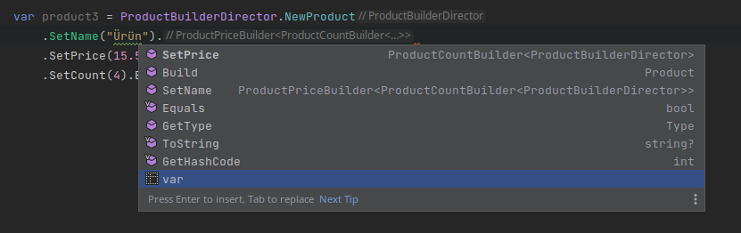

# C# Recursive Generic Kullanarak Fluent Builder Kodluyoruz

Merhaba arkadaşlar

Bu yazımızda amacımız recursive generic'leri kullanarak genişleyebilir ve tekrar kullanılabilir bir fluent builder yazmak.

Anlaşılması için örneklerde oluşturulacak alt nesneleri basit tipler olarak tanımladım. Sadece isim atamak veya fiyat girmek için bu kadar karmaşık bir builder kodlamaya gerek yok. Ayrıca soyutlamaları da özellikle kullanmadım ki asıl konumuz olan recursive generic kavramına odaklanabilelim. 

Burada bulduğumuz çözümler dışında daha birçok yöntemle bu aynı sonuca ulaşmak elbette mümkün. Bu nedenle tavsiyem burada yazılanlara alternatif üretmektense amaca odaklanmanız. Konuyu bıraktığımız yerden daha ileriye götürmeye çalışmak daha fazla öğrenmenizi sağlayacaktır. 

Basit bir builder yazıp onu gittikçe geliştireceğiz. 


Bildiğiniz üzere creational (yaratımsal) tasarım desenlerinden biri de builder tasarı desenidir. Karmaşık nesnelerin adım adım oluşturulmasını sağlayarak daha anlaşılabilir ve yönetilebilir bir yapı sunar. Bazen bir nesneyi oluştururken bir çok alt nesneyi e oluşturmak ve yönetmek durumunda da kalabiliriz. Bu gibi durumlarda da builder tasarım deseni süreci parçalara bölerek karmaşıklığı azaltır.


[Resim Kaynak](https://refactoring.guru/design-patterns/builder)

Çok karmaşık nesneleri zaten bir yaratımsal tasarım deseni kullanmadan oluşturmaya çalışmak constructor'a çok fazla yüklenmeyi gerektirir ki bu şekilde onlarca parametre içeren yapıcı metotlara da  telescoping constructor diyoruz. Bu şekilde oluşturulan nesnelerde kullanılmayan bir çok parametre, opsiyonlara (options, types, flags) göre farklı işler yapan sınıflar, iç içe yazılmış onlarca condition, test edilemeyen fonksiyonlar vb bir çok problemli durum ortaya çıkmaktadır.

Zaten yazılım geliştirirken SOLID prensiplerine aykırı en ufak bir hata ile kodumuz kokmaya (code smell) başlıyor. Yaratımsal tasarım desenleri de aslında yapılabilecek bu tarz hataların yayılmasını engelleyen en önemli araçlardan biri. İlgili nesnenin mecburen hatalarla oluşturulması gereken durumlarda nesnenin instance'ının oluşturulması dışarıdan soyutlanarak tabiri caizse virüsün dışarı yayılması da engellenmiş oluyor. 

Teori kısmına biraz değindiğimize göre çalışmaya başlayabiliriz.

En basit haliyle aşağıdaki gibi bir kodlama ile Product nesnesini adım adım oluşturabiliriz.
```c#

    public class Product
    {
        public string Name { get; set; }
        public double Price { get; set; }
        public int Count { get; set; }

        public override string ToString()
        {
            return $"Name:{Name}, Price:{Price}, Count:{Count}";
        }
    }

    public class ProductBuilder
    {
        private readonly Product _product;

        public ProductBuilder()
        {
            _product = new Product();
        }

        public ProductBuilder SetName(string name)
        {
            _product.Name = name;
            return this; ;
        }

        public ProductBuilder SetPrice(double price)
        {
            _product.Price = price;
            return this;
        }

        public ProductBuilder SetCount(int count)
        {
            _product.Count = count;
            return this;
        }

        public Product Build()
        {
            return _product;
        }
    }


    class Program
    {
        static void Main(string[] args)
        {

            var product = new ProductBuilder()
                                    .SetName("Ürün")
                                    .SetPrice(14.5)
                                    .SetCount(3)
                                    .Build();

            Console.WriteLine(product);
            //Name:Ürün, Price:14.5, Count:3
        }
    }

```

SetName, SetPrice ve SetCount fonksiyonları hep aynı nesneyi yani ProductBuilder builder nesnenesini geri döndürüyor. Daha karmaşık nesnelerin oluşturulmasında her zaman aynı objenin döndürülmesi yeterli gelmeyebilir. Bununla birlikte bazen çalıştırılacak builder objelerinin veya fonksiyolarının sıralaması da önemli olabilir. Örneğimizde Name, Price ve Count istenilen istenilen sırada çalıştırlabilir. Ancak bazen bu objeler birbirleiyle ilişkili olabilir ve biri tamamlanmadan diğeri oluşturulamıyor olabilir.

Product esnesinin oluşturulmasında SetName, SetPrice ve SetCount fomksiyonlarının çalıştırılmasında belli bir sıraya uymak zorunda değiliz. Örneğin alttaki kodda bize aynı product  nesnesini verecektir.

```c#

var product = new ProductBuilder()
                        .SetPrice(14.5)
                        .SetName("Ürün")
                        .SetCount(3)
                        .Build();
```


Örneğimizi biaz geliştirelim ve ve oluşturulacak alt nesnenler için ayru builder objeleri oluşturalım. Ayrıca adımların belli bir sıra tamamlanmasını sağlayalım.

```c#
    public class Product
    {
        public string Name { get; set; }
        public double Price { get; set; }
        public int Count { get; set; }

        public override string ToString()
        {
            return $"Name:{Name}, Price:{Price}, Count:{Count}";
        }

    }

 public class ProductNameBuilder
    {
        private Product _product;
        public ProductNameBuilder()
        {
            _product = new Product();
        }
        public ProductPriceBuilder SetName(string name)
        {
            _product.Name = name;
            var productPriceBuilder = new ProductPriceBuilder(_product);
            return productPriceBuilder; ;
        }
    }

    public class ProductPriceBuilder
    {
        private Product _product;
        public ProductPriceBuilder(Product product)
        {
            _product = product;
        }

        public ProductCountBuilder SetPrice(double price)
        {
            _product.Price = price;
            var productCountBuilder = new ProductCountBuilder(_product);
            return productCountBuilder;
        }
    }

    public class ProductCountBuilder
    {
        private Product _product;
        public ProductCountBuilder (Product product)
        {
            _product = product;
        }

        public ProductCountBuilder SetCount(int count)
        {
            _product.Count = count;

            return this;
        }

        public Product Build()
        {
            return _product;
        }
    }


    class Program
    {
        static void Main(string[] args)
        {

            var product2 = new ProductNameBuilder()
                .SetName("Ürün")
                .SetPrice(15.5)
                .SetCount(4)
                .Build();

            Console.WriteLine(product2);
            //Name:Ürün, Price:15.5, Count:4

        }
    }


```

Görüleceği üzere artık her alt nesnenin oluşturulmasını farklı bir builder ile yapmış olduk. Ayrıca her bir adım bir sonraki adımı da bize veriyor. Örneğin ProductNameBuilder sınıfındaki SetName fonksiyonu bize ProductPriceBuilder nesnesini döndürdüğü için bir sonraki adımı takip etmek zorunda bırakıyor böylece hata yapma riski ortadan kaldırmış olduk.

Ancak bu seferde her adım için instance'ları kendimiz oluşturduk ki buda çok tavsiye dilen bir durum değil. Yani creational pattern'lerin faydalarından yararlanmak için için builder pattern'i uygulamya çalışırken arada onlarca instance'ı doğrudan oluşturmak çok da mantıklı olmadı.


O zaman örneğimizi biraz daha geliştirelim. Bu sefer örneğimizi recursive generic kullarnarak yapalım.


```c#
    public class Product2
    {
        public string Name { get; set; }
        public double Price { get; set; }
        public int Count { get; set; }

        public override string ToString()
        {
            return $"Name:{Name}, Price:{Price}, Count:{Count}";
        }


        public class Builder :  ProductCountBuilder<Builder>
        {
        }

        public static Builder New => new Builder();

    }

    public abstract class ProductBuilder2
    {
        protected readonly Product2 Product;
        public ProductBuilder2()
        {
            Product = new Product2();
        }

        public Product2 Build() => Product;
    }


    public class ProductNameBuilder<T> : ProductBuilder2 where T : ProductNameBuilder<T>
    {
        public T SetName(string name)
        {
            Product.Name = name;
            var productNameBuilder = (T)this;
            return productNameBuilder;
        }
    }


    public class ProductPriceBuilder<T> : ProductNameBuilder<ProductPriceBuilder<T>> where T : ProductPriceBuilder<T>
    {
        public T SetPrice(double price)
        {
            Product.Price = price;
            var productPriceBuilder = (T)this;
            return productPriceBuilder;
        }
    }


    public class ProductCountBuilder<T> : ProductPriceBuilder<ProductCountBuilder<T>> where T : ProductCountBuilder<T>
    {

        public T SetCount(int count)
        {
            Product.Count = count;
            var productCountBuilder = (T)this;
            return productCountBuilder;
        }
    }


    class Program
    {
        static void Main(string[] args)
        {
            var product3 = Product2.New
                                .SetName("Ürün")
                                .SetPrice(10.9)
                                .SetCount(1)
                                .Build();

            Console.WriteLine(product3);
            //Name:Ürün, Price:10.9 Count:1

        }
    }


```

Bu şelilde soyutlamalardan daha fazla faydalanmış olduk böylece conrete nesnlere bağımlılığımız biraz daha zalmış oldı.

Product sınıfımıza bakacak olursak New adında bir fonksiyon Builder nesnemizi oluşturuyor. Dikkat edilirse yeni bir Product sınıfı yazıldığı görülüyor. Oluşturulan builder nesnesi de Product2 nesnesini inşa eden builder'ların en souncusu yani  ProductCountBuilder sınıfı. Bunun nedeni ise bu sınıfın kendinden önceki bütün kalıtımı içeriyor olması. Böylece bütün builder'rın sunmuş olduğu fonksiyonlara erişebiliyoruz. Eğer yanlış yerden başlayacak olursak hata almıyoruz ancak oluşan Product2 nesnemizde set edilmeyen property'ler boş gelmiş oluyor. Örneğin SetName yerine SetPrice'dan başlayıp SetCount yaptıktan sonra nesnemize ulaşacak olursak Name property'si  empty olarak dönecektir.


```c#
    public class Product2
    {
        public string Name { get; set; }
        public double Price { get; set; }
        public int Count { get; set; }

        public override string ToString()
        {
            return $"Name:{Name}, Price:{Price}, Count:{Count}";
        }


        public class Builder :  ProductCountBuilder<Builder>
        {
        }

        public static Builder New => new Builder();

    }
```

Product sınıfımızfda oluşturulan Builder nesnesi ProductCountBuilder\<Builder\> nesnesini miras almış. Bu sınıfı altta inceleyecek olursak onun da  ProductPriceBuilder\<ProductCountBuilder\<T>> sınıfını miras aldığı götülebilir. Yani son tahlilde bizim generic T tipimiz recursive bir şekilde geriye doğru geçtiği bütün sınıfları içinde barındırmış oluyor. Yukarıya doğru yani ProductCountBuilder sınıfına kadar içinde bütün sınıfları ve fonksiyonları taşımış oluyor.


```c#

    public class ProductCountBuilder<T> : ProductPriceBuilder<ProductCountBuilder<T>> where T : ProductCountBuilder<T>
    {

        public T SetCount(int count)
        {
            Product.Count = count;
            var productCountBuilder = (T)this;
            return productCountBuilder;
        }
    }


```

Bu sayede Product sınıfında oluşturduğumyuz Builder sınıfı üzerinden bütün builder'lara ve dolayısıyla nesnemizi oluşturacak  foksiyonlara erişmiş oluyoruz. Sistem SetName fonksiyonu çağrıldıktan sonra sadece bir sonraki adımı yani SetPrice fonksiyonunu sunacaktır.



```c#
var product3 = Product2.New
                    .SetName("Ürün")
                    .SetPrice(10.9)
                    .SetCount(1)
                    .Build();

```

Ancak bu sistemde hala bir eksiklik var. Örneğin bu yapıyı kullanarak bir bilgisayar objesini inşa edemiyoruz. Ayrıca son adım olan ProductCountBuilder nesnesinden sonra yeni bir builder ekleecek olsak Product nenemizi de değiştirmek durumda kalacağız. Çünkü son adım değişeceği için Builder sınıfımızı yeni adımdan miras almalıyız.

Eğer bu iki negatif durumuda halledebilirsek biraz daha esnek bir yapımız olmuş olacak.

Yeni bir Product sınıfı yazdık (Product3). Ancak bu sefer bir interface kullanarak yaptık çünkü oluştuccağımız diğer nesneleri soyutlamamız gerekiyor. Öncelikle Product3 sınıfı için bir builder yapısı kuruyoruz. Ardından bu sınıftan türeyecek Computer nesnesi için bir builde geliştiriyoruz. Product3 için geliştirdiğimiz builder yapısınıa yeni builder sınıfları ekliyoruz. Son Computer nesnesinde Car nesnesini miras alarak Car için gerekli builder sınıflarını Computer yazdıklarımıza ekliyoruz. Bu arada Car nesnesini Computer'dan değil Product3'den de türetebilir ve yine Product3 için yazılmış builer'ları genişleterek Computer'dan bağımsız farklı bir builder kurgududa geliştrebilirdik.


```c#
public interface IProduct3
{
    public string Name { get; set; }
    public double Price { get; set; }
    public int Count { get; set; }
}

public class Product3 : IProduct3
{
    public string Name { get; set; }
    public double Price { get; set; }
    public int Count { get; set; }

    public override string ToString()
    {
        return $"Name:{Name}, Price:{Price}, Count:{Count}";
    }

    public class Builder :  GenericProductBuilder<Builder>
    {

    }

   public static Builder New => new Builder();

}

public class ProductNameBuilder3<T>  where T : ProductNameBuilder3<T>
{
    private IProduct3 _product3;

    public ProductNameBuilder3(IProduct3 product3)
    {
        _product3 = product3;
    }

    public T SetName(string name)
    {
        _product3.Name = name;
        return (T)this;

    }
}


public class ProductPriceBuilder3<T> : ProductNameBuilder3<ProductPriceBuilder3<T>> where T : ProductPriceBuilder3<T>
{

    private IProduct3 _product3;

    public ProductPriceBuilder3(IProduct3 product3):base(product3)
    {
        _product3 = product3;
    }


    public T SetPrice(double price)
    {
        _product3.Price = price;
        return (T)this;
    }


}


public class ProductCountBuilder3<T> : ProductPriceBuilder3<ProductCountBuilder3<T>> where T : ProductCountBuilder3<T>
{


    private readonly IProduct3 _product3;

    public ProductCountBuilder3(IProduct3 product3):base(product3)
    {
        _product3 = product3;
    }

    public T SetCount(int count)
    {
        _product3.Count = count;
        return (T)this;
    }
}


public class GenericProductBuilder<T> : ProductCountBuilder3<GenericProductBuilder<T>> where T : GenericProductBuilder<T>
{
    private static readonly IProduct3 _product3=new Product3();
    public GenericProductBuilder():base(_product3)
    {
    }
    public IProduct3 Build() => _product3;
}


//----------------------------------------- Computer nesnemiz için Product Builder nesnesini geliştiriyoruz.
public class Computer : Product3
{
    public string Manufacturer { get; set; }

    public override string ToString()
    {
        return $"Name:{Name}, Price:{Price}, Count:{Count}, Manufacturer: {Manufacturer}";
    }

    public class Builder :  GenericComputerBuilder<Builder>
    {
    }

    public static Builder New => new Builder();

}


public class ComputerManufacturerBuilder<T> : ProductCountBuilder3<ComputerManufacturerBuilder<T>> where T : ComputerManufacturerBuilder<T>
{


    private readonly Computer _computer;

    public ComputerManufacturerBuilder(IProduct3 product3):base(product3)
    {
        _computer = (Computer)product3;
    }

    public T SetManufacturer(string manufacturer)
    {
        _computer.Manufacturer = manufacturer;
        return (T)this;
    }
}


public class GenericComputerBuilder<T> : ComputerManufacturerBuilder<GenericComputerBuilder<T>> where T : GenericComputerBuilder<T>
{
    private static readonly IProduct3 _computer=new Computer();
    public GenericComputerBuilder():base(_computer)
    {
    }
    public Computer Build() => (Computer)_computer;
}


//-------------------------------------------------------------------------------------- car nesnemiz için Computer Builder nesnesini geliştiriyoruz.


public class Car : Computer
{
    public string Model { get; set; }

    public override string ToString()
    {
        return $"Name:{Name}, Price:{Price}, Count:{Count}, Manufacturer: {Manufacturer}, Model: {Model}";
    }

    public class Builder :  GenericCarBuilder<Builder>
    {
    }

   public static Builder New => new Builder();

}


public class CarModelBuilder<T> : ComputerManufacturerBuilder<CarModelBuilder<T>> where T : CarModelBuilder<T>
{
    private readonly Car _car;

    public CarModelBuilder(IProduct3 product3):base(product3)
    {
        _car = (Car)product3;
    }

    public T SetModel(string model)
    {
        _car.Model = model;
        return (T)this;
    }

}


public class GenericCarBuilder<T> : CarModelBuilder<GenericCarBuilder<T>> where T : GenericCarBuilder<T>
{
    private static readonly Car _car=new Car();
    public GenericCarBuilder():base(_car)
    {
    }
   public Car Build() => _car;
}
//--------------------------------------------------------- Kodumuz test ediyoruz.

    class Program
    {
        static void Main(string[] args)
        {

            var product5 = Product3.New
                .SetName("Ürün")
                .SetPrice(12.5)
                .SetCount(2).Build();

            Console.WriteLine(product5);
// Name:Ürün, Price:12.5, Count:2


            var computer = Computer.New
                .SetName("Bilgisayar")
                .SetPrice(12.5)
                .SetCount(2)
                .SetManufacturer("Dell")
                .Build();

            Console.WriteLine(computer);

// Name:Bilgisayar, Price:12.5, Count:2, Manufacturer: Dell

            var car = Car.New
                .SetName("Araç")
                .SetPrice(12.5)
                .SetCount(2)
                .SetManufacturer("Fiat")
                .SetModel("Egea")
                .Build();

            Console.WriteLine(car);
      }
    }

// Name:Araç, Price:12.5, Count:2, Manufacturer: Fiat, Model: Egea

```

Son tahlilde istediğimiz nokta ya gelebildik. Tabiiki bu kadar basit sınıflar ve primitive tipler için böyle bir yapı kurmak çokda mantıklı değil. Ayrıca bunu yazmanında daha basit farklı yolları da bulunabilirdi. Baştada dediğim gibi amacımız mevzuyu yavaş yavaş recursive generic'lere getirme ve neler yapılabilceğine basit bir örnek vermekti.

Umarım faydalı olmuştur.


# Kaynaklar
- https://www.evrenbal.com/builder-tasarim-deseni-nedir
- https://refactoring.guru/design-patterns/builder
- http://www.javaturk.org/tasarim-kaliplari/
- https://methodpoet.com/builder-pattern/
- https://code-maze.com/fluent-builder-recursive-generics/
- https://medium.com/@hazraarka072/fluent-builder-and-powering-it-up-with-recursive-generics-in-java-483005a85fcd
