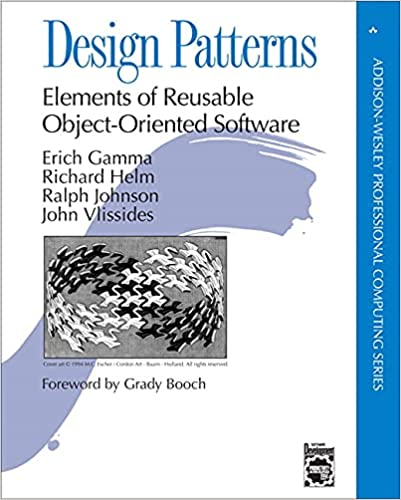
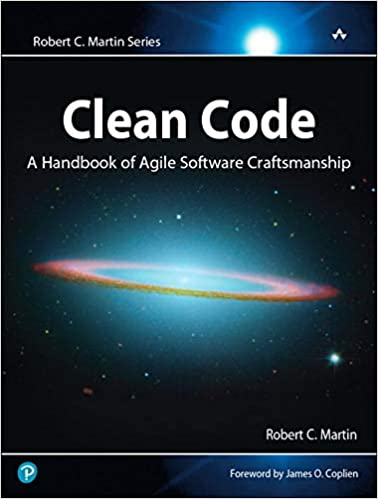
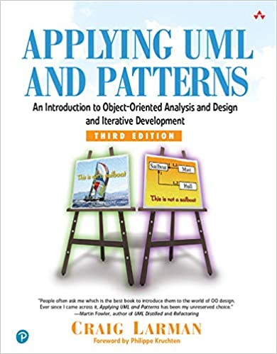
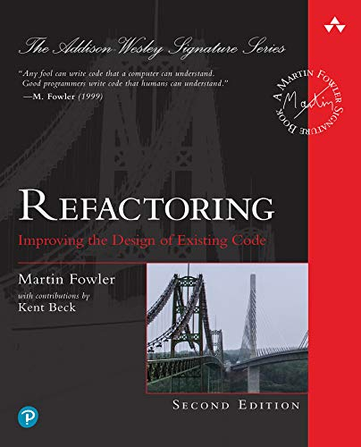
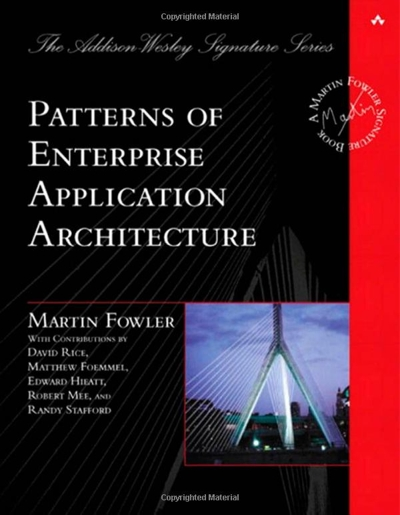

# Tasarım Desenlerini Neden Kullanamıyoruz?

Merhaba arkadaşlar,

Eğer yazının başlığından dolayı buraya geldiyseniz tahminim siz de bir çok yazılımcı gibi tasarım desenlerini defalarca kez çalışıp doğru düzgün kullanamadan unuttunuz. 

Hikaye şöyle başlar, her defasında bir söz verilir artık kullanacağım diye ama hiç kullanılmaz. Çünkü ihtiyaç duyulmaz. Kod yazarken tam olarak tasarım desenini çalıştığımız örnek duruma veya uml diyagramına benzer bir yapının birebir denk geleceğini düşünürüz. Bu durum yaşandığı anda da hemen ilişki kurup veya hissedip :) "ha işte beklediğim an geldi" deyip ilgili tasarım desenini kullanabileceğimizi zannederiz. Tabii ki öyle bir an yaşanmadığı için unutulur. Dolayısıyla ihtiyaç da duyulmamış olur.

Belki ilk yanılgı tasarım desenlerinin doğrudan amaç olarak görülmesinden dolayı birebir aynı durumlar yakalanmaya çalışılır. Örneğin "bir gün öyle bir nesne yaratmam gerekecek ki o nesne çok büyük olacak, yapıcı metodunda bir ton parametre gerekecek, çok karmaşık olacak ve bundan dolayı ben onun için builder tasarım desenini kullanacağım. O gün yazılım hayatımın altın günü olacak :)" gibi planlar yapılır.

Ancak böyle bir bakış açısıyla tasarım desenlerinin hafızamızda kalması veya birebir aynı yapıya uygun bir pattern yakalamaya çalışarak uygulanmaya çalışılması zor olacaktır.

 

Bu nedenle öncelikle tasarım desenlerine bakışımızı değiştirmemiz gerekiyor. Yukarıda bahsettiğim durumlar aslında tasarım desenlerinin bir amaç edinildiğini gösteriyor. Halbuki asıl amacımız prensiplere uymak/uygulamak olmalıdır.

Alttaki listede en çok kullanılan prensiplerden bazılarını bulabilirsiniz.
 
- **SOLID** : Single Responsibility (SRP), Open/Closed (OCP), Liscov Substitution (LSP), Interface Segregation (ISP), Dependency Inversion (DIP)
- **GRASP**: General Responsibility Assignment Software Principles (controller, creator, indirection, information expert, low coupling, high cohesion, polymorphism, protected variations, ve pure fabrication)
- **YAGNI** : You Aren't Gonna Need It Principle
- **DRY** : Don't repeat yourself
- **KISS** : Keep It Simple Stupid Principle

Daha bir çok prensip var tabii ki. Bunlar ve diğerleri için bir çok kaynak bulabilirsiniz.

Yani işin özü kendinizi öncelikle temiz kod yazmaya alıştırmalısınız. Bu süreç tasarı desenlerini hazmekten çok daha fazla zaman alabilir. Bunun için e temel bir kaç kaynağı ekliyorum. Ne yazık ki bu kaynakların hepsi İngilizce. Dağınık ta olsa birçoğu için Türkçe kaynaklar bulabilirsiniz. Ancak en doğrusu İngilizcenizi bunları anlayacak seviyeye getirmek olacaktır.

[Design Patterns: Elements of Reusable Object-Oriented Software](https://www.amazon.com.tr/Design-Patterns-Elements-Reusable-Object-Oriented/dp/0201633612)

[Clean Code: A Handbook of Agile Software Craftsmanship](https://www.amazon.com/Clean-Code-Handbook-Software-Craftsmanship/dp/0132350882)

[Applying UML and Patterns: An Introduction to Object-Oriented Analysis and Design and Iterative Development ](https://www.amazon.com/Applying-UML-Patterns-Introduction-Object-Oriented/dp/0131489062)

[Refactoring: Improving the Design of Existing Code](https://www.amazon.com/Refactoring-Improving-Existing-Addison-Wesley-Signature/dp/0134757599)

[Patterns of Enterprise Application Architecture](https://www.amazon.com/Patterns-Enterprise-Application-Architecture-Martin/dp/0321127420)

Prensiplerin olmadığı bir dünyada zaten her şeyi istediğimiz gibi yazarız. Bu durumda her durum için ayrı prensip ezberlemek durumunda kalırız ki bu hakikaten salt ezberlemek olur. Halbuki bizi tasarım deseni yazmaya zorlayan şey prensiplere uyma zorunluluğumuz olmalıdır. Zaten aynı durumlar yaşandıkça bunlar için geliştirilen teknikleri yazılı hale getirmek [birilerinin aklına gelmiş](https://en.wikipedia.org/wiki/Design_Patterns).

Bazen doğrudan bir amacımız yada bir problem için çözüm arayışımız da olabilir. Ancak tasarım desenlerinin amacı yine de doğrudan sadece amacınız veya probleminiz için çözüm üretmek değil doğru yani prensiplere uygun çözüm üretmektir. Yani bizim doğru yolda kalmamızı sağlamaya çalışırlar.  

## Problemi Tanımlamak, Çözüm Üretmekten Zordur

Ortada bir problem olup olmadığını anlamak veya problemi tanımlamak ona çözüm üretmekten zordur. Örneğin SOLID prensiplerinden biri olan single responsibility prensibini onlarca kez okuruz. Okurken çok karmaşık gelmez. Bir çok developer fonksiyonları single responsible yazdığını düşünür. Ancak bir namespace/package'ı veya bir class'ı nasıl single responsible yazabiliriz diye düşünmeyiz. İlgili katmanda veri odaklı bir dosya ve class adı verdiğimizde olayın bittiğini düşünürüz. Kendimizi prensiplerle kısıtlamadığımız sürece de bir problem yaşamadan uzunca bir süre sorun yaşamayız. Bu durumda iş işten geçene kadar da hiç bir şey hissetmeden kod yazabiliriz.

Diğer bir SOLID prensibi olan open/closed prensibini düşünelim. Genellikle class'lar ile ilgili bir konuymuş gibi görünmesine rağmen aslında yazılımın bütün parçalarını kapsar. Örneğin bir class'ı değişime kapalı, gelişime açık yapabilmenin yolu  aynı zamanda fonksiyonları da  aynı prensiple yazmaktan geçiyor. Bir fonksiyonu open/closed prensibine uygun yazarken dikkat edilmesi gereken en önemli konulardan biri fonksiyonu single responsibility'ye uygun yazmaktır. Bu sayede amacına sıkı sıkıya bağlı bir fonksiyonun değişmesi için daha az neden olacaktır.

Çok karmaşık ve bir kaç sürecin tamamlanması sonucunda oluşturulacak  bir sınıfımızın olduğunu varsayalım. Eğer prensipler olmasaydı böyle bir sınıfı örneğin 20 adet parametreli bir constructor (yapıcı metot) ile oluşturabilirdik. Büyük ihtimal uzunca bir süre bu sınıf sorunsuzca kullanılabilirdi. Ancak bir süre sonra bütün parametrelere sahip olmayan ancak bu sınıfa ihtiyacı olan diğer sınıflar constructor'a null parametreler geçirerek instance'lar oluşturmaya başlayacaktır. Bu durumda kod gittikçe karmaşıklaşacaktır çünkü sınıfın her talebe cevap vermesi gerektiği için içine bir çok if bloğu yazmak durumunda kalacağız. Bunun gibi başka sınıflar da yazdığımızı bir düşünün. Bu olayın sonu koca bir namespace veya paketin yolundan sapması yani single responsible bir yapıyı sağlayamamış oluruz.

Aynı class'ı en temel prensiplerden SOLID prensiplerine uygun yazmaya çalışsaydık öncelikle single responsible bir sınıf yazmaya çalışacaktık. Bu belki bizi birden fazla class yazmaya zorlayacaktı çünkü 20 parametre ile kurulan bir nesnenin tek bir şeye odaklanması zor görünüyor. Peki sınıfın hakikaten bu kadar çok parametre ile oluşturulması gerekiyorsa ancak bu sınıftan instance oluşturacak her nesnede parametrelerin hepsi bulunmuyorsa bu durumda ne yapacağız? Interface Segregation prensibine göre bu sınıflara aynı interface'e bağımlı yapmamamız gerekiyor. Ayrıca sınıfımızın bazı süreçlere bağlı olduğunu da söylemiştik. Yani adım adım oluşturulması gereken bir sınıfımız var. Bu kısıtlara göre kod yazmaya çalıştığımızda kendimizi bir builder tasarım deseni yazarken bulabiliriz. Dikkat edersek builder tasarım desenini bilsek dahi prensipleri zorlamadan kod yazıyor olsaydık tasarım deseni kullanmayı gerektiren bir problemimiz de olmayacaktı. Eğer temel tasarım desenlerinden haberdarsak ihtiyacımız olan pattern'i bulmak çok zor olmayacaktır. Çünkü ne istediğimizi çok iyi biliyor olacağız. İşin zor olan kısmını yani problemi tanımlama kısmını halletmiş olacağız.

Sonuç olarak prensipler sayesinde kodumuz büyüdükçe yaşanabilecek problemleri engellemiş oluruz. Prensiplere uymak için de tasarım desenlerini uygulama durumunda kalırız. Problemleri her zaman deneyimleyerek çözmeye çalışmamıza gerek yok. Her zaman başa dönemeyeceğimiz için prensipler problemleri daha yaşamadan önlememizi sağlar.

## Ezberlemek Kötü Bir Şey Değildir

Buraya kadar salt ezberin anlamsız ve kalıcı olmayacağını söylemiş gibi olduk. Tabii ki bu ezber yapmanın tamamen gereksiz olduğunu göstermiyor. Son tahlilde ihtiyacımız olduğunda ilgili tasarım desenini hatırlamak isteriz. Ezberlemekten kastımız şiir, şarkı veya tekerleme ezberlemek gibi mantıksal  kurguyu oturtmadan ezberlemek değil elbette. Ancak bazen büyük ve birbirleriyle ilişkili başlıklardan oluşan bir konunun ana başlıklarını birer cümleyle de olsa ezberlemek çalıştığınız konunun mantığını da, öğrenme sürecimizi de hızlandırabilir.

Aslına bakarsanız tasarım desenlerinin anlatıldığı kaynaklarda devamlı olarak aralarındaki ilişkilere değinilmesenin  bir sebebi de akılda kalmasını sağlamaktır. İlk kez çalıştığınız bir tasarım deseninde diğer tasarım desenlerinden bahsedildiğinde ilk okumada bir şey ifade etmemesi gayet normal. Ancak ezberden de olsa tasarım desenlerinin hangi durumlarda kullanıldığını ve nasıl kurgulandığını bir kaç cümle ile ezbere biliyor olmamız aralarındaki ilişkileri daha kolay anlamamızı ve dolayısıyla daha kalıcı olmalarını da sağlayacaktır.  

Ezberleme tekniklerinden bazılarını alttaki listede bulabilirsiniz.

- **Loci Yöntemi**: Bilgileri mekanla ilişkilendirmeye dayanır
- **Akrostiş (İlk Harf) Yöntemi**: Bilgilerin ilk harfleri ile anlamlı kelimeler üretme üzerinde kuruludur
- **Hikaye Oluşturma**: Bilgi ile akılda kalıcı bir hikaye oluşturma
- **Kanca Yöntemi**: Sayılar ile bilgi arasında bağ kurarak yapılır. Sayıları zaten bildiğimiz için anlamlı bir ilişki kurduğumuz bilgiyi hatırlamaya çalışırız.

Daha bir çok teknik var tabii ki. Özellikle görsel hafızanızı geliştirmek UML diyagramlarını aklınızda tutmayı kolaylaştıracaktır. İlk başta birer cümle ile bile olsa hepsini ezberleyip saha sonra çalışmaya başlamanız tasarım desenleri arasındaki yapısal ilişkileri ve birlikte kullanım senaryolarını anlamanızı kolaylaştıracaktır. 

## Tasarım Desenlerini Birebir Öğrendiğiniz Kalıbı Kullanarak Uygulamak Zorunda Değilsiniz

Tasarım desenlerinin anlatıldığı kaynaklarda çizilen diyagramları birebir değiştirmeden uygulamak zorunda değiliz. İlk maddede "Tasarım Desenleri Amaç Değil Sonuçtur" demiştik. Amacımız prensiplere uygunluk, pattern'leri olduğu gibi uygulamak zorunda değiliz. İhtiyacımıza göre değiştirmemiz aslında bakarsanız bir zorunluluk. Çünkü aldığımız kaynaktaki durum ile bizim yaşadığımız durum arasında farklılıklar olabilir ve doğrudan uygulamak bazı prensiplere aykırı sonuç doğurabilir.

Hatta öğrenmeyi kolaylaştırması için örnek olarak yazacağınız  kodlarda doğrudan concrete (somut) nesnelerle bile çalışabilirsiniz. Kaynaklarda bu tarz örneklere de eminim rastlamışsınızdır. Bu da tamamen başka bir eğitim tekniği. Amaç konuya odaklanmak ve kalıcılığı arttırmak. Öğrenirken detaylarla ilgilenmeyip doğrudan tasarım deseninin amacına odaklanmak ve daha sade bir diyagramı akılda tutmak hem anlamayı hem de kalıcılığı arttıracaktır.

Özellikle birden fazla tasarım desenini aynı anda uygulamak durumundaysanız bazı değişiklikler yapmak durumda kalacaksınız. Zaten bundan dolayı adını bile duymadığımız yüzlerce tasarım deseni ortaya çıkmış durumda. Ancak yapacağınız değişikliklerde naming convention'lara dikkat etmeliyiz. Örneğin factory kelimesi yerine builder kelimesini kullanmamalıyız. Factory method tasarım desenini  ne kadar farklı kullansak da sonuçta bir factory metodumuz olacak ve nesnemizi oluşturacaktır.

Şimdi birazda akılda kalmasını kolaylaştıracak egzersizler yapalım. Amacımız her adımda içerikleri biraz daha genişleterek ve tekrar yaparak aklımızda kalmasını sağlamak olacak. Bu nedenle yazıyı ikiye bölmek zorunda kaldım çok tekrar olduğu için yazı biraz uzadı haliyle. Ufak ufak mevzuyu büyütüyor olacağız ve bir sonraki adımda bir önceki adımı da içerek şekilde 

## Tek Cümle İle Tasarım Desenlerinin Amaçları

Bir kaç tekrarlayarak ezberlemeye çalışalım ama tamamen hepsinin aklımızda kalması gerekmiyor amacımız bir sonraki adıma hazırlık.  

### Oluşturucu (Creational) Tasarım Desenleri

Creational tasarım desenleri nesneleri doğrudan somutlaştırmak yerine nesneler yaratan kalıplardır. Bu, belirli bir durum için hangi nesnelerin oluşturulması gerektiğine karar vermede programa daha fazla esneklik sağlar ve tekrar kullanılabilirliği arttırır.

- **Singleton**: Bir sınıf için nesne oluşturmayı bir instance (örnek) ile kısıtlar. Biraz daha farklı bir anlatımla tek bir nesnenin ona ihtiyaç olan bütün nesnelerce kullanılmasını sağlar. 

- **Factory Method**: Bir metot yardımıyla aynı interface'den türetilmiş farklı sınıflardan instance (örnek) oluşturmak için kullanılır. 
  
- **Abstract Factory**: Birbiriyle ilişkili ancak birbirinden farklı bir grup nesneyi bir sınıf içindeki birden fazla factory metotla oluşturmamızı sağlar. Gerektiğinde birden fazla factory sınıfından meydana gelebilir.

- **Builder**: Karmaşık bir nesnenin oluşturulma süreci/adımları ile sunumunu birbirinden ayırarak aynı nesnenin farklı türlerinin oluşturulmasını sağlar. 

- **Prototype**: Oluşturulması çok maliyetli olan nesnelerin daha önce oluşturulmuş benzer örneklerinden klonlama/kopyalama yapılmasını sağlar.

### Yapısal (Structural) Tasarım Desenleri

Structural tasarım desenleri sınıf ve nesnelerin bileşimi ile ilgilidir. Yapıları esnek ve verimli tutarken daha büyük yapıların oluşturabilmesi için nesne ve sınıfların nasıl bir araya geleceğini açıklar. Birleşmelerde genellikle inheritance (miras alma) olma kullanılır. Yani is-a ilişkisi has-a ilişkisine tercih edilir. 

- **Adapter**: İki farklı interface'in birlikte çalışabilmesini sağlar.

- **Bridge**: Nesnenin soyutlaması ile implementasyonunu birbirinden ayırmak için kullanılır. Böylece ikisi birbirinden bağımsız genişleyebilir.

- **Composite**: Ortak arayüze sahip nesneler arasında parent-child (tree) ilişkisi kurulabiliyorsa istemciyi parçalardan soyutlayıp tek bir nesne ile muhatap kılmak için kullanılır.

- **Decorator**: Dinamik olarak bir nesneye yeni sorumluluklar eklemek veya değiştirmek için kullanılır.

- **Facade**: Çok karmaşık sistemleri kullanmak için daha basitleştirilmiş bir arayüz sunmak için kullanılır.

- **Flyweight**: Tek başına küçük olmasına rağmen yüzlerce oluşturulduğunda çok maliyetli olacak nesnelerin oluşturulmasında kullanılır.

- **Proxy**: Gerçek nesnenin yerine geçerek istemci tarafında hiç bir değişiklik yaptırtmadan gerçek nesnenin ya hiç yapamadığı yada eksik yaptığı bazı işleri yapmak için kullanılır.

### Davranışsal (Behavioral) Tasarım Desenleri

Behavioral tasarım desenleri nesneler arasındaki iletişimle ve doğru iletişim yöntemleri ile algoritma ve sorumlulukların atanması ile ilgilenir. 

- **Chain of Responsibility**: Bir nesne üzerinde yapılması gereken bir dizi işlemi istemcinin kendi kararı ile nesneyi ilgili sorumluluğu yapabilecek nesnelere geçirerek tamamlamayı sağlar.

- **Command**: İstemcinin talebini(action, function ve parametreler) bir nesne olarak aracı nesne üzerinden alıcıya ulaştırılır. Amaç istemcinin talebi ile alıcının cevabını birbirinden soyutlamaktır. 

- **Interpreter**: Belli bir düzendeki metinlerin işlenmesi gereken durumlarda kullanılır.

- **Iterator**: Bir koleksiyonun elemanlarını tiplerinden bağımsız gezmek için kullanılır.

- **Mediator**: Benzer işleri yapan nesneler arasındaki karmaşık bağımlılıkları gevşek bağımlılık ile ortadan kaldırmak için kullanılır. Anlamı da zaten arabulucudur.

- **Memento**: Bir nesnenin iç yapısını ve uygulama detaylarını saklayarak önceki state'ine geri dönmeyi sağlamak için kullanılır. 

- **Observer**: Bir nesnede meydana gelen değişiklikleri bunlardan haberdar olmak isteyen nesnelere duyurmak için kullanılır.

- **State**: Bir nesnenin iç durumu değiştiğinde davranışının da değişmesini sağlamak için kullanılır.

- **Strategy**: Çalışma anında aynı işi yapan bir grup algoritmadan birini seçebilmek için kullanılır.

- **Template Method**: Belli bir sırada/düzende yapılması gereken bir dizi işin hem sırasını/düzenini belirlemek hem de yapılacak bu işlerden bazılarının alt sınıflar tarafından yapılabilmesini sağlamak için kullanılır.

- **Visitor**: Bir nesneyi değiştirmeden nesne üzerinde yeni operasyonlar çalıştırmamızı sağlayan tasarım desenidir

## Gerçek Hayattan Örneklerle Tasarım Desenleri

Şimdi bu tanımların üzerine gerçek hayattan örnekler vererek pekiştirmeye çalışalım. Her yeni başlıkta bir önceki başlıkta öğrendiğimizi tekrar ederek devam edeceğiz. Örneklerde amacımız bir uygulama içinde yazılması muhtemel örnekler vermekten ziyade gerçek hayatta yaşamamızın muhtemel olduğu örnekler vermek. Bir nevi hikayeleştirme ve farklı objelerle ilişki kurarak hafızamızda daha kalıcı olmasını sağlamış olacağız. 
### Oluşturucu (Creational) Tasarım Desenleri

Nesneleri doğrudan somutlaştırmak yerine nesneler yaratan kalıplardır. Bu, belirli bir durum için hangi nesnelerin oluşturulması gerektiğine karar vermede programa daha fazla esneklik sağlar.

- **Singleton**:

**Amaç:** Bir sınıf için nesne oluşturmayı bir instance (örnek) ile kısıtlar. Biraz daha farklı bir anlatımla tek bir nesnenin ona ihtiyaç olan bütün nesnelerce kullanılmasını sağlar. 
  
**Örnek:** Örneğin evdeki buzdolabını evdeki bütün bireylerin kullanması veya bir çöp konteynerini sokaktaki bir grup komşunun beraber kullanması gibi. Kodlama yaparken de bu tarz bir nesneye ihtiyaç duyduğumuzda bunu garantileyecek tasarım deseni singleton'dur.

- **Factory Method**: 

**Amaç:** Aynı interface'den türetilmiş farklı sınıflardan instance (örnek) oluşturmak için kullanılır. Tek bir metottur. 
  
**Örnek:** Örneğin aynı araba markasına sahip farklı modeller üretilmesini sağlayan bir fabrika düşünelim.

- **Abstract Factory**: 

**Amaç:** Birbiriyle ilişkili ancak birbirinden farklı bir grup nesneyi oluşturur. Bir sınıftır, birden fazla factory metottan meydana gelir. Hatta bazen birden fazla factory sınıfından meydana gelebilir.

**Örnek:** Örneğin farklı araba markalarına ait farklı modellerin üretildiği bir fabrika düşünelim. Hatta üçüncü bir boyut bile eklenebilir mesela farklı ülkeler için farklı markaların farklı modellerini üretmek için farklı farklı fabrikalar kullanılması gibi.

- **Builder**: 

**Amaç:** Karmaşık bir nesnenin oluşturulma süreci/adımları ile sunumunu birbirinden ayırarak aynı nesnenin farklı türlerinin oluşturulmasını sağlar. 

**Örnek:** Bir araba almak istediğimizde galeriye gideriz. Hangi özellikleri istediğimizi söyleriz ve belli bir süre sonra istediğimiz araç fabrikada üretilir ve teslim edilir. Haliyle üretim süreci karmaşıktır, bir çok iş sırayla ve belirli süreçler takip edilerek tamamlanır. Aracın yapımı ve süreçleri fabrikada yapılırken sunumu ve satışı galeri tarafından yapılır.

- **Prototype**: 
  
**Amaç:** Oluşturulması çok maliyetli olan nesnelerin daha önce oluşturulmuş benzer örneklerinden klonlama/kopyalama yapılmasını sağlar.

**Örnek:** Çilingire anahtar kopyalamaya gittiğimize bir an için çilingirin kopyası oluşturulacak anahtarın gireceği kapı anahtar göbeğini istediğini ve içini açıp milim milim uzunlukları ölçtüğünü, anahtarın dişlerinin açılarını hesapladığını ve bu hesaba göre bize anahtarı ürettiğini hayal edelim. Bu şuan kopyalamayı bildiğimiz için ne kadar gereksiz geliyor değil mi? 

Bir satırlık kod ile kolaylıkla oluşturduğumuz bazı nesnelerin sistem tarafından ne kadar cpu,memory ve network kullanılarak üretildiğini düşünürsek bu hatayı ne kadar çok yaptığımızı anlayabiliriz. Biz kod yazmadığımız için sanki o kadar iş yokmuş gibi geliyor olabilir. Ancak  performansın önemli olduğu çok kullanıcılı bir uygulamada bir  nesnenin sistemi ve network'ü yoğun kullanarak oluşturulması ciddi problemlere sebep olabilir.

### Yapısal (Structural) Tasarım Desenleri

- **Adapter**: 

**Amaç:** İki farklı interface'in birlikte çalışabilmesini sağlar. 

**Örnek:** Gerçek hayatta kullandığımız adaptörler tam olarak aynı işi yapmaktadır. Amerika'dan aldığımız bir elektronik cihazın fişini Türkiye'deki prizlere uygun hale getirmek için kullandığımız adaptörler buna örnektir.

- **Bridge**:

**Amaç:** Nesnenin soyutlaması ile implementasyonunu birbirinden ayırmak için kullanılır. Böylece ikisi birbirinden bağımsız genişleyebilir.

**Örnek:** Gerçek hayat örneğini vermek biraz zor ancak yine teşbihte hata olmaz deyip örneklendirmeye çalışalım. Örneğin araba üretiyor olalım. Arabaları tüm müşterilerin isteklerini karşılayacak şekilde üretmemiz imkansız olacaktır. Onun yerine arabaları elimizdeki teknik dokümanlara göre (abstraction) temelde sahip olması gereken tüm parçaları ile üretip müşteriden müşteriye değişim gösteren özellikleri satın alma esnasında müşterilerimizden alıp üretimin tamamlanmasını sağlamak daha az maliyetli olacaktır. Örneğin rengi, sunroof olup olmaması gibi.

- **Composite**: 

**Amaç:** Ortak arayüze sahip nesneler arasında parent-child (tree) ilişkisi kurulabiliyorsa istemciyi parçalardan soyutlayıp tek bir nesne ile muhatap kılmak için kullanılır.

**Örnek:** Amaç nesnelerin tree yapısında tek bir bileşik nesne olarak oluşturmaktır. Şuan tabii ki bu tarz kütüphaneler artık dillerde mevcut ancak kitabın yazıldığı tarihleri düşünecek olursak pattern olarak anlatılmaya çalışılması mantıklı görünüyor. Örneğin bir galeriye gittiniz ve bir aracın fiyatını sordunuz ve satıcı size bütün parçaların fiyatını tek tek hesaplamaya başladı. Bu çok anlamsız olur haliyle. Tabii ki bir aracın fiyatını hesaplamak için bütün parçaların fiyatı tek tek bilinmeli ancak bu alıcı olarak bizi ilgilendirmiyor.

- **Decorator**: 

**Amaç:** Dinamik olarak bir nesneye yeni sorumluluklar eklemek veya değiştirmek için kullanılır.

**Örnek:** Tam bir örnek olamayabilir ama akılda kalıcı olacağını düşünüyorum. Mesela benzinli aracımıza LPG taktırmak buna örnek olabilir.

- **Facade**:

**Amaç:** Çok karmaşık sistemleri kullanabilmek amacıyla daha basitleştirilmiş bir arayüz sunmak için kullanılır.

**Örnek:**Örneğin bir aracı kullanırken direksiyonun arkasında neler döndüğünü bilmeyiz. Yada bilgisayar kullanırken tek bildiğimiz klavye, mouse ve monitördür geri kalan detayları bilmemize gerek yoktur.

- **Flyweight**: 

**Amaç:** Tek başına küçük olmasına rağmen yüzlerce oluşturulduğunda çok maliyetli olacak nesnelerin oluşturulmasında kullanılır.

**Örnek:** İllaki nesneleri o kadar sayıda oluşturmaya gerek olmayabilir, acaba başka bir yolu yok mudur bu işin mantığı ile çözüm üretilir. Örneğin bir araç kiralama firması muhtemel farklı bin müşteri için bin adet araç satın alamaz. Onun yerine yüz aracı farklı zamanlarda onlara kiralar. Yani bin müşterinin işi görülür fakat bu yüz araçla yapılır. Aracın hangi tarihte kime ait olacağı gibi özellik aracın iç özelliklerinden değildir sadece bir durumdur onu değiştirerek aynı hizmet verilir.

- **Proxy**: 
  
**Amaç:** Gerçek nesnenin yerine geçerek istemci tarafında hiç bir değişiklik yaptırtmadan gerçek nesnenin ya hiç yapamadığı yada eksik yaptığı bazı işleri yapmak için kullanılır.

**Örnek:** Loglama, cache'leme, güvenlik, performans gibi işler için kullanılabilir. Gerçek hayattan en iyi örnek avukatlar olabilir. Bizim adımıza bizim yapamadığımız veya çok iyi yapamayacağımız bir davada savunma işini bizim adımıza yapabilirler. Yada noterden vekalet verdiğimizde de bi sebepten dolayı yapamayacağımız bir işi bir başkasına yaptırabiliyoruz.Yada mesela banka kartımızla bankadan para çekebileceğimiz gibi bankamatikten de para çekebiliriz.

### Davranışsal Tasarım Desenleri

- **Chain of Responsibility**: 

**Amaç:** Bir nesne üzerinde yapılması gereken bir dizi işlemi istemcinin kendi kararı ile nesneyi ilgili sorumluluğu yapabilecek nesnelere geçirerek tamamlamayı sağlar.

**Örnek:** Devlet dairelerine gittiğimizde sırasıyla bazı işleri yapmamamız gerekir. Elimizdeki bir belgede sırasıyla yapılması gereken bazı işler olur ve bunlara göre bazı ofisler gezilerek o ofisin yapması gereken işler yaptırılıp diğer ofise geçilir. Son tahlilde bütün işler bittiğinde  her ofisin onay imzası ile işimiz bitmiş olur. Örneğin bir bankadan para çekmek istediniz yada bir kredi başvurunda bulunacaksınız. Bu başvuruyu yada para çekme işlemini başlattığınızda bir dizi işlem arka arkaya belli bir sıra ile yapılır. 

- **Command**: 

**Amaç:** İstemcinin talebini(action, function ve parametreler) bir nesne olarak aracı nesne üzerinden alıcıya ulaştırılır. Amaç istemcinin talebi ile alıcının cevabını birbirinden soyutlamaktır. 

**Örnek:** Örneğin bir Android TV'miz olsun. Bu televizyonu hem Android tabanlı cep telefonumuzdan veya TV uzaktan kumandasından yönetebiliriz. Örneğin sesi açmak için uzaktan kumandadan düğmeye bastığımızda da, telefon üzerinden bastığımızda da TV tarafında aynı komut yani ses açma komutu çalışmış oluyor. Garip  bir tanımlama olacak ama bir an için TV üzerindeki bu ses açma donanımının her kişiye özel olarak yapıldığını hayal edelim. Bu durumda ses açma ile bunu kontrol edecek insanlar arasında güçlü bir bağımlılık olacaktı. Uzaktan kumanda veya telefon ile bağımlılık azaltılmış oluyor ayrıca televizyon tarafından sunulan ses açma komutu ile implementasyon kolaylaştırılmış oluyor. Her uzaktan kumanda televizyonun ses açma teknik altyapısını kendi üzerinde monte etmek zorunda kalmıyor. Sadece televizyonun ses açmak için cihazdan talep ettiği sinyali gönderiyor olması yeterli oluyor.

- **Interpreter**: 

**Amaç:** Belli bir düzendeki metinlerin işlenmesi gereken durumlarda kullanılır.

**Örnek:** Gerçek hayatta da yaptığımız roma rakamlarının çözümlenmesi, kriptolanmış bir metnin çözümlenmesi gibi durumlarda kullanılabilir.

- **Iterator**: 

**Amaç:** Bir koleksiyonun elemanlarını tiplerinden bağımsız gezmek için kullanılır.

**Örnek:** Örneğin bir postacının veya kargocunun listedeki bütün adresleri tek tek gezip paketleri bırakması örnek olabilir. Evde kimlerin yaşadığı, evin şekli vb özellikler postacıyı ilgilendirmez.

- **Mediator**: 

**Amaç:** Benzer işleri yapan nesneler arasındaki karmaşık bağımlılıkları gevşek bağımlılık ile ortadan kaldırmak için kullanılır. Anlamı da zaten arabulucudur.

**Örnek:** Örneğin havaalanına iniş yapmak isteyen uçaklar bir birleriyle değilde kule ile iletişime geçerler. Yada ev almak veya kiralamak isteyen kişiler kendi aralarında  veya satıcılarla doğrudan muhatap olmak yerine emlakçıya veya bir web sitesine giderler.  

- **Memento**: 
**Amaç:** Bir nesnenin iç yapısını ve uygulama detaylarını saklayarak önceki state'ine geri dönmeyi sağlamak için kullanılır. 

**Örnek:** Gerçek hayattan doğrudan bir örnek vermeye gerek yok. Bir objenin eski durumuna alındığı bütün durumlar bu tasarım desenine örnektir. 

- **Observer**: 
  
**Amaç:** Bir nesnede meydana gelen değişiklikleri bunlardan haberdar olmak isteyen nesnelere duyurmak için kullanılır.

**Örnek:** Mesela bir dergiye abone oldunuz amacınız dergi çıktığında bu derginin size ulaşmasını sağlamak. Yada belli bir ürün için indirim olduğunda web sitesinin veya uygulamanın size sms göndermesini istemek örnek olarak gösterilebilir.

- **State**:
- 
**Amaç:** Bir nesnenin iç durumu değiştiğinde davranışının da değişmesini sağlamak için kullanılır.

**Örnek:** Mesela gerçek hayatta kredi kartımızda anormal bir harcama olduğunda bankanın kartımızı kilitli duruma (state) getirmesi durumunda kartımızın artık harcama yapmamıza izin vermez. Aynı kartın durumu güvenliye geçtiğinde artık kredi kartı kullanılabilir duruma gelir. 

- **Strategy**: 
- 
**Amaç:** Çalışma anında aynı işi yapan bir grup algoritmadan birini seçebilmek için kullanılır.

**Örnek:** Akılda kalıcı olmasını sağlamak amacıyla buna doğrudan bir örnek vermektense şunu söylemek istiyorum, hayatınızda bir işi yapmanın birden çok yolu olmasına rağmen onlardan birini seçtiğiniz anları düşünün. Hatta bazı durumlarda aynı iş için farklı zamanlarda farklı yolu bile seçmiş olabilirsiniz.

- **Template Method**: 

**Amaç:** Belli bir sırada/düzende yapılması gereken bir dizi işin hem sırasını/düzenini belirlemek hem de yapılacak bu işlerden bazılarının alt sınıflar tarafından yapılabilmesini sağlamak için kullanılır.

**Örnek:** Bir inşaatın yapılabilmesi bütün işlerin sırayla tamamlanması gerekir. Müteahhit aldıkları işi belli prosedürlere ve sırasına uygun şekilde yapmak durumundalar. Ancak bazı işleri de prosedürlerin izin verdiği ölçüde kendi bildikleri gibi de yapabilirler. Dolayısıyla aynı işi farklı müteahhitler farklı şekilde yapabilir. Temel prosedürler aynı dahi olsa farklılık atacakları bir çok şey olacaktır.

- **Visitor**: 

**Amaç:** Bir nesneyi değiştirmeden nesne üzerinde yeni operasyonlar çalıştırmamızı sağlayan tasarım desenidir.

**Örnek:** Örneğin bir okula aşı vurmak için bir doktorun geldiğini düşünelim. Normalde okulun öğrencilerine aşı vurmak gibi hizmeti yoktur yani asli işlerinden biri değildir. Aşıyı yapacak doktoru bir misafir olarak okula gelir ve okuldaki öğrencilere aşılarını yapar. Okulu yapısında (mesela organizasyon şemasını değiştirmeye) veya öğrencilerde herhangi bir değişiklik yapmaya (mesela aşı vurulacaklar diye farklı kıyafet giymelerine) gerek yoktur. 

Umarım faydalı olmuştur. 

Bir sonraki yazımızda tasarım desenlerinin nasıl yazılacağını kod örnekleri ile inceleyeceğiz.
# Kaynaklar
- https://egitimbilimlerinotlari.com/bilgi-isleme-kuraminin-temel-kavramlari/
- https://tr.wikipedia.org/wiki/Loci_Metodu
- https://ogrencikariyeri.com/haber/verimli-ders-calismanin-en-etkili-yontemleri
- https://hackernoon.com/how-to-remember-design-patterns-ap1z35sl
- https://www.codeproject.com/tips/57578/the-best-way-to-remember-design-patterns
- https://en.wikipedia.org/wiki/Design_Patterns
- https://dotnettutorials.net/course/dot-net-design-patterns/
- https://refactoring.guru/design-patterns
- https://www.dofactory.com/
- 
