# Tasarım Desenleri Birlikte Nasıl Kullanılır? (Tasarım Desenleri 3)

Merhaba arkadaşlar,

Önceki yazılarımızda tasarım desenlerini öğrenmeye çalışırken ne tür hatalar yaptığımızdan ve ve daha kalıcı olması için uygulanabilecek tekniklerden bahsetmiştik. Bu yazımızda da yapısal olarak temel bazı konulara değinip daha sonra tasarım desenlerinin birbirleriyle olan yapısal benzerliklerini ve birlikte kullanımlarını inceleyeceğiz.

Amacımız ilk yazımızda da bahsettiğimiz üzere tasarım desenlerinin akılda daha uzun süre kalmasını sağlamak. Bunun dışında çoğu kez tasarım desenlerini iç içe kullanmak durumunda da kalacağız. Tasarım desenlerinden ihtiyacımıza göre iki tanesini veya daha fazlasını beraber kullanabiliriz. Ancak kullanırken yapısal benzerlikleri veya farklılıkları biliyor olmak bize entegrasyon konusunda kolaylık sağlayacaktır. Zaten  bundan dolayı da bir çok kaynakta yapısal benzerliklere de değinilir.

Genel olarak hepsi üzerinde en temel benzerlikler prensiplerin uygulanmasından kaynaklanır. 

- Soyutlama tasarım desenlerinin kalbidir diyebiliriz. Asla taviz verilmemesi gereken prensiplerden biridir. Örneğin üst sınıfların alt sınıflara bağımlılığının olmaması için alt sınıfların instance'ı üst sınıflarda doğrudan oluşturulmaz. Hepsinde dikkat edilirse ya constructor üzerinden veya bir başka fonksiyon üzerinden parametre geçirerek ilgili nesnenin interface'i (yani soyutlaması) parametre olarak geçilir. Yani doğrudan nesne örneği oluşturulmaz. 
- Diğer bir benzerlik ise mümkün olduğunca ana nesne değiştirilmez daha doğrusu değişmeyecek şekilde kodlanır. Bunun için ya ana nesne başka bir nesneye parametre olarak geçilir yada diğer nesne ana nesneye parametre olarak geçilir.

Tasarım desenleri arasındaki ilişkilerden bahsettiğim metinler [refactoring guru](https://refactoring.guru/) web sitesinden alıntıdır. Özellikle alttaki iki kaynağı ziyaret etmenizi tavsiye ederim.

- refactoring guru](https://refactoring.guru)
- [do factory](https://www.dofactory.com)

### Oluşturucu (Creational) Tasarım Desenleri

Nesneleri doğrudan somutlaştırmak yerine nesneler yaratan kalıplardır. Bu, belirli bir durum için hangi nesnelerin oluşturulması gerektiğine karar vermede programa daha fazla esneklik sağlar.

- **Singleton**: 
  
**Amaç:** Bir sınıf için nesne oluşturmayı bir instance (örnek) ile kısıtlar. Biraz daha farklı bir anlatımla tek bir nesnenin ona ihtiyaç olan bütün nesnelerce kullanılmasını sağlar. 
  
**Nasıl Yapılır**: ilk condition'da nesneye ihtiyaç duyan bütün istekler için nesnenin create olup olmadığı kontrol edilir. Eğer nesne instance'ı henüz yoksa bir nesne üzerine lock statement yazılarak bu statement içine birden fazla request girmesi ihtimaline karşı ikinci bir condition konulur ve instance halen oluşmadıysa oluşturulur. lock içinde işini bitiren istekler lock statement'dan çıktıkça gelen her istek nesnenin oluşturulduğunu gördüğü için nesne tekrar create edilmemiş olacak.

Çoğu durumda tek bir facade nesnesi yeterli olduğundan, bir Facade sınıfı genellikle bir Singleton'a dönüştürülebilir.

Fly_weight, nesnelerin tüm paylaşılan durumlarını bir şekilde yalnızca bir flyweight nesnesine indirmeyi başarmış olsaydınız, Singleton'a benzerdi. Ancak bu kalıplar arasında iki temel fark vardır:

Yalnızca bir Singleton örneği olmalıdır, oysa bir Flyweight sınıfı farklı içsel durumlara sahip birden çok örneğe sahip olabilir.
Singleton nesnesi değiştirilebilir olabilir. Flyweight nesneleri değişmezdir.

- **Factory Method**: 
  
**Amaç:** Aynı interface'den türetilmiş farklı sınıflardan instance (örnek) oluşturmak için kullanılır. Tek bir metottur. 

**Nasıl Yapılır?:** Oluşturulacak bütün nesneler aynı interface'den türetilir. Daha sonra yine bir interface'den türetilen fabrika nesnesi içindeki bir metot ile ilgili nesne oluşturulur.

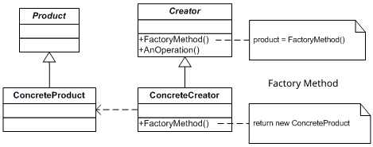

Birçok tasarım Factory Method kullanarak başlar ve Abstract Factory, Prototype veya Builder'a doğru gelişir.

Abstract Factory sınıfları genellikle bir Factory Methods kümesine dayanır, ancak bu sınıflardaki yöntemleri oluşturmak için Prototype'ı da kullanabilirsiniz.

Collection alt sınıflarının collection'larla uyumlu farklı türde iterator döndürmesine izin vermek için Factory Method'u yineleyici ile birlikte kullanabiliriz.

Factory Method, Template Method'un özel bir kullanımıdır. Yani bir Factory Method, büyük bir Template Metod içinde bir adım olarak hizmet edebilir.

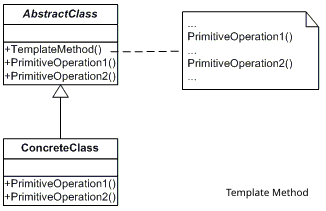

- **Abstract Factory**: 

**Amaç:** Birbiriyle ilişkili ancak birbirinden farklı bir grup nesneyi oluşturur. Bir sınıftır, birden fazla factory metottan meydana gelir. Hatta bazen birden fazla factory sınıfından meydana gelebilir.

**Nasıl Yapılır?:** Oluşturulacak bütün nesneler aynı interface'den türetilir. Daha sonra yine bir interface'den türetilen fabrika nesnesi içindeki birden fazla metot ile ilgili nesneler oluşturulur. Hatta birden fazla fabrika üretmek istenirse fabrika nesnesinden daha fazla da üretilebilir.

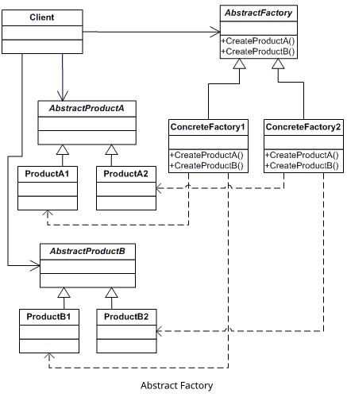

Birçok tasarım Factory Method kullanarak başlar ve Abstract Factory, Prototype veya Builder'a doğru gelişir.

Builder, adım adım karmaşık nesneler oluşturmaya odaklanır. Abstract Factory, ilgili nesnelerin üyelerini oluşturma konusunda uzmanlaşmıştır. Abstract Factory ürünü hemen döndürürken, Builder ürünü getirmeden önce bazı ek adımlarını çalıştırmamıza izin verir.

Abstract Factory sınıfları genellikle bir dizi Factory Methods'a dayanır, ancak bu sınıflardaki yöntemleri oluşturmak için Prototype'ı da kullanabiliriz.

Abstract Factory, yalnızca istemci kodundan alt sistem nesnelerinin oluşturulma şeklini gizlemek istediğinizde Facade'e bir alternatif olarak hizmet edebilir.

Abstract Factory, Builder ve Prototype singleton olarak yazılabilir.

- **Builder**: 

**Amaç:** Karmaşık bir nesnenin oluşturulma süreci/adımları ile sunumunu birbirinden ayırarak aynı nesnenin farklı türlerinin oluşturulmasını sağlar. 

**Nasıl Yapılır?:** En basit haliyle bir veya birden fazla builder nesnesi ile ilgili nesnelerin parçaları farklı fonksiyonlara oluşturulacak şekilde yazılır. Daha sonra bir director nesnesi ile bir veya birden fazla builder nesnesi ilgili nesneyi oluşturacak fonksiyona parameter olarak geçirilir.

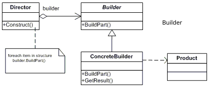

Birçok tasarım Factory Method kullanarak başlar ve Abstract Factory, Prototype veya Builder'a doğru gelişir.

Builder, adım adım karmaşık nesneler oluşturmaya odaklanır. Abstract Factory, ilgili nesnelerin üyelerini oluşturma konusunda uzmanlaşmıştır. Abstract Factory ürünü hemen döndürürken, Builder ürünü getirmeden önce bazı ek adımlarını çalıştırmamıza izin verir.

Builder'ı complex Composite tree oluştururken kullanabiliriz çünkü constructor adımlarını recursive çalışacak şekilde programlayabiliriz.

- **Prototype**: 

**Amaç:** Oluşturulması çok maliyetli olan nesnelerin daha önce oluşturulmuş benzer örneklerinden klonlama/kopyalama yapılmasını sağlar.

Bir satırlık kod ile kolaylıkla oluşturduğumuz bazı nesnelerin sistem tarafından ne kadar cpu,memory ve network kullanılarak üretildiğini düşünürsek bu hatayı ne kadar çok yaptığımızı anlayabiliriz. Biz kod yazmadığımız için sanki o kadar iş yokmuş gibi geliyor olabilir. Ancak  performansın önemli olduğu çok kullanıcılı bir uygulamada bir  nesnenin sistemi ve network'ü yoğun kullanarak oluşturulması ciddi problemlere sebep olabilir.

**Nasıl Yapılır?:** Kopyası alınacak nesne içine kopyalama fonksiyonu tanımlanır ve nesnenin kopyası döndürülür.

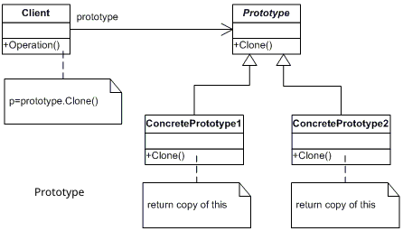

Birçok tasarım Factory Method kullanarak başlar ve Abstract Factory, Prototype veya Builder'a doğru gelişir.

Builder, adım adım karmaşık nesneler oluşturmaya odaklanır. Abstract Factory, ilgili nesnelerin üyelerini oluşturma konusunda uzmanlaşmıştır.

Prototype, Command'ların kopyalarını history'ye kaydetmemiz gerektiğinde yardımcı olabilir.

Yoğun Composite ve Decorator kullanan tasarımlar genellikle Prototype kullanmaktan yararlanabilir. Deseni uygulamak, karmaşık yapıları sıfırdan yeniden oluşturmak yerine klonlamamıza olanak tanır.

### Yapısal (Structural) Tasarım Desenleri

- **Adapter**: 

**Amaç:** İki farklı interface'in birlikte çalışabilmesini sağlar. 

**Nasıl Yapılır?:** Gerçek hayatta kullandığımız adaptörler gibi ara bir nesne oluşturulur ve kaynak nesne adapter nesnesine parametre olarak geçilir. Alınan kaynak nesneden istemcinin beklediği veriler değiştirilerek sunulur. 

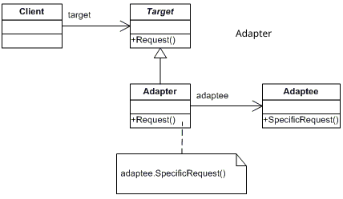

Bridge genellikle önceden tasarlanır ve bir uygulamanın parçalarını birbirinden bağımsız olarak geliştirmenize izin verir. Adapter ise uyumsuz olan sınıfların birlikte çalışmasını sağlamak için vardır. 

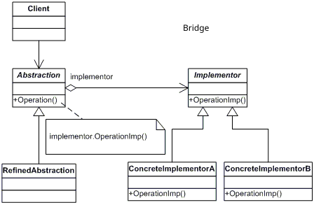

Adapter var olan bir nesnenin arayüzünü değiştirirken, Decorator bir nesneyi arayüzünü değiştirmeden geliştirir. Ayrıca, Decorator, Adapter kullandığınızda mümkün olmayan recursive composition'ı destekler.

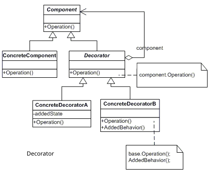

Adapter, wrapped nesneye farklı bir interface sağlar, Proxy nesneyle aynı interface'i kullanarak farklı işler yaparken Decorator aynı sınıfa gelişmiş bir interface sağlar.

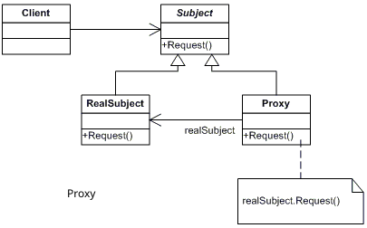

Facade, mevcut nesneler için yeni bir arayüz tanımlarken, Adapter mevcut arayüzü kullanılabilir hale getirmeye çalışır. Adapter genellikle yalnızca bir nesneyi sararken (wrap), Facade birden çok nesnenin  alt sistemiyle çalışır.

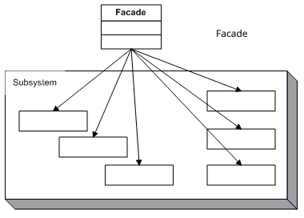
Bridge, State, Strategy (ve bir dereceye kadar Adapter) çok benzer yapılara sahiptir. Ancak, hepsi farklı sorunları çözer. 

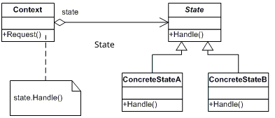

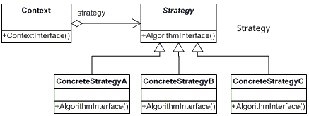

- **Bridge**: 

**Amaç:** Nesnenin soyutlaması ile implementasyonunu birbirinden ayırmak için kullanılır. Böylece ikisi birbirinden bağımsız genişleyebilir.

**Nasıl Yapılır?:** İki parçadan oluşuyor abstraction ve implementation. İstemcinin talep ettiği değerin bir kısmı değişmeyen kısım (abstraction) diğer kısmı ise değiştirilebilen yani isteğe göre seçilebilen kısım (implementation). Mesela biz bir şekil çizen kod yazabiliriz ancak istemciye renk seçimi yaptırmamız gerekebilir. Bunun için öncelikle abstraction kısmı yazılır ve değişen kısım parametre olarak abstraction nesnesine geçilir. 

Bridge genellikle önceden tasarlanır ve bir uygulamanın parçalarını birbirinden bağımsız olarak geliştirmenize izin verir. Adapter ise uyumsuz olan sınıfların birlikte çalışmasını sağlamak için vardır.  

Eğer Bridge çok spesifik bir implementation için kullanılıyorsa Abstract Factory ile birlikte kullanılabilir. Bu durumda Abstract Factory ilişkileri gizleyebilir ve karmaşıklığı istemci kodundan gizleyebilir. 

Builder'ı Bridge ile birleştirebiliriz: director sınıfı soyutlama rolünü oynarken, farklı builder'lar uygulama görevi görür.

- **Composite**: 

**Amaç:** Ortak arayüze sahip nesneler arasında parent-child (tree) ilişkisi kurulabiliyorsa istemciyi parçalardan soyutlayıp tek bir nesne ile muhatap kılmak için kullanılır.

**Nasıl Yapılır?:** Hiyerarşik yapıdaki bütün elementlere aynı interface uygulanır. Her bir element child elementlerinin listesini veya tek bir child elemanın bilgisini tutar.

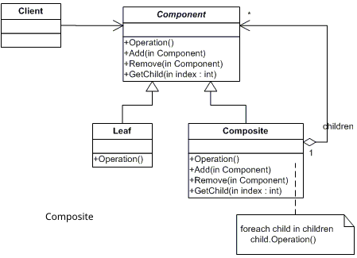

Builder'ı karmaşık Composite tree oluştururken kullanabiliriz çünkü yapım adımlarını yinelemeli (recursive) çalışacak şekilde programlayabiliriz.

Chain of Resonsibility genellikle Composite ile birlikte kullanılır. Bu durumda, bir tree'nin bir node/leaf bileşeni bir istek aldığında, onu tüm üst bileşenlerin chain'inden geçerek nesne ağacının köküne kadar iletebilir.

Composite trees arasında geçiş yapmak için Iterator'ı kullanabilirsiniz.

Bir Composite tree üzerinde bir işlem yürütmek için Visitor'u kullanabiliriz.

Biraz RAM'den tasarruf etmek için Composite ağacının paylaşılan yaprak düğümlerini Flyweights olarak uygulayabiliriz.

Composite ve Decorator benzer yapı diyagramlarına sahiptir, çünkü her ikisi de açık uçlu sayıda nesneyi organize etmek için recursive kompozisyona dayanır. Decorator yapı olarak Composite gibidir, ancak yalnızca bir alt bileşeni vardır. Diğer bir önemli fark ise Decorator, sarılmış (wrapped) nesneye ek sorumluluklar eklerken, Composite yalnızca çocuklarının sonuçlarını "toplar". Bununla birlikte, tasarım desenleri de işbirliği yapabilir: Composite tree içindeki belirli bir nesnenin davranışını genişletmek için Decorator'ı kullanabiliriz.

Composite ve Decorator'ı yoğun olarak kullanan tasarımlar, genellikle Prototype kullanmaktan yararlanabilir. Deseni uygulamak, karmaşık yapıları sıfırdan yeniden oluşturmak yerine klonlamamıza olanak tanır.

- **Decorator**: 

**Amaç:** Dinamik olarak bir nesneye yeni sorumluluklar eklemek veya değiştirmek için kullanılır.

**Nasıl Yapılır?:**  Dekore edilecek nesne ile aynı interface'i implement eden  decorator sınıfına nesnenin kendisi parametere olarak geçilir.

Adapter var olan bir nesnenin arayüzünü değiştirirken Decorator bir nesneyi arayüzünü değiştirmeden geliştirir. Ayrıca Decorator, Adapter kullandığınızda mümkün olmayan recursive kompozisyonu destekler.

Adapter, sarılmış (wrapped) nesneye farklı bir arabirim (interface) sağlar, Proxy aynı arabirimi client'i değişikliği zorlamadan uygularken  Decorator ona gelişmiş bir arabirim sağlar.

Chain of Responsibility ve Decorator çok benzer sınıf yapılarına sahiptir. Chain of Responsibility işleyicileri, birbirinden bağımsız olarak isteğe bağlı işlemleri yürütebilir. Ayrıca, herhangi bir noktada isteği daha fazla iletmeyi bırakabilirler. Öte yandan, çeşitli Decorator, nesnenin davranışını temel arayüzle tutarlı tutarken genişletebilir. Ayrıca, dekoratörlerin chain'deki gibi talebin akışını kesmesine izin verilmez.

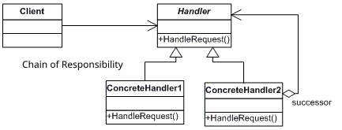

Composite ve Decorator benzer yapı diyagramlarına sahiptir, çünkü her ikisi de açık uçlu sayıda nesneyi organize etmek için recursive kompozisyona dayanır. Decorator yapı olarak Composite gibidir, ancak yalnızca bir alt bileşeni vardır. Diğer bir önemli fark ise Decorator, sarılmış (wrapped) nesneye ek sorumluluklar eklerken, Composite yalnızca çocuklarının sonuçlarını "toplar". Bununla birlikte, tasarım desenleri de işbirliği yapabilir: Composite tree içindeki belirli bir nesnenin davranışını genişletmek için Decorator'ı kullanabiliriz.

Composite ve Decorator'ı yoğun olarak kullanan tasarımlar, genellikle Prototype kullanmaktan yararlanabilir. Deseni uygulamak, karmaşık yapıları sıfırdan yeniden oluşturmak yerine klonlamamıza olanak tanır.

Decorator ve Proxy benzer yapılara sahiptir, ancak çok farklı amaçlara sahiptir. Her iki model de, bir nesnenin işin bir kısmını diğerine devretmesi gereken kompozisyon ilkesi üzerine inşa edilmiştir. Aradaki fark, bir Proxy'nin genellikle hizmet nesnesinin yaşam döngüsünü kendi başına yönetmesidir, oysa Decorator bileşimi her zaman istemci tarafından kontrol edilir.

- **Facade**: 

**Amaç:** Çok karmaşık sistemleri kullanabilmek amacıyla daha basitleştirilmiş bir arayüz sunmak için kullanılır.

**Nasıl Yapılır?:**  Class içinde bir fonksiyon yardımıyla diğer nesnelerdeki fonksiyonlar sırasıyla çağrılır.

Facade, mevcut nesneler için yeni bir arayüz tanımlarken, Adapter mevcut arayüzü kullanılabilir hale getirmeye çalışır. Adapter genellikle yalnızca bir nesneyi sararken, Facade tüm bir nesne alt sistemiyle çalışır.

Abstract Factory, yalnızca istemci kodundan alt sistem nesnelerinin oluşturulma şeklini gizlemek istediğinizde Facade'e bir alternatif olarak hizmet edebilir.

Flyweight, çok sayıda küçük nesnenin nasıl oluşturulacağını gösterirken, Facade, tüm bir alt sistemi temsil eden tek bir nesnenin nasıl oluşturulacağını gösterir.

Facade ve Mediator benzer işlere sahiptir: sıkı bir şekilde birleşmiş çok sayıda sınıf arasında işbirliğini organize etmeye çalışırlar. Facade, nesnelerin bir alt sistemine basitleştirilmiş bir arabirim (interface) tanımlar, ancak herhangi bir yeni işlevsellik getirmez. Alt sistemin kendisi facade'den habersizdir. Alt sistem içindeki nesneler doğrudan iletişim kurabilir. Mediator, sistem bileşenleri arasındaki iletişimi merkezileştirir. Bileşenler yalnızca aracı nesneyi bilir ve doğrudan iletişim kurmaz.

Çoğu durumda tek bir facade nesnesi yeterli olduğundan, bir Facade sınıfı genellikle Singleton'a dönüştürülebilir.

Facade, hem karmaşık bir varlığı tamponlaması hem de onu kendi başına başlatması bakımından Proxy'ye benzer. Facade'den farklı olarak Proxy, hizmet nesnesiyle aynı arabirime (interface) sahiptir, bu da onları değiştirilebilir hale getirir.

- **Flyweight**: 

**Amaç:** Tek başına küçük olmasına rağmen yüzlerce oluşturulduğunda çok maliyetli olacak nesnelerin oluşturulmasında kullanılır.

**Nasıl Yapılır?:**  Öncelikle nesneyi oluşturmak için ilgili nesneyi ifade eden bir interface veya abstract class yazılır. Bu interface client tarafında değiştirebilecek kısımlar için fonksiyon sunar. Genellikle bu nesneler bir factory yardımıyla oluşturulur ve belli sayıda (list, array, dictionary vb objelerde) saklanır. Nesneye ihtiyaç olduğunda listeden okunarak kullanıma sunulur. İşi biten nesne tekrar listeye eklenir. Aynı anda aynı nesnenin listedeki tüm örneklerine ihtiyaç olmadığı sürece sorun olmayacaktır.

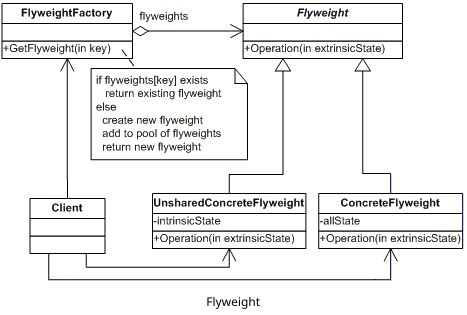

Biraz RAM'den tasarruf etmek için Composite tree'nin paylaşılan yaprak düğümlerini Flyweights olarak uygulayabiliriz.

Flyweight, çok sayıda küçük nesnenin nasıl oluşturulacağını gösterirken Facade, tüm bir alt sistemi temsil eden tek bir nesnenin nasıl oluşturulacağını gösterir.

Flyweight, nesnelerin tüm paylaşılan durumlarını bir şekilde tek bir flyweight nesnesine indirgemeyi başarmış olsaydık, Singleton'a benzerdi. Ancak bu kalıplar arasında iki temel fark vardır: Yalnızca bir Singleton örneği olmalıdır, oysa bir Flyweight sınıfı farklı içsel durumlara sahip birden çok örneğe sahip olabilir. İkincisi Singleton nesnesi değiştirilebilir olabilir. Flyweight nesneleri değişmezdir.

- **Proxy**: 

**Amaç:** Gerçek nesnenin yerine geçerek istemci tarafında hiç bir değişiklik yaptırtmadan gerçek nesnenin ya hiç yapamadığı yada eksik yaptığı bazı işleri yapmak için kullanılır.

**Nasıl Yapılır?:**  Oluşturulacak nesne ile aynı interface'i implement eden proxy nesnesi yazılır. İhtiyaca göre client tarafında hiçbir değişikliğe gerek kalmayacak şekilde proxy sınıfında ekleme ve düzenlemeler yapılır. 

Adapter, sarılmış (wrapped) nesneye farklı bir arabirim (interface) sağlar, Proxy aynı arabirimi client'i değişikliği zorlamadan uygularken  Decorator ona gelişmiş bir arabirim sağlar.

Facade, hem karmaşık bir varlığı arabelleğe alması hem de onu kendi başına başlatması bakımından Proxy'ye benzer. Facade'den farklı olarak Proxy, ana nesne ile aynı arabirime sahiptir ve bu da onları değiştirilebilir hale getirir.

Decorator ve Proxy benzer yapılara sahiptir, ancak çok farklı amaçlara sahiptir. Bir Proxy'nin genellikle ana nesnenin yaşam döngüsünü kendi başına yönetebilir, oysa Decorator her zaman istemci tarafından kontrol edilir.

### Davranışsal Tasarım Desenleri

- **Chain of Responsibility**:
 
**Amaç:** Bir nesne üzerinde yapılması gereken bir dizi işlemi istemcinin kendi kararı ile nesneyi ilgili sorumluluğu yapabilecek nesnelere geçirerek tamamlamayı sağlar.

**Nasıl Yapılır?:**  Builder'a çok benzer görünmesine rağmen en temel fark orada sadece nesne yaratma amacı varken burada herhangi bir işi tamamlama amacı vardır. Aynı interface'i implement eden bir dizi nesne oluşturulur. Her bir nesne zincirin bir halkası gibidir. Implement edilen interface üzerinde bir sonraki adımı parametre olarak isteyen bir fonksiyon bulunur. Bir sonraki adım da aynı interface'den implement edilmek zorundadır bu nedenle parametre olarak interface'in kendisi verilir. Ayrıca bu interface'de üzerinde işlem yapılacak veya verileri kullanılacak nesneyi parametre olarak alan ve gerekli işlemleri de yapan başka bir fonksiyon bulunur. Bu fonksiyon işi yaptıktan sonra bir sonraki adımı ifade eden nesne üzerindeki aynı adlı fonksiyona parametre olarak aldığı nesneyi parametre olarak geçer. Alttaki örnekteki gibi interface yerine abstract class kullanmak da mümkündür.

Chain of Responsibility, Command, Mediator ve Observer, isteklerin göndericilerini (sender) ve alıcılarını (receiver) bağlamanın çeşitli yollarını ele alır:

Chain of Responsibility, potansiyel alıcılardan oluşan dinamik bir zincir boyunca, biri onu işleyene kadar bir isteği sırayla iletir.

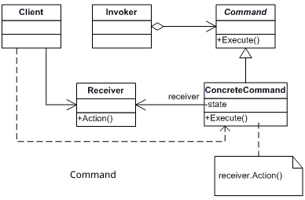

Command, gönderenler ve alıcılar arasında tek yönlü bağlantılar kurar.

Mediator, göndericiler ve alıcılar arasındaki doğrudan bağlantıları ortadan kaldırarak onları bir mediator nesnesi aracılığıyla dolaylı olarak iletişim kurmaya zorlar.

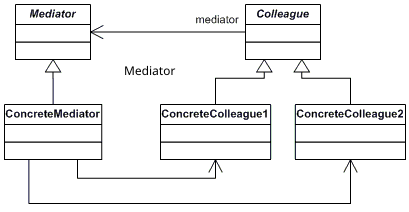

Observer, alıcıların isteklere dinamik olarak abone olmalarını ve abonelikten çıkmalarını sağlar.

Chain of Responsibility genellikle Composite ile birlikte kullanılır. Bu durumda, bir node/düğüm/yaprak bileşeni bir istek aldığında, onu tüm ana bileşenlerin chain'inden nesne ağacının köküne kadar iletebilir.

Chain of Responsibility içindeki işleyiciler Commands olarak uygulanabilir. Bu durumda, bir istek tarafından temsil edilen aynı bağlam nesnesi üzerinde birçok farklı işlemi gerçekleştirebiliriz. Ancak, isteğin kendisinin bir Command nesnesi olduğu başka bir yaklaşım daha vardır. Bu durumda, aynı işlemi bir chain ile bağlantılı bir dizi farklı bağlamda yürütebilirsiniz.

Chain of Responsibility ve Decorator çok benzer sınıf yapılarına sahiptir. Ancak, birkaç önemli farklılık vardır. Chain of Responsibility, birbirinden bağımsız olarak isteğe bağlı işlemleri yürütebilir. Ayrıca, herhangi bir noktada isteği daha fazla iletmeyi bırakabilirler. Decorator'ların nesnenin davranışını temel arabirimle (interface) tutarlı tutarken genişletebilir. Ayrıca, decorator'ların istek akışını kesmesine izin verilmez.

- **Command**:

**Amaç:** İstemcinin talebini(action, function ve parametreler) bir nesne olarak aracı nesne üzerinden alıcıya ulaştırılır. Amaç istemcinin talebi ile alıcının cevabını birbirinden soyutlamaktır. 

**Nasıl Yapılır?:** Üzerinde işlem yapılacak nesneyi constructor üzerinden parametre alacak bir command nesnesi oluşturulur. Command nesnesi aynı zamanda ilgili nesne üzerinde yapılacak işlem için bir fonksiyon sunar. 

Chain of Responsibility, Command, Mediator ve Observer, isteklerin göndericilerini (sender) ve alıcılarını (receiver) bağlamanın çeşitli yollarını ele alır:

Chain of Responsibility, potansiyel alıcılardan oluşan dinamik bir zincir boyunca, biri onu işleyene kadar bir isteği sırayla iletir.

Command, gönderenler ve alıcılar arasında tek yönlü bağlantılar kurar.

Mediator, göndericiler ve alıcılar arasındaki doğrudan bağlantıları ortadan kaldırarak onları bir mediator nesnesi aracılığıyla dolaylı olarak iletişim kurmaya zorlar.

Observer, alıcıların isteklere dinamik olarak abone olmalarını ve abonelikten çıkmalarını sağlar.

Chain of Responsibility içindeki işleyiciler Commands olarak uygulanabilir. Bu durumda, bir istek tarafından temsil edilen aynı bağlam nesnesi üzerinde birçok farklı işlemi gerçekleştirebiliriz.

"undo" uygularken Command ve Memento'yu birlikte kullanabiliriz. Bu durumda, command'lar bir hedef nesne üzerinde çeşitli işlemler yapmaktan sorumludur, memento ise bir command yürütülmeden hemen önce o nesnenin durumunu kaydeder.

Command ve Strategy yapısal olarak benzer görünebilir çünkü her ikisini de bir nesneyi bazı eylemlerle parametreleştirmek için kullanabiliriz. Ancak amaçları çok farklıdır. Herhangi bir işlemi bir nesneye dönüştürmek için Command'ı kullanabiliriz. İşlemin parametreleri o nesnenin alanları olur. Dönüştürme işlemin yürütülmesini ertelemenize, sıraya koymanıza, komutların geçmişini saklamanıza, uzak servislere komut göndermenize vb. olanak tanır.Strategy genellikle aynı şeyi yapmanın farklı yollarını açıklar ve bu algoritmaları tek bir sınıfta değiştirmenize izin verir.

Prototype, Command'ların kopyalarını history'ye kaydetmemiz gerektiğinde yardımcı olabilir.

Visitor'u Command'ın daha güçlü bir versiyonu olarak değerlendirebiliriz. Visitor farklı sınıflar üzerindeki farlı nesneler üzerinde operasyonlar çalıştırabilir.

- **Iterator**: 

**Amaç:** Bir koleksiyonun elemanlarını tiplerinden bağımsız gezmek için kullanılır.

**Nasıl Yapılır?:**  Bunun  için programlama dillerinde artık bir çok hazır kütüphane gelmektedir. Bir çok dilde list, collection, enumerable, dictionary, array vb bir çok iterable nesne bulunur. Bu nesneler kullanılarak tasarım deseni kurgulanır. Öncelikle collection/dizi nesnesi oluşturulur. Daha sonra bu nesneyi parametre olarak alarak elemanları üzerinde gezebileceğimiz iterator nesnesi yazılır. 

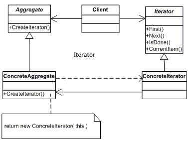

Composite trees üzerinde gezinmek için Iterator kullanabiliriz.

Koleksiyon alt sınıflarının koleksiyonlarla uyumlu farklı türde yineleyiciler (iterator) döndürmesine izin vermek için Factory Method'u Iterator ile birlikte kullanabiliriz.

Iterator'un anlık durumunu yakalamak ve gerekirse geri almak için Memento'yu Iterator ile birlikte kullanabiliriz.

Visitor'u Iterator ile birlikte karmaşık bir veri yapısını dolaşmak ve hepsi farklı sınıflara sahip olsalar bile öğeleri üzerinde bazı işlemler yürütmek için kullanabiliriz.

- **Mediator**:

**Amaç:** Benzer işleri yapan nesneler arasındaki karmaşık bağımlılıkları gevşek bağımlılık ile ortadan kaldırmak için kullanılır. Anlamı da zaten arabulucudur.

**Nasıl Yapılır?:**  Öncelikle birbirleriyle iletişime geçecek nesneler tanımlanır. Bu nesnelerin listesinin bulunduğu veya liste olmasa bile her bir nesnenin tanımının olduğu mediator nesnesi oluşturulur. Mediator nesnesi birbirleriyle iletişime geçecek nesnelerin constructor'una parametre olarak geçilir. Mediator nesnesi üzerinde diğer nesnelerle iletişim için bir fonksiyon bulunur. bütün nesneler mediator nesnesini parametre olarak aldığı için birbirleriyle iletişime geçebilirler. Aşağıdaki örnekte atılan mesaj herkese gitmektedir.

Chain of Responsibility, Command, Mediator ve Observer, isteklerin göndericilerini (sender) ve alıcılarını (receiver) bağlamanın çeşitli yollarını ele alır:

Chain of Responsibility, potansiyel alıcılardan oluşan dinamik bir zincir boyunca, biri onu işleyene kadar bir isteği sırayla iletir.

Command, gönderenler ve alıcılar arasında tek yönlü bağlantılar kurar.

Mediator, göndericiler ve alıcılar arasındaki doğrudan bağlantıları ortadan kaldırarak onları bir mediator nesnesi aracılığıyla dolaylı olarak iletişim kurmaya zorlar.

Observer, alıcıların isteklere dinamik olarak abone olmalarını ve abonelikten çıkmalarını sağlar.

Facade ve Mediator benzer işlere sahiptir: sıkı bir şekilde birleşmiş çok sayıda sınıf arasında işbirliğini organize etmeye çalışırlar. Facade, nesnelerin bir alt sistemine basitleştirilmiş bir arabirim (interface) tanımlar, ancak herhangi bir yeni işlevsellik getirmez. Alt sistemin kendisi facade'den habersizdir. Alt sistem içindeki nesneler doğrudan iletişim kurabilir. Mediator, sistem bileşenleri arasındaki iletişimi merkezileştirir. Bileşenler yalnızca aracı nesneyi bilir ve doğrudan iletişim kurmaz.

- **Memento**: 
**Amaç:** Bir nesnenin iç yapısını ve uygulama detaylarını saklayarak önceki state'ine geri dönmeyi sağlamak için kullanılır.
 
**Nasıl Yapılır?:** Ana nesnemizi (originator) state'ini saklamak için bir memento nesnesi yazılır. Memento nesnesinde asıl nesnemizin state'i constructor üzerinden parametre alınır.

"undo" uygularken Command ve Memento'yu birlikte kullanabiliriz. Bu durumda, command'lar bir hedef nesne üzerinde çeşitli işlemler yapmaktan sorumludur, mementos ise bir command yürütülmeden hemen önce o nesnenin durumunu kaydeder.

Geçerli iteration durumunu yakalamak ve gerekirse geri almak için Memento'yu Iterator ile birlikte kullanabiliriz.

Bazen Prototype, Memento'ya daha basit bir alternatif olabilir. Bu, geçmişinde durumunu saklamak istediğiniz nesne oldukça basitse ve dış kaynaklara bağlantıları yoksa veya bağlantıların yeniden kurulması kolaysa işe yarar.

- **Observer**: 

**Amaç:** Bir nesnede meydana gelen değişiklikleri haberdar olmak isteyen nesnelere duyurmak için kullanılır.

**Nasıl Yapılır?:**  Öncelikle diğer nesneler tarafından izlenecek olan nesne oluşturulur. Bu nesne üzerinde onu izleyecek nesnelerin yani observer'ların listesi ve bu listeye eleman eklemek için bir fonksiyon bulunur. Observer nesneleri aynı interface'i implement eder ve izlenen nesnede meydana gelen değişikliğin iletilmesi için bir fonksiyon sunarlar.  

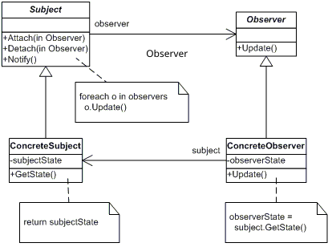

Chain of Responsibility, Command, Mediator ve Observer, isteklerin göndericilerini (sender) ve alıcılarını (receiver) bağlamanın çeşitli yollarını ele alır:

Chain of Responsibility, potansiyel alıcılardan oluşan dinamik bir zincir boyunca, biri onu işleyene kadar bir isteği sırayla iletir.

Command, gönderenler ve alıcılar arasında tek yönlü bağlantılar kurar.

Mediator, göndericiler ve alıcılar arasındaki doğrudan bağlantıları ortadan kaldırarak onları bir mediator nesnesi aracılığıyla dolaylı olarak iletişim kurmaya zorlar.

Observer, alıcıların isteklere dinamik olarak abone olmalarını ve abonelikten çıkmalarını sağlar.

Observier ile mediator yapısal olarak çok benzer ancak amaç olarak tabii ki çok farklılar. Mediator'un birincil amacı, bir dizi sistem bileşeni arasındaki karşılıklı bağımlılıkları ortadan kaldırmak iken observer amacı tek taraflı olarak kaynakta meydana gelen event'ler hakkında abonelerine bilgi iletmektir.

- **State**:
  
**Amaç:** Bir nesnenin iç durumu değiştiğinde davranışının da değişmesini sağlamak için kullanılır.

**Nasıl Yapılır?:**  Her state için bir nesne tasarlanır. Bu state nesnelerin ilgili state durumda iken yapılacak bütün işler için fonksiyonlar tanımlanır.  Yani A state'inde iken yapılacak işler ile B state'inde yapılacak işler tamamen aynıdır ancak yani her state'de yapılacak işlerin bir karşılığı vardır sonuç olarak hepsi aynı interface'i implement eder. Dana sonra asıl nesnemizi yani üzerinde çalışacağımız nesneyi state interface'ini parametre olarak alacak constructor ile veya public bir değişkenle tanımlarız.

Bridge, State, Strategy (ve bir dereceye kadar Adapter) çok benzer yapılara sahiptir. Aslında, tüm bu kalıplar, işi diğer nesnelere atayan composition'a dayanır. Ancak, hepsi farklı sorunları çözer. State, Strategy'nin bir uzantısı olarak düşünülebilir.Strategy, bu nesneleri tamamen bağımsız ve birbirinden habersiz hale getirir. Ancak State, concrete state'ler arasındaki bağımlılıkları kısıtlamaz ve contex'in state'i istedikleri gibi değiştirmelerine izin verir.

- **Strategy**: 

**Amaç:** Çalışma anında aynı işi yapan bir grup algoritmadan birini seçebilmek için kullanılır.

**Nasıl Yapılır?:**  Aynı işi farklı yollarla yapan strategy nesneleri hepsi aynı interface'i implement edecek şekilde oluşturulur. Daha sonra bu nesneleri kullanacak nesnemizi oluştururuz. Bu nesne strategy nesnelerini implement ettiğimiz interface'i constructor  üzerinden parametre olarak alır.

Bridge, State, Strategy (ve bir dereceye kadar Adapter) çok benzer yapılara sahiptir. Aslında, tüm bu kalıplar, işi diğer nesnelere atayan composition'a dayanır. Ancak, hepsi farklı sorunları çözer.

Command ve Strategy benzer görünebilir çünkü her ikisini de bir nesneyi bazı eylemlerle parametreleştirmek için kullanabiliriz. Ancak amaçları çok farklıdır. Herhangi bir işlemi bir nesneye dönüştürmek için Command kullanabiliriz. İşlemin parametreleri o nesnenin alanları olur. Dönüştürme işlemin yürütülmesini ertelememize, kuyruğa almamıza, command'ların geçmişini saklamamıza, uzak servislere command göndermemize vb. izin verir. Ancak Strategy genellikle aynı şeyi yapmanın farklı yollarını açıklar ve bu algoritmaları tek bir bağlam sınıfında değiştirmenize izin verir.

Decorator, bir nesnenin dışını değiştirmemize izin verirken, Strategy, iş işleyişi değiştirmemize izin verir.

Template Method kalıtımı temel alır: algoritmanın parçalarını değiştirmemize izin vererek alt sınıfları genişletmemizi sağlar. Strategy kompozisyona dayalıdır, farklı stratejilerden birini runtime'da tercih etmemizi sağlar. 

State, Strategy'nin bir uzantısı olarak düşünülebilir.Strategy, bu nesneleri tamamen bağımsız ve birbirinden habersiz hale getirir. Ancak State, concrete state'ler arasındaki bağımlılıkları kısıtlamaz ve contex'in state'i istedikleri gibi değiştirmelerine izin verir.

- **Template Method**: 

**Amaç:** Belli bir sırada/düzende yapılması gereken bir dizi işin hem sırasını/düzenini belirlemek hem de yapılacak bu işlerden bazılarının alt sınıflar tarafından yapılabilmesini sağlamak için kullanılır.

**Nasıl Yapılır?:**  Genellikle temel işler için bir abstract class tanımlanır. Bu class içinde bütün fonksiyonlar iş yapmak zorunda değildir. Bazı işlerin alt sınıflar tarafından yapılmasına (override) yapılmasına izin verilir. Alt sınıflar bu abstract sınıfı miras alır ve istedikleri metotları override ederler.

Template Method kalıtımı temel alır: algoritmanın parçalarını değiştirmemize izin vererek alt sınıfları genişletmemizi sağlar. Strategy kompozisyona dayalıdır, farklı stratejilerden birini runtime'da tercih etmemizi sağlar. 

Factory Method, Template Method'un özel bir kullanımıdır. Yani bir Factory Method, büyük bir Template Metod içinde bir adım olarak hizmet edebilir.

- **Visitor**: 

**Amaç:** Bir nesneyi değiştirmeden nesne üzerinde yeni operasyonlar çalıştırmamızı sağlayan tasarım desenidir.

**Nasıl Yapılır?:**  Aynı interface'in implement edildiği bir veya daha fazla visitor nesnesi oluşturulur. Bu visitor nesnelerinde yapılacak işler için metotlar eklenir. Daha sonra asıl üzerinde işlem yapacağımız nesnemizi/nesnelerimizi constructor üzerinden visitor interface'imizi parametre olarak alacak şekilde tanımlarız.

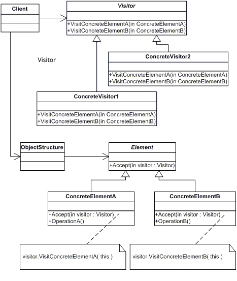

Bir Composite ağacının tamamı üzerinde bir işlem yürütmek için Visitor kullanabiliriz.

Visitor'u Iterator ile birlikte karmaşık bir veri yapısında gezinmek ve hepsinin farklı sınıfları olsa bile öğeleri üzerinde bazı işlemler yürütmek için kullanabiliriz.

# Kaynaklar
- https://egitimbilimlerinotlari.com/bilgi-isleme-kuraminin-temel-kavramlari/
- https://tr.wikipedia.org/wiki/Loci_Metodu
- https://ogrencikariyeri.com/haber/verimli-ders-calismanin-en-etkili-yontemleri
- https://hackernoon.com/how-to-remember-design-patterns-ap1z35sl
- https://www.codeproject.com/tips/57578/the-best-way-to-remember-design-patterns
- https://en.wikipedia.org/wiki/Design_Patterns
- https://dotnettutorials.net/course/dot-net-design-patterns/
- https://refactoring.guru/design-patterns
- https://www.dofactory.com/
- 
