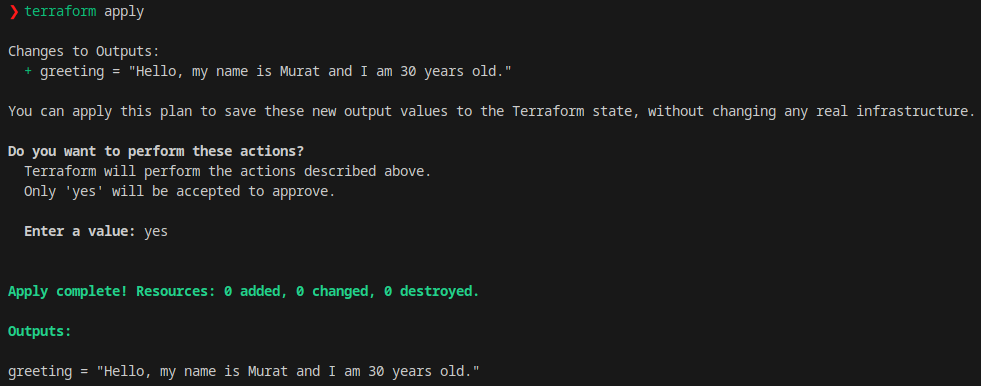

## HashiCorp Configuration Language (HCL) Dili Nedir? Nasıl Kullanılır?

Bu yazımızda HashiCrop firmasının ürünlerinde kullandığı declarative bir konfigürasyon dili olan HCL hakkında birşeyler öğrenmeye çalışacağız. 

Amacımız HCL dilini sadece dil olarak anlamya çalışmak olacakç Yani mümkün olduğunda araçlardan bağımsız anlamaya çalışacağız. Özellikle Terraform, Packer vb bir ürün hakkında çalışma yapmadığımız için  yazdığımız örnekler HashiCorp'un bir veya birkaç ürünü üzerinde olacak. Ancak bütün kodları çalıştıramayacağız. 

En sonda çalıştırlabilir kod örnekleri yapıyor olacağız. Eğer devam edebilirsem yazısnın ikinci makalesinde de Terraform'u Azure üzerinden incelemeye ve öğrenmeya çalışacağız.


İyi okumlar.


## HCL Dili Nedir?

HCL HashiCrop firmasının geliştirdiği declarative bir yapılandırma dilidir. 

Declarative kelime anlamı olarak bildirimsel demek. Biraz açacak olursak, kodun nasıl çalışacağına kafa yormadan sadece ne istediğimizi söylediğimiz ve sonucunu dilin kedisinin bize hazırladığı dillere declarative diyoruz. Declarative'in birde tem tersi var buna da imperative diyoruz. Bu dillerde ise işin nasıl yapılacağını yazarak dilin asıl amacımızı nasıl gerçekleştireceğini belirtiyoruz. 

Biraz daha açarsak daha iyi anlaşılacağını düşünüyorum.

- **Deklaratif (Bildirimsel):**
    - Deklaratif yaklaşım, bir sistemi veya işlemi nasıl elde edileceği yerine ne elde edilmek istendiğiyle tanımlar. Yani, bir hedefin açıklamasıdır.
    - Kullanıcı, bir durumu belirtir ve sistem bu durumu sağlamak için gerekli adımları otomatik olarak gerçekleştirir. Kullanıcı, işlemin detaylarına odaklanmak yerine nihai durumu tanımlar.
    - SQL, HTML ve NixOS konfigürasyon dosyaları gibi deklaratif örnekler vardır. SQL’de bir veri setinin nasıl alınacağını değil, alınan veri setinin ne olması gerektiğini belirtirsiniz.
    - Daha kolay anlaşılır ve bakımı yapılabilir.
    - Yapılandırma dosyaları ve sistem konfigürasyonları genellikle daha kısa ve açık olabilir.


- **Emir Kipi (Imperative):**
    - Imperative yaklaşım, bir sistemi veya işlemi adım adım nasıl gerçekleştireceğimizi belirtir. Yani, bir işlemi adım adım açıklar ve her adımı belirli bir sırayla yürütür.
    - Kullanıcı, işlemin her adımını belirtir ve her adımın nasıl gerçekleştirileceğini ayrıntılı olarak açıklar.
    - Birçok programlama dilindeki genel programlama mantığı emir kipindedir. Örneğin, bir döngü içinde adım adım bir işlemin nasıl gerçekleştirileceğini belirlemeniz gerekir.
    - Daha fazla kontrol sağlar, özellikle belirli bir sıra veya koşul durumu gerektiren durumlarda.
    - Deklaratif ve Imperatif Arasındaki Ana Fark: Deklaratif, ne yapılması gerektiğini belirtirken, emir kipinde olan nasıl yapılması gerektiğini belirtir.
    - Kullanım Bağlamı: Deklaratif genellikle yapılandırma dosyaları, sorgu dilleri ve sistem konfigürasyonları gibi tanımlayıcı bağlamlarda kullanılırken, emir kipinde genellikle genel programlama ve adım adım kontrol gerektiren durumlarda kullanılır.


Dolayısıyla HCL'in de neden declarative bir dil olduğunu da daha iyi anlamış olduk.

Şuan bildiğim kadarıyla sadece HashiCorp tarafından kullanılıyor. Packer, Terraform ve diğerlerinin konfigüsasyonunda bu dil kullanılıyor. Dosya uzantıları kullanılan araca göre farklılık gösterebilir. Örneğin Terraform için `.tf` veya iken Packer için `.pkr.hcl` olarak kullanılır.

Konfigürasyon dili olduğu için yani genel bir programlşama dili olmadığı için doğrudan bir runtime'ı yoktur. Bu nedenle kullanıldıldı araç (Terraform, Packer, Nomad, Vault vb.) tarafından yorumlanır ve çalıştırılır.

- Nomad: https://developer.hashicorp.com/nomad/docs/configuration
- Vault: https://developer.hashicorp.com/vault/docs/configuration
- Terraform: https://developer.hashicorp.com/terraform/language
- Packer: https://developer.hashicorp.com/packer/docs/templates/hcl_templates

En basit haliyle bir Terraform HCL dokümanı alttaki gibidir. 

```hcl
# Yorumlar buraya yazılır

variable "example_variable" {
  type = string
  default = "Hello, HCL!"
}

resource "aws_instance" "example" {
  ami           = "ami-123456"
  instance_type = "t2.micro"
}
```

Bu örnekte:

- variable bloğu bir değişkeni tanımlar.
- resource bloğu bir kaynak (örneğin bir AWS örneği) tanımlar.
- \# sembolüyle başlayan satırlar yorum satırlarıdır.

Dikkat ederseniz json formatına oldukça benzer ancak bazı farkları vardır.

- HCL'de Anahtar-değer çiftleri ve bloklar şeklinde yapılandırılırken, Json'da Anahtar-değer çiftleri şeklinde yazılır, ancak yazım kuralları daha katıdır.
- JSON'da her anahtar çift tırnak içinde yazılmalı ve öğeler arasında virgül olmalıdır.
- HCL, parametreler arasında boşluk bırakılmasına izin verir ve daha esnek bir yazım sunar.
- HCL, yorumları destekler (JSON’da yorum yok).

HCL versiyonu:

```hcl
variable "region" {
  type    = string
  default = "us-west-2"
}
```

Json Versiyonu:

```json
{
  "region": "us-west-2"
}

```
- Karmaşık veri yapıları (listeler, haritalar, bloklar) ve iç içe yapılar daha esnek ve düzenli bir şekilde yazılabilir. Listeler ve haritalar gibi veri yapıları da rahatça tanımlanabilir. JSON’da da aynı veri yapıları kullanılabilir, ancak JSON yazımının daha katı ve daha az okunabilir olduğunu unutmamak gerekir.


HCL Versiyonu:

```hcl
regions = ["us-west-1", "us-west-2", "us-east-1"]

```

Json Versiyonu:

```json
{
  "regions": ["us-west-1", "us-west-2", "us-east-1"]
}
```
- Yorum eklemek mümkündür ve bu yorumlar dosyanın okunabilirliğini artırır. Yorumlar, kodu açıklamak veya geçici olarak devre dışı bırakmak için kullanılabilir. Tek satır yorumları # veya // ile başlar, ve çok satırlı yorumlar için \<\<EOF kullanabilirsiniz. JSON dosyalarında yorum eklenemez. JSON’un amacı, veri iletimi olduğu için yorumlar genellikle yasaktır.
- 
Syntax hakkında daha fazla bilgi almak için [şu sayfayı](https://github.com/hashicorp/hcl/blob/main/hclsyntax/spec.md) takip edebilirsiniz.


## Veri Tipleri


HCL'deki veri tipleri temel olarak **basit veri tipleri** ve **karmaşık veri yapıları** olarak iki grupta inceleyelim 

### **Basit Veri Tipleri**

1. **String (Dize)**:
   - **String** veri tipi, metin veya dizi verilerini saklamak için kullanılır.
   - HCL'de stringler çift tırnak (`"`) içinde yazılır. Eğer içinde özel karakterler veya boşluklar varsa, onları da doğru bir şekilde yazabilirsiniz.
   - **Örnek**:
     ```hcl
     name = "Murat"
     greeting = "Hello, HCL!"
     ```

   - Stringler ayrıca **çok satırlı** olabilir. Çok satırlı stringler için birden fazla satır kullanabilir ve her satır `<<EOF` gibi bir gösterimle açılabilir:
     ```hcl
     description = <<EOF
     This is a string
     that spans multiple lines.
     EOF
     ```

2. **Number (Sayı)**:
   - **Number** veri tipi, sayıları (tam sayılar ve ondalıklı sayılar) temsil eder.
   - HCL’de sayılar **tam sayı** veya **ondalıklı sayı** formatında olabilir.
   - **Örnek**:
     ```hcl
     age = 30
     price = 99.99
     ```

3. **Bool (Boolean - Mantıksal Değer)**:
   - **Bool** veri tipi, iki değer alabilir: `true` veya `false`. Genellikle mantıksal karşılaştırmalar, koşul ifadeleri veya durum kontrolü için kullanılır.
   - **Örnek**:
     ```hcl
     is_active = true
     is_deleted = false
     ```

### **Karmaşık Veri Yapıları**

HCL, daha karmaşık veri yapılarını da destekler. Bu veri türleri, daha büyük yapılandırmalar oluşturmanıza olanak tanır.

1. **List (Liste)**:
   - **List**, sıralı verileri tutar ve her biri belirli bir sıraya sahip olan birden fazla öğe içerebilir.
   - Listeler, köşeli parantezler (`[]`) içinde tanımlanır.
   - HCL, listelere farklı veri tipleri de dahil edebilir (örneğin, string, number, vb.).
   - **Örnek**:
     ```hcl
     fruits = ["apple", "banana", "cherry"]
     numbers = [1, 2, 3, 4, 5]
     ```

2. **Map (Harita)**:
   - **Map**, anahtar-değer çiftlerinden oluşan bir veri yapısıdır. Anahtarlar genellikle string olur ve her anahtar bir değere bağlanır.
   - Mapler, `{}` (küme parantezleri) ile tanımlanır.
   - **Örnek**:
     ```hcl
     user_info = {
       name = "John"
       age = 25
       city = "New York"
     }
     ```

   - Map içinde, anahtarlar benzersiz olmalıdır ve her bir anahtar bir değere karşılık gelir.

3. **Set (Küme)**:
   - **Set**, birbirinden benzersiz öğeler içeren bir koleksiyondur. Set, tekrarlı öğelere izin vermez.
   - Setler genellikle listeler gibi tanımlanır, ancak HCL’de `set` türü hakkında net bir sözdizimi olmasa da, HCL’de bu türdeki yapıların çoğunlukla listeler şeklinde kullanıldığını görebilirsiniz.
   - **Örnek**:
     ```hcl
     unique_numbers = [1, 2, 3, 4, 5]
     ```

4. **Object (Nesne)**:
   - **Object**, iç içe geçmiş anahtar-değer çiftlerinden oluşan veri yapılarıdır. Bu, daha karmaşık veri yapılarını tanımlamak için kullanılır.
   - **Örnek**:
     ```hcl
     person = {
       name = "Alice"
       address = {
         street = "123 Main St"
         city = "Wonderland"
       }
     }
     ```

   - Burada, `person` nesnesi içinde bir `address` nesnesi bulunmaktadır. Bu tür nesneler, daha büyük ve daha karmaşık veri yapılarının tanımlanmasına olanak tanır.

#### c. **Değişkenler ve Veri Tipi Belirleme**

HCL’de, veri tipleri genellikle otomatik olarak belirlenir. Ancak, veri tipi doğrulama veya sınırlamalar eklemek için **değişken tanımlamaları** yapabilirsiniz. HCL’de, bir değişkeni tanımlarken, veri tipi belirtmek isteyebilirsiniz.

- **Örnek**:
  ```hcl
  variable "example_string" {
    type = string
    default = "Hello"
  }

  variable "example_number" {
    type = number
    default = 42
  }

  variable "example_bool" {
    type = bool
    default = true
  }
  ```

Bu örneklerde:
- `"example_string"` bir string tipinde tanımlanmıştır.
- `"example_number"` bir sayı tipinde tanımlanmıştır.
- `"example_bool"` bir bool tipinde tanımlanmıştır.

#### d. **Veri Tipi Dönüşümleri**
HCL, bazı veri tipi dönüşümleri ve fonksiyonlar kullanarak bir veri türünü başka bir veri türüne çevirebilir. Örneğin, bir sayıyı string’e dönüştürme gibi işlemler yapılabilir.

- **Örnek**:
  ```hcl
  number_value = 123
  string_value = tostring(number_value)  # number'ı string'e çevirir
  ```

---

## Yapılandırma Blokları

Block kavramının içeriği de araçtan araca göre farklılık gösterecektir. Bizim amacımız syntax olarak mevzuyu kavramak. Ancak sonuçta bir araç üzerinden konuyu anlamamız gerekiyor ki bizde burada Terraform'u baz aldık. Mesela Packer için [şu sayfaya](https://developer.hashicorp.com/packer/docs/templates/hcl_templates/blocks) bakabilirsiniz.

Terraform üzerinden block'ları inceledikten sonra Packer, Nomad ve Vault için de özet olarak block kavramına bakacağız.  


HCL dilinde **Yapılandırma Blokları** (Configuration Blocks), yapılandırma dosyasının temel bileşenleridir ve belirli bir işlevi yerine getiren yapıların veya kaynakların tanımlanmasını sağlar. HCL'deki bloklar, genellikle **kaynaklar (resources)**, **değişkenler (variables)**, **modüller (modules)** ve **çıkışlar (outputs)** gibi yapıların tanımlanmasını içerir. Yapılandırma blokları, HCL dilinde birçok farklı kullanım amacı için kullanılır. Bu bloklar, belirli bir işlevi yerine getiren ve genellikle başlıklar ve anahtar-değer çiftleri ile yapılandırılan kısımlardır. HCL dilinde bir yapılandırma bloğu, **blok tipi** ile başlar ve onun altında yapılandırma özellikleri ve parametreler bulunur.

### **Blokların Genel Yapısı**

Her blok, şu şekilde bir yapıya sahiptir:
1. **Blok Türü**: Yapılandırma tipini belirler (örneğin, `resource`, `variable`, `output`).
2. **Blok Adı**: Yapılandırma bloğunun özel bir ismi olabilir (örneğin, `aws_instance`, `database`).
3. **İçerik**: Anahtar-değer çiftlerinden oluşan parametreler ve ayarlar.

Örnek:
```hcl
resource "aws_instance" "example" {
  ami           = "ami-123456"
  instance_type = "t2.micro"
} 
```
Burada:
- `resource` blok türüdür.
- `"aws_instance"` blok adı ve `"example"` kaynak etiketidir.
- İçerikteki `ami` ve `instance_type` anahtar-değer çiftleri, kaynak özellikleridir.

### **Kaynak Blokları (Resources)**

**Kaynak blokları**, altyapı öğelerini (örneğin, sunucular, veritabanları, ağlar) tanımlamak için kullanılır. HCL dilindeki `resource` blokları, belirli bir altyapı öğesini temsil eder ve bu öğenin özelliklerini tanımlar.

- **Örnek**:
  ```hcl
  resource "aws_instance" "example" {
    ami           = "ami-123456"
    instance_type = "t2.micro"
  }
  ```
  Burada, `aws_instance` kaynağı tanımlanmıştır ve bu kaynak için `ami` ve `instance_type` gibi özellikler belirtilmiştir.

Kaynak blokları:
- Altyapı oluşturma veya mevcut altyapıyı yönetme işlemleri için kullanılır.
- Her kaynak, bir **blok adı** ve **kaynak türü** ile tanımlanır.
  
### **Değişken Blokları (Variables)**

Değişken blokları, yapılandırma dosyalarında dinamik değerler sağlamak için kullanılır. Bu bloklar, özellikle yapılandırmanın farklı ortamlar veya parametreler ile yeniden kullanılabilir olmasını sağlar.

- **Örnek**:
  ```hcl
  variable "region" {
    type    = string
    default = "us-west-2"
  }
  ```
  Burada, `"region"` adlı bir değişken tanımlanmış ve varsayılan değeri `"us-west-2"` olarak belirlenmiştir.

Değişken blokları:
- Yapılandırma dosyasındaki değerleri parametreleştirerek tekrar kullanılabilir hale getirir.
- Değişkenlerin tipi ve varsayılan değeri tanımlanabilir.

### **Çıktı Blokları (Outputs)**

**Çıktı blokları**, bir yapılandırmanın sonucunda elde edilen değerleri dışarıya sunmak için kullanılır. Örneğin, oluşturduğunuz bir kaynak hakkında bilgi çıkarmak için `output` bloğu kullanılabilir.

- **Örnek**:
  ```hcl
  output "instance_ip" {
    value = aws_instance.example.public_ip
  }
  ```
  Burada, `aws_instance.example.public_ip` değerini dışarıya çıktıyı olarak sunuyoruz.

Çıktı blokları:
- Kaynaklardan elde edilen değerlerin dışarıya sunulması için kullanılır.
- Genellikle oluşturulan kaynakların IP adresi veya diğer parametreleri gibi bilgileri dışarıya çıkarmak için kullanılır.

###  **Modül Blokları (Modules)**

**Modüller**, bir veya birden fazla kaynağı, değişkeni veya çıktıyı içeren yapılandırma birimleridir. Modüller, daha büyük ve daha karmaşık yapılandırmaların tekrar kullanılabilir olmasını sağlar. HCL dilindeki `module` blokları, başka bir yapılandırma dosyasını içerir ve onu mevcut yapılandırmaya entegre eder.

- **Örnek**:
  ```hcl
  module "vpc" {
    source = "./modules/vpc"
    cidr_block = "10.0.0.0/16"
  }
  ```
  Burada, `vpc` modülü, dışarıdaki `./modules/vpc` dizininden bir yapılandırmayı alır ve yapılandırma içerisinde kullanır. Burayı ilerde ilerde daha detaylı göreceğiz.

Modül blokları:
- Altyapı kodunun tekrar kullanılabilir olmasını sağlar.
- Tekrarlanan yapılandırmaları modüller aracılığıyla daha yönetilebilir hale getirir.

### **Provider Blokları (Providers)**

**Provider blokları**, HCL yapılandırmasında kullanılan dış hizmet sağlayıcılarını belirtmek için kullanılır. Örneğin, bir AWS kaynağı oluşturacaksanız, `provider` bloğu ile AWS sağlayıcısını tanımlamanız gerekir.

- **Örnek**:
  ```hcl
  provider "aws" {
    region = "us-west-2"
  }
  ```
  Burada, `aws` sağlayıcısı, AWS altyapısı ile bağlantı kurmak için yapılandırılmıştır.

Provider blokları:
- Bulut hizmet sağlayıcılarıyla (AWS, Azure, Google Cloud, vb.) bağlantı kurar.
- Sağlayıcıya ait parametreler burada tanımlanır (örneğin, API anahtarları, bölge vb.).

### **Yorumlar ve Açıklamalar**

Yapılandırma blokları içinde **yorumlar** da ekleyebilirsiniz. Yorumlar, kodun ne yaptığını açıklamak için kullanılır ve yapılandırma dosyasındaki herhangi bir işlevi etkilemez. Yorumlar genellikle satır başında `#` veya `//` ile yazılır.

- **Örnek**:
  ```hcl
  # AWS region ayarlarını yapıyoruz
  provider "aws" {
    region = "us-west-2"
  }
  ```

### **Blokları Birleştirmek ve İleri Düzey Yapılandırmalar**

Birden fazla blok birleştirilerek daha karmaşık yapılandırmalar oluşturulabilir. HCL, bloklar arası bağımlılıkları belirlemek için bu blokları etkili bir şekilde birleştirebilir.

- **Örnek**:


```hcl
resource "aws_security_group" "example" {
    name = "example-security-group"
    description = "Allow SSH access"
    ingress {
      from_port   = 22
      to_port     = 22
      protocol    = "tcp"
      cidr_blocks = ["0.0.0.0/0"]
    }
  }

resource "aws_instance" "example" {
    ami           = "ami-123456"
    instance_type = "t2.micro"
    security_groups = [aws_security_group.example.name]
  }
```

Burada, bir `aws_security_group` kaynağı ile oluşturulan güvenlik grubu, bir `aws_instance` kaynağına entegre edilmiştir.


Daha fazla detay için Terraform resmi sayfasına [şu linkten](https://developer.hashicorp.com/terraform/language/resources/syntax) bakabilirsinizi.


## Packer, Nomad ve Vault için Block Kavramı

Kısaca değinip birer örnekle aanlamya çalışalım. 


### Packer için Block Kavramı

acker, sanal makineler, konteynerler ve diğer ortamlarda imajlar (machine images) oluşturmak için kullanılan bir araçtır. HCL, Packer yapılandırmalarında da kullanılır, ancak Packer'ın yapılandırma blokları daha çok image creation (imaj oluşturma) süreciyle ilgilidir.


- source Blokları: Packer'da imaj oluşturmak için kullanılan kaynakları tanımlar. Bir kaynak, bir şablonun temelini oluşturur.  Kaynaklar, örneğin bir AWS AMI veya bir Docker imajı olabilir.

```hcl
source "amazon-ebs" "example" {
  ami_name      = "my-ami"
  instance_type = "t2.micro"
  region        = "us-west-2"
  source_ami    = "ami-123456"
  ssh_username  = "ubuntu"
}

```
- build Blokları: build blokları, belirli kaynakları kullanarak imaj oluşturulmasını sağlar.


```hcl
build {
  sources = ["source.amazon-ebs.example"]
}

```

- provisioner Blokları: Provisioner blokları, oluşturulan imaj üzerine konfigürasyonları uygulamak için kullanılır. Bu bloklar, genellikle dosyalar kopyalama veya yazılımlar yükleme gibi işlemleri yapar.

```hcl
provisioner "shell" {
  inline = ["echo Hello, World!"]
}

```


### Nomad için Block Kavramı

Nomad, HashiCorp'un iş yükü planlama ve yönetim aracıdır. Nomad, uygulamaları ve işleri (job) konteynerler veya sanal makineler üzerinde çalıştırmak için kullanılır. HCL, Nomad yapılandırma dosyalarında iş tanımlarını yapmak için kullanılır.

- job Blokları:

Nomad’da bir iş tanımlaması job bloğuyla yapılır. Her iş, belirli bir iş yükünü ifade eder (örneğin, bir web sunucusu veya bir batch işlemi).

```hcl
job "example" {
  datacenters = ["dc1"]
  type = "batch"

  task "web" {
    driver = "docker"
    config {
      image = "nginx:latest"
    }
  }
}

```

- task Blokları:

Bir task, Nomad’da işin daha küçük birimidir ve her task, bir container veya bir iş süreci olabilir. Her bir task, genellikle belirli bir uygulamanın veya servisin çalıştırılmasını sağlar.


```hcl
task "web" {
  driver = "docker"
  config {
    image = "nginx:latest"
  }
}

```

- group Blokları:

Group blokları, birden fazla task’ı gruplayarak, belirli bir iş yükünü organize etmek için kullanılır.

```hcl
group "web-group" {
  task "web" {
    driver = "docker"
    config {
      image = "nginx:latest"
    }
  }
}

```


### Vault için Block Kavramı

Vault, gizli verilerin (secrets) yönetimi için kullanılan bir HashiCorp aracıdır. Vault, özellikle kimlik doğrulama, yetkilendirme ve güvenli veri depolama ile ilgilidir. Vault yapılandırma dosyaları da HCL kullanılarak yazılır.

- backend Blokları:

Vault’un storage backend'ini tanımlar. Hangi tür veri depolama kullanılacağı (örneğin, file veya consul gibi) belirlenir.

```hcl
backend "file" {
  path = "/vault/data"
}

```

- seal Blokları:

Vault’un şifreleme sistemini yapılandırır. Şifreleme (seal/unseal) işlemleri Vault'un güvenliğini sağlamak için kullanılır.

```hcl
seal "awskms" {
  region = "us-east-1"
  kms_key_id = "arn:aws:kms:us-east-1:123456789012:key/abcdefg-1234-5678-abcd-efghijklmnop"
}

```

- listener Blokları:

Vault’un ağ üzerinden erişimi yapılandırır. Hangi port üzerinden Vault’un erişilebileceği gibi bilgiler burada tanımlanır.

```hcl
listener "tcp" {
  address = "0.0.0.0:8200"
  tls_disable = 1
}

```
- audit Blokları:

Vault içindeki denetim (audit) işlemlerini yapılandırır. Hangi denetim sistemlerinin kullanılması gerektiği belirtilir.

```hcl
audit "file" {
  path = "/var/log/vault_audit.log"
}

```


## Kontrol Yapıları ve Döngüler

Kontrol Yapıları HCL'de, yapılandırmaların dinamik hale gelmesini sağlayan, mantıksal kararlar ve veri üzerinde işlem yapma yeteneği sunan önemli özelliklerdir. HCL, genellikle deklaratif bir dil olsa da, belirli koşullar ve döngülerle esneklik sağlar. 

### Kontrol Yapıları

- **Koşullar (If-Else)**

HCL'deki **koşul yapıları**, bir değerin doğruluğunu veya belirli bir durumu kontrol etmek için kullanılır. Bu, belirli bir işlemi yalnızca belirli bir koşul sağlandığında gerçekleştirmeyi sağlar.

 HCL, geleneksel `if-else` ifadeleri yerine, **ternary operatörü** kullanarak koşul ifadelerini kısaltır.

**Ternary (Üçlü) Operatörü Kullanımı**:
Ternary operatörü, şu yapıyı takip eder:
```hcl
condition ? true_value : false_value
```

Bu, eğer **koşul** doğruysa `true_value`, yanlışsa `false_value` döndüren bir ifadedir.

**Örneğin**:
```hcl
variable "environment" {
  default = "development"
}

output "instance_count" {
  value = var.environment == "production" ? 5 : 1
}
```

Eğer `environment` değişkeni `"production"` ise, `instance_count` çıktısı `5` olacak. Eğer `"development"` veya başka bir değer ise, `instance_count` çıktısı `1` olacaktır.


- **Döngüler (For)**

HCL, döngülerle veri yapılarını işlemek ve üzerinde işlem yapmak için de esneklik sağlar. **`for`** döngüsü özellikle listeler üzerinde işlem yapmak için yaygın şekilde kullanılır. Bu döngü, bir veri kümesi (liste, harita vb.) üzerinde yineleme yaparak her bir öğe ile işlem yapılmasına imkan verir.

**Listelerde Döngü Kullanımı**:
`for` döngüsü, bir liste üzerinde işlem yapmak için şu şekilde kullanılır:

**Örnek**:
```hcl
variable "regions" {
  type    = list(string)
  default = ["us-west-1", "us-west-2", "us-east-1"]
}

output "doubled_regions" {
  value = [for region in var.regions : region]
}
```
Bu örnekte, `regions` listesindeki her bir öğe üzerinde işlem yaparak her öğeyi döndüren bir `for` döngüsü bulunuyor. Bu, listedeki her öğeyi yeniden işleyip çıktı olarak verecektir.

**Listeyi Dönüştürme Örneği**:
Bir listeyi işleyip dönüştürmek için de `for` döngüsünü kullanabiliriz. Örneğin, her öğenin değerini iki katına çıkarmak için alttaki gibi bi kod yazılabilir.

**Örnek**:
```hcl
variable "numbers" {
  type    = list(number)
  default = [1, 2, 3, 4, 5]
}

output "doubled_numbers" {
  value = [for num in var.numbers : num * 2]
}
```
`numbers` listesi üzerinde bir `for` döngüsü çalıştırılıyor ve her bir öğe (`num`), 2 ile çarpılıyor ve yeni liste olarak döndürülüyor.

**Harita (Map) Üzerinde Döngü Kullanımı**:
HCL'de `for` döngüsü, haritalar (map) üzerinde de kullanılabilir.

**Örnek**:
```hcl
variable "tags" {
  type = map(string)
  default = {
    "env" = "production"
    "owner" = "admin"
  }
}

output "tag_values" {
  value = [for key, value in var.tags : value]
}
```
Bu örnekte, `tags` haritasındaki her anahtar-değer çifti üzerinde döngü yapılır ve sadece değerler (`value`) döndürülür.

**Koşul İfadesi ile `for` Döngüsü**:
HCL’de, `for` döngüsüne **koşul ifadeleri** ekleyerek daha dinamik bir işlem yapabilirsiniz. Bu, bir koşula göre hangi öğelerin işleneceğini belirlemenizi sağlar.

**Örnek**:
```hcl
variable "numbers" {
  type    = list(number)
  default = [1, 2, 3, 4, 5]
}

output "even_numbers" {
  value = [for num in var.numbers : num if num % 2 == 0]
}
```
Bu örnekte, `numbers` listesinde sadece çift sayılar (`num % 2 == 0`) filtrelenir ve döndürülür.

**Döngüler ve Karmaşık Yapılar**

HCL’de döngüler, daha karmaşık veri yapılarını işlemek için de kullanılabilir. Özellikle, **nested (iç içe) listeler** veya **haritalar** ile çalışırken döngülerden faydalanabilirsiniz.

**Örnek**:
```hcl
variable "users" {
  type = list(object({
    name  = string
    email = string
  }))
  default = [
    { name = "Alice", email = "alice@example.com" },
    { name = "Bob", email = "bob@example.com" }
  ]
}

output "user_emails" {
  value = [for user in var.users : user.email]
}
```
Burada, `users` listesinde her bir öğe bir nesne (object) olup, her nesnenin `email` alanı bir `for` döngüsü ile işlenir.

**`count` ile Döngü Kullanımı**

HCL'de döngüler için `count` özelliği de kullanılabilir. Bu, özellikle aynı kaynağın birden çok örneğini oluşturmak için kullanışlıdır. `count` ile bir kaynağın kaç kez oluşturulacağını belirleyebilirsiniz.

**Örnek**:
```hcl
resource "aws_instance" "example" {
  count = 3
  ami   = "ami-123456"
  instance_type = "t2.micro"
}
```
Bu örnekte, `aws_instance` kaynağı 3 kez oluşturulacaktır. `count` değerini dinamik olarak değiştirerek daha esnek yapılandırmalar yapabilirsiniz.


## Modüller

HCL (özellikle Terraform) yapılandırmalarında çok önemli bir rol oynar ve altyapı kodlarının **yeniden kullanılabilir**, **modüler** ve **daha yönetilebilir** olmasını sağlar. Modüller, bir veya birden fazla kaynak, değişken veya çıkıştan oluşabilir ve bu modüller başka bir yapılandırma dosyasında kolayca kullanılabilir. Modüller, özellikle büyük ve karmaşık altyapı yönetiminde büyük fayda sağlar.


**Modül Tanımlaması (Örnek)**:
Bir modül, bir kaynak veya kaynaklar grubu içerebilir. Örneğin, bir AWS EC2 örneği oluşturacak bir modül tanımlayalım.

```hcl
# ./modules/ec2_instance/main.tf
resource "aws_instance" "example" {
  ami           = "ami-123456"
  instance_type = "t2.micro"
}
```

Burada, `ec2_instance` adlı bir modül tanımlandı ve bu modül, bir EC2 örneği oluşturmak için gerekli kaynağı içeriyor.

**Modül Kullanımı**

Tanımladığınız modülleri, başka bir HCL dosyasına **`module`** bloğu ile çağırabilirsiniz. `source` parametresi, modülün nerede bulunduğunu belirtir.


Örneğin, modülü çağırmak için başka bir dosyada şu şekilde yapılandırma yapılabilir:

```hcl
# main.tf (ana dosya)
module "ec2_instance" {
  source = "./modules/ec2_instance"
}
```

- `module` bloğu ile daha önce tanımladığınız `ec2_instance` modülünü çağırıyorsunuz.
- `source` parametresi, modülün dosya sistemindeki yerini belirtir.

**Modül Parametreleri (Değişkenler)**

Modüller, dışarıdan değer almak için **değişkenler** kullanabilir. Modülleri parametreleştirerek, farklı ortamlarda aynı modülü farklı değerlerle kullanabilirsiniz.

**Modül Değişkenleri (Örnek)**:
Öncelikle modülde kullanılacak değişkeni tanımlayalım.

```hcl
# ./modules/ec2_instance/variables.tf
variable "ami_id" {
  type = string
}
variable "instance_type" {
  type = string
}
```

Bu modül, dışarıdan `ami_id` ve `instance_type` değerlerini alacak.

**Modül Kullanımı ve Parametre Geçirme (Örnek)**:
Modülün kullanıldığı ana dosyada, bu değişkenlere değer atayabiliriz.

```hcl
# main.tf (ana dosya)
module "ec2_instance" {
  source        = "./modules/ec2_instance"
  ami_id        = "ami-123456"
  instance_type = "t2.micro"
}
```

Burada:
- `ami_id` ve `instance_type` değişkenlerine değerler atanır.
- Bu değerler, modülde tanımlanan değişkenlerle eşleşir ve modülün içindeki kaynaklara bu değerler geçirilir.

**Modül Çıktıları (Outputs)**

Modüller, belirli **çıktıları** dışarıya sunabilir. Modül içerisindeki çıktılar, başka bir yapılandırmada kullanılabilir.

**Modül Çıkışı Tanımlama (Örnek)**:
Modül içerisinde bir çıktı tanımlayalım:

```hcl
# ./modules/ec2_instance/outputs.tf
output "instance_id" {
  value = aws_instance.example.id
}
```

Burada, `aws_instance.example.id` değeri bir çıktı olarak belirlenmiştir. Bu, modülü kullanan yapılandırma tarafından erişilebilir.

**Modül Çıktısını Kullanma (Örnek)**:
Ana dosyada modül çıktısını kullanabiliriz:

```hcl
# main.tf (ana dosya)
module "ec2_instance" {
  source        = "./modules/ec2_instance"
  ami_id        = "ami-123456"
  instance_type = "t2.micro"
}

output "instance_id" {
  value = module.ec2_instance.instance_id
}
```
- Modülde tanımlanan `instance_id` çıktısı, ana dosyada kullanılabilir.
- Bu çıktı, EC2 örneğinin ID’sini döndürür.

**Modüllerin Yeniden Kullanımı ve Modüler Altyapı**

Modüller, altyapı kodlarının **yeniden kullanılabilir** olmasını sağlar. Aynı modülü farklı dosyalarda veya projelerde tekrar kullanabilirsiniz. Bu, kodun **sürdürülebilirliğini** artırır ve altyapı yönetimini daha verimli hale getirir.

Örneğin, bir `VPC` modülü oluşturduğunuzda, bunu sadece **AWS** üzerinde değil, **GCP** veya başka bir sağlayıcıda da kullanabilirsiniz. Her seferinde aynı altyapıyı kurmak yerine, sadece gerekli parametrelerle modülü kullanmak yeterlidir.

**VPC Modülü Örneği (Tekrar Kullanım)**:
```hcl
# ./modules/vpc/main.tf
resource "aws_vpc" "example" {
  cidr_block = var.cidr_block
}

# main.tf (ana dosya)
module "vpc" {
  source     = "./modules/vpc"
  cidr_block = "10.0.0.0/16"
}
```

Burada, `vpc` modülü yeniden kullanılabilir ve farklı parametrelerle farklı ortamlar için uyarlanabilir.

Modüller hakkında daha fazla bilgi almak için resmi dokümanları [şu sayfadan](https://developer.hashicorp.com/terraform/language/modules) takip edebilirsiniz.

## Veri Yapıları ve İleri Seviye Konular


HCL, temel veri yapılarına (string, number, bool) ek olarak daha karmaşık veri yapılarını da kullanmanıza olanak tanır. Bu, büyük altyapı kodlarının daha modüler, tekrar kullanılabilir ve esnek olmasını sağlar.

- **Nesneler (Objects)**

HCL'deki **object** veri yapıları, birden fazla anahtar-değer çiftini içeren **karmaşık veri yapılarını** ifade eder. Nesneler, özellikle iç içe geçmiş veri yapıları oluşturmak için kullanılır.

**Object Tanımlama**:
  Nesneler, birden fazla **key-value pair** içerir ve genellikle daha karmaşık yapılandırma verilerini tanımlamak için kullanılır.

  **Örnek:**
  ```hcl
  variable "server" {
    type = object({
      name    = string
      ip      = string
      enabled = bool
    })
    default = {
      name    = "server1"
      ip      = "192.168.1.1"
      enabled = true
    }
  }
  ```

`server` değişkeni bir nesne olarak tanımlandı ve bu nesne, `name`, `ip`, ve `enabled` anahtar-değer çiftlerini içeriyor.  Nesnenin her bir özelliği, farklı veri tiplerinde olabilir.

**Nesneye Erişim**:
  Nesnenin özelliklerine erişmek için şu şekilde yazılabilir:
  ```hcl
  output "server_name" {
    value = var.server.name
  }
  ```

Bu, `server` nesnesinin `name` özelliğini dışarıya çıkartır.

- **Yinelemeli Yapılandırmalar (Nested Structures)**

HCL'de veri yapıları, iç içe (nested) olabilir. Bu, bir nesne içinde başka nesnelerin veya listelerin yer almasına olanak tanır. Yinelemeli yapılandırmalar, daha karmaşık ve hiyerarşik veri yapılarını temsil etmek için kullanılır.

**İç İçe Nesneler (Nested Objects)**:
  HCL’de, bir nesne içinde başka nesneler tanımlanabilir.

  **Örnek**:
  ```hcl
  variable "server" {
    type = object({
      name    = string
      address = object({
        ip   = string
        port = number
      })
    })
    default = {
      name    = "webserver"
      address = {
        ip   = "192.168.1.1"
        port = 80
      }
    }
  }

  output "server_ip" {
    value = var.server.address.ip
  }
  ```

`server` nesnesi içinde **`address`** adında başka bir nesne var. Bu nesne, IP adresini ve port numarasını içeriyor. `output` bloğunda, `server.address.ip` şeklinde iç içe verilere erişim sağlanmıştır.

**Listeler İçinde Nesneler (Nested Lists)**:
  HCL'de listeler içinde de nesneler tanımlanabilir.

  **Örnek**:
  ```hcl
  variable "servers" {
    type = list(object({
      name    = string
      ip      = string
      enabled = bool
    }))
    default = [
      {
        name    = "server1"
        ip      = "192.168.1.1"
        enabled = true
      },
      {
        name    = "server2"
        ip      = "192.168.1.2"
        enabled = false
      }
    ]
  }

  output "server1_ip" {
    value = var.servers[0].ip
  }
  ```
`servers` adlı liste, birden fazla nesne içeriyor. Her nesne bir sunucunun bilgilerini tutuyor. İlk sunucunun IP adresini elde etmek için `var.servers[0].ip` kullanılır.

- **Map (Harita) Veri Yapıları**

HCL’de **map** (harita) veri yapısı, anahtar-değer çiftlerini depolamak için kullanılır. Map’ler, her bir anahtarın bir değere bağlandığı koleksiyonlardır. HCL, string türünde anahtarlar ve çeşitli değer türlerini (string, number, bool, vb.) destekler.

**Map Tanımlama**:
  HCL'de map, genellikle bir dizi anahtar-değer çiftini depolamak için kullanılır.

  **Örnek**:
  ```hcl
  variable "tags" {
    type = map(string)
    default = {
      "env"   = "production"
      "owner" = "admin"
      "team"  = "devops"
    }
  }

  output "env_tag" {
    value = var.tags["env"]
  }
  ```

`tags` map türünde bir değişken olup, `env`, `owner`, `team` anahtarlarına karşılık gelen değerler içeriyor. `output` bloğunda, `tags["env"]` ifadesiyle `env` anahtarına ait değer dışarıya çıkarılıyor.

- **Yineleme ve Koşullar ile Veri Manipülasyonu**

HCL, veri manipülasyonunu sadece veri türleriyle sınırlı bırakmaz; aynı zamanda **`for` döngüleri** ve **koşul ifadeleri** ile verileri filtreleme ve dönüştürme işlemleri yapılabilir.

**Listeleri Filtreleme ve Dönüştürme**:
  `for` döngüsü, özellikle liste elemanlarını dönüştürme veya filtreleme işlemleri için kullanılır.

**Örnek**:
  ```hcl
  variable "numbers" {
    type    = list(number)
    default = [1, 2, 3, 4, 5]
  }

  output "even_numbers" {
    value = [for num in var.numbers : num if num % 2 == 0]
  }
  ```

`for` döngüsü, `numbers` listesi üzerindeki her öğe için çalışır ve yalnızca çift sayıları (`num % 2 == 0`) döndürür.

**Nested List Filtering**:
  Bir liste içinde filtreleme işlemi yapılabilir, hatta iç içe listelerde de işlem yapılabilir.

**Örnek**:
  ```hcl
  variable "users" {
    type = list(object({
      name  = string
      email = string
      active = bool
    }))
    default = [
      { name = "Alice", email = "alice@example.com", active = true },
      { name = "Bob", email = "bob@example.com", active = false },
      { name = "Charlie", email = "charlie@example.com", active = true }
    ]
  }

  output "active_users" {
    value = [for user in var.users : user.email if user.active]
  }
  ```

`users` listesi, kullanıcı bilgilerini içeren nesnelerden oluşuyor. `for` döngüsü, yalnızca aktif kullanıcıların (active = true) `email` değerlerini döndürüyor.

- **Veri Manipülasyonu ve İleri Seviye Fonksiyonlar**

HCL, bazı **yerleşik fonksiyonlar** ile veri üzerinde işlemler yapmanıza olanak tanır. Bu fonksiyonlar, string manipülasyonu, liste işlemleri ve sayısal hesaplamalar gibi işlemleri içerir.

**Örnek - `join` Fonksiyonu**:
  Listeleri birleştirme işlemi yapabilirsiniz:
  ```hcl
  variable "regions" {
    type    = list(string)
    default = ["us-west-1", "us-west-2", "us-east-1"]
  }

  output "regions_string" {
    value = join(", ", var.regions)
  }
  ```

  Bu örnekte, `join` fonksiyonu, listedeki öğeleri birleştirir ve virgülle ayırır.


##  Çıktılar ve Sonuçlar (Outputs)

HCL dilinde altyapı yönetiminde ve yapılandırmaların değerlendirilmesinde önemli bir rol oynar. Çıktılar, bir yapılandırmanın sonucunu dışarıya sunar ve başka yapılandırma dosyalarında, modüllerde veya çıktı olarak başka işlemlerle kullanılabilir. Özellikle **Terraform** gibi araçlarda çıktıların kullanımı yaygındır, çünkü bu çıktılar, yapılan altyapı değişikliklerinin veya kaynakların durumunu dışarıya iletmeye olanak tanır.

- **Çıktı Tanımlama**

HCL'de bir **output** (çıktı) bloğu, belirli bir değeri dışa sunmak için kullanılır. Çıktı, genellikle bir kaynağın, değişkenin veya hesaplanan bir değerin sonucunu gösterir.

**Temel Çıktı Tanımlaması (Örnek)**:
```hcl
output "instance_id" {
  value = aws_instance.example.id
}
```

Bu örnekte:
- `instance_id` adlı bir çıktı tanımlanmıştır.
- Bu çıktı, `aws_instance.example.id` değerini dışarıya sunar. Yani, AWS EC2 örneğinin ID’si bu çıktı olarak dönecektir.

**Çıktının Kullanımı**

Bir çıktıyı kullanmak, genellikle dışarıya sunulan veriyi başka bir işlemde veya dosyada kullanmak için yapılır. Çıktılar, modüller aracılığıyla da başka yapılandırmalara iletilebilir.

**Çıktı Kullanımı (Örnek)**:
```hcl
module "web_server" {
  source = "./modules/web_server"
}

output "web_server_ip" {
  value = module.web_server.instance_ip
}
```

`module.web_server.instance_ip`, `web_server` modülünde tanımlanan bir çıktıyı kullanarak dışarıya IP adresini sunar. Bu, modülün bir sonucu olan IP adresinin başka bir yapılandırmada kullanılmasına olanak tanır.

- **Çıktılarda Hesaplamalar ve Manipülasyonlar**

Çıktılar sadece doğrudan kaynaklardan alınan değerleri sunmakla kalmaz, aynı zamanda **hesaplamalar** veya **manipülasyonlar** da yapabilir. Bu, elde edilen değerlerin daha anlamlı bir şekilde dışarıya aktarılmasını sağlar.

**Hesaplama ile Çıktı (Örnek)**:
```hcl
output "instance_count" {
  value = length(aws_instance.example)
}
```

Bu örnekte: `length(aws_instance.example)` fonksiyonu, oluşturulan `aws_instance.example` kaynaklarının sayısını döndürür.


- **Şifreli ve Gizli Çıktılar**

Çıktılar, güvenlik nedeniyle şifreli veya gizli bilgiler içerebilir. **`sensitive`** parametresi, bir çıktıyı gizlemek için kullanılır. Bu, özellikle şifreler, API anahtarları veya diğer hassas veriler için önemlidir.

**Gizli Çıktı Tanımlaması (Örnek)**:
```hcl
output "db_password" {
  value     = aws_secretsmanager_secret.example.secret_string
  sensitive = true
}
```

Burada:
- `db_password` çıktısı, şifreli bir veri içeriyor ve bu yüzden `sensitive = true` olarak işaretlenmiştir.
- Bu, çıktının **gizli** olduğunu belirtir ve genellikle terminalde veya çıktı dosyasında gizli tutulur.

- **Modül Çıktıları**

Modüller, kendi içlerinde tanımladıkları çıktıları dışarıya sunabilir. Bir modülün çıktısı, başka bir yapılandırma veya modül tarafından kullanılabilir.

**Modül Çıktısı Tanımlama (Örnek)**:
```hcl
# ./modules/web_server/outputs.tf
output "instance_ip" {
  value = aws_instance.example.public_ip
}
```

Bu, `web_server` modülünün bir çıktısını tanımlar ve dışarıya sunar.

**Modül Çıktısını Kullanma (Örnek)**:
```hcl
module "web_server" {
  source = "./modules/web_server"
}

output "web_server_ip" {
  value = module.web_server.instance_ip
}
```

`web_server` modülündeki `instance_ip` çıktısı, ana yapılandırmaya aktarılmıştır.

- **Çıktıların Türünü Belirtme**

Çıktıların değerinin türünü belirlemek mümkündür. Bu, çıktının **veri türünü** kontrol etmenize olanak tanır.

**Çıktı Türü Belirtme (Örnek)**:
```hcl
output "instance_ip" {
  value = aws_instance.example.public_ip
  type  = string
}
```

`instance_ip` çıktısının türü **string** olarak belirtilmiştir. Bu, çıktının değerinin bir metin olduğunu belirtir.

- **Çıktıların Kullanım Alanları**

**Kaynak Kimlik Bilgilerini Döndürme**:
   Çıktılar genellikle, bir kaynakla ilgili kimlik bilgilerini dışarıya çıkarmak için kullanılır. Örneğin, bir EC2 örneği oluşturduğunuzda, örneğin **IP adresi**, **ID** veya **DNS adı** gibi bilgileri dışarıya verebilirsiniz.

   **Örnek**:
   ```hcl
   output "instance_ip" {
     value = aws_instance.example.public_ip
   }
   ```

**Bağımlı Modüllere Bilgi Sağlama**:
   Modüller arasındaki **bağımlılıkları** yönetmek için çıktılar kullanılır. Bir modülün çıktısı, başka bir modülün **girdi parametreleri** olarak kullanılabilir.

   **Örnek**:
   ```hcl
   module "network" {
     source = "./modules/network"
   }

   module "server" {
     source = "./modules/server"
     network_id = module.network.network_id
   }
   ```

**Çıktıları Kullanarak Altyapıyı İzleme**:
   Çıktılar, altyapının durumunu izlemek ve denetlemek için de kullanılabilir. Örneğin, bir kaynağın ne zaman oluşturulduğu veya yapılandırıldığı ile ilgili bilgi edinmek.


## HCL ile Uygulama Yapma

Örneklerimizi Terraform üzeriden çalıştıracağımız için bilgisayarımızda kurulu olması gerekiyor. Bu arada fazladan bir bilgi daha vereyim. Terraform artık lisanslandığı için alternatifi hatta bi birebir kopyalarak devam eden bir opensource proje var. En son  okuduğum kadarıyla Terraform state dosyalarını bile birebir destekliyır. Aracın adı OpenTofu, [resmi sayfasından](https://opentofu.org/) takip edebilirsiniz. Şuan baktığımda neredeyse 24 bin yıldıza ulaşmış.

[Resmi sayfasından](https://developer.hashicorp.com/terraform/install) bütün işletim sistemleri için kurulum dokümanlarına erişebilirsiniz.

Ancak örneklerimizde bir cloud hesabınızın olmasın agerek yok. Yani gerçekten Terraform kullanarak cloud sistemlere bileşenler oluşturmayacağız.

- Output'un konsola yazdırılması

İlk örneğimiz için example1 adında bir klaösr oluşturup içine `main.tf` adında bir dosya oluşturup alttaki kodları kopyalıyoruz.

```hcl
variable "name" {
  type    = string
  default = "Murat"
}

variable "age" {
  type    = number
  default = 30
}

output "greeting" {
  value = "Hello, my name is ${var.name} and I am ${var.age} years old."
}

```

Daha sonra terminalde veya powershell kullnarak example1 klasörün egidip alttaki komutları sırayla çalıştırıyoruz.

```shell
terraform init

terraform plan

terraform apply
```

son komutu çalıştıdığımızda uygulamak için `yes` yazmamızı isteyecek. `Yes` yazıp enter'a tıkladığımızda alttaki gibi bir sonuç göreceğiz.




- Kullanıcıdan alınan input'un kontrol edilmesi ve sonucun konsola yazdırılması

İkinci örneğimizde kulanıcıdan bir değer alıp kotrol ettikten sonra alınan değere göre konsole bir sonuç döneceğiz.


Örneğimiz için example2 adında bir klasör oluşturup içine `main.tf` adında bir dosya oluşturup alttaki kodları kopyalıyoruz.


```hcl
variable "is_admin" {
  type    = bool
  description = "Set to true if the user is an admin"
}

output "role" {
  value = var.is_admin ? "Admin" : "User"
}
```


Daha sonra terminalde veya powershell kullnarak example1 klasörün egidip alttaki komutları sırayla çalıştırıyoruz.

```shell
terraform init

terraform plan

terraform apply

```

Son komutta bize user'ın admin olup olmadığı soruluyor. Bu soruya true veya false depğerini girmemiz gerekiyor. Eğer true girersek lattaki gibi bir sonuç göreceğiz.


- Dögülerin kullanımı ve konsola yazdırılması

Example3 adında bir klasör oluşturup içine `main.tf` adında bir dosya koyup  alttaki kodları kopyalıyoruz.  

```hcl
variable "numbers" {
  type    = list(number)
  default = [1, 2, 3, 4, 5]
}

output "doubled_numbers" {
  value = [for num in var.numbers : num * 2]
}

```

örnek 1 ve 2 deki gibi kodları çalıştırabiliriz.


- Nesneler ve İleri Seviye Veri Yapıların (Objects and Nested Structures)  kullanımı ve konsola sonuçların yazdırılması 


example4 adından bir klasör oluşturup example 1 ve 2 deki gibi kodumuzu çalıştırıyoruz.


```hcl
variable "user" {
  type = object({
    name  = string
    email = string
    age   = number
  })
  default = {
    name  = "Alice"
    email = "alice@example.com"
    age   = 28
  }
}

output "user_info" {
  value = "Name: ${var.user.name}, Email: ${var.user.email}, Age: ${var.user.age}"
}

```
Sonuç alttaki gibi olacaktır.


- Gizli Veriler ve Çıktılar (Sensitive Outputs)


db_password çıktısı gizli olarak işaretlenmiştir. Bu, verinin çıktısının konsolda gözükmemesini sağlar.
Çıktı: Gizli veri olduğu için görünmez olacaktır.

```hcl
output "db_password" {
  value     = "supersecretpassword"
  sensitive = true
}

```

- Modül kullanımı

Bu örnek içinde example5adında  bir klasör açıp alttaki gibi bir klasör ve dosya yapısı kuruyoruz.

```
modules
      |
       greet_user
                |
                 main.tf
main.tf
```
greet_user dizini altındaki `main.tf` dosyasının içerğini alttaki gibi ayarlıyoruz.

```hcl
variable "name" {
  type    = string
  default = "Ahmet"
}

output "greeting" {
  value = "Hello, ${var.name}!"
}

```

Ana dizindeki `main.tf` dosyasının içerğini alttaki gibi ayarlıyoruz.

```hcl
module "greet_user" {
  # ./modules/greet_user/main.tf
  source = "./modules/greet_user"
  name = "Murat"
}

output "greeting_message" {
  value = module.greet_user.greeting
}
```
terminalde example5 dizinide iken alttaki komutları sırasıyla çalıştırdığımızda

```shell
terraform init

terraform plan

terraform apply
```

greet_user modülü, name parametresine bağlı olarak bir selam mesajı döndürür. Ana dosyada bu modül çağrılır ve çıktısı konsola yazdırılır.

Alttaki gibi bir sonuç görmemiz gerekiyor.


## Fonksiyon Kullanımı

HCL içinde kullnabilceğimiz bir çok fonksiyon var. Bunların içinde numeric, string, collection, encoding, file system, date-time, ip network, hash ve crypto, type conversion fonsksiyonları yer alır.

Detaylı örnklerle kullanımlarını [resmi sayfasında](https://developer.hashicorp.com/terraform/language/functions) bulabilirsiniz.

Evet bu yazımızında sonuna geldik. Umarım faydalı olmuştur. Bir sonraki yazımızda Terraform'u inceleyeğiz ve Azure üzerinden örnekler yapacağız.
