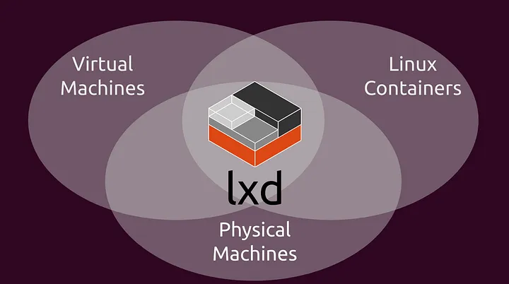
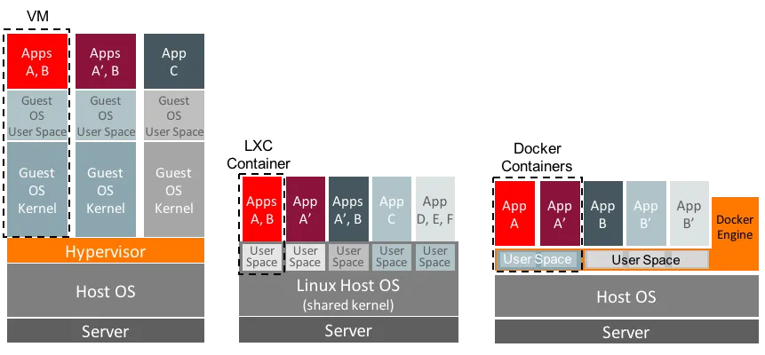
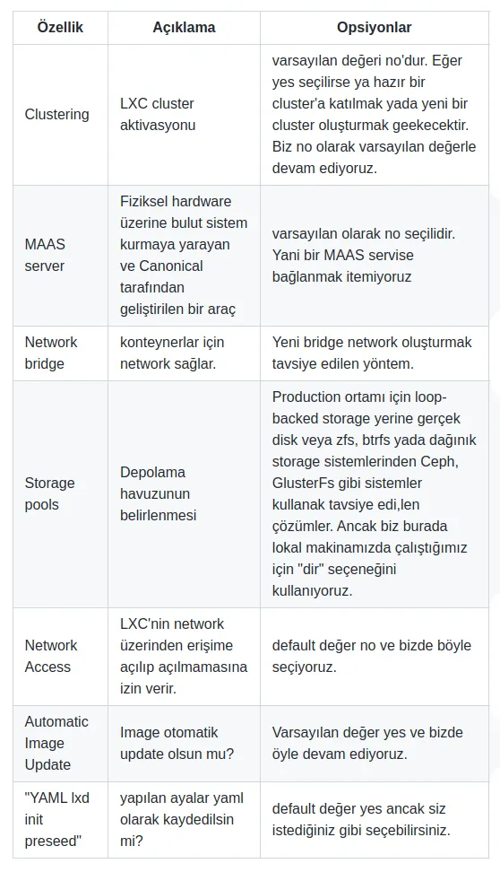

# LXC Kullanımı, Terraform LXD Provider'ı ile Otomasyon ve Terraform ile LXC Kullanarak Kubernetes Cluster Oluşturma

Merhabalar,

Bu yazımızda Terraform ile LXC üzerinde kubeadm kullnarak Kubernetes cluster kurulumu ytapmaya çalışacağız. Bunu için öncelikle 

- LXC/LCD nedir? 
- Docker container'ları ile arasındaki fark tam olarak nedir? 

sorularına yanıp bulup ardından Terraform üzerinde terraform-lxd provider ile HA bir Kubernetes cluster için alttaki ropolojide makinelerimizi nasıl oluşturacağımızı göreceğiz.

Makelede terraform nedir konusuna değinmiyoruz. Ancak Terraform gibi Hashicorp'un diğer ürünlerinde de kullandığı HashiCorp Configuration Language hakkında bilgi almak isterseniz daha önce yazdığım [HashiCorp Configuration Language (HCL) Dili Nedir? Nasıl Kullanılır?](https://medium.com/p/ed413c291f2d) başlıklı yazıyı inceleyebilirsiniz. Hem dili temde Terraform üzerinden bu dil nasıl kullanılı ronun hakkında bilg alabilirsiniz.

LXC ile konuya bir girelim.

Her ne kadar konteyner denince günümüzde akla ilk olarak Docker gelse de, aslında bu teknolojinin kökleri çok daha eskiye, 2008 yılında geliştirilen LXC (Linux Containers) sistemine kadar uzanır.

LXC, Linux çekirdeğinin sunduğu cgroups ve namespaces gibi özellikleri kullanarak, izole edilmiş işlem alanları oluşturma amacıyla ortaya çıkmıştır. Bu sayede, sanal makinelerin sağladığı izolasyona benzer bir yapı daha hafif ve doğrudan çekirdek düzeyinde mümkün hale gelmiştir. LXC’nin ortaya koyduğu sistem konteyner yaklaşımı, yalnızca bir uygulamayı değil, adeta bütün bir işletim sistemini izole bir ortamda çalıştırmayı hedefler.

Zamanla bu altyapının daha kullanıcı dostu bir hale getirilmesi ihtiyacı doğmuş ve bu bağlamda Canonical tarafından 2015 yılında geliştirilen LXD projesi devreye girmiştir. LXD, LXC üzerine inşa edilmiş bir konteyner yöneticisidir ve REST API, ağ ve disk yönetimi gibi yüksek seviyeli araçlarla LXC’yi daha erişilebilir kılar.

Öte yandan Docker, 2013 yılında geliştirildiğinde, başlangıçta LXC'yi konteyner motoru olarak kullanmış, ancak daha sonra runc adı verilen kendi container runtime bileşenine geçerek, uygulama konteynerlerine odaklanan daha sade ve hızlı bir çözüm sunmuştur. Docker’ın yaklaşımı, “her konteyner bir uygulamadır” ilkesine dayanırken, LXC’nin felsefesi “her konteyner bir sistemdir” şeklinde özetlenebilir.

Bu bağlamda, LXC ile Docker arasında temel bir ayrım ortaya çıkar: LXC sistem konteynerleri üretirken, Docker yalnızca tek bir uygulamayı izole etmeye odaklanır. Bu fark, konteynerlerin kullanım amaçlarını, performans kriterlerini ve izolasyon düzeylerini doğrudan etkiler.



[resim kaynak](https://8grams.medium.com/lxd-lxc-linux-container-to-rule-them-all-5f488322d667)


Ayrıca, klasik sanal makineler (VM) ile karşılaştırıldığında, LXC konteynerleri çok daha hızlı başlatılabilir, daha az kaynak tüketir ve host sistemin çekirdeğini doğrudan paylaşarak, native Linux performansı sağlar. Ancak VM’ler, tam donanım emülasyonu sundukları için farklı işletim sistemleri veya çekirdek sürümleri çalıştırmak isteyen senaryolarda hala tercih edilmektedir. 



[resim kaynak](https://8grams.medium.com/lxd-lxc-linux-container-to-rule-them-all-5f488322d667)

Şekilde de görüleceği üzere LXC Docker konteynerleri ile sanal makinelerinin tam ortasında duruyor. Bu tabiiki sanal mekinelere göre daha fazla hız kazantırıyor an cak diğer taraftan da tabiiki sanal makineler kadar soyutlama getirmediği bir gerçek. Ancak burada şunu da belirtmek gerekiyor. LXD 3-4 yıl önce sanal makine oluşturma özelliğini de getirdi. İlk zamanlar ufak tefek işler ve lab ortamı kurmak için kullanmıştım. Windows VM bile oluşturulabiliyordu. Bir yıl kadar önce yazılmış [şu resmi blok yazısından](https://ubuntu.com/blog/lxd-virtual-machines-an-overview) nasıl çalıştığı hakkında bilgi verilmiş. Aslında arkada QEMU kullanıyor. O zaman ne nalamı oldu diyebilirsiniz ama buradaki ama sadece LXC komutlarıyla hem konteyner hem de sanal makine oluşturma ve yönetebilme rahatlığı. Eğer alışırsanız hakikaten hem hızına hem de bir iki komutla özellikle test ve lab ortamları oluşturmanın rahatalığını seveceksiniz.

Bu arada LXC kullanalarak fiziksel sunucular üzerinden LXC cluster kurarak da kullnabilirsiniz. Altta birazdan LXD kurarken sorulacak cluster parametresine `yes` cevabı verip diğer node'ların bigilerini de verirseniz bir LXC cluster'ı kurmuş olacaksınız. [LXD resmi dokümanlarını](https://documentation.ubuntu.com/lxd/stable-4.0/clustering/) da takip edebilirsiniz. Ayrıca [şu resmi sayfada](https://ubuntu.com/tutorials/how-to-setup-a-basic-lxd-cluster#2-initializing-clustering-on-the-first-server) tam bir LXD cluster'ının kurulumu anlatılıyor.

Biz tek makine üzerinde LXD kurup bir iki komut görüp ardından Kubernetes cluster için Terraform ile ototmasyon yapmayı öğreneceğiz.

## LXD Kurulumu

Herhalde LXD'nin sadece Linux sistemlerde çalıştığıjnı söylememe gerek yok. Kurlumu şok basit. LXD, Ubuntu'nun geliştiridiği bir sistem olduğu için snap üzerinden kuruluyor. 

Snap Ubuntu'nun Linux sistemler için geliştirdiği cross platform bir paket yöneticisi. [Şu linkten](https://snapcraft.io/snapcraft) kurulumunu yapabilirsiniz. Kurulum yaptıktan sonra alttaki komutla LXD kurulumu yapılıyor.

```bash
sudo snap install lxd

# lxd grubu oluşturulmuş mu kontrol ediyoruz?
getent group lxd | grep "$USER"

# Kullanıcıyı lxd grubuna ekliyororuz
sudo usermod -aG lxd "$USER"
newgrp lxd

```

Daha sonra `lxd init` komutunu çalıştırıyoruz ve sorulara alttaki cevapları veriyoruz.


Sistemi yönetmek için ayrıca bir de web üzerinde çalışan UI var. LXD kurulduğunda aslınd abu da kurluyor zaten. Sadece aktif etmemiz gererkiyor.

```bash
lxc config set core.https_address :8443
```
Daha sonra bir tarayıcıdan `https://localhost:8443` adresine gidecek olursanız arayüze erişebilirsiniz.

UI konusuna devam etmeyeceğiz ancak çok faydalı bir araç olduğunu söyleyebilirim. UI üzerinden konteyner oluşturabilir ve kaynaklarını yöntebilirsiniz. [Bu sayfada](https://documentation.ubuntu.com/lxd/latest/tutorial/ui/#access-the-ui) adım adım herşey anlatılıyor.

## LXD Temel Kullanım

- Image kaynaklarının listesi

```bash
lxc remote list

```

- Uzak sunucudaki Image'ları listelemek

```bash

lxc image list images: ubuntu
lxc image list images: alpine

```
- Ubuntu container çalıştırmak

```bash
lxc launch ubuntu:24.04 ubuntu-container
```

- Çalışan konteynerleri listelemek

```bash
lxc image list

```

- Komut çalıştırmak

```bash
lxc exec  ubuntu-container -- echo merhaba
```


- Çalışan konteynere giriş yapmak

Docker konteynerlerden farklı olarak `--it` parametresi yerine `--` kullanıyoruz.

```bash
lxc exec  ubuntu-container -- bash
```

Bir Linux makinesinde ne yapabiliyorsak aynısını burada da yapabiliriz.

- Çalışan konteyneri durdurmak tekrar çelıştırm k ve silmek

```bash
lxc stop ubuntu-container

lxc start ubuntu-container

# alttaki örneklkeri için konteyneri silmeyin
# lxd delete ubuntu-container


```
- Konteynerin özelliklerini değiştirmek

Lxd'yi init ettiğimizde varsayılan aylarla bir konfigürasyon oluştu. Biz bir konteyner oluşturduğumuzda da bu ayarlara göre intance oluştumuş oluyoruz. Ancak tabii ki bu ayaları değiştirmek mümkün.


```bash
# özellikleir set etmek için alttaki template kullanılır
# lxc config set <instance_name> <option_key>=<option_value> <option_key>=<option_value> ...

# örneğin

lxc config set ubuntu-container limits.memory=2GiB
```

Bütün opsiyon ve özellik listesi için: https://documentation.ubuntu.com/lxd/latest/reference/instance_options/#


- Konteyner'in özelliklerini görmek ve editlemek

```bash
lxc config show ubuntu-container
lxc config edit ubuntu-container # stop edildikten sonra editlenebilir.
```


- Konteynerler İçin Device ve Ağ Yönetimi

Bir makinenin Network device, disk, usb, pci vb farklı device'ları eklemek ve konfisgürasyonunu yapmak için de ayalarlar yapılabilir.

Bütün device listesi için: https://documentation.ubuntu.com/lxd/latest/reference/devices/

Bu başlığa örnek için önce bir network oluşturup bu network'e bağlı iki konteyner oluşturalım. Bu konteyner'lar sadee birbirleriyle konuşabilsin, önceden oluşturduğumuz konteyner ile konuşamasın.

Ayrıca disk device'ını da kendimiz bağlayalım.

Altta görüleceği üzere hem netwrok hem de disk device ekledik.

```bash
# Ağ oluşturduk

lxc network create isolated-br0 \
  ipv4.address=10.200.200.1/24 \
  ipv4.nat=false \  # nat iptal ettik
  ipv6.address=none

# birinci mekineyi init et
lxc init ubuntu:24.04 ubuntu-a

# root diski bağla
lxc config device add ubuntu-a root disk path=/ pool=default

# izole ağı bağla
lxc config device add ubuntu-a eth0 nic name=eth0 network=isolated-br0 type=nic

# birinci makineyi başlat
lxc start ubuntu-a


# ikinci mekineyi ayarlar ve çalıştır

lxc init ubuntu:24.04 ubuntu-b

lxc config device add ubuntu-b root disk path=/ pool=default

lxc config device add ubuntu-b eth0 nic name=eth0 network=isolated-br0 type=nic

lxc start ubuntu-b


# conteyner listesini al

lxc list

# network kontolü yap

lxc exec ubuntu-a -- ping 10.200.200.11

# alttaki komut başarısız olmalı
lxc exec ubuntu-a -- ping 8.8.8.8

```

- Konteyner dosya ve dizin işlemleri

Konteynerden dosya kopyalamak için

```bash
lxc file pull ubuntu-container/etc/hosts $HOME/
```

Konteynere dosya göndermek için

```bash
lxc file push /etc/hosts ubuntu-container/etc/hosts2
```

Bütün bir klaör kopyalancaksa `-r` parametresi eklenir. 


## Proceed ve Profile Dosyaları Hakkında

- **Proceed dosyası**, bir LXD sunucusunu tamamen otomatik olarak yapılandırmak için kullanılan bir YAML formatında konfigürasyon dosyasıdır. Bu dosya ile lxd init işlemini otomatikleştirebilir, storage, network, profile ve hatta container’ları önceden tanımlayabiliriz.

Hatırlarsanız LXD kurulumu sonrasnda `LXD init` komutun çalıştırmaıştık ve bazı sorulara cevap vermiştik. Bu dosya tam oalrak init komutunu otomatikleştirmek için kullanılır.  Alttaki gibi bir formatı var.


```yaml
config:
  core.https_address: "[::]:8443"              # LXD API'nın dışarıya açık dinleme adresi
  images.auto_update_interval: "24"            # Image'ler otomatik her 24 saatte bir güncellensin

networks:
- name: lxdbr0
  type: bridge
  config:
    ipv4.address: 10.0.3.1/24
    ipv4.nat: "true"
    ipv6.address: none

storage_pools:
- name: default
  driver: zfs
  config:
    size: 10GB                                 # ZFS pool büyüklüğü
  # Note: Eğer zfs mevcut değilse, 'dir' veya 'btrfs' kullanılabilir.

profiles:
- name: default
  description: "Default profile for LXD containers"
  devices:
    eth0:
      name: eth0
      network: lxdbr0
      type: nic
    root:
      path: /
      pool: default
      type: disk

cluster:                                       # (İsteğe bağlı) Eğer cluster kuruyorsan
  server_name: node1
  enabled: false                               # Tek düğümde kullanılacaksa false

# (İsteğe bağlı) Başlangıçta bir konteyner oluşturmak için:
instances:
- name: test-container
  type: container
  source:
    type: image
    alias: ubuntu/22.04
    server: https://images.linuxcontainers.org
  profiles:
    - default
  config:
    limits.cpu: "2"
    limits.memory: 1GB

```

Bu dosyayı `cat lxd-preseed.yaml | lxd init --preseed` komutyla çalıştıp LXD sunucumuzu initialize edebiliriz. 

Ayrıca istersek `lxd init --dump` komutuyla `Proceed.yml` dosyaını mevcut ortamımızdan da alabiliriz.


- Profile Dosyası ise container ve VM'ler için varsayılan yapılandırma şablonları tanımlar. Bu yapı, her instance oluşturulduğunda otomatik olarak atanabilecek bir şablon görevi görür.

LXC'de Docker'da olduğu gibi Dockerfile benzeri bir dosya bulunmaz. Çünkü burada amacımız biruygulamayı  build edip yayına vermek değil. Temel amacımız tabiri caizse bir sanal makinemsi :) birşey oluşturmak. Burada ihtiyacımız olan şey ouşturlacak container veya VM'in bir deklerasyona göre oluşturulması. Bunun içine profile dosyası kullanılır.

LXD'deki profile, instance’lara uygulanacak:

  - Ağ ayarları (network devices),
  - Disk ayarları (storage volumes),
  - Limitler (CPU, bellek),
  - Ortam değişkenleri (config),
  - ve diğer ayarları merkezi olarak tanımlamak için kullanılır.

Örnek bir profile dosyası aşağıdaki gibidir.

```yml
config:
  limits.cpu: "2"                  # Konteyner maksimum 2 CPU çekirdeği kullanabilir
  limits.memory: "2GB"             # Maksimum 2GB RAM
  environment.HTTP_PROXY: ""       # Ortam değişkeni tanımı (boş da olabilir)

description: "Web uygulamaları için temel profil"

devices:
  eth0:
    name: eth0                     # Konteyner içindeki network interface adı
    network: lxdbr0                # LXD üzerindeki mevcut bridge ağı
    type: nic                      # Aygıt türü: NIC (ağ kartı)

  root:
    path: /                        # Root dizin mount noktası
    pool: default                  # Bağlanacağı storage pool adı
    type: disk                     # Aygıt türü: disk (mount işlemi yapılacak)

  webport:
    type: proxy                    # Proxy cihaz: port yönlendirmesi sağlar
    listen: tcp:0.0.0.0:8080       # Host sistemde dinlenecek adres
    connect: tcp:127.0.0.1:80      # Konteyner içinde yönlendirilecek hedef port

```

Mesela bu dosya kullanılarak alttaki komutlarla profile oluşturulur.

```bash
lxc profile create web
lxc profile edit web < web-profile.yml
```

Daha sonra bu profile kullanılarak alttaki komutla container oluşturulur.

```bash
lxc launch ubuntu:22.04 my-container --profile web
```
## Cloud-init

Bulut bilişim teknolojilerinin yükselişiyle birlikte, sanal makinelerin dinamik ve otomatik biçimde başlatılması, yapılandırılması ve yönetilmesi kritik bir ihtiyaç haline gelmiştir. Bu ihtiyaca yanıt olarak geliştirilen cloud-init, ilk olarak Ubuntu tarafından 2009 yılında tanıtılmış ve hızla bulut ekosisteminin vazgeçilmez bir bileşeni haline gelmiştir.

Cloud-init, bir sanal makine veya konteyner ilk kez başlatıldığında, sistemin otomatik olarak kullanıcı hesaplarını oluşturma, ağ yapılandırmalarını ayarlama, paketleri yükleme ve script çalıştırma gibi işlemleri gerçekleştirmesine olanak tanır. Başlangıçta sadece Ubuntu için geliştirilen bu araç, bugün Debian, CentOS, RHEL, Fedora, openSUSE gibi birçok dağıtım tarafından da desteklenmektedir.

Modern altyapılarda "ilk açılışta konfigürasyon" (first boot provisioning) ihtiyacına pratik ve güçlü bir çözüm sunan cloud-init, bulut servis sağlayıcıları (AWS, Azure, OpenStack), sanallaştırma platformları ve LXD gibi konteyner sistemleriyle entegre çalışarak altyapı otomasyonunun temel taşlarından biri olmuştur.

Biz de LXC tarafında makinelerimizi ilk ayağa kaldırırken ihtiyacımız olan kurulumları ve ayarları cloud-init ile yapacağız.

[Resmi sayfasında](https://cloudinit.readthedocs.io/en/latest/explanation/introduction.html) daha detaylı bilgiye ulaşabilirsiniz. 


Şimdilik biz burada basit bir örnek yapacağız. Alttaki maddeleri yapan bir cloud-init config dosyası hazırlayalım.


- Admin adında bir kulanıcı eklensin ve sudoers grubuna eklensin
- Nginx kurulsun ve index dosyasına merhaba yazılsın ve yayına verilsin
- Test emaçlı bir kaç kerne modülü eklensin
- Firewall kapatılsın


Alttaki komutu terminalde çalıştıralım.

```bash

lxc launch ubuntu:24.04 myweb \
  -c user.user-data="$(cat <<EOF
#cloud-config
hostname: lxc-web
timezone: Europe/Istanbul

users:
  - name: admin
    gecos: Admin Kullanıcısı
    sudo: ALL=(ALL) NOPASSWD:ALL
    shell: /bin/bash
    groups: sudo


package_update: true
package_upgrade: true
packages:
  - nginx

runcmd:
  - echo '<h1>Merhaba Dünya</h1>' > /var/www/html/index.html
  - systemctl enable nginx
  - systemctl start nginx
  - systemctl stop ufw || true
  - systemctl disable ufw || true
  - modprobe loop
  - modprobe dm_mod
  - modprobe ip_tables
EOF
)"

```

Yada bir dosyaya yazıp alttaki gibi de çalıştırabiliriz.

```bash
lxc launch ubuntu:24.04 myweb -c user.user-data="$(cat user-data.yaml)"

```

Yaptıklarımızı test edelim.

```bash
# nginx servisine bakalım
lxc exec  myweb  -- systemctl status nginx

# 80 portunu test edelim ama önce ip adresini öğrenelim
lxc exec  myweb  -- ip a

curl 10.44.213.22 # üstteki komutta bende bu ip göründü
# <h1>Merhaba Dünya</h1>

```
`10.44.213.22` ip adresini tarayıcıda da çağırdığımızda sonucu görebiliriz.


## Prometheus ve Grafana ile Metriklerin Takibi

Bu konuya girmeyeceğiz ancak en çok kullanılan Prometheus ve Grafana ikilisini desteklediğni belirtmek istedim. 

Kurulumu ve yapılandırmasıçok kolay alttaki linkten taşp edebilirsiniz. Ekran görüntüleriyle birlikte kurulumunu anlatılmış. 


- https://documentation.ubuntu.com/lxd/latest/howto/grafana/


## Terraform Kullanılarak LXC Otomasyonu

LXC için Terraform registry'de LXD provider'ı var. [Şu linkten](https://registry.terraform.io/providers/terraform-lxd/lxd/latest/docs/resources/instance) provider dokümanına ulaşabilirsiniz.

Alttaki dokümanı bir klasör içinde `main.tf` adıyla kaydedelim. Açıklama satılarına baktığımızda kodun ne için yazıldığı gör lebiliyor.

```hcl

terraform {
  required_providers {
    lxd = {
      source = "terraform-lxd/lxd"
    }
  }
}

provider "lxd" {
  generate_client_certificates = true
  accept_remote_certificate   = true
  # Varsayılan olarak local Unix socket (/var/snap/lxd/common/lxd/unix.socket) üzerinden bağlanır
}


# LXC container oluştur
resource "lxd_instance" "example-container" {
  name  = "example-container"
  image     = "ubuntu:24.04"

  # CPU ve RAM limitleri
  limits = {
    cpu    = "1"
    memory = "2GB"
  }


  # Root diski tanımla
  device {
    name = "root"
    type = "disk"

    properties = {
      pool = "default"
      path = "/"
    }
  }

  # Ağ arayüzü tanımla (lxdbr0 köprüsü üzerinden)
  device {
    name = "eth0"
    type = "nic"

    properties = {
      network = "lxdbr0"
      type    = "nic"
    }
  }

}


```
Daha sonra alttaki komutlarla konteynerimizi ayağa kaldıralım.
 


```bash
terraform init
terraform plan
terraform apply
```


Konteyner listesine baktığımızda listede example-container adlı konteyneri görebiliriz.


```bash
lxc list
# sonuç
+-------------------+---------+----------------------+------+-----------+-----------+
|       NAME        |  STATE  |         IPV4         | IPV6 |   TYPE    | SNAPSHOTS |
+-------------------+---------+----------------------+------+-----------+-----------+
| example-container | RUNNING | 10.44.213.178 (eth0) |      | CONTAINER | 0         |
+-------------------+---------+----------------------+------+-----------+-----------+
| myweb             | RUNNING | 10.44.213.22 (eth0)  |      | CONTAINER | 0         |
+-------------------+---------+----------------------+------+-----------+-----------+
| ubuntu-container  | RUNNING | 10.44.213.153 (eth0) |      | CONTAINER | 0         |
+-------------------+---------+----------------------+------+-----------+-----------+

```

Bu `main.yml` dosyasıyla aynı dizine `user-data.yml` adında bir doaya oluşturup altttaki cloud-init içeriğini bu dosyaya kopyalayalım. Bu yukarıda cloud-init konusunu işlerken yazdığımız dosyanın aynısı. 

```yml
#cloud-config
hostname: lxc-web
timezone: Europe/Istanbul

users:
  - name: admin
    gecos: Admin Kullanıcısı
    sudo: ALL=(ALL) NOPASSWD:ALL
    shell: /bin/bash
    groups: sudo


package_update: true
package_upgrade: true
packages:
  - nginx

runcmd:
  - echo '<h1>Merhaba Dünya</h1>' > /var/www/html/index.html
  - systemctl enable nginx
  - systemctl start nginx
  - systemctl stop ufw || true
  - systemctl disable ufw || true
  - modprobe loop
  - modprobe dm_mod
  - modprobe ip_tables
```

Terraform dosyamızı alttaki gibi değişiriyoruz. 
- Instance tanımı içinde config diye bir bölüm tanımlayıp içini cloud-init dosyamızı ekledik.
- Ayrıca yeni bir network oluşturup LXC instance'ımızın ağ device'ına `parent  = "${lxd_network.new_default.name}"` parametresi ekledik.


```hcl

terraform {
  required_providers {
    lxd = {
      source = "terraform-lxd/lxd"
    }
  }
}

provider "lxd" {
  generate_client_certificates = true
  accept_remote_certificate   = true
  # Varsayılan olarak local Unix socket (/var/snap/lxd/common/lxd/unix.socket) üzerinden bağlanır
}


resource "lxd_network" "new_default" {
  name = "new_default"

  config = {
    "ipv4.address" = "10.150.19.1/24"
    "ipv4.nat"     = "true"
  }
}


# LXC container oluştur
resource "lxd_instance" "example-container" {
  name  = "example-container"
  image     = "ubuntu:24.04"


  # cloud-init configürasyonumuzu  tanımlıyoruz
  config = {
  "user.user-data" = file("user-data.yml")
  }

  # CPU ve RAM limitleri
  limits = {
    cpu    = "1"
    memory = "2GB"
  }


  # Root diski tanımla
  device {
    name = "root"
    type = "disk"

    properties = {
      pool = "default"
      path = "/"
    }
  }

  # Ağ arayüzü tanımla (lxdbr0 köprüsü üzerinden)
  device {
    name = "eth0"
    type = "nic"

    properties = {
      nictype = "bridged"
      parent  = "${lxd_network.new_default.name}"
    }
  }

}

```

Alttaki komutlarla instance'ımızı tekrar oluşturuyoruz. 

```bash
terraform init
terraform plan
terraform apply
```

Daha sonra konteyner listesini alalım.

```bash
lxc list
+-------------------+---------+----------------------+-----------------------------------------------+-----------+-----------+
|       NAME        |  STATE  |         IPV4         |                     IPV6                      |   TYPE    | SNAPSHOTS |
+-------------------+---------+----------------------+-----------------------------------------------+-----------+-----------+
| example-container | RUNNING | 10.150.19.10 (eth0)  | fd42:9a0d:a982:1c8d:216:3eff:fe82:d166 (eth0) | CONTAINER | 0         |
+-------------------+---------+----------------------+-----------------------------------------------+-----------+-----------+
| myweb             | RUNNING | 10.44.213.22 (eth0)  |                                               | CONTAINER | 0         |
+-------------------+---------+----------------------+-----------------------------------------------+-----------+-----------+
| ubuntu-container  | RUNNING | 10.44.213.153 (eth0) |                                               | CONTAINER | 0         |
+-------------------+---------+----------------------+-----------------------------------------------+-----------+-----------+
```

`example-container` konteynerimizin ip adresi network oluştutuken belirttiğimiz ip adresiyle aynı. 

Birde network listesine bakalım.

```bash
lxc network ls

```

`new_default` networkünün oluştuğunu görebiliriz. Son olarak bir de nginx çalışıyor mu onu test edelim.

```bash

curl 10.150.19.10 # üstteki komutta bende bu ip göründü
# <h1>Merhaba Dünya</h1>
```
Bu şekilde çalıştığını görebiliriz.

## HA Kubernetes cluster kurlumu için Terraform Lxd ile sunucuların hazırlanması

Buraya kadar basit bir örnekle provider'ı anlamaya çalıştık. Şİmdi daha büyük bir örnek yapmaya çalışacağız.

Alttaki gibi bir yapımız olacak.


Bir Load Balancer, 3 Master ve 3 Worker node'dan oluşan bir HA Kubernetes cluster kurmak için bir altapıya ihtiyacımız var. Alttaki kısıtları göz önüne alarak 7 makinelik bir yapı kurmyaı hedefliyoruz.

Alttakiler terraform için kısıtları belirtiyor

- Load balancer, master ve worker node'lar için bir terraform dosyasında (`profiles.tf`) profiller ayrı ayrı lxc profile olarak tanımlanacak
- Bu cluster için ayrı bir network ve subnet oluşturulacak ve buda ayrı bir terraform doaysında (`network.tf`) tanımlanacak
- Birde ayrıca bir terraform dosyasında (`storage.tf`) storage pool tanımı yapılcak
- Bu storage ve netowrk tanımları profilerde kullanılacak
- Bir de `instances.tf` dosyası oluşturulup instance'lara ait resource'lar burada tanımlanacak
- Load balancer, master ve worker node'ları için her bir gruba cpu, ram ve disk ayarı yapılabilecek. bunu ayrı vir `vars.tf` adnda bir variable'ların toplanacağı dosya tanımlanacak.
- Bütün makinere birbirlerinine hostname ile ulaşabilmesleri için hosts dosyalarına ip ve hostname bilgileri yazılacak

Alttakiler Kubernetes için kısıtları belirtiyor. Amacımız kubernetes kurmak değil zaten bunu Terraform ilö eyapmak çok mantıkjlı da olmaz. Sadece master ve worker node'ları Kubernetes için hazır hale getirecek kurlumları ve ayarları yapmak istiyoruz.

- Bütün master ve worker node'lara Kubernetes için gerekli olan ayarlar yapılacak
- Her birine sadece kubeadm kurulacak
- Master ve worker node'lara Container runtime olarak Docker ve CRI olarak da doğal olarak cri-dockerd yüklenecek. Yükleme sonrası `docker info` komutuyla yükleme kontrol edilecek


Adım adım sistemimizi kuralım. Kodları çok detaylı anlatmayacağım çünkü yukarıda anlattıklarım ve ilk makalede anlattıklarımdan zaten net bir şekilde kodun ne yaptığı anlaşılıyor olacak. Zaten Terraform'un kullandığı HCL dini ve yapısı da çok kolay anlaşılıyor.

- Öncelikle bir klasör oluşturup içine script adında bir klasör daha oluşturuyoruz. ben alttaki gibi bir yapımız olacak

lxd-k8s adında bir klasör oluşturdum. İlerde oluşturacağımız doaylarla altakki gib ibir yapı kurmuş olacağız.

```
├── main.tf          # Terraform provider konfigürasyonu
├── vars.tf          # Değişkenler (CPU, RAM, disk, vb)
├── network.tf       # Network ve subnet tanımları
├── storage.tf       # Storage pool tanımları
├── profiles.tf      # LXD profilleri (load balancer, master, worker)
├── instances.tf     # LXD instance'ları
├── README.md        # Readme dosyası
└── scripts
    ├── install-haproxy.sh   # HaProxy kurulumu
    └── install-k8s-node.sh  # Kubernetes kurulumu için gerekli ayarların yapılması
```

- Daha sonra HaProxy konteynereimizin konfigürasyonu için `install-haproxy.sh` adında bir script dosyası oluşturuyoruz ve işçeriğini alttan kopyalıyoruz.

Çok basit ve yalın bir şekilde HaProxy kurup konfigürayonunuu yapıyoruz.


```shell
#!/bin/bash

# HAProxy Load Balancer Installation Script

echo "Installing HAProxy on Load Balancer..."

# Update system
apt-get update
apt-get install -y haproxy

# Configure HAProxy
cat > /etc/haproxy/haproxy.cfg << EOL
global
    daemon
    maxconn 4096

defaults
    mode tcp
    timeout connect 5000ms
    timeout client 50000ms
    timeout server 50000ms

frontend kubernetes-api
    bind *:6443
    default_backend kubernetes-api-backend

backend kubernetes-api-backend
    balance roundrobin
    server k8s-master1 10.100.0.11:6443 check
    server k8s-master2 10.100.0.12:6443 check
    server k8s-master3 10.100.0.13:6443 check
EOL

# Update hosts file
cat >> /etc/hosts << EOL
10.100.0.10 k8s-lb
10.100.0.11 k8s-master1
10.100.0.12 k8s-master2
10.100.0.13 k8s-master3
10.100.0.14 k8s-worker1
10.100.0.15 k8s-worker2
10.100.0.16 k8s-worker3
EOL

# Enable and start HAProxy
systemctl enable haproxy
systemctl start haproxy

echo "HAProxy installation and configuration completed"


```
- Script klasörüne bir `install-k8s-node.sh` adında bir doaya oluşturup içerğini alttan kopyalıyoruz.
Burada da basitçe amacımız Kubernetes için gerekli olan temel ayları ve kurulumları yapıyoruz. Örnek olması açısından Container Runtime olarak Docker ve CRI olarak da cri-dockerd yüklüyoruz. Bunu isteğinize göre değiştirebilirsiniz.

```shell

#!/bin/bash

# Kubernetes Node Installation Script
# This script installs Docker, cri-dockerd, and kubeadm on master and worker nodes

KUBERNETES_VERSION="1.29.0"

echo "Installing Kubernetes components..."

# Update system
apt-get update
apt-get install -y apt-transport-https ca-certificates curl gpg

# Add Docker GPG key and repository
curl -fsSL https://download.docker.com/linux/ubuntu/gpg | gpg --dearmor -o /usr/share/keyrings/docker-archive-keyring.gpg
echo "deb [arch=amd64 signed-by=/usr/share/keyrings/docker-archive-keyring.gpg] https://download.docker.com/linux/ubuntu $(lsb_release -cs) stable" | tee /etc/apt/sources.list.d/docker.list > /dev/null

# Install Docker
apt-get update
apt-get install -y docker-ce docker-ce-cli containerd.io

# Install cri-dockerd
wget https://github.com/Mirantis/cri-dockerd/releases/download/v0.3.8/cri-dockerd_0.3.8.3-0.ubuntu-jammy_amd64.deb
dpkg -i cri-dockerd_0.3.8.3-0.ubuntu-jammy_amd64.deb

# Configure cri-dockerd
systemctl enable cri-docker.service
systemctl enable cri-docker.socket
systemctl start cri-docker.service
systemctl start cri-docker.socket

# Add Kubernetes GPG key and repository
curl -fsSL https://pkgs.k8s.io/core:/stable:/v1.29/deb/Release.key | gpg --dearmor -o /etc/apt/keyrings/kubernetes-apt-keyring.gpg
echo "deb [signed-by=/etc/apt/keyrings/kubernetes-apt-keyring.gpg] https://pkgs.k8s.io/core:/stable:/v1.29/deb/ /" | tee /etc/apt/sources.list.d/kubernetes.list

# Install kubeadm
apt-get update
apt-get install -y kubeadm=${KUBERNETES_VERSION}-1.1
apt-mark hold kubeadm

# Configure system for Kubernetes
modprobe br_netfilter
modprobe overlay
echo "br_netfilter" >> /etc/modules-load.d/k8s.conf
echo "overlay" >> /etc/modules-load.d/k8s.conf

# Configure sysctl for Kubernetes
cat > /etc/sysctl.d/k8s.conf << EOL
net.bridge.bridge-nf-call-iptables = 1
net.bridge.bridge-nf-call-ip6tables = 1
net.ipv4.ip_forward = 1
EOL
sysctl --system

# Disable swap
swapoff -a
sed -i "/swap/d" /etc/fstab

# Update hosts file
cat >> /etc/hosts << EOL
10.100.0.10 k8s-lb
10.100.0.11 k8s-master1
10.100.0.12 k8s-master2
10.100.0.13 k8s-master3
10.100.0.14 k8s-worker1
10.100.0.15 k8s-worker2
10.100.0.16 k8s-worker3
EOL

# Verify Docker installation
docker info

echo "Kubernetes components installation completed"

```

- Şimdi de cluster kurarken gerekli olacak kaynakları isteğimize göre yöntebilmek için root dizine yani lxd-k8s klasörüne değikenlerden oluşan bir `vars.tf` adında bir doaya oluşturup içeriğin alttan kopyalıyoruz.
Açıklama gereken bir şey yok gibi görünüyor. Yani değişken isimlerinden bile ne olduğu anlaşılıyor zaten.

```json
# Kubernetes Cluster Variables

# Kubernetes version
variable "kubernetes_version" {
  description = "Kubernetes version to install"
  type        = string
  default     = "1.33.0"
}

# Load Balancer configuration
variable "lb_config" {
  description = "Load balancer configuration"
  type = object({
    cpu_cores = number
    memory_gb = number
    disk_gb   = number
  })
  default = {
    cpu_cores = 1
    memory_gb = 2
    disk_gb   = 2
  }
}

# Master nodes configuration
variable "master_config" {
  description = "Master nodes configuration"
  type = object({
    count     = number
    cpu_cores = number
    memory_gb = number
    disk_gb   = number
  })
  default = {
    count     = 3
    cpu_cores = 1
    memory_gb = 2
    disk_gb   = 2 
  }
}

# Worker nodes configuration
variable "worker_config" {
  description = "Worker nodes configuration"
  type = object({
    count     = number
    cpu_cores = number
    memory_gb = number
    disk_gb   = number
  })
  default = {
    count     = 3
    cpu_cores = 1
    memory_gb = 2
    disk_gb   = 2
  }
}

# Network configuration
variable "network_config" {
  description = "Network configuration"
  type = object({
    name   = string
    subnet = string
    gateway = string
  })
  default = {
    name    = "k8s-network"
    subnet  = "10.100.0.0/24"
    gateway = "10.100.0.1/24"
  }
}

# Storage pool configuration
variable "storage_pool" {
  description = "Storage pool name"
  type        = string
  default     = "k8s-storage"
}

# Base image
variable "base_image" {
  description = "Base LXD image"
  type        = string
  default     = "ubuntu:24.04"
}

```


- Sistemimiz için gerelen network'ü oluşturuyoruz. Bunun için root dizinde `network.tf` adında bir dosya oluşturup alttakileri kopyalıyoruz.


```json
# Network Configuration

resource "lxd_network" "k8s_network" {
  name = var.network_config.name
  
  config = {
    "ipv4.address" = var.network_config.gateway
    "ipv4.nat"     = "true"
    "ipv6.address" = "none"
  }
}

# Output network information
output "network_name" {
  value = lxd_network.k8s_network.name
}

output "network_gateway" {
  value = var.network_config.gateway
}

output "network_subnet" {
  value = var.network_config.subnet
}

```
- Storage için `storage.tf` dosyası oluşturup alttakileri kopyalıyoruz. 

```json
# Storage Pool Configuration

resource "lxd_storage_pool" "k8s_storage" {
  name   = var.storage_pool
  driver = "dir"
  
}

```


- Ve bu kaynkları kullnacak olan profil doyasmızı oluşturuyoruz. Bunun için `profiles.tf` adında bir dosya oluşturup içerğini alttan kopyalıyoruz.

```json
# LXD Profiles for Kubernetes Cluster

# Base profile for all nodes
resource "lxd_profile" "k8s_base" {
  name = "k8s-base"
  
  config = {
    "security.nesting"       = "true"
    "security.privileged"    = "true"
    "linux.kernel_modules"   = "ip_tables,ip6_tables,netlink_diag,nf_nat,overlay,br_netfilter"
    "raw.lxc"               = "lxc.apparmor.profile=unconfined\nlxc.mount.auto=proc:rw sys:rw cgroup:rw\nlxc.cgroup.devices.allow=a\nlxc.cap.drop="
  }

  device {
    name = "eth0"
    type = "nic"
    properties = {
      network = lxd_network.k8s_network.name
    }
  }

  device {
    name = "root"
    type = "disk"
    properties = {
      path = "/"
      pool = lxd_storage_pool.k8s_storage.name
    }
  }
}

# Load Balancer Profile
resource "lxd_profile" "lb_profile" {
  name = "k8s-lb"
  
  config = {
    "limits.cpu"    = var.lb_config.cpu_cores
    "limits.memory" = "${var.lb_config.memory_gb}GB"
  }

  device {
    name = "root"
    type = "disk"
    properties = {
      path = "/"
      pool = lxd_storage_pool.k8s_storage.name
      size = "${var.lb_config.disk_gb}GB"
    }
  }

  device {
    name = "eth0"
    type = "nic"
    properties = {
      network = lxd_network.k8s_network.name
    }
  }
}

# Master Node Profile
resource "lxd_profile" "master_profile" {
  name = "k8s-master"
  
  config = {
    "limits.cpu"             = var.master_config.cpu_cores
    "limits.memory"          = "${var.master_config.memory_gb}GB"
    "security.nesting"       = "true"
    "security.privileged"    = "true"
    "linux.kernel_modules"   = "ip_tables,ip6_tables,netlink_diag,nf_nat,overlay,br_netfilter"
    "raw.lxc"               = "lxc.apparmor.profile=unconfined\nlxc.mount.auto=proc:rw sys:rw cgroup:rw\nlxc.cgroup.devices.allow=a\nlxc.cap.drop="
  }

  device {
    name = "root"
    type = "disk"
    properties = {
      path = "/"
      pool = lxd_storage_pool.k8s_storage.name
      size = "${var.master_config.disk_gb}GB"
    }
  }

  device {
    name = "eth0"
    type = "nic"
    properties = {
      network = lxd_network.k8s_network.name
    }
  }
}

# Worker Node Profile
resource "lxd_profile" "worker_profile" {
  name = "k8s-worker"
  
  config = {
    "limits.cpu"             = var.worker_config.cpu_cores
    "limits.memory"          = "${var.worker_config.memory_gb}GB"
    "security.nesting"       = "true"
    "security.privileged"    = "true"
    "linux.kernel_modules"   = "ip_tables,ip6_tables,netlink_diag,nf_nat,overlay,br_netfilter"
    "raw.lxc"               = "lxc.apparmor.profile=unconfined\nlxc.mount.auto=proc:rw sys:rw cgroup:rw\nlxc.cgroup.devices.allow=a\nlxc.cap.drop="
  }

  device {
    name = "root"
    type = "disk"
    properties = {
      path = "/"
      pool = lxd_storage_pool.k8s_storage.name
      size = "${var.worker_config.disk_gb}GB"
    }
  }

  device {
    name = "eth0"
    type = "nic"
    properties = {
      network = lxd_network.k8s_network.name
    }
  }
}

```

- Variable'ları ve Profile bilgilerini kullnarak instance'ları oluşturacak olan `instances.tf` dosyasını oluşturuyoruz.

Burada yukarıda daha önce bahsetmediğim bir konu var. Hazırladığımız script'i local-exec provision ile çalıştırırken konteyner'in oluştuğuna ve ayağa kalkmış olduğuna dikkat edin. Yani cloud-init gibi çalıştırmıyoruz.

Hatırlarsanız cloud-init konteyner veya VM ilk kez oluşturulduğunda kullanılıyordu.

```json
# LXD Instances for Kubernetes Cluster

# Load Balancer Instance
resource "lxd_instance" "k8s_lb" {
  name  = "k8s-lb"
  image = var.base_image
  type  = "container"
  
  profiles = [lxd_profile.lb_profile.name]
  
  config = {
    "boot.autostart" = "true"
  }

  # Load Balancer configuration
  provisioner "local-exec" {
    command = <<-EOF
      sleep 30
      lxc file push ${path.module}/scripts/install-haproxy.sh k8s-lb/tmp/install-haproxy.sh
      lxc exec k8s-lb -- chmod +x /tmp/install-haproxy.sh
      lxc exec k8s-lb -- /tmp/install-haproxy.sh
    EOF
  }

  depends_on = [lxd_profile.lb_profile, lxd_network.k8s_network]
}

# Master Nodes, count parametresi ile master node larının kaç tane oluşrurulacağını da belirtmiş oluyoruz.
resource "lxd_instance" "k8s_masters" {
  count = var.master_config.count
  name  = "k8s-master${count.index + 1}"
  image = var.base_image
  type  = "container"
  
  profiles = [lxd_profile.master_profile.name]
  
  config = {
    "boot.autostart" = "true"
  }

  # Master node configuration
  provisioner "local-exec" {
    command = <<-EOF
      sleep 30
      lxc file push ${path.module}/scripts/install-k8s-node.sh k8s-master${count.index + 1}/tmp/install-k8s-node.sh
      lxc exec k8s-master${count.index + 1} -- chmod +x /tmp/install-k8s-node.sh
      lxc exec k8s-master${count.index + 1} -- /tmp/install-k8s-node.sh
    EOF
  }
  # öncelikle alttaki resource'ların tamamlanmış olması lazım
  depends_on = [lxd_profile.master_profile, lxd_network.k8s_network]
}

# Worker Nodes
resource "lxd_instance" "k8s_workers" {
  count = var.worker_config.count
  name  = "k8s-worker${count.index + 1}"
  image = var.base_image
  type  = "container"
  
  profiles = [lxd_profile.worker_profile.name]
  
  config = {
    "boot.autostart" = "true"
  }

  # Worker node configuration
  provisioner "local-exec" {
    command = <<-EOF
      sleep 30
      lxc file push ${path.module}/scripts/install-k8s-node.sh k8s-worker${count.index + 1}/tmp/install-k8s-node.sh
      lxc exec k8s-worker${count.index + 1} -- chmod +x /tmp/install-k8s-node.sh
      lxc exec k8s-worker${count.index + 1} -- /tmp/install-k8s-node.sh
    EOF
  }

  # öncelikle alttaki resource'ların tamamlanmış olması lazım
  depends_on = [lxd_profile.worker_profile, lxd_network.k8s_network]
}

# Outputs
output "load_balancer_ip" {
  value = "10.100.0.10"
}

output "master_ips" {
  value = [for i in range(var.master_config.count) : "10.100.0.${11 + i}"]
}

output "worker_ips" {
  value = [for i in range(var.worker_config.count) : "10.100.0.${14 + i}"]
}

```

- Ve son olarak `main.tf` doyamızı oluşturuyoruz. Bu dosyada kullanılacak modül ve provider tanımlarını ve ayalarını yapıyoruz.

```json
# Main Terraform configuration

terraform {
  required_providers {
    lxd = {
      source  = "terraform-lxd/lxd"
      version = "~> 2.0"
    }
  }
  required_version = ">= 1.0"
}

# LXD provider configuration
provider "lxd" {
  # Configure LXD provider
  generate_client_certificates = true
  accept_remote_certificate    = true
}
```

Evet, artık yapımız tamamlanmış oldu.


```
├── main.tf          # Terraform provider konfigürasyonu
├── vars.tf          # Değişkenler (CPU, RAM, disk, vb)
├── network.tf       # Network ve subnet tanımları
├── storage.tf       # Storage pool tanımları
├── profiles.tf      # LXD profilleri (load balancer, master, worker)
├── instances.tf     # LXD instance'ları
├── README.md        # Readme dosyası
└── scripts
    ├── install-haproxy.sh   # HaProxy kurulumu
    └── install-k8s-node.sh  # Kubernetes kurulumu için gerekli ayarların yapılması

```

Artık alttaki komutları çalıştırarak ortamımızı kaldırmış olacağız. 


```shell

terraform init

terraform plan

teraform apply

```


## Incus Hakkında


Son olarak birde Incus projesinden bahsedeelim.

2023 yılında Canonical, LXD projesini bağımsız bir açık kaynak topluluğu projesi olmaktan çıkararak kendi kontrolü altına aldı. Bu değişiklik, topluluğun katılımını sınırladı ve LXD'nin daha kapalı bir geliştirme modeline geçmesine neden oldu. Bu durumdan rahatsızlık duyan orijinal geliştiricilerden bazıları, LXD’nin özgün açık kaynak ruhunu sürdürmek amacıyla Incus adlı çatallanmış (fork) bir projeyi başlattı. Incus, LXD’nin topluluğa açık bir alternatifi olarak doğdu ve hızla benimsenmeye başladı.

Incus, teknik olarak LXD ile büyük ölçüde uyumludur; hatta birçok komut ve yapılandırma doğrudan taşınabilir durumdadır. Ancak uzun vadede Incus, daha şeffaf, topluluk odaklı ve özgür yazılım ilkelerine sadık bir yol izlemeyi hedeflemektedir. Canonical'ın kontrolündeki LXD'nin tersine, Incus’un yönetimi Linux Containers (LXC) topluluğu tarafından yapılmakta ve bu sayede dış katkılar daha özgürce kabul edilmektedir. Bu ayrım, LXD ve Incus’un gelecekte farklı yönlere evrilmesine zemin hazırlamaktadır.

Yukarıda bahsettiğimiz hemen hemen herşey Incus'da da aynı. Bütün Komutlar bile aynı. Incus için Terraform'da bir provider da var. 

- Terraform Incus provider sayfası: https://registry.terraform.io/providers/lxc/incus/latest/docs
- Incus Resmi Sayfası: https://linuxcontainers.org/incus/ 


Bu yazımız da bu kadar, umarım faydalı olmuştur.

Diğer yazılarımızda görüşmek üzere kendinize iy ibakın.

## Kaynaklar

- https://dev.to/amabe_dev/how-to-run-gui-apps-in-lxd-containers-882
- https://medium.com/@cristi.posoiu/learn-and-use-lxd-system-containers-especially-for-development-and-testing-f340af676ba6
- https://registry.terraform.io/providers/lxc/incus/latest/docs/resources/network
- https://github.com/terraform-lxd/terraform-provider-lxd
- https://www.adaltas.com/en/2023/06/01/dev-environment-terraform-lxd/
- https://www.adaltas.com/en/2023/06/01/dev-environment-terraform-lxd/
