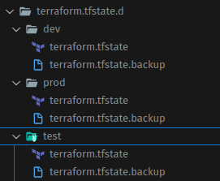

# Terraform Workspace ile Environment Yönetimi: LXD Provider ile Uygulama

Bu yazımızda Terraform Workspace kavramını inceleyeceğiz. Tamemen resmi sayfasındaki [Workspace başlığını](https://developer.hashicorp.com/terraform/cli/workspaces) takip edeceğiz.


Serinin diğer makaleleri için altaki başlıkları ziyaret edebilirsiniz.

- [HashiCorp Configuration Language (HCL) Dili Nedir? Nasıl Kullanılır?](HCL.md)
- [LXC Kullanımı, Terraform LXD Provider'ı ile Otomasyon ve Terraform ile LXC Kullanarak Kubernetes Cluster Oluşturma](terraform-lxd.md)

Terraform CLI’de “workspace”, aynı konfigürasyon dizini içinde birden fazla bağımsız state dosyasını saklamamızı sağlayan mantıksal bir yapıdır.

Tavsiye edilen kullanım şekli en basit haliyle aynı kaynakların farklı değişkenlerle yönetmek gerektiğinde kullanılır. Biraz daha somut anlatacak olursak örneğin bir bulut sağlayıcısında test, pre-prod (staging) ve prod ortamlarını yönetmemiz gerektiğini düşünelim. Bu durumda ortamdan ortama kaynaklarımızın tekil olarak sayısı, network ayarları, cpu, memory vb değişecek ancak kaynaklarımızın büyük bir kısmı aynı kalacak. Bu durumda bütün kaynakları tekrar tanımlamaktansa aynı kaynakları farklı özelliklerle tekrar kullanabiliriz. Tabi bunu yapmanın Terraform'da başka yolları da var ancak biz bugün Workspace kavramın odaklanacağız.

Diğer taraftan alttaki durumalarda kullanımı da önerilmiyor.

- Farklı kullanıcı  hesapları için kaynak yönetimi: Aynı ortamı farklı kimliklerle kurmak için uygun değil. Yani mesela AWS üzerinde farklı hesapları yönetmek için Workspace uygun değildir. Zaten daha kolay ymentme yolları var.
- Doğal olarak farklı provider bloklarını yönetmek için de workspace uygun değildir.
- Versiyonlama için de Workspace kullanımı uygun değildir.

Örneklerimizi de LXD provider ile LXC üzerinde yapcağız. LXD nedir, nasıl çalışır vb sorularınız için serinin ikinci yazısına bakabilirsiniz.

- [Terraform LXD provider ile on-prem ortam yönetimi](2.terraform-lxc.md)


## Workspace Nasıl Çalışır?

Evet şimdi küçük örneklerle başlayalım. 

Amacımız bir tane LXC instance'ının kaç adet çalışacağını, storage pool'unu, network'ünü ve profilini ortama göre farklı farklı yapmak.

Bu örnek için sadece `main.tf` dosyası oluşturuyoruz ve içerğini alttaki gibi kıopyalıyoruz. Detaylarını kodun altında devam edeceğiz.

```javascript
terraform {
    required_version = ">= 1.6.0"
    required_providers {
        lxd = {
            source  = "terraform-lxd/lxd"
            version = ">= 1.10.1"
        }
    }
}

provider "lxd" {}


// locals bloğu Terraform'da yalnızca o modül içinde geçerli, "sabit-gibi" değişkenler tanımlamak için kullanılır.
# default durumda da test workspace i kullanılsın
locals {
    env = terraform.workspace == "default" ? "test" : terraform.workspace
}

// Dışarıdan değiştirebilir değişken
variable "instance-count" {
    type = map(number)
    default = {
        dev  = 1
        test = 2
        prod = 3
    }
}

// Dışarıdan değiştirebilir değişken
variable "gateway" {
    type = map(string)
    default = {
        dev  = "10.100.10.1/24"
        test = "10.100.20.1/24"
        prod = "10.100.30.1/24"
    }
}

// network
resource "lxd_network" "br-network" {
    name = "br-${local.env}"
    type = "bridge"
        config = {
    "ipv4.address" = "${var.gateway[local.env]}"
    "ipv4.nat"     = "true"
    "ipv6.address" = "none"
    }
}

// storage
resource "lxd_storage_pool" "storage-pool" {
    name   = "storage-${local.env}"
    driver = "dir"
}


// profile
resource "lxd_profile" "profile-env" {
    name = "profile-${local.env}"
    device {
        name = "eth0"
        type = "nic"
        properties = {
        network = lxd_network.br-network.name
    }
}

    device {
        name = "root"
        type = "disk"
        properties = {
            path = "/"
            pool = lxd_storage_pool.storage-pool.name
        }
    }
}

// Instance
resource "lxd_instance" "app" {
    count  = var.instance-count[local.env]
    // SADECE count.index'i kullanın; sayı üzerinde .index yoktur
    name   = "app-${count.index + 1}-${local.env}"
    profiles = [lxd_profile.profile-env.name]
    type  = "container"
    image  = "ubuntu:24.04"

}


// Output
output "environment" {
    value = lxd_network.br-network.name
}

output "instance_names" {
    value = [for instance in lxd_instance.app : instance.name]
}

```

`locals` bloğu ile aktif olan workspace adını alıyoruz ve bunuda env adında bir değişkene atıyoruz. Eğer default workspace'deysek de test ortamının kullanılcağını belirtmiş oluyoruz. Hiç bir workspace tanımı yapmasak bile yani Terraform'da workspace kavramını hiç kullanmasak bilde sistem bizim için defarul adında bir workspace zaten oluşturmuş oluyor.

`instance-count` ve `gateway` adında iki adet değişkenimiz var. Bunlara dikkat ederseniz map olarak tanımlı. Map veri tibi key-value ikilis iolarak çalışır. Yani key verildiğinde value alınır. Burada amacımız ortam bilgisini verdiğimizde on akarşılık gelen veriyi almak. Örneğin dev, veya test key'nini verdiğimizde karşılığında var olan değeri almak.

Bu değişkenleri kullandığımız / çağırdığımız her yerde dikkat ederseniz ortam değişkenin değerine göre verileri okuyoruz. Yani aktif olan ortam neyse değişkenler ona göre verileri sunuyor.

output verilerimizi de oluşturulan instance'lar hakkında bilgi alabilelim diye ekledik.


Şimdi workspace'lerimizi oluşturalım.

```bash
terraform workspace new dev
terraform workspace new test
terraform workspace new prod
```

listeye bakalım

```bash
terraform workspace list

#* default
#  dev
#  prod
#  test

```

Şimdi test workspace'ine geçiş yapalım.

```bash
terraform workspace select test
```
Artık kaynaklarımızı oluştuabiliriz.

```bash
terraform init
terraform plan
terraform apply

# Souç olararak alttakileri göreceğiz.
# environment = "br-test"
# instance_names = [
#   "app-1-test",
#   "app-2-test",
# ]

```

Görüldüğü gibi test oramı için kaynaklarımız oluşmuş. Şimdi de dev ortamına geçip tekrar kaynakları oluşturalım.

```bash
terraform workspace select dev

terraform init
terraform plan
terraform apply

# Souç olararak alttakileri göreceğiz.
# environment = "br-dev"
# instance_names = [
#   "app-1-dev",
# ]

```

Bu şekilde birden fazla workspace kullandığımızda root dizinde `terraform.tfstate.d` adında bir klasör oluştuğunu görebiliriz. Bunun için kontrol edecek olursanız her ortam için ayrı bir tfstate dosyası oluştuğunu görebilirsiniz.




- **Örnek Uygulama**

Daha kapsamlı bir örnek yapalım.

Bir uygulama için bir api, bir veritabanı ve birde Web UI sunucusuna ihtiyacımız olduğunu düşünüelim.

Mesela alttaki gibi yapı kurmak istiyoruz.

- prod ortamında bir api, web ui ve veritabanı sunucuları
- test ortamında api ile web ui tek bir sunucuda ve bir db sunucusu
- dev ortamında ise hepsi için tek bir sunucu 

Prod ve test ortamında veritabanı aynı amaçla kullanılan kaynaklarken, diğer kaynaklar tamamen biribirlerinden farklı.

Bu sistemi kurmanın tabii ki bir çok yolu var ama biz workspace'e odaklanacağız.

## Örnek Uygulama: İlk Versiyon

İlk versiyonumuz alttaki gibi bir yapıda olacak. İkinci bir versiyon daha yazacağız.

```
.
├── backend.tf  # state dosyalarımızı nerede tutacağımızı ayarlar
├── versions.tf # kullanacağımız terraform ve provider versiyonlarını ayalar
├── main.tf
├── outputs.tf  # bu root modülün çıktılarını belirler
└── env-module/
      └── main.tf
      ├── network.tf # network ayarları
      ├── storage.tf # lxc storace pool ayarı
      ├── profile.tf # lxc profile ayaları
      ├── outputs.tf
      └── instances.tf  # lxc instance ayaları
```

Yapıya bakarak varmak istediğimiz sonucu yorumlayalım.

- Modules klasörüne bakacak olursak her bir ortam için network ve storage tanımlartının ortak olduğunu görebiliyoruz.
- root dizindeki main workspace seçimine göre ilgili ortamı import ediyor.
  
Şimdi dosya içeriklerimizi yazalım.


**Root Dizini**


- backend.tf

```javascript
// biz belirtmesek de kendisi yönetiyor sadece bu şekilde de yapılabileceğini gösteriyoruz
terraform {
  backend "local" {
    path = "terraform.tfstate"          # sabit değer olmak zorunda yani  değpişken olamaz. bizde default değeri atadık.
  }
}


```

- versions.tf

```javascript
terraform {
  required_version = ">= 1.6.0"
  required_providers {
    lxd = {
      source  = "terraform-lxd/lxd"
    }
  }
}

provider "lxd" {
  generate_client_certificates = true
  accept_remote_certificate   = true
}
```

- main.tf

```javascript
locals {
  env = terraform.workspace == "default" ? "dev" : terraform.workspace
}

// Module seçili olan environment için gerekli kaynakları oluşturacak
module "env-module" {
  source = "./env-module"
  env    = local.env
}

```

- outputs.tf

```javascript
// Output
output "root-module-environment" {
    value = local.env
}


```

**env-module dizini**


- network.tf

```javascript

locals  {
  network_gateways = {
    dev = "10.100.10.1/24"
    test = "10.100.20.1/24" 
    prod = "10.100.30.1/24" 
  }
}

resource "lxd_network" "bridge" {
  name = "br-${var.env}"
  type = "bridge"

  config = {
    "ipv4.address" = local.network_gateways[var.env]
    "ipv4.nat"     = "true"
    "ipv6.address" = "none"
  }
}

```

- storage.tf

```javascript

resource "lxd_storage_pool" "pool" {
  name   = "pool-${var.env}"
  driver = "dir"                     // Ortak driver, boyut havuzda sınırlanmıyor
}
```

- profile.tf

```javascript
resource "lxd_profile" "base" {
  name = "profile-${var.env}"

  // NIC → ortamın ağı
  device {
    name = "eth0"
    type = "nic"
    properties = { network = lxd_network.bridge.name }
  }

  // Kök disk → ortamın havuzu (boyut yok, instance'ta override edilecek)
  device {
    name = "root"
    type = "disk"
    properties = {
      path = "/"
      pool = lxd_storage_pool.pool.name
    }
  }
}
```

- instances.tf

```javascript

// instance sayısı ve özellikleri alttaki listeden ayarlanabilir.
locals {

  instances_matrix = {
    dev = [
      { name = "apiwebdb-${var.env}", image = "ubuntu:22.04", size = "2GB", cpu = 1, memory = "2GB" }
    ]


    test = [
      { name = "apiweb-${var.env}", image = "ubuntu:22.04", size = "2GB", cpu = 1, memory = "2GB" },
      { name = "db-${var.env}",  image = "ubuntu:22.04", size = "4GB", cpu = 1, memory = "2GB" }
    ]

    prod = [
      { name = "api-${var.env}", image = "ubuntu:22.04", size = "2GB", cpu = 1, memory = "2GB" },
      { name = "web-${var.env}", image = "ubuntu:22.04", size = "3GB", cpu = 1, memory = "2GB" },
      { name = "db-${var.env}",  image = "ubuntu:22.04", size = "4GB", cpu = 1, memory = "2GB" }
    ]
  }
}

resource "lxd_instance" "node" {
  for_each = { 
    for inst in local.instances_matrix[var.env] : 
        "${inst.name}-${var.env}" => inst // Her instance için benzersiz bir anahtar oluşturuyoruz
  } 

  name     = each.value.name
  image    = each.value.image
  limits = {
    cpu = each.value.cpu,
    memory = each.value.memory
  }

  profiles = [lxd_profile.base.name]

  device {
    name = "root"
    type = "disk"
    properties = {
      path = "/"
      pool = lxd_storage_pool.pool.name
      size = each.value.size          
    }
  }  
}

```

- output.tf
```javascript
// Output
output "root-module-environment" {
    value = var.env
}
```


Bütün dosyaları oluşturduktan sonra alttaki komutlarda testimizi yapabiliriz.


```bash
terraform init                      

terraform workspace new dev
terraform workspace select dev
terraform apply

terraform workspace new test
terraform workspace select test
terraform apply                     

terraform workspace new prod
terraform workspace select prod
terraform apply


# destroy etmek için


terraform workspace select dev
terraform destroy


terraform workspace select test
terraform destroy                     


terraform workspace select prod
terraform destroy

```

## Örnek Uygulama: İkinci Versiyon

Yukarıdaki örneğimize hem biraz best-practice'lere uymaya çalışalım hem de hatalarımız düzeltelim.

Alttaki gibi bir yapımız olacak.


```
.
├── backend.tf  # state dosyalarımızı nerede tutacağımızı ayarlar
├── main.tf 
└── env-module/
      └── main.tf
      ├── network.tf # network ayarları
      ├── storage.tf # lxc storace pool ayarı
      ├── profile.tf # lxc profile ayaları
      ├── outputs.tf # modülün ürettiği bütün instance lar hakkında terminale bilgi yazar
      ├── variables.tf # değişkenler ve default değerlinin tanımı
      └── instances.tf  # lxc instance ayaları
```

- Root module'deki gereksiz dosyaları kaldırıp module seviyesinde gerekli olanlar tutuldu. Örneğin root dizinden `version.tf` kaldırıldı. Zaten lcd provider'ı da zaten env-module modülü kullanıyor.
- Ayrıca değişkenleri de env-module modülünde ayrı bir dosya da (`variables.tf`) topladık. Böylece module içinde ne derdedir karmaşasını çözmüş ve bütün değişkenleri tek yerden yönetiyor olduk.
- Root dizindeki `main.tf` dosyasından kullandığımız env-module modülündeki değişkenleri isteğimize göre değişkelnleri ezerek kullandık. Böylece module ile onu kullanan root modülü arasını daha iyi ayırmış olduk. Yani modülü kullanmak için modüle girmemize gerek kalamadı (ki öyle olmalı).

Şimdi dosya içeriklerini yazalım.

*****Root Dizini**


- backend.tf

```javascript
terraform {
  backend "local" {
    path = "./terraform.tfstate"
  }
}
```

- main.tf

```javascript
locals {
  # worspace bilgisini environment tanımı için alıyoruz
  env = terraform.workspace == "default" ? "dev" : terraform.workspace
}

# environment bilgisine göre modülü çağırıyoruz
module "env-module" {
  source = "./env-module"


  env = local.env


  # her ortam için instance yapılandırması
  # module içinde tanımlı instance tanımlarını ezmek için örnek olsun diye tanımladık
  instances_config = {
    dev = [
      { name = "apiwebdb", image = "ubuntu:22.04", size = "2GB", cpu = 1, memory = "2GB" }
    ]
    test = [
      { name = "apiweb", image = "ubuntu:22.04", size = "2GB", cpu = 1, memory = "2GB" },
      { name = "db", image = "ubuntu:22.04", size = "4GB", cpu = 1, memory = "2GB" }
    ]
    prod = [
      { name = "api", image = "ubuntu:22.04", size = "2GB", cpu = 1, memory = "2GB" },
      { name = "web", image = "ubuntu:22.04", size = "3GB", cpu = 1, memory = "2GB" },
      { name = "db", image = "ubuntu:22.04", size = "4GB", cpu = 1, memory = "2GB" }
    ]
  }

  # Her ortam için network yapılandırması
  # module içinde tanımlı default network ayarlarını ezmek için örnek olsun diye tanımladık
  network_config = {
    dev  = "10.100.10.1/24"
    test = "10.100.20.1/24"
    prod = "10.100.30.1/24"
  }

}
```

**env-module dizini**

- instances.tf

```javascript

resource "lxd_instance" "node" {
  for_each = {
    for inst in var.instances_config[var.env] :
    "${inst.name}-${var.env}" => inst
  }

  name  = "${each.value.name}-${var.env}"
  image = each.value.image

  limits = {
    cpu    = each.value.cpu
    memory = each.value.memory
  }

  profiles = [lxd_profile.base.name]

  device {
    name = "root"
    type = "disk"
    properties = {
      path = "/"
      pool = lxd_storage_pool.pool.name
      size = each.value.size
    }
  }
}
```
- main.tf

```javascript


terraform {
  required_version = ">= 1.6.0"
  required_providers {
    lxd = {
      source  = "terraform-lxd/lxd"
      version = "~> 2.0"
    }
  }
}

provider "lxd" {
  generate_client_certificates = true
  accept_remote_certificate    = true
}
```

- network.tf

```javascript

resource "lxd_network" "bridge" {
  name = "br-${var.env}"
  type = "bridge"

  config = {
    "ipv4.address" = var.network_config[var.env]
    "ipv4.nat"     = "true"
    "ipv6.address" = "none"
  }
}
```

- outputs.tf

```javascript
output "environment" {
  description = "Aktif Ortam"
  value       = var.env
}

output "instances" {
  description = "Oluşturulan instance ların detayları"
  value = {
    for k, v in lxd_instance.node : k => {
      name         = v.name
      status       = v.status
      ip_address   = v.ipv4_address
      ipv6_address = v.ipv6_address
      image        = v.image
      cpu_limit    = v.limits.cpu
      memory_limit = v.limits.memory
      type         = v.type
    }
  }
}

output "network_info" {
  description = "Network configuration"
  value = {
    bridge_name = lxd_network.bridge.name
    gateway     = var.network_config[var.env]
    type        = lxd_network.bridge.type
  }
}

output "storage_info" {
  description = "Storage pool information"
  value = {
    pool_name = lxd_storage_pool.pool.name
    driver    = lxd_storage_pool.pool.driver
  }
}

# Detaylı instance bilgileri için formatted output
output "instance_summary" {
  description = "instance detayları"
  value = join("\n", concat([
    "=== ${upper(var.env)} ENVIRONMENT INSTANCES ==="
  ], [
    for k, v in lxd_instance.node :
    "  ${v.name}: ${v.ipv4_address != "" ? v.ipv4_address : "No IP"} | Type: ${v.type} | Status: ${v.status}"
  ]))
}

```

- profile.tf

```javascript

resource "lxd_profile" "base" {
  name = "profile-${var.env}"

  # Network interface
  device {
    name = "eth0"
    type = "nic"
    properties = {
      network = lxd_network.bridge.name
    }
  }

  # Root disk
  device {
    name = "root"
    type = "disk"
    properties = {
      path = "/"
      pool = lxd_storage_pool.pool.name
    }
  }
}

```

- storage.tf

```javascript

resource "lxd_storage_pool" "pool" {
  name   = "pool-${var.env}"
  driver = "dir" # Directory-based storage driver
}
```

- variables.tf

```javascript


variable "env" {
  description = "Ortam Adı (dev, test, prod)"
  type        = string

  validation {
    condition     = contains(["dev", "test", "prod"], var.env)
    error_message = "Ortam bunlardan biri olmalı: dev, test, prod."
  }
}

variable "instances_config" {
  description = "Ortama göre İnstance yapılandırması için değişken"
  type = map(list(object({
    name   = string
    image  = string
    size   = string
    cpu    = number
    memory = string
  })))

  default = {
    dev = [
      { name = "apiwebdb", image = "ubuntu:22.04", size = "2GB", cpu = 1, memory = "2GB" }
    ]
    test = [
      { name = "apiweb", image = "ubuntu:22.04", size = "2GB", cpu = 1, memory = "2GB" },
      { name = "db", image = "ubuntu:22.04", size = "4GB", cpu = 1, memory = "2GB" }
    ]
    prod = [
      { name = "api", image = "ubuntu:22.04", size = "2GB", cpu = 1, memory = "2GB" },
      { name = "web", image = "ubuntu:22.04", size = "3GB", cpu = 1, memory = "2GB" },
      { name = "db", image = "ubuntu:22.04", size = "4GB", cpu = 1, memory = "2GB" }
    ]
  }
}

variable "network_config" {
  description = "her ortam için network konfigürasyonu için değişken"
  type        = map(string)

  default = {
    dev  = "10.100.10.1/24"
    test = "10.100.20.1/24"
    prod = "10.100.30.1/24"
  }
}

```


Bütün dosyaları oluşturduktan sonra alttaki komutlarda testimizi yapabiliriz.


```bash
terraform init                      

terraform workspace new dev
terraform workspace select dev
terraform apply

terraform workspace new test
terraform workspace select test
terraform apply                     

terraform workspace new prod
terraform workspace select prod
terraform apply


# destroy etmek için


terraform workspace select dev
terraform destroy


terraform workspace select test
terraform destroy                     


terraform workspace select prod
terraform destroy

```


Evet Terraform hakkında bir yazımızın sonuna geldik. Umarım faydalı olmuştur. 
