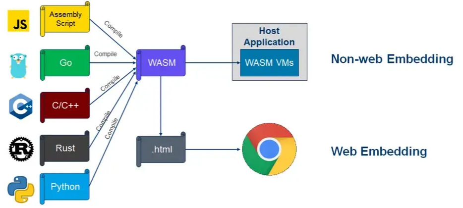
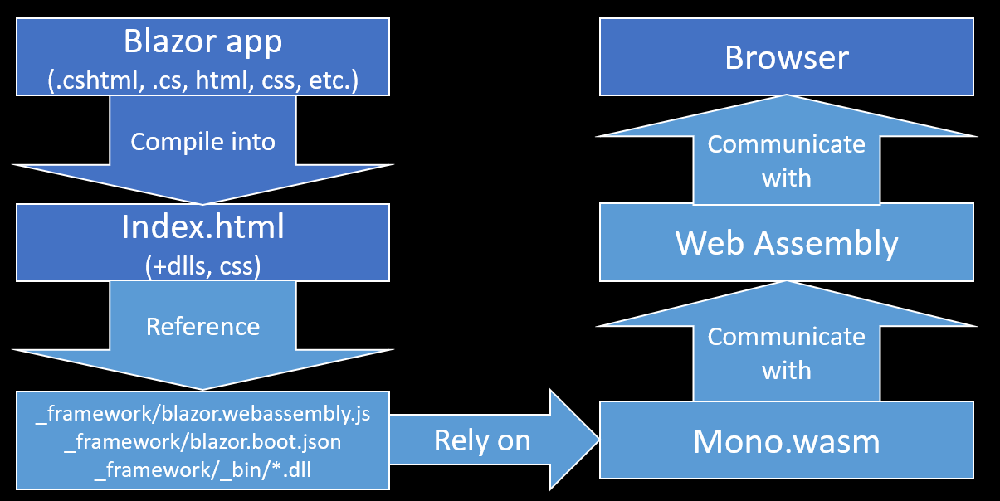
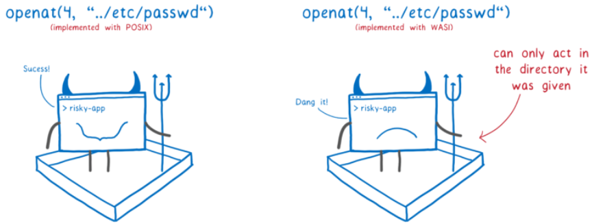

# Everything All About WebAssembly


In this article, we will talk about WebAssembly, which has been frequently mentioned in recent years.

We will be examining the following topics:

- What is WebAssembly? What is it used for, and what is its purpose?
- What are the current areas of usage?
- What are the potential applications and roadmap?
- How does it work?
- Is it secure?
- Will it replace JavaScript? What is the future of the web?
- Does it impact mobile app development?
- What does it offer for decentralized architects, blockchain, and web3?


We will try to find answers to the questions that many of us have in mind about WebAssembly. Let's start with what WebAssembly is and what it is not.

The significant support from the technology and software world's biggest companies (Mozilla, Microsoft, Google, Apple, Fastly, Intel, and Red Hat) played a crucial role in its rapid development. However, this support alone is not the only reason. Looking back at the past five years, we can say that WebAssembly might be one of the fastest-growing technologies, even though it might not have caught our attention due to the fact that previous architectures/technologies are still in use and haven't necessitated a switch.

If we look at the definition on its [official page](https://webassembly.org/), it is defined as follows.

"WebAssembly (Wasm) stack-based virtual machine için tasarlanmış binary  bir formattır. Hemen hemen bütün programlama dilleri için portable bir derleme hedefi olarak tasarlanmıştır. Hem client hem de server taraflı web uygulamaları geliştirebilmeyi sağlar."_



[source](https://hacks.mozilla.org/2019/03/standardizing-wasi-a-webassembly-system-interface/)


We will be able to write code with almost all programming languages (currently around forty different languages) and run the resulting product (WASM) on any platform that has a compatible runtime. Just like Java, which can run on many platforms, **WebAssembly abstracts the programming language from the platform**. As a result, we can develop with our preferred programming language.

We might already come up with a thought that we can run a code on different platforms anyway. For example, we can compile code written in the C language for different platforms.


However, here we have to write code for each platform difference and take separate builds for each. WebAssembly allows us to run our application with a single build. Of course, this is not its only benefit. We will examine its other advantages in the rest of the article.


[source](https://hacks.mozilla.org/2019/03/standardizing-wasi-a-webassembly-system-interface/)


Let's ask one of the questions ourselves. So, if WebAssembly was initially introduced for web browsers, does that mean it's the end of JavaScript? The short answer to this question is "no." So, you might wonder why we need both. Now, let's elaborate on the matter. The [actual purpose of WebAssembly](https://webassembly.github.io/spec/core/intro/introduction.html) was to provide a structure that could run almost as fast as native code in places where speed is crucial and intensive computations are required. However, they must have thought, 'why confine such a fast, portable, embeddable, modular, language-independent, and so on system only to the web world?' So, they began expanding its scope by adding new features over time. Despite its initial release in March 2017, and even though the first version is still in use, we can say that it has become one of the most talked-about and rapidly developing technologies of recent times.

This development not only pushed WebAssembly beyond its initial ecosystem but also influenced it to become an alternative to JavaScript in the future. We can understand this from the following message on [its official website](https://developer.mozilla.org/en-US/docs/WebAssembly/Concepts)). Of course, expecting this to happen quickly would not be reasonable.


[source](https://developer.mozilla.org/en-US/docs/WebAssembly/Concepts)

You can visit the [Mozilla Developer Network](https://developer.mozilla.org/en-US/docs/Web/API) page for a list of Web APIs. I'm sure the concept of Web APIs might not be as extensive for many developers as it is in the listed resources.

If we return to our question, WebAssembly does not have a goal to eliminate JavaScript. Why would they even consider kill it? JavaScript has proven itself over the years as an easy-to-learn and easy-to-use language. What WebAssembly actually does, or will do, is simply to bring new players into the game. So, looking from the perspective of the browser, WebAssembly aims to provide an environment where not only JavaScript but also other programming languages can be used alongside it.

If we also consider technological advancements:

- where web 3.0 is being discussed,
- where blockchain technologies are rapidly evolving,
- where artificial intelligence has entered our lives in every field,
- where modular and portable structures/technologies are gaining importance,
- where agility is being talked about in every sector,

In a world where every object is somehow connected to web technologies, relying solely on JavaScript as our only tool doesn't seem very reasonable. When thinking this way, it is not hard to predict that if WebAssembly fails to achieve this, another technology will definitely demonstrate the expected progress.


**Let's take a look at the last 5-6 years of this technology and see what it tells us about the future.**


When we look at its initial purpose, WebAssembly, which was originally designed for web applications and even just to run within the client's web browser, seems to have already surpassed itself. If we look at the use cases mentioned on its [official website](https://webassembly.org/docs/use-cases/), we encounter the extensive list below.

## Use Cases Within the Browser

- Better execution for languages and toolkits that are currently cross-compiled to the Web (C/C++, GWT, …).
- Image / video editing.
- Games: (Casual games that need to start quickly, AAA games that have heavy assets, Game portals (mixed-party/origin content).
- Peer-to-peer applications (games, collaborative editing, decentralized and centralized).
- Music applications (streaming, caching).
- Image recognition.
- Live video augmentation (e.g. putting hats on people’s heads).
- VR and augmented reality (very low latency).
- CAD applications.
- Scientific visualization and simulation.
- Interactive educational software, and news articles.
- Platform simulation / emulation (ARC, DOSBox, QEMU, MAME, …).
- Language interpreters and virtual machines.
- POSIX user-space environment, allowing porting of existing POSIX applications.
- Developer tooling (editors, compilers, debuggers, …).
- Remote desktop.
- VPN.
- Encryption.
- Local web server.
- Common NPAPI users, within the web’s security model and APIs.
- Fat client for enterprise applications (e.g. databases).

## Use Cases Beyond the Browser"

- Game distribution service (portable and secure).
- Server-side compute of untrusted code.
- Server-side application.
- Hybrid native apps on mobile devices.
- Symmetric computations across multiple nodes

I am sharing some links related to the mentioned areas and their respective projects:

- In [this project](https://make.wordpress.org/core/2022/09/23/client-side-webassembly-wordpress-with-no-server/), they have managed to run WordPress without PHP, entirely within the browser. You can access the Git project through [this link](https://github.com/WordPress/wordpress-wasm).
- You can play the game [Doom 3](https://wasm.continuation-labs.com/d3demo/) directly in the browser.
- They have successfully run PostgreSQL database within WebAssembly. For the GitHub project, please visit [this link](https://github.com/snaplet/postgres-wasm).
- Adobe's new project involves running Photoshop on the browser. You can explore more about this work through [this link](https://web.dev/ps-on-the-web/).
- If you are interested in container technologies, you can examine Docker's WebAssembly-based container work in [this link](https://www.docker.com/blog/docker-wasm-technical-preview/). We will delve deeper into this topic in the continuation of the article.
- The [web page](https://bellard.org/jslinux/index.html) of a project where Linux, FreeBSD, and Windows operating systems are executed within the browser using WebAssembly.
- [A study](https://github.com/copy/v86)) that emulates x86 compatible CPUs and hardware, translating machine codes to WebAssembly at runtime. You can find [examples](https://copy.sh/v86/) where different versions of operating systems are running inside the browser.
- You can run [FFmpeg](https://github.com/ffmpegwasm/ffmpeg.wasm) on the browser via WASM.
- You can use [AutoCAD](https://blogs.autodesk.com/autocad/autocad-web-app-google-io-2018/) on a web browser.
- You can develop cross-platform applications using [Uno Platform](https://platform.uno/blog/a-piece-of-windows-10-is-now-running-on-webassembly-natively-on-ios-and-android/) and WebAssembly. By cross-platform, I mean the code we write will not only work on Android and iOS but also on Windows, Linux, and Mac.
- [Google Earth](https://earth.google.com/web/) uses WebAssembly for 3D graphics.
- You can read an example of a microservice written in WebAssembly on [this page](https://blog.logrocket.com/rust-microservices-server-side-webassembly/)."

It is possible to find many more examples on the internet. Additionally, you can track projects on the '[made with WebAssembly](https://madewithwebassembly.com/)' page.

Web browsers that run WebAssembly are actually runtimes themselves. There are many runtime projects available to execute WebAssembly outside the browser. You can find a list of these on this [GitHub page](https://github.com/appcypher/awesome-wasm-runtimes).

## The Most Popular webAssembly Runtimes in Github

- **WasmEdge**

One of the fastest runtimes in the ecosystem, currently supported by CNCF.

It supports languages such as C/C++, Rust, Go, Swift, Kotlin, AssemblyScript, Grain, JavaScript, and Python.

This runtime has also been used in the future Docker & Wasm combination we will discuss.

GitHub Url: https://github.com/WasmEdge/WasmEdge

- **Wasm3**

It supports languages such as Python3, Rust, C/C++, GoLang, Zig, Perl, Swift, .Net, Nim, Arduino, PlatformIO, Particle, QuickJS.

A project focused on running WebAssembly on embedded devices.


GitHub Url: https://github.com/wasm3/wasm3

- **Wasmer**

It supports an extensive range of languages, far too many to list here. 


It also manages the WebAssembly Package Manager (WAPM) project within the same community. We won't delve into its details here, as we'll discuss it later on.

GitHub Url: https://github.com/wasmerio/wasmer

- **Wasmtime**

It supports languages such as C/C++, Rust, Go, Python, dotnet and Go.

GitHub Url: https://github.com/bytecodealliance/wasmtime


## Diğer Araçlar

- **WASI (WebAssembly System Interface)**

[WASI](https://github.com/WebAssembly/WASI) (WebAssembly System Interface) is a middleware developed by the WebAssembly team that facilitates access to system resources for WebAssembly modules. If our WebAssembly code is written and executed with a WASI-compliant runtime, it can utilize system resources such as the file system, clock, sockets, and more. We can describe WASI as a technology that extends WebAssembly, particularly in terms of security and portability.

By incorporating the WASI library into our code, we not only ensure it runs without the need for different builds in various environments but also enhance its security. We'll conclude the discussion here since we'll delve into this topic in more detail in the future.

- **WAPM (WebAssembly Package Manager)**


Wapm is a package manager tool developed by the team behind the Wasmer runtime. First, you need to install the Wasmer runtime on your system, and then you can install [Wapm](https://wapm.io/).


It works on all operating systems and is very easy to install.


- For Windows, you can run the following command in PowerShell.

```powershell
iwr https://win.wasmer.io -useb | iex
```

- For Linux and Mac, you can run the following command

```shell
curl https://get.wasmer.io -sSfL | sh
```

From this point onwards, the process is the same for all operating systems.

For example, to run SQLite, you first download the relevant package and then execute it.


```shell
wapm install sqlite/sqlite

wapm run sqlite
```

Now you can execute your SQLite commands.

In fact, you can run the sqlite.wasm file through the Wasmer CLI using the Wapm "run" command.

On my machine, the WASM file is located in the home directory.

```shell
wasmer ~/wapm_packages/sqlite/sqlite@0.2.2/build/sqlite.wasm
```

What would running SQLite or another application or module in this way gain us?

- One of the key advantages is platform independence. This means that once we've exported our application as WASM, we'll be able to run it on any platform without making any further modifications.
- Thanks to the support of web browsers, we'll be able to run much larger applications on the client side.
- We'll be able to use packages written in any language on the same platform. For example, it might be possible to develop one module in JavaScript, another in C#, and yet another in Python, and use them all on the same platform.


Especially in today's world where decentralized application development is gaining momentum, imagine how much WebAssembly can achieve. We will also delve into this topic further in the article.

Moreover, with the ability to run outside of browsers, it is possible to run on mobile and IoT devices as well. It's not difficult to predict that WebAssembly will have a significant impact in the mobile world.

# WebAssembly Technical Details


There is a text format available for writing WebAssembly (WASM), and it can be converted into WASM. However, developing in this way can be challenging, so there are different implementations available for each programming language.


The file extension for the text format is '.wat', while the binary format uses '.wasm'. You can use the following command to convert from the text format to binary. For more details, you can visit [this page](https://webassembly.org/getting-started/advanced-tools/)."


```shell
wat2wasm simple.wat -o simple.wasm
```

It is possible to do this.

```shell
wasm2wat simple.wasm -o simple.wat
```

Using the runtimes mentioned above and installing the necessary packages for the language you want to write in, you can build your project. Alternatively, infrastructure is available in various languages, especially for developing web components, similar to Microsoft's [Blazor](https://dotnet.microsoft.com/en-us/apps/aspnet/web-apps/blazor) technology. Currently, WebAssembly has a JavaScript dependency because it cannot directly access the DOM, but this limitation is expected to be overcome in the future.

Microsoft is one of the companies that effectively utilizes WebAssembly. They seem to have a strong belief in this technology, as they introduced their technology called [Blazor](https://dotnet.microsoft.com/en-us/apps/aspnet/web-apps/blazor) to developers much earlier than many other companies did.



[source](https://www.vivienfabing.com/blazor/2019/10/10/blazor-what-is-blazor.html)

[Blazor](https://dotnet.microsoft.com/en-us/apps/aspnet/web-apps/blazor) currently appears to target web browser runtimes. However, it is also possible to develop server-side applications with WebSocket support. In this scenario, all the code runs on the server, and interaction with the client is facilitated through WebSockets. Furthermore, applications developed with Blazor can run not only on the web but also on mobile devices and desktop environments.

Additionally, there are plans to run Blazor applications outside of web browsers using runtimes. Improvements have been made in the [AOT](https://learn.microsoft.com/en-us/dotnet/core/deploying/native-aot/) (ahead-of-time) aspect with .Net 7, and these enhancements are ongoing. The goal here is to run applications on systems without requiring the .NET runtime to be installed. This will allow us to run Blazor applications outside of browsers with lower costs and less complexity. An experimental [SDK](https://github.com/SteveSandersonMS/dotnet-wasi-sdk) is already available for this purpose. In a sample project, a Blazor application is made capable of running outside of a browser using WASI. It can also be published using the Wasmtime or Wasmer runtimes mentioned earlier. You can find more details about this project in [this link](https://dev.to/azure/exploring-net-webassembly-with-wasi-and-wasmtime-41l5).

As mentioned earlier, it's also possible to use WebAssembly modules developed in different languages in the same environment. For example, you can use a WASM package developed in the C language within a .NET runtime. For a sample project, you can visit [this link](https://www.thinktecture.com/en/webassembly/webassembly-with-dotnet/).

Furthermore, with WASI, your application can communicate over the network and even publish web pages using the HTTP protocol. A small web server has been created using the WasmEdge runtime. You can check out the example project in [this link](https://wasmedge.org/book/en/write_wasm/rust/networking.html).


## WebAssembly Security

WebAssembly offers robust security isolation. Modules run in their own isolated (sandboxed) environment, separate from the host runtime. When running within a browser runtime, it strictly adheres to the browser's security policies. However, outside of the browser, it operates using capability-based security. In its simplest form, capability-based security allows the caller to determine how much authority each WASM module should have.

Capability-based security is not a new technique, but it has gained more attention recently, particularly with the development of decentralized applications, especially in the blockchain space. Some of the most commonly used security models include:

- Access control list (ACL)
- Attribute-based access control (ABAC)
- Context-based access control (CBAC)
- Capability-based security
- Role-based access control (RBAC)

The aim of capability-based security is to ensure security in a decentralized system. For instance, access control lists or role-based security rely on identity-based systems where security for an individual and the system is centralized and involves an authentication process. Information about an individual is sent to a central authority for verification. However, in the case of WebAssembly verification or the verification of a Bitcoin transaction, there is no central authority. In its simplest form, capability-based security allows the caller to decide how much authority to grant to each WASM module.

Let's dive into the topic a bit further. In a traditional system, a command or application that will run needs to have permissions consistent with the user running it. For example, to create a file in a folder, the user must have write permissions in that folder. Then, the user runs the application with their own credentials, and the application can create the file in the specified folder. This approach works fine for systems or applications that we trust in terms of security. However, if the application comes from an unknown or untrusted source, running it with our own permissions effectively delegates authority to that application. If the application is doing something in the background that we are unaware of, it will do so with our permissions.


[source](https://hacks.mozilla.org/2019/03/standardizing-wasi-a-webassembly-system-interface/)

Another potential danger in this scenario is that the application interacts directly with the system, meaning there is an ecosystem that allows it to do things without our knowledge. Once we grant permission, there is no system in place to control the actions of the application.

Now, let's try to understand the capability-based security framework used by WebAssembly. The tool that provides this system to us is WASI. As mentioned earlier, WASI's role is to facilitate communication and interaction between the WebAssembly module and the system.


WASI core provides a structure similar to POSIX. If we want to access a directory or a network on the system, we must do it through WASI. In other words, our module cannot directly interact with the system. After importing the WASI library in the programming language we are using, we specify the permissions we want to grant (such as file access, network, sockets, etc.), load our WASM file into a sandbox environment, and execute it with these permissions. Of course, it is also possible to call the same module with a WASI-supported runtime.


[source](https://hacks.mozilla.org/2019/03/standardizing-wasi-a-webassembly-system-interface/)

The permission granted for a specific resource in the context of capability-based security is given exclusively to the requested resource, and if desired, it can be restricted. Furthermore, this permission is granted only to the requesting module and is not granted universally to all of WebAssembly.


[source](https://hacks.mozilla.org/2019/03/standardizing-wasi-a-webassembly-system-interface/)

This way, system portability is also enhanced. Just like in containers, we can shape our WebAssembly module according to the environment. It becomes possible to set up dedicated environments for each execution. Thanks to these capabilities, WASI has gained significant popularity and development in the last years.

Let's look at a few examples. The following Rust code takes two file names as arguments for input and output. It reads the text from the input file and writes it to the output file.


```rust
use std::env;
use std::fs;
use std::io::{Read, Write};

fn process(input_fname: &str, output_fname: &str) -> Result<(), String> {
    let mut input_file =
        fs::File::open(input_fname).map_err(|err| format!("error opening input {}: {}", input_fname, err))?;
    let mut contents = Vec::new();
    input_file
        .read_to_end(&mut contents)
        .map_err(|err| format!("read error: {}", err))?;

    let mut output_file = fs::File::create(output_fname)
        .map_err(|err| format!("error opening output {}: {}", output_fname, err))?;
    output_file
        .write_all(&contents)
        .map_err(|err| format!("write error: {}", err))
}

fn main() {
    let args: Vec<String> = env::args().collect();
    let program = args[0].clone();

    if args.len() < 3 {
        eprintln!("usage: {} <from> <to>", program);
        return;
    }

    if let Err(err) = process(&args[1], &args[2]) {
        eprintln!("{}", err)
    }
}

```
[source](https://github.com/bytecodealliance/wasmtime/blob/main/docs/WASI-tutorial.md)


We are building our code. In the first line, we install our dependency (package), and in the second line, we build it.

```shell
rustup target add wasm32-wasi
$ cargo build --target wasm32-wasi
```
Let's try running our code with the Wasmtime runtime. We seem to be stuck on the if block inside the main function of our Rust code. In other words, it's asking us to provide the file names.

```shell
wasmtime demo.wasm
usage: demo.wasm <from> <to>
```

Let's create our input file and pass it as an argument to our application. After creating a "test.txt" file and writing "hello world" into it, we use this file as input. We also use the "/tmp/somewhere.txt" file as output.

However, this time, we encountered an error. It's telling us that the capability is insufficient. In other words, it explicitly states that even if we have read and write permissions as a user for the "test.txt" file, WebAssembly cannot write to this file.

```shell
echo hello world > test.txt
wasmtime demo.wasm test.txt /tmp/somewhere.txt
error opening input test.txt: Capabilities insufficient
```

This time, we will provide the directories where the module can operate using the "dir" and "mapdir" flags of Wasmtime.


```shell
wasmtime --dir=. --mapdir=/tmp::/var/tmp demo.wasm test.txt /tmp/somewhere.txt
cat /var/tmp/somewhere.txt
hello world
```

The dot (.) represents the current working directory on the host where we are running the application. In the "mapdir" flag, we are mapping the "/var/tmp" directory on the host to the "/tmp" directory in our WebAssembly application. The application cannot actually see the contents of "/var/tmp" on the host, but it can write the "somewhere.txt" file there. If you are familiar with container technologies, "dir" is similar to the context directory you specify when building a Dockerfile, and "mapdir" is akin to binding a directory like in bind mounts.

Now, let's try to create a similar application with Node.js. Starting from version 12, Node.js supports WASI.

As mentioned earlier, we can leverage programming languages to write WebAssembly, but we can also take advantage of WebAssembly's human-readable text format. For example, in the following "wat" code, we are writing "hello" to the standard output.

The first line is using the "fd_write" module to create a file descriptor.


```wat
(module
  (import "wasi_unstable" "fd_write"
    (func $fd_write (param i32 i32 i32 i32)
                    (result i32)))

  (memory 1)
  (export "memory" (memory 0))
  (data (i32.const 8) "hello\n")

  (func $main (export "_start")

    ;; io vector within memory
    (i32.store (i32.const 0) (i32.const 8))
    (i32.store (i32.const 4) (i32.const 6))

    (call $fd_write
        (i32.const 1)  ;; file_descriptor
        (i32.const 0)  ;; *iovs
        (i32.const 1)  ;; iovs_len
        (i32.const 14) ;; nwritten
    )
    drop ;; drop the result from the stack
  )
)
```

Now let's run this code using the Node.js WASI library. To build it, we can use the "wat2wasm" tool (we can also call it a compiler).


```javascript
const fs = require('fs');
const { WASI } = require('wasi');

const wasi = new WASI({
  args: process.argv,
  env: process.env,
  preopens: {
    '/sandbox': '.'
  }
});

const importObject = {
  wasi_unstable: wasi.wasiImport
};

(async () => {
  const wasm = await WebAssembly
    .compile(fs.readFileSync('hello.wasm'));

  const instance = await WebAssembly
    .instantiate(wasm, importObject);

  wasi.start(instance);
})();

```

Let's run the code.

```javascript
node --experimental-wasi-unstable-preview1 wasi-node.js
hello
```

We can see that we have successfully written "hello" to the standard output.


Here, Node.js has direct WASI support. However, in languages that do not have native WASI support, it is still possible to write similar code with the support of runtimes.

For instance, the Wasmer runtime has JavaScript support. In the code snippet below, you can see how the "helloworld.wasm" application is executed inside a browser.

In this example, you can observe the use of Wasmer's file system module for sandboxed file system operations.


```javascript

import { WASI } from '@wasmer/wasi'
import browserBindings from '@wasmer/wasi/lib/bindings/browser'
import { WasmFs } from '@wasmer/wasmfs'

const wasmFilePath = '/helloworld.wasm'  // Path to our WASI module
const echoStr      = 'Hello World!'    // Text string to echo

const wasmFs = new WasmFs()

let wasi = new WASI({
  args: [wasmFilePath, echoStr],

  // Environment variables that are accessible to the WASI module
  env: {},

  // Bindings that are used by the WASI Instance (fs, path, etc...)
  bindings: {
    ...browserBindings,
    fs: wasmFs.fs
  }
})

// - - - - - - - - - - - - - - - - - - - - - - - - - - - - - - - - - - - - - - -
// Async function to run our WASI module/instance
const startWasiTask =
  async pathToWasmFile => {
    // Fetch our Wasm File
    let response  = await fetch(pathToWasmFile)
    let wasmBytes = new Uint8Array(await response.arrayBuffer())


    // Instantiate the WebAssembly file
    let wasmModule = await WebAssembly.compile(wasmBytes);
    let instance = await WebAssembly.instantiate(wasmModule, {
       ...wasi.getImports(wasmModule)
    });

    wasi.start(instance)                      // Start the WASI instance
    let stdout = await wasmFs.getStdOut()     // Get the contents of stdout
    document.write(`Standard Output: ${stdout}`) // Write stdout data to the DOM
  }

// - - - - - - - - - - - - - - - - - - - - - - - - - - - - - - - - - - - - - - -
// Everything starts here
startWasiTask(wasmFilePath)
```
[source](https://docs.wasmer.io/integrations/js/wasi/browser/examples/hello-world)


I believe the examples provided are sufficient for understanding the topic.


## Container World and WebAssembly


Certainly, let's start with Solomon Hykes, the creator of Docker, and his tweets on the subject. You can find his tweets on this topic in the following [link](https://twitter.com/solomonstre/status/1111004913222324225).


As you mentioned, containers are limited to running on the operating system on which they were created. For example, if an image is created using a Windows base image, it can only run on Windows. However, WebAssembly doesn't have such limitations. Additionally, WebAssembly provides robust security isolation. WebAssembly modules run in their own isolated (sandboxed) environment, separate from the host runtime. When running within a browser runtime, it strictly adheres to the browser's security policies, and outside of the browser, it operates with capability-based security. In its simplest form, this system allows the caller to determine how much authority each WASM module should have.


However, unlike containers, a WebAssembly module doesn't come bundled with a pre-packaged file system. Instead, files, directories, environment variables, time, and other system resources can be added directly to the WebAssembly module during startup. This is a fundamental feature of the WebAssembly System Interface (WASI), which is one of the WebAssembly standards. It is not part of a larger orchestration system (like Docker or Kubernetes) but rather a part of a runtime. Therefore, it inherently operates in isolation.


[source](https://cosmonic.com/product/)

Certainly, we can see that WebAssembly offers a much more lightweight structure. The fact that isolation is provided through a sandbox on the runtime results in a solution that is not only lighter but also faster and more controllable. While Solomon mentioned that WebAssembly may not replace Docker or containers, with the ongoing development of WebAssembly, we may witness various changes in container technologies in the future.

In the image below, you can see how the wasm container is executed in the lower right corner. If you've read the entire article up to this point, you may have guessed that Wasmer is the runtime being used here.


if you are using docker desktop, you can run the following example.

```shell

docker run -dp 8080:8080 \
  --name=wasm-example \
  --runtime=io.containerd.wasmedge.v1 \
  --platform=wasi/wasm32 \
  michaelirwin244/wasm-example

```

An example of a Dockerfile for creating a wasm image.


```Dockerfile

FROM scratch
COPY ./target/wasm32-wasi/release/wasm-docker.wasm /wasm-docker.wasm
ENTRYPOINT [ "wasm-docker.wasm" ]
```

after building the image, we can run it.


```shell
# build
docker buildx build --platform wasi/wasm -t wasm-docker:0.1 .
# run
docker container run --rm --runtime=io.containerd.wasmedge.v1 --platform=wasi/wasm32 wasm-docker:0.1

```

The work on the container side is not limited to just Docker. For example, Istio, a service mesh solution for Kubernetes, has its own efforts with WebAssembly for production. They have replaced the previous extension mechanism, Mixer, with Proxy-Wasm using WebAssembly to extend the Envoy proxy. You can follow the details on this topic on their [official page](https://istio.io/latest/docs/concepts/wasm/).


[source](https://istio.io/v1.13/docs/concepts/wasm/)

On the other hand, there are various ongoing efforts directly within Kubernetes. One of the most ambitious and creative ones is [Kruslet](https://github.com/krustlet/). Kruslet is a tool developed in Rust that is designed to run WebAssembly. It is developed to perform the exact job of [Kubelet](https://kubernetes.io/docs/reference/command-line-tools-reference/kubelet/), but for WebAssembly, using the Wasmtime runtime instead of a container runtime. 

Installation documentation is available for EKS, GKE, AKS, DigitalOcean, on-premises, and other platforms. If you want to try it out, you can follow the links below.


- [Installation with Minikube](https://docs.krustlet.dev/howto/krustlet-on-minikube/)
- [Installation with MicroK8s](https://docs.krustlet.dev/howto/krustlet-on-microk8s/)


## Mobile World and WebAssembly


The [Blazor Framework](https://dotnet.microsoft.com/en-us/apps/aspnet/web-apps/blazor) and [Uno Platform](https://platform.uno/) that we mentioned earlier are excellent examples of how cross-platform applications can be developed with WebAssembly. You can find many other frameworks and applications using WebAssembly with similar capabilities.

However, what is most important is the potential of WebAssembly to change the app store culture, provided it receives sufficient support. With the ability to run code on every platform and utilize security and system resources through WASI and runtimes, it can enable the development of richer applications and games on devices. Moreover, it might be possible to achieve this using various programming languages.

- A mobile game developed with Rust, [Panda Doodle](https://lucamoller.com/posts/2021-07/rewritting-my-mobile-game-in-rust-targeting-wasm): Since it's WebAssembly, it can be played in a browser as well. You can play the game from [this link](https://lucamoller.com/posts/2021-07/rewritting-my-mobile-game-in-rust-targeting-wasm).

- Another mobile-friendly game developed with WebAssembly on the Uno Platform. You can explore it along with its source code [here](https://platform.uno/blog/a-space-shooter-game-on-the-web-with-c-wasm-and-uno-platform/).

- The game [AngryBots](https://beta.unity3d.com/jonas/AngryBots/), developed using Unity, with WebGL and WebAssembly.

- There's even a book written on game development with WebAssembly. You can access the book from [this link](https://www.packtpub.com/product/hands-on-game-development-with-webassembly/9781838644659).

As we mentioned earlier, since cross-platform application development is possible, these example games can be considered proof of that.
 

## Blockchain, Web3 and Other Technologies


Another project related to WebAssembly is the microservice framework developed by Fermyon. You can get detailed information about the framework (Spin) by visiting the [quickstart page](https://developer.fermyon.com/spin/quickstart/).

Before we dive into blockchain, let's also discuss what WebAssembly means for the mobile world. You may have heard that even when the iPhone was first released, Steve Jobs was an advocate of development using HTML, CSS, and JavaScript, favoring structures like SPA/PWA over app stores. If you haven't heard of this, you can easily find information about it with a quick Google search ([example](https://www.google.com/search?q=steve+jobs+hates+app+store)). Forbes also discussed this topic in one of their articles ([source](https://www.forbes.com/sites/markrogowsky/2014/07/11/app-store-at-6-how-steve-jobs-biggest-blunder-became-one-of-apples-greatest-strengths/?sh=194313694652)).

From a technological development perspective, Steve Jobs' viewpoint makes sense. Looking at the world of the web and mobile today, we find ourselves constrained by Apple and Google app stores. These two companies set the standards and limits in a world where only two firms dominate. Even for simple tasks like sending a push notification, we can't do it independently of the app stores. However, with the right ecosystem, SPA/PWA or an alternative approach could have been developed to allow these tasks to be performed without being tied to the stores.

I anticipate that those who disagree with this idea might raise objections, but from a technological advancement perspective, we can see the validity of Steve Jobs' thinking. Perhaps he changed his mind later; I don't know. Today, we are stuck with Apple and Google app stores. Billions of dollars are generated from them.

Nevertheless, despite all this, the tech ecosystem is trying to chart its own path. Many events and increasing awareness about personal data rights and the consciousness of individuals and countries have led to the rapid development of decentralized structures. The use of decentralized social media platforms has significantly increased, especially after Elon Musk's acquisition of Twitter and the subsequent developments. You can find some examples in the list below:


- [Mastodon](https://joinmastodon.org/servers): A structure where every user can either create an account on an existing server or set up their own server and interact with other servers. Imagine, for example, you could create a Twitter exclusively for art enthusiasts. Or think about creating a Twitter just for your school friends. All the data is in your control, everyone can speak freely without facing bans. You can interact with [other servers](https://joinmastodon.org/servers) or simply enjoy it on your own.

- [Pixelfed](https://pixelfed.org/): An alternative to Instagram.

- [Lemmy](https://join-lemmy.org/): A Reddit alternative.

- [Diaspora](https://diasporafoundation.org/): An alternative to Facebook.

- [PeerTube](https://joinpeertube.org/): An alternative to YouTube.


In addition, all these applications can share information not only within their own domains but also among others. This means you can share or follow your Mastodon account from Pixelfed, for instance.

This is made possible by the [ActivityPub](https://www.w3.org/TR/activitypub/) protocol, which has its standards defined by W3C. The ActivityPub protocol is a decentralized social networking protocol based on the ActivityStreams 2.0 data format. It provides both client-to-server and server-to-server APIs for creating, updating, and deleting content, as well as notifications and content delivery.

The matter is not limited to social media alone. The entire web ecosystem, along with web3, is trying to break free from its shell and become more independent. Of course, we're not claiming that web3 has arrived; there's a long way to go. However, the ecosystem is undergoing a transformation on the path towards that goal. Along this path, many technologies will emerge, some will disappear, and others will survive.

Of course, the applications mentioned here were not developed with WebAssembly. However, they provide an insight into the need for decentralized structures. In a world like this, where applications need to be distributed, workloads suitable for remote machines need to be distributed, and efficient and secure execution is essential, WebAssembly can be seen as a crucial component.

Now, let's explore what WebAssembly can offer to this world.


### Blockchain World and WebAssembly

In the blockchain realm, one of the most interesting applications related to WebAssembly was Coinhive, a browser extension used to mine the Monero cryptocurrency. This extension, using WebAssembly on users' computers, would seek unwitting users' consent to generate cryptocurrency. It was shut down in 2019, but various versions and similar applications for different cryptocurrencies still exist, albeit with malicious intent. These examples illustrate the potential directions this technology can take.

Reducing server load by deploying an application to the client side might not be the only benefit. It's possible to design applications to work in a distributed architecture, collect data from clients (IoT), distribute complex computations (distributed computing), develop decentralized applications, and more. Already, there are libraries like [wasp-peer](https://github.com/wasm-peers/wasm-peers) for building peer-to-peer applications using the WebRTC protocol.

While the blockchain world isn't my area of expertise, it does seem like WebAssembly has great potential there. The Ethereum Virtual Machine, similar to the structure seen in the image, is present in many blockchain systems and serves as the place where developers write code for developing dApps (decentralized applications).


[source](https://www.preethikasireddy.com/post/the-architecture-of-a-web-3-0-application)


- In the [example application](https://www.codementor.io/@beber89/webassembly-to-run-blockchain-using-go-yuw6f9u7m), blockchain technology is used to facilitate a coin exchange between two individuals. This demonstrates the versatility and potential of blockchain when combined with WebAssembly.

- Additionally, I recommend reading the article by Raul Jordan, a core developer at Ethereum, titled "[WebAssembly & The Future of Blockchain Computing](https://medium.com/@rauljordan/webassembly-the-future-of-blockchain-computing-1a0ae28f7e40)." In this article, he discusses the reimplementation of the Ethereum Virtual Machine (EVM) using WebAssembly. It offers valuable insights into the role of WebAssembly in the future of blockchain computing.

Smart contracts are used for various purposes, including the operation of decentralized applications (DApps). Smart contracts are algorithms that run on the Ethereum blockchain. A contract is a collection of data and code stored at an Ethereum address. Smart contracts are utilized to enforce predefined rules. To create a smart contract on the Ethereum network, one must use the term Ethereum Virtual Machine (EVM). The Virtual Machine essentially establishes an abstraction layer between executing code and the executing machine. This layer is necessary to ensure that applications are separated from one another and from the host computers.

The sentence "It creates an abstraction between the executed code and the executing machine" is quite meaningful :) It seems like WebAssembly was written for this purpose.

- One of the alternatives for developing dApps is [Polkadot](https://polkadot.network/cross-chain-communication/?utm_source=mads&utm_medium=search&utm_campaign=xcm%202022&utm_content=brand): It mainly focuses on cross-chain communication. It has a framework called [Substrate](https://substrate.io/) that allows application development. Applications developed here are compiled and run as WebAssembly. However, they currently only support the Rust language for development.

- Another dApp development blockchain platform is [Cosmos](https://cosmos.network/): Like Polkadot, it is primarily concerned with inter-blockchain communication, and its motto is "The Internet of Blockchains." Just like others, the development ecosystem here is built on WebAssembly, and they have infrastructure for developing smart contracts called [CosmoWasm](https://docs.cosmwasm.com/docs/1.0/). However, for now, it only supports Rust.

There are other systems out there, but knowing that WebAssembly is commonly used in blockchain application development platforms should give us enough insight into its future.

That's it from me. I hope it has been useful.

Until next time in our other articles.

# Resources
- https://www.fermyon.com/blog/webassembly-vs-containers
- https://webassembly.org/docs/security/
- https://www.vivienfabing.com/blazor/2019/10/10/blazor-what-is-blazor.html
- https://dev.to/ahmad_butt_faa7e5cc876ea7/webassembly-docker-killer-1egd
- https://blog.scooletz.com/2020/06/08/capability-based-security
- https://www.storj.io/blog/secure-access-control-in-the-decentralized-cloud
- https://hacks.mozilla.org/2019/03/standardizing-wasi-a-webassembly-system-interface/
- https://webassembly.org/docs/security/
- https://webassembly.org/
- https://blog.ttulka.com/learning-webassembly-7-introducing-wasi/
- https://rsms.me/wasm-intro
- https://medium.com/@rauljordan/webassembly-the-future-of-blockchain-computing-1a0ae28f7e40
- https://github.com/bytecodealliance/wasmtime/blob/main/docs/WASI-tutorial.md
- https://www.infoworld.com/article/3678208/why-wasm-is-the-future-of-cloud-computing.html
- https://koinsaati.com/ethereum-virtual-machine-evm-nedir
- https://medium.com/hackernoon/games-build-on-webassembly-3679b3962a19
- https://platform.uno/blog/a-space-shooter-game-on-the-web-with-c-wasm-and-uno-platform/
- https://www.windley.com/archives/2012/03/protocols_and_metaprotocols_what_is_a_personal_event_network.shtml
- https://blog.devgenius.io/webassembly-wasm-in-blockchain-f651a8ac767b
- https://www.preethikasireddy.com/post/the-architecture-of-a-web-3-0-application


