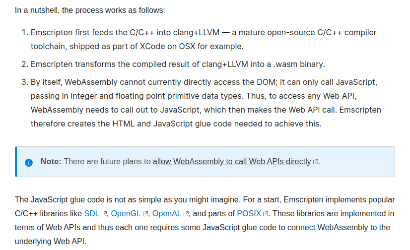
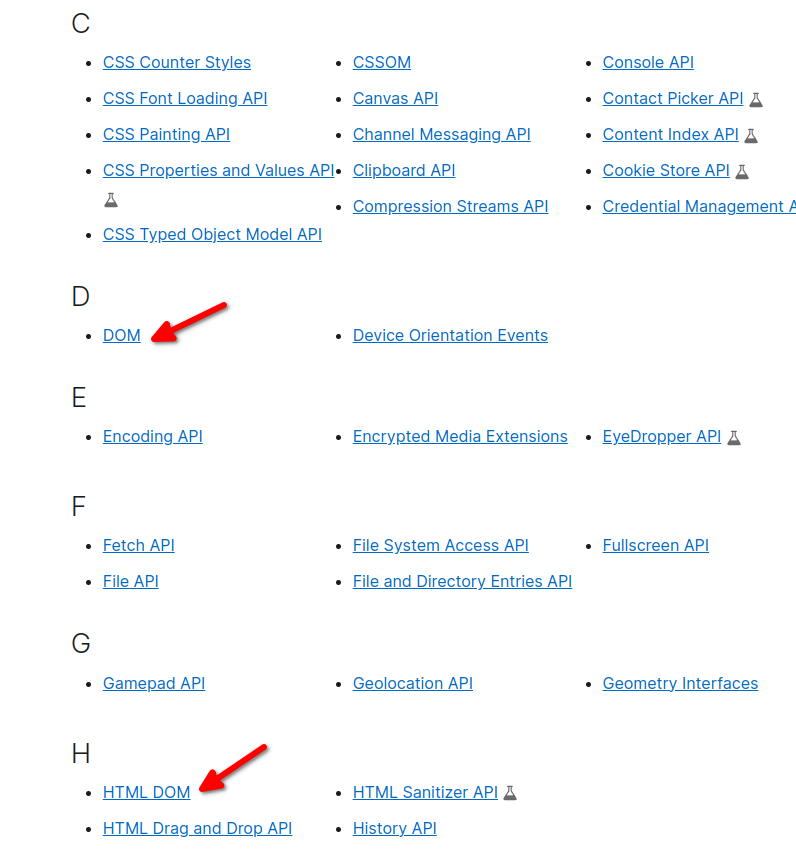

# WebAssembly Dünyasında Neler Oluyor?

[Resmi sayfasındaki](https://webassembly.org/) tanıma bakacak olursak şu şekilde tanımlanmış.

_"WebAssembly (Wasm) stack-based virtual machine için tasarlanmış binary  bir formattır. Hemen hemen bütün programlama dilleri için portable bir derleme hedefi olarak tasarlanmıştır. Hem client hem de server taraflı web uygulamaları geliştirebilmeyi sağlar."_


Biraz açıklayıcı olursak, hemen hemen bütün programlama dilleriyle kod yazabileceğiz ve ortaya çıkan ürünü (wasm) çalıştırmak istediğimiz platform için bir runtime varsa çalıştırabileceğiz. Java'da bildiğiniz üzere bir çok platformda çalışabiliyor.Ancak WebAssembly Java'dan farklı olarak platform ile programlama dilini soyutluyor. Bu sayede istediğimiz programlama diliyle geliştirme yapabiliyoruz.

Her zaman sorulardan birini biz de soralım. Peki WebAssembly ilk çıkış itibariyle web browser'lar için çıktıysa bu JavaScript'in sonu mudur? Bu sorunun kısa cevabı **hayır**. O zaman ikisine ne gerek var diyebilirsiniz. Şimdi mevzuyu biraz açalım. Aslında hakikaten WebAssembly'nin [çıkış amacı](https://webassembly.github.io/spec/core/intro/introduction.html) hızın önemli olduğu, yoğun hesaplama gereken yerlerde neredeyse native kadar hızlı çalışabilen bir yapı sunmaktı.Ancak bu kadar hızlı çalışabilen, taşınabilen, gömülü, modüler, dil bağımsız... vb. bir sistemi neden sadece web dünyasına sıkıştıralım ki diye düşünmüş olacaklar ki zamanla yeni özellikler ekleyerek kapsamını genişletmeye başladılar.İlk versiyonu Mart 2017'de çıkmış olmasına rağmen ve halen daha birinci versiyonu kullanılıyor olmasına rağmen belki de son zamanların en çok konululan, en hızlı gelişen teknolojilerden biri ol du diyebiliriz.

Bu gelişim sadece WebAssembly'i eko sistemin dışına çıkartmakla kalmadı aynı zamanda **ileride** JavaScript'e bir **alternatif** olma yolunda da etkiledi. Bunu da yine [resmi sayfasındaki](https://developer.mozilla.org/en-US/docs/WebAssembly/Concepts) aşağıdaki mesajdan anlayabiliyoruz.Tabii ki bunun kısa sürede olmasını beklemek mantıklı olmayacaktır.


[kaynak](https://developer.mozilla.org/en-US/docs/WebAssembly/Concepts)

Web API listesi için [Mozilla Developer Network](https://developer.mozilla.org/en-US/docs/Web/API) sayfasını ziyaret edebilirsiniz.

Sorumuza tekrar dönecek olursak WebAssembly JavaScript'i kaldırma gibi bir hedefi yok. Zaten neden kaldırmayı da düşünsünler? Uzun yıllardır gösterdiği gelişimle kendini kanıtlamış öğrenmesi ve kullanması çok kolay bir dil. WebAssembly'nin yaptığı veya yapacağı yeni oyunculara da kapıyı açmak olacaktır. Yani browser tarafı için bakacak olursak sadece JavaScript değil onunla birlikte diğer programlama dillerinin de kullanılabileceği bir ortam sunmaya çalışıyor WebAssembly.

Aslında teknolojik gelişmelere de bakacak olursak 
- web 3.0'ın konuşulduğu, 
- blockchain teknolojilerinin hızla geliştiği, 
- yapay zekanın her alanda hayatımıza girdiği, 
- modüler ve taşınabilir yapıların/teknojilerin önem kazandığı, 
- agility (çevikliğin) her sektörde konuşulduğu,
- her şeyin ucunun web teknolojilerine değdiği

bir dünyada elimizdeki tek aracın JavaScript olması  veya kalması da çok mantıklı görünmüyor. Böyle düşününce olur da WebAssembly bunu başaramazsa kesinlikle bir başka bir teknolojinin bu beklenen gelişimi göstereceğini tahmin etmek hiç de zor değil.   


**Peki bu teknolojinin geçen 5-6 yıllık bir geçmişi bize geleceği hakkında neler söylüyor ona bir akalım.**


İlk çıkış amacına baktığımızda web uygulamaları, hatta sadece client tarafında browser içinde çalışması için planlanmış olan WebAssembly geldiği noktada kendini çoktan aşmış görünüyor.


Yine [resmi sayfasında](https://webassembly.org/docs/use-cases/) yer alan kullanım alanlarına bakacak olursak alttaki uzun listeye ulaşıyoruz.

## Browser İçinde Kullanım Alanları

- Better execution for languages and toolkits that are currently cross-compiled to the Web (C/C++, GWT, …).
- Image / video editing.
- Games: (Casual games that need to start quickly, AAA games that have heavy assets, Game portals (mixed-party/origin content).
- Peer-to-peer applications (games, collaborative editing, decentralized and centralized).
- Music applications (streaming, caching).
- Image recognition.
- Live video augmentation (e.g. putting hats on people’s heads).
- VR and augmented reality (very low latency).
- CAD applications.
- Scientific visualization and simulation.
- Interactive educational software, and news articles.
- Platform simulation / emulation (ARC, DOSBox, QEMU, MAME, …).
- Language interpreters and virtual machines.
- POSIX user-space environment, allowing porting of existing POSIX applications.
- Developer tooling (editors, compilers, debuggers, …).
- Remote desktop.
- VPN.
- Encryption.
- Local web server.
- Common NPAPI users, within the web’s security model and APIs.
- Fat client for enterprise applications (e.g. databases).

## Browser Dışında Kullanım Alanları

- Game distribution service (portable and secure).
- Server-side compute of untrusted code.
- Server-side application.
- Hybrid native apps on mobile devices.
- Symmetric computations across multiple nodes

Bahsi geçen alanlara alakalı bazı projelerin linkini paylaşıyorum.

- [Bu projede](https://make.wordpress.org/core/2022/09/23/client-side-webassembly-wordpress-with-no-server/) WordPress'i PHO olmadan ve tamamen browser içinde çalıştırmayı başarmışlar. Git Projesine de [şu linkten](https://github.com/WordPress/wordpress-wasm) ulaşabilirsiniz.
- [Doom 3](https://wasm.continuation-labs.com/d3demo/) Oyununu browser üzerinden oynayabilirsiniz.
- PstgreSQL veritabanını WebAssembly içinde çalıştırmayı başarmışlar. GitHub projesi için [şu linki](https://github.com/snaplet/postgres-wasm) ziyaret ediniz.
- Adobe'nin yeni projesi, Photoshop'u  browser üzerinden çalışmak için yaptığı çalışmayı [şu linkten](https://web.dev/ps-on-the-web/) araştırabilirsiniz.
- Container teknolojileri ile ilgileniyorsanız Docker'ın WebAssembly tipindeki container çalışmasını incelemek için [şu linke](https://www.docker.com/blog/docker-wasm-technical-preview/) bakabilirsiniz. Bu konuyu makalenin devamında daha detaylı inceliyor olacağız.


# WebAssembly Tenik Detaylar


Text formatını uzantısı  wat, binary formatın uzantısı wasm olarak kullanılır. Text formattan binary almak için alttaki komutu kullanabilirsiniz. Detaylar için [şu sayfayı](https://webassembly.org/getting-started/advanced-tools/) ziyaret edebilirsiniz.

```shell
wat2wasm simple.wat -o simple.wasm
```

Tersini yapmak da mümkün.

```shell
wasm2wat simple.wasm -o simple.wat
```


solomon hykes sözü

Solomon Hykes, a co-founder of Docker, wrote in 2019, "If WASM+WASI existed in 2008, we wouldn't have needed to create Docker. That's how important it is. WebAssembly on the server is the future of computing."[84] Wasmer, out in version 1.0, provides "software containerization, we create universal binaries that work anywhere without modification, including operating systems like Linux, macOS, Windows, and web browsers. Wasm automatically sandboxes applications by default for secure execution".[84]

kendi tweet i
https://twitter.com/solomonstre/status/1111004913222324225

https://en.wikipedia.org/wiki/WebAssembly


mebbagistest.kizilay.org.tr (gui)
mebbagistestapi.kizilay.org.tr
10.0.41.11
10.0.66.180


mebbagis.kizilay.org.tr (gui)
bagismeb.kizilay.org.tr
10.0.40.23
10.0.6.180 

# Yapılmış Projeler

https://make.wordpress.org/core/2022/09/23/client-side-webassembly-wordpress-with-no-server/

https://github.com/snaplet/postgres-wasm

https://github.com/wasmerio/wasmer-postgres


https://www.webassemblygames.com/

https://www.crazygames.com/game/zombsroyaleio


web api ye erişebilmesi hedefine dair metin : https://developer.mozilla.org/en-US/docs/WebAssembly/Concepts



peki web apiler nedir:

https://developer.mozilla.org/en-US/docs/Web/API





# Wasi (WebAssembly System Interface) Nedir

https://github.com/WebAssembly/WASI

Kesinlikle okunmalı: https://hacks.mozilla.org/2019/03/standardizing-wasi-a-webassembly-system-interface/ 

# Wasm Runtimes

https://github.com/appcypher/awesome-wasm-runtimes

### WasmEdge
Github: https://github.com/WasmEdge/WasmEdge

Şuan (11/26/2022) 4300 yıldızı var ve dotnet desteği yok. 

Docker wasm runtime olarak bunu kullanıyor bu arada. https://docs.docker.com/desktop/wasm/#running-a-wasm-application-with-docker-run

WasmEdge is an official sandbox project hosted by the CNCF. 

### Wasm3

GitHub: https://github.com/wasm3/wasm3

Şuan (11/26/2022) 5500 yıldızı var ve dotnet desteği var ancak en son iki yıl önce update olmuş GitHub reposu. https://github.com/tana/Wasm3DotNet


### Wasmer

GitHub: https://github.com/wasmerio/wasmer

Şuan (11/26/2022) 14000 yıldızı var ve dotnet desteği var ancak en son iki yıl önce update olmuş GitHub reposu. https://github.com/migueldeicaza/WasmerSharp

### Wasmtime

GitHub : https://github.com/bytecodealliance/wasmtime

Şuan (11/26/2022) 11000 yıldızı var ve dotnet desteği var. https://github.com/bytecodealliance/wasmtime-dotnet

A Bytecode Alliance project

# Wapm (WebAssembly Package Manager)

https://wapm.io/

Wasmer runtime'ı yazan grubun bir aracı.


# Bakılması gereken kaynaklar

- Bi bak: https://hub.docker.com/r/renefonseca/wasisdk#!

- makale : https://www.thinktecture.com/en/webassembly/webassembly-with-dotnet/
uygulama : https://github.com/thinktecture-labs/article-webassembly-dotnet-server

- blazor uygulamasını browser dışında çalıştırabilek için detaylı anlatım:
https://dev.to/azure/exploring-net-webassembly-with-wasi-and-wasmtime-41l5


- blockchain
https://medium.com/@rauljordan/webassembly-the-future-of-blockchain-computing-1a0ae28f7e40

- blockchain uygulaması
https://www.codementor.io/@beber89/webassembly-to-run-blockchain-using-go-yuw6f9u7m

- web 3
https://101blockchains.com/web-3-0-blockchain-technology-stack/


# Kullanım Alanları

https://webassembly.org/docs/use-cases/


## Browser İçinde Kullanım Alanları


- Better execution for languages and toolkits that are currently cross-compiled to the Web (C/C++, GWT, …).
- Image / video editing.
- Games:
- Casual games that need to start quickly.
- AAA games that have heavy assets.
- Game portals (mixed-party/origin content).
- Peer-to-peer applications (games, collaborative editing, decentralized and centralized).
- Music applications (streaming, caching).
- Image recognition.
- Live video augmentation (e.g. putting hats on people’s heads).
- VR and augmented reality (very low latency).
- CAD applications.
- Scientific visualization and simulation.
- Interactive educational software, and news articles.
- Platform simulation / emulation (ARC, DOSBox, QEMU, MAME, …).
- Language interpreters and virtual machines.
- POSIX user-space environment, allowing porting of existing POSIX applications.
- Developer tooling (editors, compilers, debuggers, …).
- Remote desktop.
- VPN.
- Encryption.
- Local web server.
- Common NPAPI users, within the web’s security model and APIs.
- Fat client for enterprise applications (e.g. databases).


## Browser Dışında Kullanım Alanları


- Game distribution service (portable and secure).
- Server-side compute of untrusted code.
- Server-side application.
- Hybrid native apps on mobile devices.
- Symmetric computations across multiple nodes


# Kaynaklar
- https://hacks.mozilla.org/2019/03/standardizing-wasi-a-webassembly-system-interface/
- 