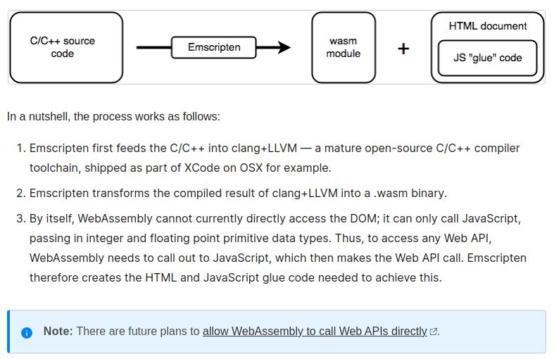
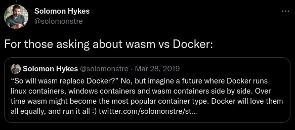

# WebAssembly Dünyasında Neler Oluyor?

Merhaba Arkadaşalar,

Bu yazımızda son yıllarda kendinden sıkça söz ettiren WebAssembly dünyasındaki gelişmelere göz atacağız. 

Bu kadar hızlı gelişmesinde teknoloji ve yazılım dünyasının en büyük firmalarının  (Mozilla, Microsoft, Google, Apple, Fastly, Intel, ve Red Hat'ın) bu teknolojiye verdikleri desteğin payı çok büyük. 

[Resmi sayfasındaki](https://webassembly.org/) tanıma bakacak olursak şu şekilde tanımlanmış.

_"WebAssembly (Wasm) stack-based virtual machine için tasarlanmış binary  bir formattır. Hemen hemen bütün programlama dilleri için portable bir derleme hedefi olarak tasarlanmıştır. Hem client hem de server taraflı web uygulamaları geliştirebilmeyi sağlar."_


Yani hemen hemen bütün programlama dilleriyle kod yazabileceğiz ve ortaya çıkan ürünü (wasm) çalıştırmak istediğimiz platform için bir runtime varsa çalıştırabileceğiz. Java'da bildiğiniz üzere bir çok platformda çalışabiliyor.Ancak WebAssembly Java'dan farklı olarak platform ile programlama dilini soyutluyor. Bu sayede istediğimiz programlama diliyle geliştirme yapabiliyoruz.

Her zaman sorulardan birini biz de soralım. Peki WebAssembly ilk çıkış itibariyle web browser'lar için çıktıysa bu JavaScript'in sonu mudur? Bu sorunun kısa cevabı **hayır**. O zaman ikisine ne gerek var diyebilirsiniz. Şimdi mevzuyu biraz açalım. Aslında hakikaten WebAssembly'nin [çıkış amacı](https://webassembly.github.io/spec/core/intro/introduction.html) hızın önemli olduğu, yoğun hesaplama gereken yerlerde neredeyse native kadar hızlı çalışabilen bir yapı sunmaktı.Ancak bu kadar hızlı çalışabilen, taşınabilen, gömülü, modüler, dil bağımsız... vb. bir sistemi neden sadece web dünyasına sıkıştıralım ki diye düşünmüş olacaklar ki zamanla yeni özellikler ekleyerek kapsamını genişletmeye başladılar.İlk versiyonu Mart 2017'de çıkmış olmasına rağmen ve halen daha birinci versiyonu kullanılıyor olmasına rağmen belki de son zamanların en çok konuşulan, en hızlı gelişen teknolojilerden biri oldu diyebiliriz.

Bu gelişim sadece WebAssembly'i ekosistemin dışına çıkartmakla kalmadı aynı zamanda **ileride** JavaScript'e bir **alternatif** olma yolunda da etkiledi. Bunu da yine [resmi sayfasındaki](https://developer.mozilla.org/en-US/docs/WebAssembly/Concepts) aşağıdaki mesajdan anlayabiliyoruz.Tabii ki bunun kısa sürede olmasını beklemek mantıklı olmayacaktır.


[kaynak](https://developer.mozilla.org/en-US/docs/WebAssembly/Concepts)

Web API listesi için [Mozilla Developer Network](https://developer.mozilla.org/en-US/docs/Web/API) sayfasını ziyaret edebilirsiniz.

Sorumuza tekrar dönecek olursak WebAssembly'nin JavaScript'i ortadan kaldırma gibi bir hedefi yok. Zaten neden kaldırmayı da düşünsünler? Uzun yıllardır gösterdiği gelişimle kendini kanıtlamış, öğrenmesi ve kullanması çok kolay bir dil. WebAssembly'nin yaptığı veya yapacağı aslında sadece yeni oyunculara da kapıyı açmak olacaktır. Yani browser tarafı için bakacak olursak sadece JavaScript değil onunla birlikte diğer programlama dillerinin de kullanılabileceği bir ortam sunmaya çalışıyor WebAssembly.

Aslında teknolojik gelişmelere de bakacak olursak 
- web 3.0'ın konuşulduğu, 
- blockchain teknolojilerinin hızla geliştiği, 
- yapay zekanın her alanda hayatımıza girdiği, 
- modüler ve taşınabilir yapıların/teknojilerin önem kazandığı, 
- agility (çevikliğin) her sektörde konuşulduğu,
- her şeyin ucunun web teknolojilerine değdiği

bir dünyada elimizdeki tek aracın JavaScript olması  veya kalması da çok mantıklı görünmüyor. Böyle düşününce olur da WebAssembly bunu başaramazsa kesinlikle bir başka bir teknolojinin bu beklenen gelişimi göstereceğini tahmin etmek hiç de zor değil.   


**Bu teknolojinin geçen 5-6 yıllık bir geçmişi bize geleceği hakkında neler söylüyor ona bir bakalım.**


İlk çıkış amacına baktığımızda web uygulamaları, hatta sadece client tarafında browser içinde çalışması için planlanmış olan WebAssembly geldiği noktada kendini çoktan aşmış görünüyor.


Yine [resmi sayfasında](https://webassembly.org/docs/use-cases/) yer alan kullanım alanlarına bakacak olursak alttaki uzun listeye ulaşıyoruz.

## Browser İçinde Kullanım Alanları

- Better execution for languages and toolkits that are currently cross-compiled to the Web (C/C++, GWT, …).
- Image / video editing.
- Games: (Casual games that need to start quickly, AAA games that have heavy assets, Game portals (mixed-party/origin content).
- Peer-to-peer applications (games, collaborative editing, decentralized and centralized).
- Music applications (streaming, caching).
- Image recognition.
- Live video augmentation (e.g. putting hats on people’s heads).
- VR and augmented reality (very low latency).
- CAD applications.
- Scientific visualization and simulation.
- Interactive educational software, and news articles.
- Platform simulation / emulation (ARC, DOSBox, QEMU, MAME, …).
- Language interpreters and virtual machines.
- POSIX user-space environment, allowing porting of existing POSIX applications.
- Developer tooling (editors, compilers, debuggers, …).
- Remote desktop.
- VPN.
- Encryption.
- Local web server.
- Common NPAPI users, within the web’s security model and APIs.
- Fat client for enterprise applications (e.g. databases).

## Browser Dışında Kullanım Alanları

- Game distribution service (portable and secure).
- Server-side compute of untrusted code.
- Server-side application.
- Hybrid native apps on mobile devices.
- Symmetric computations across multiple nodes

Bahsi geçen alanlara alakalı bazı projelerin linkini paylaşıyorum.

- [Bu projede](https://make.wordpress.org/core/2022/09/23/client-side-webassembly-wordpress-with-no-server/) WordPress'i PHO olmadan ve tamamen browser içinde çalıştırmayı başarmışlar. Git Projesine de [şu linkten](https://github.com/WordPress/wordpress-wasm) ulaşabilirsiniz.
- [Doom 3](https://wasm.continuation-labs.com/d3demo/) Oyununu browser üzerinden oynayabilirsiniz.
- PstgreSQL veritabanını WebAssembly içinde çalıştırmayı başarmışlar. GitHub projesi için [şu linki](https://github.com/snaplet/postgres-wasm) ziyaret ediniz.
- Adobe'nin yeni projesi, Photoshop'u  browser üzerinden çalışmak için yaptığı çalışmayı [şu linkten](https://web.dev/ps-on-the-web/) araştırabilirsiniz.
- Container teknolojileri ile ilgileniyorsanız Docker'ın WebAssembly tipindeki container çalışmasını incelemek için [şu linke](https://www.docker.com/blog/docker-wasm-technical-preview/) bakabilirsiniz. Bu konuyu makalenin devamında daha detaylı inceliyor olacağız.
- Linux, FreeBSD ve Windows işletim sistemlerinin WebAssembly ile browser içinde çalıştırıldığı projenin [web sayfası](https://bellard.org/jslinux/index.html).
- x86 uyumlu CPU ve hardware'leri emulate eden ve makine kodlarını WebAssembly'ye runtime'da çeviren [bir çalışma](https://github.com/copy/v86). [Örnekleri](https://copy.sh/v86/) içinde işletim sistemlerinin farklı versiyonlarının browser içinden çalıştırıldığını görebilirsiniz.   
- [FFmpeg](https://github.com/ffmpegwasm/ffmpeg.wasm)'i wasm üzerinden browser'da çalıştırabilirsiniz.
- [AutoCAD](https://blogs.autodesk.com/autocad/autocad-web-app-google-io-2018/)'i web browser üzerinden kullanabilirsiniz.
- [Uno Platform](https://platform.uno/blog/a-piece-of-windows-10-is-now-running-on-webassembly-natively-on-ios-and-android/) ile  WebAssembly üzerinden cross platform uygulama geliştirebilirsiniz. Cross'dan kastım yazdığımız kodun sadece Android ve IOS değil, aynı zamanda  Windows, Linux ve Mac'de de çalışması.

Daha birçok örneği internette bulmak mümkün.

WebAssembly'i çalıştıran web browser'lar birer runtime. WebAssembly'i browser dışında çalıştırmak için bir çok Runtime projesi mevcut. Bunların listesi için şu [Github sayfasına](https://github.com/appcypher/awesome-wasm-runtimes) bakabilirsiniz.

## Github'da en çok yıldız alan bazı Runtime'lar

- **WasmEdge**

Ekosistemdeki en hızlı runtime'lardan biri. Halihazırda CNCF tarafından desteklenen bir proje.

C/C++, Rust, Go, Swift, Kotlin, AssemblyScript, Grain, JavaScript ve Python  dillerini destekliyor.

İleride değineceğimiz Docker&Wasm ikilisinde de bu runtime kullanılmış.

Wasm runtime'ını yönetmek ve orkestra etmek için Kubernetes, blockhain, 

GitHub Sayfası: https://github.com/WasmEdge/WasmEdge

- **Wasm3**

Python3, Rust, C/C++, GoLang, Zig, Perl, Swift, .Net, Nim, Arduino, PlatformIO, Particle, QuickJS dillerini destekliyor.

Embedded cihazlarda WebAssembly çalıştırılması üzerine yoğunlaşmış bir proje.

GitHub Sayfası: https://github.com/wasm3/wasm3

- **Wasmer**

Buraya yazamayacağım kadar çok dili destekliyor. 


Aynı zamanda WebAssembly Package Manager (WAPM) projesini de aynı commmunity yönetiyor. İleride değineceğim için burada detaylarına girmiyoruz.

GitHub Sayfası: https://github.com/wasmerio/wasmer

- **Wasmtime**

C/C++, Rust, Go, Python, :net ve Go dillerini destekliyor.

GitHub Sayfası: https://github.com/bytecodealliance/wasmtime


Runtime'lar bunlarla sınırlı değil , daha fazlası için [şu sayfayı](https://github.com/appcypher/awesome-wasm-runtimes) ziyaret edebilirsiniz.

## Diğer Araçlar

- **WASI (WebAssembly System Interface)**

[WASI](https://github.com/WebAssembly/WASI) WebAssembly takımı tarafından geliştirilen we WebAssembly modüllerinin sistem kaynaklarına erişimini sağlayan bir middleware'dır. 

- **WAPM (WebAssembly Package Manager)**

Wasmer runtime'ı geliştiren takımın geliştirdiği package manager aracı. Öncelikle sisteminize Wasmer runtime'ı ardından [Wapm](https://wapm.io/)'ı kurmanız gerekiyor.


Bütün işletim sistemlerinde çalışıyor ve kurması da çok kolay. 

- Windows için alttaki komutu PowerShell üzerinde çalıştırıyoruz.

```powershell
iwr https://win.wasmer.io -useb | iex
```

- Linux ve Mac için alttaki komutu çalıştırıyoruz

```shell
curl https://get.wasmer.io -sSfL | sh
```

Bundan sonrakiler bütün işletim sistemlerinde aynı şekilde çalışıyor.

Örneğin Sqlite'ı çalıştırmak için öncelikle ilgili paketi indidiriyoruz ve ardında çalıştırıyoruz.

```shell
wapm install sqlite/sqlite

wapm run sqlite
```

Artık sqlite komutlarımızı çalıştırabiliriz.

Aslında wapm'ın run komutu şile yaptığı wasmer cli üzerinden sqlite.wasm doyasını çalıştırmak.

Kendi makinemde wasm dosyası home dizini altında.

```shell

wasmer ~/wapm_packages/sqlite/sqlite@0.2.2/build/sqlite.wasm
```

Peki sqlite'ı veya bir başka uygulamayı veya modülü bu şekilde çalıştırabilmek bize ne kazandıracak?

- En önemli kolaylıklarında biri platform bağımsızlığı. Yani uygulamamızı bir kez wasm olarak export alabildiysek başka hiçbir düzenleme yapmadan her platformda çalıştırabilir olacağız.
- Web browser'ların desteği sayesinde istemci tarafında çok daha büyük uygulamaları çalıştırabilir olacağız.
- Herhangi bir dilde yazılmış paketleri aynı platforma kullanabileceğiz Örneğin bir modülü JavaScript ile diğer modülü C# ile bir diğerini Python ile geliştirip aynı platformda kullanmak mümkün olabilecek.

Özellikle blockchain ile birlikte merkeziyetsiz uygulama çalışmalarının hız kazandığı günümüzde WebAssembly'nin ne kadar büyük işler yapabileceğini bir düşünün. Makalenin devamında bu konuya da değineceğiz.

Ayrıca browser dışında çalışabilme yeteneği ile mobil ve iot cihazlarında da çalışabilmesi mümkün. WebAssembly'nin mobil dünyada da çok etkili olacağını tahmin etmek çok zor değil.    

# WebAssembly Tenik Detaylar

Wasp yazmak  için text format mevcut ve bunu wasm'a çevirmekte mümkün. Alttaki komutlarla bu yapılabilir. Ancak tabii ki bu şekilde geliştirme yapmak çok zor olacağı için her programlama dili için farklı farklı implementasyonlar mevcut.


Text formatını uzantısı  wat, binary formatın uzantısı wasm olarak kullanılır. Text formattan binary almak için alttaki komutu kullanabilirsiniz. Detaylar için [şu sayfayı](https://webassembly.org/getting-started/advanced-tools/) ziyaret edebilirsiniz.

```shell
wat2wasm simple.wat -o simple.wasm
```

Tersini yapmak da mümkün.

```shell
wasm2wat simple.wasm -o simple.wat
```


Yukarıda bahsettiğimiz runtime'lar kullanılarak yazmak istediğiniz dil için gerekli paketleri kurarak build alabilirsiniz. Yada Microsoft'un [Blazor](https://dotnet.microsoft.com/en-us/apps/aspnet/web-apps/blazor) teknolojisine benzer her dilde özellikle web component'leri geliştirebileceğiniz alt yapılar mevcut. Henüz WebAssembly DOM'a erişemediği için JavaScript bağımlılığı mevcut ancak bunun da zamanla ortadan kalkacağı yukarıda belirttiğimiz gibi bir süre sonra aşılacaktır.

Microsoft WebAssembly'yi  belki de en etkili kullanan firmalardan biri. Microsoft bu teknolojiye çok güveniyor olacak ki [Blazor](https://dotnet.microsoft.com/en-us/apps/aspnet/web-apps/blazor) adındaki teknolojosini bir çok firamaya göre çok daha erken geliştiricilere sundu. 

[Blozor](https://dotnet.microsoft.com/en-us/apps/aspnet/web-apps/blazor) şuanki haliyle web browser runtime'ları hedef almış gibi görünüyor. Ancak websocket desteği ile sunucu taraflı uygulamalar geliştirmek de mümkün. Bu durumda bütün kod sunucuda çalışarak websocket yardımıyla client tarafı etkileşim kurmak da mümkün. Ayrıca Blazor ile geliştirdiğiniz uygulamaları sadece web'de değil mobil cihazlarda ve desktop ortamlarında da çalıştırmak mümkün.

Ayrıca Blazor uygulamasını browser dışında runtime'lar kullanarak çalıştırma planları da mevcut. .Net 7 ile birlikte [AOT](https://learn.microsoft.com/en-us/dotnet/core/deploying/native-aot/) (ahead-of-time) tarafında geliştirmeler yapıldı ve halen bu geliştirmeler devam ediyor. Burada amaç dotnet runtime kurmadan uygulamayı sistemlerde çalıştırabilmek. Bu sayede Blazor uygulamalarımızı browser dışında da çalıştırabilir olacağız.

Bunun  için şimdiden deneysel bir [SDK](https://github.com/SteveSandersonMS/dotnet-wasi-sdk)'de mavcut. Örnek çalışma ile Blazor uygulaması WASI kullanılarak browser dışında da çalışabilir hale getiriliyor. Yukarıda bahsettiğimiz  Wasmtime veya Wasmer runtime'ları kullanılarak da yayımlanabiliyor. Bu projenin detaylarına [şu linkten](https://dev.to/azure/exploring-net-webassembly-with-wasi-and-wasmtime-41l5) ulaşabilirsiniz.

Ayrıca yukarıda farklı dillerde geliştirilen WebAssembly modüllerinin aynı anada kullanılabilmesinin mümkün olduğundan bahsetmiştik. Mesela C diliyle geliştirilmiş bir wasm paketini dotnet içinde bir runtime yardımıyla kullanabiliriz. Örnek çalışma için  [şu linki](https://www.thinktecture.com/en/webassembly/webassembly-with-dotnet/) ziyaret ediniz.  

Bunun haricinde tabii ki Wasi sayesinde doğrudan uygulamamız network ile haberleşebilir ve http protokolünü kullanarak web sayfası da yayımlayabilir. WasmEdge runtime kullanılarak küçük bir web server yazılmış. Örnek projeyi [şu linkten](https://wasmedge.org/book/en/write_wasm/rust/networking.html) ziyaret edebilirsiniz.

## Container Dünyasında WebAssembly

Konuya Docker'ın da kurucusu olan Solomon Hykes'ın [Tweet](https://twitter.com/solomonstre/status/1111004913222324225)'leri ile başlayalım.





Özetle Solomon "Eğer 2008 yılında WASM ve WASI olsaydı bizim Docker'ı icat etmemize gerek kalmayacaktı. İşte bu kadar önemli. WebAsembly sunucu taraflı Computation'ın geleceğidir." diyor.

Devamında WebAssembly'nin Docker'ın yerine geçmeyeceğini ancak Linux ve Windows konteynerler ile birlikte çalışabileceğini hatta ileride belki de wasm tipindeki konteynerler'in daha çok kullanılabileceğinden bahsediliyor.


[Bu örnek](https://blog.logrocket.com/rust-microservices-server-side-webassembly/) ile docker üzerinden Rust ile yazılmış  wasm modülü ile bir microservice Docker kullanılarak yayına verilmiş.


## Blockchain ve Web 3 Dünyasında WebAssembly


- blockchain
https://medium.com/@rauljordan/webassembly-the-future-of-blockchain-computing-1a0ae28f7e40

- blockchain uygulaması
https://www.codementor.io/@beber89/webassembly-to-run-blockchain-using-go-yuw6f9u7m

- web 3
https://101blockchains.com/web-3-0-blockchain-technology-stack/


