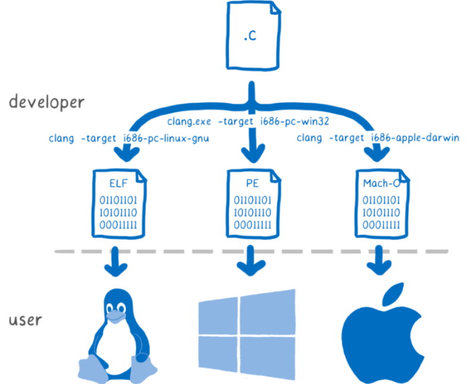
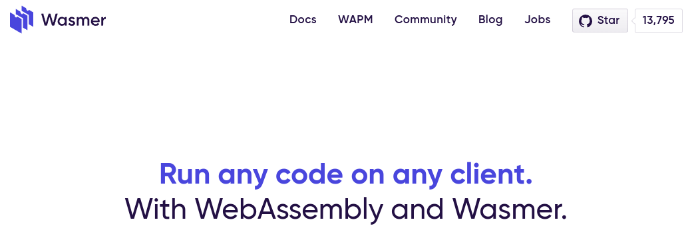
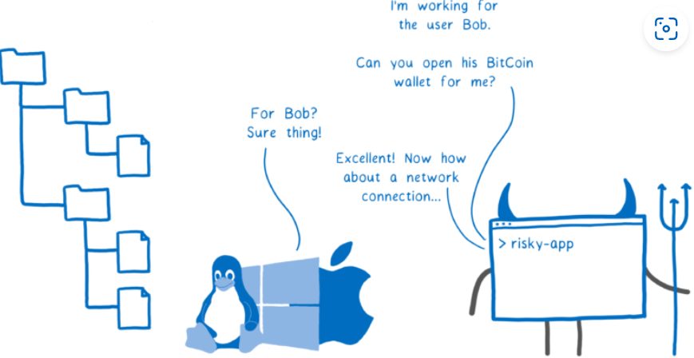
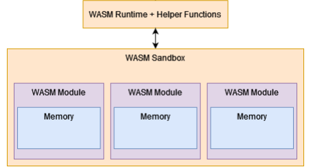
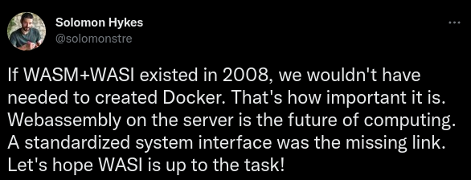
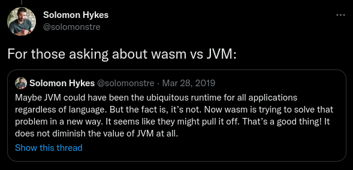
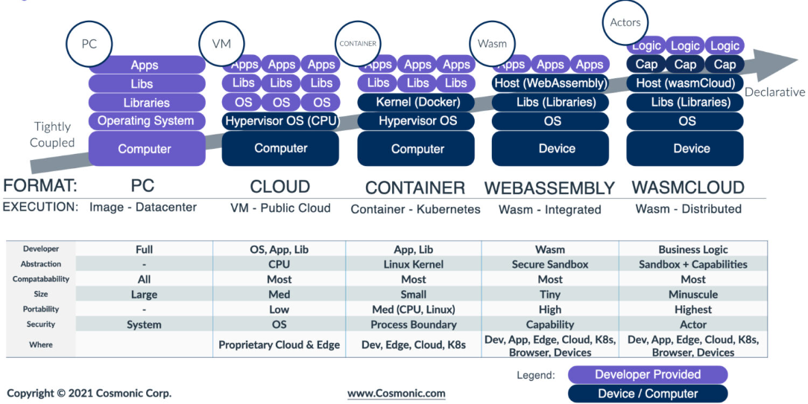

# WebAssembly Tarafında Neler Oluyor?

Bu yazımızda son yıllarda kendinden sıkça söz ettiren WebAssembly dünyasındaki gelişmelere göz atacağız. Nasıl çalıştığını anlamaya çalışacağız. Bununla birlikte hangi alanlarda kullanıldığı ve bize neler vadettiğini inceleyeceğiz. İyi okumalar diliyorum.  


Bu kadar hızlı gelişmesinde teknoloji ve yazılım dünyasının en büyük firmalarının  (Mozilla, Microsoft, Google, Apple, Fastly, Intel, ve Red Hat'ın) bu teknolojiye verdikleri desteğin payı çok büyük. Ancak tek başına bu yeteli değil tabii ki. Geçen beş yıla baktığımızda farkında olmasak da belki en hızlı gelişen teknolojilerden biri WebAssembly diyebiliriz. Dikkatimizi çekmemesinin temel sebebi ise  halen bir önceki yapıların/teknolojilerin kullanılabiliyor olmasından dolayı ihtiyaç haline gelmemiş olması.

Öncelikle daha önce hiç duymayanlar için WebAssembly nedir ne değildir oradan başlayalım.

[Resmi sayfasındaki](https://webassembly.org/) tanıma bakacak olursak şu şekilde tanımlanmış.

_"WebAssembly (Wasm) stack-based virtual machine için tasarlanmış binary  bir formattır. Hemen hemen bütün programlama dilleri için portable bir derleme hedefi olarak tasarlanmıştır. Hem client hem de server taraflı web uygulamaları geliştirebilmeyi sağlar."_


[kaynak](https://hacks.mozilla.org/2019/03/standardizing-wasi-a-webassembly-system-interface/)


Yani hemen hemen bütün programlama dilleriyle kod yazabileceğiz ve ortaya çıkan ürünü (wasm) çalıştırmak istediğimiz platform için bir runtime varsa çalıştırabileceğiz. Java'da bildiğiniz üzere bir çok platformda çalışabiliyor.Ancak **WebAssembly Java'dan farklı olarak platform ile programlama dilini soyutluyor**. Bu sayede istediğimiz programlama diliyle geliştirme yapabiliyoruz.

Aklımıza zaten biz bir kodu farklı platformlarda çalıştırabiliyorduk şeklinde bir düşünce gelebilir. Örneğin C dili ile yazılmış bir kodu farklı platformlar için derleyebiliyoruz.


Ancak burada her platform farklılığı için kod yazmak ve her biri için ayrı build almak zorundayız. WebAssembly ise tek bir build alarak uygulamamızı çalıştırmamızı sağlıyor. Tabii ki tek faydası bu değil. Diğer faydalarını yazının devamında inceliyor olacağız.


[kaynak](https://hacks.mozilla.org/2019/03/standardizing-wasi-a-webassembly-system-interface/)


Her zaman sorulardan birini biz de soralım. Peki WebAssembly ilk çıkış itibariyle web browser'lar için çıktıysa bu JavaScript'in sonu mudur? Bu sorunun kısa cevabı **hayır**. O zaman ikisine ne gerek var diyebilirsiniz. Şimdi mevzuyu biraz açalım. Aslında hakikaten WebAssembly'nin [çıkış amacı](https://webassembly.github.io/spec/core/intro/introduction.html) hızın önemli olduğu, yoğun hesaplama gereken yerlerde neredeyse native kadar hızlı çalışabilen bir yapı sunmaktı.Ancak bu kadar hızlı çalışabilen, taşınabilen, gömülü, modüler, dil bağımsız... vb. bir sistemi neden sadece web dünyasına sıkıştıralım ki diye düşünmüş olacaklar ki zamanla yeni özellikler ekleyerek kapsamını genişletmeye başladılar.İlk versiyonu Mart 2017'de çıkmış olmasına rağmen ve halen daha birinci versiyonu kullanılıyor olmasına rağmen belki de son zamanların en çok konuşulan, en hızlı gelişen teknolojilerden biri oldu diyebiliriz.

Bu gelişim sadece WebAssembly'i ekosistemin dışına çıkartmakla kalmadı aynı zamanda **ileride** JavaScript'e bir **alternatif** olma yolunda da etkiledi. Bunu da yine [resmi sayfasındaki](https://developer.mozilla.org/en-US/docs/WebAssembly/Concepts) aşağıdaki mesajdan anlayabiliyoruz.Tabii ki bunun kısa sürede olmasını beklemek mantıklı olmayacaktır.


[kaynak](https://developer.mozilla.org/en-US/docs/WebAssembly/Concepts)

Web API listesi için [Mozilla Developer Network](https://developer.mozilla.org/en-US/docs/Web/API) sayfasını ziyaret edebilirsiniz.Bir çok developer için Web API kavramı eminim listedeki kadar geniş değildir.

Sorumuza tekrar dönecek olursak WebAssembly'nin JavaScript'i ortadan kaldırma gibi bir hedefi yok. Zaten neden kaldırmayı da düşünsünler? Uzun yıllardır gösterdiği gelişimle kendini kanıtlamış, öğrenmesi ve kullanması çok kolay bir dil. WebAssembly'nin yaptığı veya yapacağı aslında sadece yeni oyunculara da kapıyı açmak olacaktır. Yani browser tarafı için bakacak olursak sadece JavaScript değil onunla birlikte diğer programlama dillerinin de kullanılabileceği bir ortam sunmaya çalışıyor WebAssembly.

Aslında teknolojik gelişmelere de bakacak olursak

- web 3.0'ın konuşulduğu,
- blockchain teknolojilerinin hızla geliştiği,
- yapay zekanın her alanda hayatımıza girdiği,
- modüler ve taşınabilir yapıların/teknojilerin önem kazandığı,
- agility (çevikliğin) her sektörde konuşulduğu,

her şeyin ucunun web teknolojilerine değdiği bir dünyada elimizdeki tek aracın JavaScript olması  veya kalması da çok mantıklı görünmüyor. Böyle düşününce olur da WebAssembly bunu başaramazsa kesinlikle bir başka teknolojinin bu beklenen gelişimi göstereceğini tahmin etmek hiç de zor değil.


**Bu teknolojinin geçen 5-6 yıllık bir geçmişi bize geleceği hakkında neler söylüyor ona bir bakalım.**


İlk çıkış amacına baktığımızda web uygulamaları, hatta sadece client tarafında browser içinde çalışması için planlanmış olan WebAssembly geldiği noktada kendini çoktan aşmış görünüyor.


Yine [resmi sayfasında](https://webassembly.org/docs/use-cases/) yer alan kullanım alanlarına bakacak olursak alttaki uzun listeye ulaşıyoruz.

## Browser İçinde Kullanım Alanları

- Better execution for languages and toolkits that are currently cross-compiled to the Web (C/C++, GWT, …).
- Image / video editing.
- Games: (Casual games that need to start quickly, AAA games that have heavy assets, Game portals (mixed-party/origin content).
- Peer-to-peer applications (games, collaborative editing, decentralized and centralized).
- Music applications (streaming, caching).
- Image recognition.
- Live video augmentation (e.g. putting hats on people’s heads).
- VR and augmented reality (very low latency).
- CAD applications.
- Scientific visualization and simulation.
- Interactive educational software, and news articles.
- Platform simulation / emulation (ARC, DOSBox, QEMU, MAME, …).
- Language interpreters and virtual machines.
- POSIX user-space environment, allowing porting of existing POSIX applications.
- Developer tooling (editors, compilers, debuggers, …).
- Remote desktop.
- VPN.
- Encryption.
- Local web server.
- Common NPAPI users, within the web’s security model and APIs.
- Fat client for enterprise applications (e.g. databases).

## Browser Dışında Kullanım Alanları

- Game distribution service (portable and secure).
- Server-side compute of untrusted code.
- Server-side application.
- Hybrid native apps on mobile devices.
- Symmetric computations across multiple nodes

Bahsi geçen alanlarla alakalı bazı projelerin linkini paylaşıyorum.

- [Bu projede](https://make.wordpress.org/core/2022/09/23/client-side-webassembly-wordpress-with-no-server/) WordPress'i PHP olmadan ve tamamen browser içinde çalıştırmayı başarmışlar. Git Projesine de [şu linkten](https://github.com/WordPress/wordpress-wasm) ulaşabilirsiniz.
- [Doom 3](https://wasm.continuation-labs.com/d3demo/) Oyununu browser üzerinden oynayabilirsiniz.
- PstgreSQL veritabanını WebAssembly içinde çalıştırmayı başarmışlar. GitHub projesi için [şu linki](https://github.com/snaplet/postgres-wasm) ziyaret ediniz.
- Adobe'nin yeni projesi, Photoshop'u  browser üzerinden çalışmak için yaptığı çalışmayı [şu linkten](https://web.dev/ps-on-the-web/) araştırabilirsiniz.
- Container teknolojileri ile ilgileniyorsanız Docker'ın WebAssembly tipindeki container çalışmasını incelemek için [şu linke](https://www.docker.com/blog/docker-wasm-technical-preview/) bakabilirsiniz. Bu konuyu makalenin devamında daha detaylı inceliyor olacağız.
- Linux, FreeBSD ve Windows işletim sistemlerinin WebAssembly ile browser içinde çalıştırıldığı projenin [web sayfası](https://bellard.org/jslinux/index.html).
- x86 uyumlu CPU ve hardware'leri emulate eden ve makine kodlarını WebAssembly'ye runtime'da çeviren [bir çalışma](https://github.com/copy/v86). [Örnekleri](https://copy.sh/v86/) içinde işletim sistemlerinin farklı versiyonlarının browser içinden çalıştırıldığını görebilirsiniz.   
- [FFmpeg](https://github.com/ffmpegwasm/ffmpeg.wasm)'i WASM üzerinden browser'da çalıştırabilirsiniz.
- [AutoCAD](https://blogs.autodesk.com/autocad/autocad-web-app-google-io-2018/)'i web browser üzerinden kullanabilirsiniz.
- [Uno Platform](https://platform.uno/blog/a-piece-of-windows-10-is-now-running-on-webassembly-natively-on-ios-and-android/) ile  WebAssembly üzerinden cross platform uygulama geliştirebilirsiniz. Cross'dan kastım yazdığımız kodun sadece Android ve IOS değil, aynı zamanda  Windows, Linux ve Mac'de de çalışması.
- [Google Earth](https://earth.google.com/web/) 3D grafikler için WebAssembly kullanıyor.
- WebAssembly ile yazılmış bir microservice örneğini [şu sayfadan](https://blog.logrocket.com/rust-microservices-server-side-webassembly/) okuyabilirsiniz.

Daha birçok örneği internette bulmak mümkün. Ayrıca [made with webassembly sayfasından](https://madewithwebassembly.com/) da projeleri takip edebilirsiniz.

WebAssembly'i çalıştıran web browser'lar aslında birer runtime. WebAssembly'i browser dışında çalıştırmak için bir çok runtime projesi mevcut. Bunların listesi için şu [Github sayfasına](https://github.com/appcypher/awesome-wasm-runtimes) bakabilirsiniz.

## Github'da en çok tercih edilen Runtime'lar

- **WasmEdge**

Ekosistemdeki en hızlı runtime'lardan biri. Halihazırda CNCF tarafından desteklenen bir proje.

C/C++, Rust, Go, Swift, Kotlin, AssemblyScript, Grain, JavaScript ve Python  dillerini destekliyor.

İleride değineceğimiz Docker&Wasm ikilisinde de bu runtime kullanılmış.

Wasm runtime'ını yönetmek ve orkestra etmek için Kubernetes, blockhain, 

GitHub Sayfası: https://github.com/WasmEdge/WasmEdge

- **Wasm3**

Python3, Rust, C/C++, GoLang, Zig, Perl, Swift, .Net, Nim, Arduino, PlatformIO, Particle, QuickJS dillerini destekliyor.

Embedded cihazlarda WebAssembly çalıştırılması üzerine yoğunlaşmış bir proje.

GitHub Sayfası: https://github.com/wasm3/wasm3

- **Wasmer**

Buraya yazamayacağım kadar çok dili destekliyor. 



Aynı zamanda WebAssembly Package Manager (WAPM) projesini de aynı commmunity yönetiyor. İleride değineceğim için burada detaylarına girmiyoruz.

GitHub Sayfası: https://github.com/wasmerio/wasmer

- **Wasmtime**

C/C++, Rust, Go, Python, :net ve Go dillerini destekliyor.

GitHub Sayfası: https://github.com/bytecodealliance/wasmtime


## Diğer Araçlar

- **WASI (WebAssembly System Interface)**

[WASI](https://github.com/WebAssembly/WASI) WebAssembly takımı tarafından geliştirilen we WebAssembly modüllerinin sistem kaynaklarına erişimini sağlayan bir middleware'dır. Yazdığımız WebAssembly eğer wasi uyumlu bir runtime ile kodlanır ve çalıştırılırsa sistem kaynaklarını da kullanabilir örneğin dosya sistemi, saat, soketler, vb. Özellikle güvenlik ve taşınabilirlik konusunda WebAssembly'yi extend eden bir toknolojidir diyebiliriz WASI için.

Kodumuzu WASI kütüphanesini ekleyerek yazdığımızda hem farklı ortamlarda farklı build'ler almadan çalışmasını sağlamış oluyoruz hem de güvenliği arttırmış oluyoruz. İleride konuyu daha detaylı inceleyeceğimiz için konuyu burada bitiriyoruz. 

- **WAPM (WebAssembly Package Manager)**

Wasmer runtime'ı geliştiren takımın geliştirdiği package manager aracı. Öncelikle sisteminize Wasmer runtime'ı ardından [Wapm](https://wapm.io/)'ı kurmanız gerekiyor.


Bütün işletim sistemlerinde çalışıyor ve kurması da çok kolay. 

- Windows için alttaki komutu PowerShell üzerinde çalıştırıyoruz.

```powershell
iwr https://win.wasmer.io -useb | iex
```

- Linux ve Mac için alttaki komutu çalıştırıyoruz

```shell
curl https://get.wasmer.io -sSfL | sh
```

Bundan sonrakiler bütün işletim sistemlerinde aynı şekilde çalışıyor.

Örneğin Sqlite'ı çalıştırmak için öncelikle ilgili paketi indiriyoruz ve ardından çalıştırıyoruz.

```shell
wapm install sqlite/sqlite

wapm run sqlite
```

Artık sqlite komutlarımızı çalıştırabiliriz.

Aslında WAPM'ın run komutu ile yaptığı Wasmer cli üzerinden sqlite.wasm doyasını çalıştırmak.

Kendi makinemde WASM dosyası home dizini altında.

```shell

wasmer ~/wapm_packages/sqlite/sqlite@0.2.2/build/sqlite.wasm
```

Peki sqlite'ı veya bir başka uygulamayı veya modülü bu şekilde çalıştırabilmek bize ne kazandıracak?

- En önemli kolaylıklarında biri platform bağımsızlığı. Yani uygulamamızı bir kez WASM olarak export alabildiysek başka hiçbir düzenleme yapmadan her platformda çalıştırabilir olacağız.
- Web browser'ların desteği sayesinde istemci tarafında çok daha büyük uygulamaları çalıştırabilir olacağız.
- Herhangi bir dilde yazılmış paketleri aynı platforma kullanabileceğiz Örneğin bir modülü JavaScript ile diğer modülü C# ile bir diğerini Python ile geliştirip aynı platformda kullanmak mümkün olabilecek.

Özellikle blockchain ile birlikte merkeziyetsiz uygulama çalışmalarının hız kazandığı günümüzde WebAssembly'nin ne kadar büyük işler yapabileceğini bir düşünün. Makalenin devamında bu konuya da değineceğiz.

Ayrıca browser dışında çalışabilme yeteneği ile mobil ve iot cihazlarında da çalışabilmesi mümkün. WebAssembly'nin mobil dünyada da çok etkili olacağını tahmin etmek çok zor değil.

# WebAssembly Tenik Detaylar

WASM yazmak  için text format mevcut ve bunu wasm'a çevirmekte mümkün. Alttaki komutlarla bu yapılabilir. Ancak tabii ki bu şekilde geliştirme yapmak çok zor olacağı için her programlama dili için farklı farklı implementasyonlar mevcut.


Text formatını uzantısı  wat, binary formatın uzantısı WASM olarak kullanılır. Text formattan binary almak için alttaki komutu kullanabilirsiniz. Detaylar için [şu sayfayı](https://webassembly.org/getting-started/advanced-tools/) ziyaret edebilirsiniz.

```shell
wat2wasm simple.wat -o simple.wasm
```

Tersini yapmak da mümkün.

```shell
wasm2wat simple.wasm -o simple.wat
```


Yukarıda bahsettiğimiz runtime'lar kullanılarak yazmak istediğiniz dil için gerekli paketleri kurarak build alabilirsiniz. Yada Microsoft'un [Blazor](https://dotnet.microsoft.com/en-us/apps/aspnet/web-apps/blazor) teknolojisine benzer her dilde özellikle web component'leri geliştirebileceğiniz alt yapılar mevcut. Henüz WebAssembly DOM'a erişemediği için JavaScript bağımlılığı mevcut ancak bu da zamanla aşılacaktır.

Microsoft WebAssembly'yi  belki de en etkili kullanan firmalardan biri. Bu teknolojiye çok güveniyor olacak ki [Blazor](https://dotnet.microsoft.com/en-us/apps/aspnet/web-apps/blazor) adındaki teknolojosini bir çok firamaya göre çok daha erken geliştiricilere sundu. 


[kaynak](https://www.vivienfabing.com/blazor/2019/10/10/blazor-what-is-blazor.html)

[Blozor](https://dotnet.microsoft.com/en-us/apps/aspnet/web-apps/blazor) şuanki haliyle web browser runtime'ları hedef almış gibi görünüyor. Ancak websocket desteği ile sunucu taraflı uygulamalar geliştirmek de mümkün. Bu durumda bütün kod sunucuda çalışarak websocket yardımıyla client tarafı etkileşim kurmak da mümkün. Ayrıca Blazor ile geliştirdiğiniz uygulamaları sadece web'de değil mobil cihazlarda ve desktop ortamlarında da çalıştırmak mümkün.

Ayrıca Blazor uygulamasını browser dışında runtime'lar kullanarak çalıştırma planları da mevcut. .Net 7 ile birlikte [AOT](https://learn.microsoft.com/en-us/dotnet/core/deploying/native-aot/) (ahead-of-time) tarafında geliştirmeler yapıldı ve halen bu geliştirmeler devam ediyor. Burada amaç dotnet runtime kurmadan uygulamayı sistemlerde çalıştırabilmek. Bu sayede Blazor uygulamalarımızı browser dışında çalıştırmak daha az maliyetle ve daha az karmaşık yapıyla çalıştırabilir olacağız. Bunun  için şimdiden deneysel bir [SDK](https://github.com/SteveSandersonMS/dotnet-wasi-sdk)'de mavcut. Örnek çalışma ile Blazor uygulaması WASI kullanılarak browser dışında da çalışabilir hale getiriliyor. Yukarıda bahsettiğimiz  Wasmtime veya Wasmer runtime'ları kullanılarak da yayımlanabiliyor. Bu projenin detaylarına [şu linkten](https://dev.to/azure/exploring-net-webassembly-with-wasi-and-wasmtime-41l5) ulaşabilirsiniz.

Ayrıca yukarıda farklı dillerde geliştirilen WebAssembly modüllerinin aynı ortamda kullanılabilmesinin mümkün olduğundan bahsetmiştik. Mesela C diliyle geliştirilmiş bir WASM paketini dotnet içinde bir runtime yardımıyla kullanabiliriz. Örnek çalışma için  [şu linki](https://www.thinktecture.com/en/webassembly/webassembly-with-dotnet/) ziyaret ediniz.  

Bunun haricinde tabii ki WASI sayesinde uygulamamız network ile haberleşebilir ve http protokolünü kullanarak web sayfası da yayımlayabilir. WasmEdge runtime kullanılarak küçük bir web server yazılmış. Örnek projeyi [şu linkten](https://wasmedge.org/book/en/write_wasm/rust/networking.html) ziyaret edebilirsiniz.


## WebAssembly Güvenlik Konusu

WebAssembly sağlam bir security izolasyona sahiptir. Modüller host runtime'ından izole kendi kapalı (sandboxed) ortamında çalışır. Browser runtime üzerinde tamamen browser'ın security policy'lerine uygun çalışırken browser dışında capability-based-security ile çalışır. En basit haliyle bu sistemde WASM modüllerinin her birine ne kadar yetki vereceğini modülü çağıranın kendisi karar verir.

Capability-based security aslında yeni bir teknik değil ancak decentralized uygulamaların (özellikle blockchain) gelişmesiyle birlikte son zamanlarda adını daha çok duymaya başladık. En çok kullanılan güvenlik modelleri

- Access control list (ACL)
- Attribute-based access control (ABAC)
- Context-based access control (CBAC)
- Capability-based security
- Role-based access control (RBAC)

Capability-based security ile amaç merkezi olamayan bir sistemde güveliğin sağlanmasıdır. Örneğin Access control list veya role-based security  gibi identity based sistemlerle kişinin ve sistemin güvenliği merkezi bir yapıyla sağlanır ve bir kimlik doğrulama işlemi gerektir. Bir merkeze kişinin bilgileri gönderilir ve orası kişiyi doğrular. Ancak WebAssembly'nin doğrulanması veya bir bitcoin'in doğrulanması için belli bir merkez yoktur. En basit haliyle bu sistemde WASM modüllerinin her birine ne kadar yetki vereceğini modülü çağıranın kendisi karar verir. 

Konuyu biraz daha açalım. Klasik bir sistemde çalışacak komut veya uygulama kendisini çalıştıran kullanıcıların yetkisiyle çalışır. Örneğin bir klasörde dosya oluşturmak için öncelikle kullanıcı olarak o klasörde yazma yetkimizin olması gerekir.  Daha sonra dosyayı oluşturacak uygulamayı kendi kullanıcımız ile çalıştırırız. Böylece uygulama ilgili klasörde dosyayı oluşturur. Bu tarz bir yaklaşım sistemin veya bizim güvenlik konusunda güven duyduğumuz uygulamalarda problem teşkil etmez. Ancak ilgili uygulama bilmediğimiz yada güvenirliği konusunda emin olmadığımız bir kaynaktan geliyorsa kendi yetkilerimizle bu uygulamayı açtığımızda  bir nevi o uygulamaya vekalet vermiş oluyoruz. Eğer uygulama arka tarafta bilmediğimiz bir şeyler yapıyorsa bunu bizim yetkilerimizle yapmış oluyor. 


[kaynak](https://hacks.mozilla.org/2019/03/standardizing-wasi-a-webassembly-system-interface/)

Bu kurgudaki diğer bir tehlike ise bu uygulamanın doğrudan sistemle muhatap olması. Yani arkada bizden habersiz yapabileceği şeyleri mümkün kılan bir eko sistem mevcut.  Biz izin verdikten sonra uygulamanın hareketlerini kontrol eden bir sistem yok.

Şimdi WebAssembly'nin kullandığı capability-based-security kurgusunu anlamaya çalışalım. Öncelikle bu sistemi bize sağlayan araç WASI'dir. Daha önce bahsettiğimiz üzere WASI'nin görevi WebAssembly modülü ile sistem arasındaki iletişim ve etkileşimi sağlamaktır.



WASI core bize POSIX'e benzer bir yapı sunar. Bir bir klasöre veya sistem üzerindeki bir network'e erişmek istiyorsak bunu WASI üzerinden yapmamız gerekir. Yani modülümüz sistemle doğrudan heberleşemez. WASI kütüphanesini kodlayacağımız dilde import ettikten sonra vermek istediğimiz izinleri (dosya erişimi, network, socket. vb) verip WASM dosyamızı sandbox ortamına yükleyip bu izinlerle çalıştırıyoruz. Aynı modülü WASI destekli bir runtime ile de çağırmak mümkün tabii ki. 


[kaynak](https://hacks.mozilla.org/2019/03/standardizing-wasi-a-webassembly-system-interface/)

İlgili kaynak için yaptığımız talep sadece o kaynak için verilir ve istenirse bu kısıtlanabilir. Ayrıca verilen bu izin sadece talep eden modüle verilir yani toptan bütün WebAssembly'ye verilmez. 


[kaynak](https://hacks.mozilla.org/2019/03/standardizing-wasi-a-webassembly-system-interface/)


Böylece sistemin taşınabilirliği de artmış olur. Aynen container'larda olduğu gibi WebAssembly modülümüzü ortama göre şekillendirebiliyoruz. Her çalıştırmaya özel ortamlar kurulması mümkün olabilir. Bu yeteneklerinden dolayı WASI son iki yıldır popüleritesini ve gelişimini çok arttırdı. 

Bir kaç örnek inceleyelim. Aşağıdaki rust kodu input ve output için iki adet dosya adını argument olarak alıyor. Input dosyasında yazan metni output doyasına yazıyor.

```rust
use std::env;
use std::fs;
use std::io::{Read, Write};

fn process(input_fname: &str, output_fname: &str) -> Result<(), String> {
    let mut input_file =
        fs::File::open(input_fname).map_err(|err| format!("error opening input {}: {}", input_fname, err))?;
    let mut contents = Vec::new();
    input_file
        .read_to_end(&mut contents)
        .map_err(|err| format!("read error: {}", err))?;

    let mut output_file = fs::File::create(output_fname)
        .map_err(|err| format!("error opening output {}: {}", output_fname, err))?;
    output_file
        .write_all(&contents)
        .map_err(|err| format!("write error: {}", err))
}

fn main() {
    let args: Vec<String> = env::args().collect();
    let program = args[0].clone();

    if args.len() < 3 {
        eprintln!("usage: {} <from> <to>", program);
        return;
    }

    if let Err(err) = process(&args[1], &args[2]) {
        eprintln!("{}", err)
    }
}

```
[kaynak](https://github.com/bytecodealliance/wasmtime/blob/main/docs/WASI-tutorial.md)


Kodumuzu build alıyoruz. İlk satır bağımlılığımız (paketi) yüklüyor ikinci satırda build alıyor.

```shell
rustup target add wasm32-wasi
$ cargo build --target wasm32-wasi
```
kodumuzu wasmtime runtime ile çalıştırmayı deneyelim. Rust kodumuzdaki main fonksiyonu içindeki if bloğuna takıldık. Yani diyorki bana doya isimlerini ver. 

```shell
wasmtime demo.wasm
usage: demo.wasm <from> <to>
```

Input doyamızı oluştuarlım argüment olarak uygulamıza geçelim. test.txt dosyanına hello world yazıp kaydtiikten sonra bunu input doayası olarak kullaıyoruz. Output olarak /tmp/somewhere.txt dosyasını kullanıyoruz.

Fakat bu sefer hata aldık.  Busefer capability'nin yetersiz olduğunu söylüyor. Yani daha açık bir şekilde bir kullanıcı olarak test.txt dosyasını okuma ve yazma yetkimiz bile olsa bu dosyaya WebAssembly yazamayacağını söylüyor. 

```shell
echo hello world > test.txt
wasmtime demo.wasm test.txt /tmp/somewhere.txt
error opening input test.txt: Capabilities insufficient
```

Bu sefer wasmtime'ın dir ve mapdir flag'lerini kullanarak modülün işlem yapabilceği dizinleri vermiş olacağız.

```shell
wasmtime --dir=. --mapdir=/tmp::/var/tmp demo.wasm test.txt /tmp/somewhere.txt
cat /var/tmp/somewhere.txt
hello world
```
Nokta (.) verdiğimiz dizin halihazırda host üzerinde çalıştığımız klasör, mapdir flag'inde ise host üzerindeki /var/tmp klasçrünü WebAssembly uygulamamızdaki /tmp klasörüne map ediliyor. Uygulama host üerindeki /var/tmp içini aslında göremiyor ancak oraya "somewhere.txt" dosyasını yazabiliyor. Eğer container teknolojileri ile ilgileniyorsanız dir ile belirttiğimiz dockerfile build ederken verdiğiniz context dizinine benzer, mapdir ise bind mount daki gibi bir dizini bağlamamızı sağlar.

Şimdi birde buna benzer bir uygulamayı NodeJS ile yapmaya çalışalım. Version 12 ile birlikte NodeJS WASI'yi destekliyor.

Yukarıda bahsetmiştik WASM yazmak için programlma dillerinden faydalanabilceğimiz gibi WebAssembly'nin sunmuş olduğu human readable text formatında da faydalanabiliriz. Örneğin alttaki wat kodunda standart output'a hello yazıyoruz.

İlk satırda fd_write modülü file descriptor oluşturmak için kullanılıyor.

```wat
(module
  (import "wasi_unstable" "fd_write"
    (func $fd_write (param i32 i32 i32 i32)
                    (result i32)))

  (memory 1)
  (export "memory" (memory 0))
  (data (i32.const 8) "hello\n")

  (func $main (export "_start")

    ;; io vector within memory
    (i32.store (i32.const 0) (i32.const 8))
    (i32.store (i32.const 4) (i32.const 6))

    (call $fd_write
        (i32.const 1)  ;; file_descriptor
        (i32.const 0)  ;; *iovs
        (i32.const 1)  ;; iovs_len
        (i32.const 14) ;; nwritten
    )
    drop ;; drop the result from the stack
  )
)
```
Şimdi bu kodu NodeJS WASI kütüphanesini kullanarak çalıştıralım. Build alamk için wat2wasm programını (derleyisini de diyebiliriz) kullanabiliriz.


```javascript
const fs = require('fs');
const { WASI } = require('wasi');

const wasi = new WASI({
  args: process.argv,
  env: process.env,
  preopens: {
    '/sandbox': '.'
  }
});

const importObject = {
  wasi_unstable: wasi.wasiImport
};

(async () => {
  const wasm = await WebAssembly
    .compile(fs.readFileSync('hello.wasm'));

  const instance = await WebAssembly
    .instantiate(wasm, importObject);

  wasi.start(instance);
})();

```

Kodumuzu çalıştıralım.

```javascript
node --experimental-wasi-unstable-preview1 wasi-node.js
hello
```

Ekrana hello geldiğini görebiliriz. 

Burada NodeJs'in doğrudan WASI desteği var. Ancak WASI destei olmayan dillerde de runtime'ların desteği ile buna benzer kodlar yamzak mümkün. 


Örneğin Wasmer runtime'ın javascript desteği mevcut. Alttaki kodda helloworld.wasm uygulamsının browser içinde nasıl çalıştırıldığını görebilirsiniz.

Örnekte sandbox file system için Wasmer'ın file system modülünün kullanıldığı görebilirsiniz.

```javascript

import { WASI } from '@wasmer/wasi'
import browserBindings from '@wasmer/wasi/lib/bindings/browser'
import { WasmFs } from '@wasmer/wasmfs'

const wasmFilePath = '/helloworld.wasm'  // Path to our WASI module
const echoStr      = 'Hello World!'    // Text string to echo

const wasmFs = new WasmFs()

let wasi = new WASI({
  args: [wasmFilePath, echoStr],

  // Environment variables that are accesible to the WASI module
  env: {},

  // Bindings that are used by the WASI Instance (fs, path, etc...)
  bindings: {
    ...browserBindings,
    fs: wasmFs.fs
  }
})

// - - - - - - - - - - - - - - - - - - - - - - - - - - - - - - - - - - - - - - -
// Async function to run our WASI module/instance
const startWasiTask =
  async pathToWasmFile => {
    // Fetch our Wasm File
    let response  = await fetch(pathToWasmFile)
    let wasmBytes = new Uint8Array(await response.arrayBuffer())


    // Instantiate the WebAssembly file
    let wasmModule = await WebAssembly.compile(wasmBytes);
    let instance = await WebAssembly.instantiate(wasmModule, {
       ...wasi.getImports(wasmModule)
    });

    wasi.start(instance)                      // Start the WASI instance
    let stdout = await wasmFs.getStdOut()     // Get the contents of stdout
    document.write(`Standard Output: ${stdout}`) // Write stdout data to the DOM
  }

// - - - - - - - - - - - - - - - - - - - - - - - - - - - - - - - - - - - - - - -
// Everything starts here
startWasiTask(wasmFilePath)
```
[kaynak](https://docs.wasmer.io/integrations/js/wasi/browser/examples/hello-world)


Zannediyorum konunun anlaşılması için örnekler yeterli olmuştur.


## Container Dünyasında WebAssembly

Konuya Docker'ın da kurucusu olan Solomon Hykes'ın [tweet](https://twitter.com/solomonstre/status/1111004913222324225)'leri ile başlayalım.






Özetle Solomon "Eğer 2008 yılında WASM ve WASI olsaydı bizim Docker'ı icat etmemize gerek kalmayabilirdi. WebAssembly sunucu taraflı Computation'ın geleceğidir." diyor. Devamında ise şuan için WebAssembly'nin Docker'ın yerine geçmeyeceğini ancak Linux ve Windows konteynerler ile birlikte çalışabileceğini hatta ileride belki de WASM tipindeki konteynerler'in en çok talep gören container tipi olabileceğini söylemiş.

Bildiğiniz üzere container'lar sadece oluşturuldukları işletim sisteminde çalışabilir. Örneğin image Windows base image kullanılarak oluşturulduysa sadece Windows üzerinden çalıştırılabilir. Ancak WebAssembly'in böyle bir sınırı yok. Ayrıca WebAssembly sağlam bir security izolasyona sahip. WebAssembly modülleri host runtime'ından izole kendi kapalı (sandboxed) ortamında çalışır. Browser runtime üzerinde tamamen browser'ın security policy'lerine uygun çalışırken browser dışında capability-based-security ile çalışır. En basit haliyle bu sistemde WASM modüllerinin her birine ne kadar yetki vereceğini modülü çağıranın kendisi karar verir.


Bununla birlikte container'lardan farklı olarak, bir WebAssembly modülü önceden paketlenmiş bir dosya sistemi birlikte gelmez. Bunun yerine dosyalar, dizinler, ortam değişkenleri, saat ve diğer sistem kaynakları başlatma sırasında doğrudan WebAssembly modülüne eklenebilir. Bu da WebAssembly standartlarından biri olan WebAssembly System Interface'in (WASI) temel bir özelliğidir. Daha büyük bir orkestrasyon (Docker, Kubernetes vb) sisteminin parçası değil, bir çalışma zamanının parçasıdır. Yani doğası gereği izole olarak çalışır.



[resim kanak](https://cosmonic.com/product/)

WebAssembly'nin çok daha light weight bir yapı sunduğunu görebiliyoruz. İzolasyonun runtime üzerinde bir sandbox ile sağlanabiliyor olması hem daha hafif hem daha hızlı hem de kontrol edilebilir yapı sağladığını söyleyebiliriz. Her ne kadar Solomon WebAssembly'nin Docker'ın  dolayısıyla container'ların yerini alamayacağını söylemiş olsa da gelecekte WebAssembly'nin gelişimiyle container teknolojilerinde de bir çok değişimi görebiliriz. 

Alttaki resimde altta sağdaki kuruda wasm container'ının nasıl çalıştırldığını görebiliriz. Eğer  buraya kadar bütün makaleyi okuduysanız buradaki wasmedge'ın runtime olduğunu tahmin etmişsinizdir. 


Eğer docker desktop kullanıyorsanız alttaki örneği çalıştırabilirsiniz.

```shell

docker run -dp 8080:8080 \
  --name=wasm-example \
  --runtime=io.containerd.wasmedge.v1 \
  --platform=wasi/wasm32 \
  michaelirwin244/wasm-example

```
Image oluturmak için dozkerfile örneği

```Dockerfile

FROM scratch
COPY ./target/wasm32-wasi/release/wasm-docker.wasm /wasm-docker.wasm
ENTRYPOINT [ "wasm-docker.wasm" ]
```
Daha sonra build alıp çalıştırabiliriz.

```shell
# build al
docker buildx build --platform wasi/wasm -t wasm-docker:0.1 .
# çalıştır
docker container run --rm --runtime=io.containerd.wasmedge.v1 --platform=wasi/wasm32 wasm-docker:0.1

```


Container tarafındaki tek çalışma Docker ile sınırlı değil. Örneğin Kubernetes için bir service mesh çözümü olan Istio da kendi tarafında production'a çıkarttığı WebAssembly'ye dayalı çalışmaları var. Envoy proxy'yi extend edebilmek için WebAssembly'yi kullanarak bir önceki birincik extension mekanizması olan Mixer'i Proxy-Wasm ile değiştirmiş. Konu ile ilgili detayları r[esmi sayfasından](https://istio.io/latest/docs/concepts/wasm/) takip edebilirsiniz.


[kaynak](https://istio.io/v1.13/docs/concepts/wasm/)


Diğer taraftan doğrudan Kubernetes tarafında da çeşitli çalışmalar yapılıyor. Bunlardan bana en iddialı ve yaratıcı olanı [Kruslet](https://github.com/krustlet/krustlet/) geldi. Kruslet WebAssembly çalıştırmak için Rust ile geliştirilmiş tam olarka [Kubelet](https://kubernetes.io/docs/reference/command-line-tools-reference/kubelet/)'in işini yapmak için gelişirilmiş bir araç. Container runtime yerine daha önce bahsettiğimiz wasmtime runtime'ını kullanarak WebAssembly pod'larını yönetir.

EKS, GKE, AKS, DigitalOgean, onprem ve diğer platformlar için  kurulum dokümanları mevcut. Test etmek isterseniz alttaki linkleri takip edebilirsiniz.

- [Minikube ile kurulum](https://docs.krustlet.dev/howto/krustlet-on-minikube/)
- [MicroK8s ile kurulum](https://docs.krustlet.dev/howto/krustlet-on-microk8s/)

WebAssembly ile ilgili diğer bir proje deFermyon firmasının geliştirmiş olduğu microservice framework'ü. Framework (spin) hakkında detaylı bilgi almak için [quickstart sayfasını](https://developer.fermyon.com/spin/quickstart/) ziyaret edebilirsiniz.

## Blockchain ve Web 3 Dünyasında WebAssembly


- blockchain
https://medium.com/@rauljordan/webassembly-the-future-of-blockchain-computing-1a0ae28f7e40

- blockchain uygulaması
https://www.codementor.io/@beber89/webassembly-to-run-blockchain-using-go-yuw6f9u7m

- web 3
https://101blockchains.com/web-3-0-blockchain-technology-stack/


# Kaynaklar
- https://www.fermyon.com/blog/webassembly-vs-containers
- https://webassembly.org/docs/security/
- https://www.vivienfabing.com/blazor/2019/10/10/blazor-what-is-blazor.html
- https://dev.to/ahmad_butt_faa7e5cc876ea7/webassembly-docker-killer-1egd
- https://blog.scooletz.com/2020/06/08/capability-based-security
- https://www.storj.io/blog/secure-access-control-in-the-decentralized-cloud
- https://hacks.mozilla.org/2019/03/standardizing-wasi-a-webassembly-system-interface/
- https://webassembly.org/docs/security/
- https://webassembly.org/
- https://blog.ttulka.com/learning-webassembly-7-introducing-wasi/
- https://rsms.me/wasm-intro
- https://github.com/bytecodealliance/wasmtime/blob/main/docs/WASI-tutorial.md


